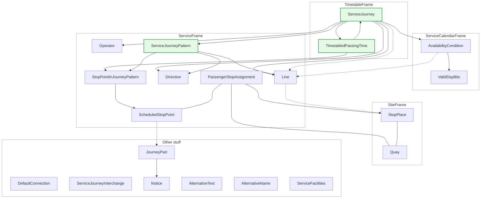

# Basic concepts in NeTEx

NeTEx can support multiple use cases. Here we talk about the Swiss timetable delivery.

The following diagram shows the relevant core classes we will use. In the center is the ServiceJourney.

Notes:
* Every `ServiceJourney` belongs to one Line and has one `Operator`. Some more information can be stored in associated `ResponsibilitySet`s. 
* The pattern of the stops is defined in a `ServiceJourneyPattern`. The timing behaviour is part of the `TimetablePassingtime`.
* The physical stops are modeled as `StopPlac`e with `Quays`.
* `ScheduledStopPoint`s are are the "logical" stops.
* The `PassengerStopAssignment` associates the physical and the logical stops.
* `DefaultConnection`, `SiteConnection` and `ServiceJourneyInterchange` defined transfers
* `JourneyMeetin`gs are used for splitting and joining of trains.
* `Notice`, `ServiceFacility` and `SiteFacility` model almost everythingelse
* The operating days are defined through `ValidDayBits` for the whole timetable year in `AvailabilityCondition`s.
