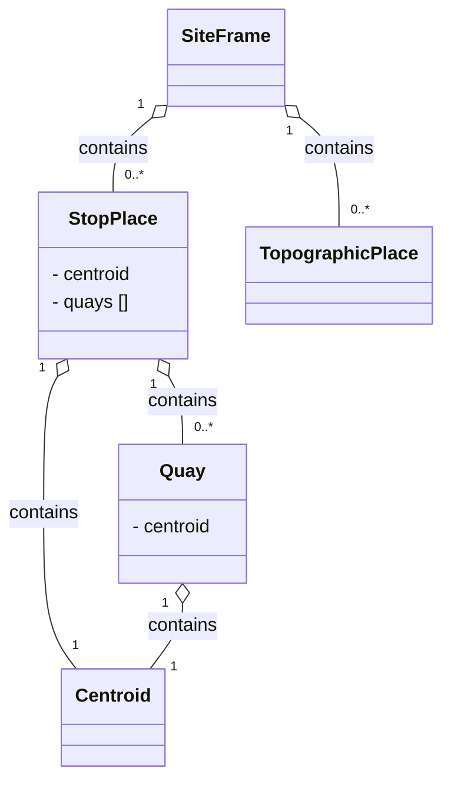

# Stop Modelling

- [SiteFrame](06_stops.md#siteframe)
- [StopPlace](06_stops.md#StopPlace)
- [Quay](06_stops.md#Quay)
- [TopographicPlace](06_stops.md#TopographicPlace)
- [Centroid](06_stops.md#Centroid)

## SiteFrame
*→ [Glossary definition](A4_annex_glossary.md#siteframe)*

### Purpose
A `SiteFrame` contains the physical infrastructure model for public transport — `StopPlace`s, `Quay`s, and topographic context. It defines the spatial elements that passengers interact with and that other frames reference for stop assignments.

### Contained Elements

- `StopPlace`s – stations and stops 
  - `Quay`s - platforms where passengers can board a vehicle
- `TopographicPlace`s - geographical and administrative area context for stops
- Not currently modelled: entrances, levels, equipments, paths, accessibility properties, points of interest

### Table
- [Swiss profile NeTEx definition](../generated/markdown-examples/SiteFrame.md)

*→ [General NeTEx definition ](../generated/xcore/SiteFrame.html)*

### Example
- [Example snippet](../generated/xml-snippets/SiteFrame.xml)

*→ [Template](../templates/SiteFrame.xml)*

### Frame Relationships
`SiteFrame` is independent of other frames but provides the physical stop infrastructure that `ServiceFrame` references through `PassengerStopAssignments`. `TimetableFrame` indirectly depends on `SiteFrame` through the `JourneyPattern` stop sequence. `SiteFrame` is typically wrapped in a `CompositeFrame` within a `PublicationDelivery`.

## StopPlace
*→ [Glossary definition](A4_annex_glossary.md#StopPlace)*

### Purpose
A named physical or virtual location where passengers can board or alight from public transport, containing one or more `Quays`.
Note that a `StopPlace` is a distinct concept from the representation of the stop in a timetable – the `ScheduledStopPoint`. The two can be connected using a `StopPointAssignment`. 

### Table
- [Swiss profile NeTEx definition](../generated/markdown-examples/StopPlace.md)

*→ [General NeTEx definition ](../generated/xcore/StopPlace.html)*

### Example
- [Example snippet](../generated/xml-snippets/StopPlace.xml)

*→ [Template](../templates/StopPlace.xml)*

### Usage Notes
- All `StopPlace`s in Switzerland are identifiable by both a DIDOK number and a SLOID. DIDOK number are under the responsability of the Department of Transport (BAV). It is possible that in the future the BAV will also regulate “Haltepunkte” and “Haltekanten” and, therefore, the identifiers of `Quays`.
- Foreign `StopPlace`s may be mapped to Swiss DIDOK codes. 
- The main connection between DIDOK codes and the NeTEx export are the `ScheduledStopPoints`. They typically have the same `Id` (except for the <Element Name> in the identifier string) as the `StopPlace`. Exceptions are meta stations and local public transport already using assignment to “Haltekanten”. In such cases the `ScheduledStopPoint` is more refined than the DIDOK and UIC codes. 
- Meta-stations will have their own codes. In some cases these are added for operational or searching reasons. 

## Quay
*→ [Glossary definition](A4_annex_glossary.md#Quay)*

### Purpose
A specific boarding or alighting position (platform, stand, bay) within a `StopPlace` where passengers physically meet vehicles. 

### Table
- [Swiss profile NeTEx definition](../generated/markdown-examples/StopPlace.md)

*→ [General NeTEx definition ](../generated/xcore/StopPlace.html)*

### Example
- [Example snippet](../generated/xml-snippets/StopPlace.xml)

*→ [Template](../templates/StopPlace.xml)*

### Usage Notes
- In standard NeTEx, a `Quay` may serve one or more `VehicleStoppingPlace`s and be associated with one or more `StopPoints`s. The Swiss profile does not currently model that.
- A `Quay` may contain other sub `Quay`s. A child `Quay` must be physically contained within its parent `Quay`.  Furthermore: 
  - A nested `Quay` is always physically contiguous with its parent and so has the same accessibility characteristics 
as it parents. 
  - Nested `Quay`s should not be used to mark individual positions on a platform – `BoadingPosition` serve this function. 
  - Nested `Quay`s and `AccessSpace`s must always be on the same `Level` as their parent (not currently modelled).
- If the SLOID for platforms is not unique, it will be formed according to the schema:
{StopPlace SLOID}_gen:{Quay SLOID}_pf:{Platform Code*}.
- If no platform SLOID is available {StopPlace SLOID}_gen:missingSLOID_pf:{Platform Code*} will be used instead.
- 👉 Please note: Special characters in the track identifier will be replaced with a dot («.»), for example 21/22 → 21.22.

In the table below you will find an overview of the possible cases. For more information on SLOID, see [Swiss Location Identification (SLOID) | öv-info.ch](https://www.oev-info.ch/de/datenmanagement/swiss-identification-public-transport-sid4pt/swiss-location-identification-sloid "https://www.oev-info.ch/de/datenmanagement/swiss-identification-public-transport-sid4pt/swiss-location-identification-sloid")
	

> **TODO** If OK move table to media folder - or put and adjust things in a md table

> QUAYs are mapped with the following resolution: **TODO** not clear
> - No hierarchy between the different definitions of quays is foreseen at the moment 
> - All combinations between sectors of the same quay are considered as independent quays. 
> - Combinations of several quays are considered as independent quays. 

## TopographicPlace
*→ [Glossary definition](A4_annex_glossary.md#TopographicPlace)*

### Purpose
A named geographic area such as a city, municipality, county, or region - used to provide spatial context for `StopPlaces`, for example when interactively searching for the origin or destination of a trip.

### Table
- [Swiss profile NeTEx definition](../generated/markdown-examples/TopographicPlace.md)

*→ [General NeTEx definition ](../generated/xcore/TopographicPlace.html)*

### Example
- [Example snippet](../generated/xml-snippets/TopographicPlace.xml)

*→ [Template](../templates/TopographicPlace.xml)*

### Usage Notes
The `TopographicPlace` represent the cantons and communes in Switzerland. Each `StopPlace` should reference the `TopographicPlace` representing its canton.  

## Centroid

### Purpose
It provides precise geographic coordinates (WGS84) of a central reference point representing a single point or an area such as a `Quay`or a `StopPlace`. 

### Table
- [Swiss profile NeTEx definition](../generated/markdown-examples/Centroid.md)

*→ [General NeTEx definition ](../generated/xcore/Centroid.html)*

### Example
- [Example snippet](../generated/xml-snippets/Centroid.xml)

*→ [Template](../templates/Centroid.xml)*

### Usage Notes
The `Centroid` always contains a location. 
- The main coordinates are given as WSG84.
- Required accuracy 4+ decimal positions.
- The Swiss coordinates are added as well, when available (see below) **TODO**
- INFO+ will not use the data from the NeTEx import, it will rely on the DIDOK master data for all Swiss coordinates. INFO+ will, however, use the imported location data of foreign places without DIDOK numbers. 

