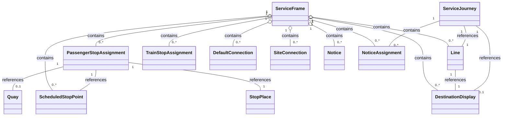

# Services
In this chapter:
- [Line](#line)
- [DestinationDisplay](#destinationdisplay)
- [ScheduledStopPoint](#scheduledstoppoint)
- [PassengerStopAssignment](#passengerstopassignment)
- [TrainStopAssignment](**TODO**)
- [DefaultConnection](#defaultconnection)
- [SiteConnection](#siteconnection)
- [ServiceJourneyPattern](#servicejourneypattern)
- [Notice](#NoticeAssignment)
- [NoticeAssignment](#NoticeAssignment)

## ServiceFrame
*→ [Glossary definition](A4_annex_glossary.md#serviceframe)*

### Purpose
Contains the network and route definitions - `Line`s, `ScheduledStopPoint`s, `DestinationDisplay`s, and `PassengerStopAssignment`s.

See the following class diagram for the most important objects of the `ServiceFrame` and their relationships to the other frames.

### Contained Elements
The `ServiceFrame` model comprises among others:
-	Route model: fixed and flexible  `Line`s and `Route`s of a transport network.
-	Line network model: overall topology of the `Line` and line sections that make up a transport network.
-	Service pattern model: `ScheduledStopPoint`s, `ServiceLink`, i.e., points and links referenced by schedules.

Other important classes of the `ServiceFrame` include:
-	`PassengerStopAssignment`s and `TrainStopAssignment` which model the relationship between stops in the timetable and the physical platforms of an actual station or other stop.
-	`Connection`s as the topological model of interchanges. They model the possibility of a transfer between two `ScheduledStopPoints`.
-	`Notice`s which are then assigned to `Journey` and `Passingtime` of the `TimetableFrame` through `NoticeAssignment`s. They model the association of footnotes and passenger information content such as stop announcements and the network.

### Table
- [Swiss profile NeTEx definition](../generated/markdown-examples/ServiceFrame.md)

*→ [General NeTEx definition ](../generated/netex-html/ServiceFrame.html)*

### Example
- [Example snippet](../generated/xml-snippets/ServiceFrame.xml)

*→ [Template](../templates/ServiceFrame.xml)*

### Frame Relationships
`ServiceFrame` depends on `ResourceFrame` for `Operator` definitions. `VehicleScheduleFrame` may reference journeys defined here for block and duty scheduling. `PassengerStopAssignment`s build the connection between `ScheduledStopPoints` and the physical model in`SiteFrame`. ServiceFrame` is typically wrapped in a `CompositeFrame`within a `PublicationDelivery`.

## Direction
We don't use `Direction` but only `DirectionType`. For this we need NeTEx 2.1.

This means that the old two defined dirctions `ch:1:Direction:H` and `ch:1:Direction:R` will no longer be supported.

## Line
*→ [Glossary definition](A4_annex_glossary.md#Line)*
### Purpose
A public transport service line, representing a marketed route with a `Name`, `TransportMode`, and `Operator`.

### Table
- [Swiss profile NeTEx definition](../generated/markdown-examples/Line.md)

*-> [General NeTEx definition](../generated/netex-html/Line.html)*

### Example

- [Example snippet](../generated/xml-snippets/Line.xml)

*->[Template](../templates/Line.xml)*

### Usage Notes
- slnid will be integrated wherever possible. We currently think that - where it exists - it has the necessary properties to be used in the `id`-attribute.
- For foreign lines and id might need to be generated.
- We store the slnid whenever possible in `id`, `privateCodes/PrivateCode` and `KeyList`.
- **TODO** link to migration concept slnid
- **TODO** handling of mixed lines
- Be aware that for mixed lines there might be multiple `Line`s in NeTEx. Otherwise, the relevant `Operator` must be set on the `ServiceJourney`.
- Note that there exist journeys in Switzerland and neighbouring countries that are not associated with a `Line`. In NeTEx, however, the `ServiceJourney`s corresponding to such journeys must still reference something in `LineRef`. To ensure this, we introduce a placeholder `Line` called "NoLine" for each `Operator` that has journeys without a Line.
- For more information about SwissLineID: see https://www.xn--v-info-vxa.ch/sites/default/files/2023-06/slnid-spezifikation_v1.25_0.pdf

## DestinationDisplay
*→ [Glossary definition](A4_annex_glossary.md#DestinationDisplay)*

### Purpose
Showing the destination of a `ServiceJourney`. The text shown on the front or side of a public transport vehicle to indicate its destination, including via-points and variant labels.

### Table
- [Swiss profile NeTEx definition](../generated/markdown-examples/DestinationDisplay.md)

*-> [General NeTEx definition](../generated/netex-html/DestinationDisplay.html)*

### Example

- [Example snippet](../generated/xml-snippets/DestinationDisplay.xml)

*->[Template](../templates/DestinationDisplay.xml)*

### Usage Notes
- In HRDF sometimes the destination is not set (`*R`). This results in NeTEX in a calculated destination definition. 
- The `DestinationDiplay` is usually be set on the `ServiceJourney`. If it changes during the run, it needs to be changed in the `ServiceJourneyPattern`. If it changes on that, then the new destination should be used. In our output, we will fill all remaining `PointsInJourneyPattern`with the relevant change.
- See also the [use case on changes in destination](uc13_changes_in_destination.md) 

> **TODO** the rules for defining need to be clarified.

## ScheduledStopPoint
*→ [Glossary definition](A4_annex_glossary.md#ScheduledStopPoint)*

### Purpose
A logical point used in the timetable to indicate a stop of a service where passengers can board or alight. A `ScheduledStopPoint` is linked to a physical `Quay` or `StopPlace` via a [PassengerStopAssignment](#passengerstopassignment). 

A `ScheduledStopPoint` can represent two types of stop points:
-	In most cases, the `ScheduledStopPoint` is the station named in the timetable, especially as some organisations don’t have a full physical model of their StopPlaces. 
-	In some cases, the `ScheduledStopPoint` may be mapped to the `Quay`. The more detailed mapping is also done with the `PassengerStopAssignment`.

### Table
- [Swiss profile NeTEx definition](../generated/markdown-examples/ScheduledStopPoint.md)

*-> [General NeTEx definition](../generated/netex-html/ScheduledStopPoint.html)*

### Example

- [Example snippet](../generated/xml-snippets/ScheduledStopPoint.xml)

*->[Template](../templates/ScheduledStopPoint.xml)*

## PassengerStopAssignment
*→ [Glossary definition](A4_annex_glossary.md#PassengerStopAssignment)*

### Purpose

`PassengerStopAssignment`s bring the Site model and the Service model in alignment. We have two general cases:
-	A `ScheduledStopPoint` in a `ServiceJourneyPattern` is linked to a `StopPlace` for arrival and departure.
-	A `ScheduledStopPoint` in a `ServiceJourneyPattern` is linked to a `Quay` for arrival and departure.

### Table
- [Swiss profile NeTEx definition](../generated/markdown-examples/PassengerStopAssignment.md)

*-> [General NeTEx definition](../generated/netex-html/PassengerStopAssignment.html)*

### Example

- [Example snippet](../generated/xml-snippets/PassengerStopAssignment.xml)

*->[Template](../templates/PassengerStopAssignment.xml)*

### Usage Notes

> ** TODO ** Suppose a vehicle arrives at quay 2A and departs on quay 2D. In this case we model only the SCHEDULED STOP POINT for QUAY 2 but assign this STOP POINT to both QUAYs by using two different PASSENGER STOP ASSIGNMENTS.

## DefaultConnection
*→ [Glossary definition](A4_annex_glossary.md#DefaultConnection)*

### Purpose
`DefaultConnections` are used to transmit the connection times for the following constellations:
-	between 2 `ProductCategory`s
-	between 2 `Operator`s
-	In a defined `StopPlace`
-	In a defined `StopPlace` and 2 `Operator`s
-	in a defined `StopPlace`, 2 `Operator`s and 2 `ProductCategory`s

### Table
- [Swiss profile NeTEx definition](../generated/markdown-examples/DefaultConnection.md)

*-> [General NeTEx definition](../generated/netex-html/DefaultConnection.html)*

### Example

- [Example snippet](../generated/xml-snippets/DefaultConnection.xml)

*->[Template](../templates/DefaultConnection.xml)*

### Usage Notes
For more details see the [use case on transfers](uc03_transfers.md).

## SiteConnection
*→ [Glossary definition](A4_annex_glossary.md#SiteConnection)*

### Purpose
The `SiteConnection` describes the transfer times between two adjacent `StopPlace`s. 

### Table
- [Swiss profile NeTEx definition](../generated/markdown-examples/SiteConnection.md)

*-> [General NeTEx definition](../generated/netex-html/SiteConnection.html)*

### Example

- [Example snippet](../generated/xml-snippets/SiteConnection.xml)

*->[Template](../templates/SiteConnection.xml)*

### Usage Notes
For more details see the [use case on transfers](uc03_transfers.md).

## ServiceJourneyPattern
*→ [Glossary definition](A4_annex_glossary.md#ServiceJourneyPattern)*

### Purpose
`ServiceJourneyPattern` is used to describe the journey pattern (sequence and times of `ScheduledStopPoints`) of `ServiceJourney`.

### Table
- [Swiss profile NeTEx definition](../generated/markdown-examples/ServiceJourneyPattern.md)

*-> [General NeTEx definition](../generated/netex-html/ServiceJourneyPattern.html)*

### Example

- [Example snippet](../generated/xml-snippets/ServiceJourneyPattern.xml)

*->[Template](../templates/ServiceJourneyPattern)*

### Usage Notes
>** TODO**

## Notice
*→ [Glossary definition](A4_annex_glossary.md#Notice)*

### Purpose
Informational or regulatory text associated with public transport services, displayed to passengers.
 

### Table
- [Swiss profile NeTEx definition](../generated/markdown-examples/Notice.md)

*-> [General NeTEx definition](../generated/netex-html/Notice.html)*

### Example

- [Example snippet](../generated/xml-snippets/Notice.xml)

*->[Template](../templates/Notice.xml)*

### Usage Notes
> ** TODO** do we need a special use case?

## NoticeAssignment
*→ [Glossary definition](A4_annex_glossary.md#NoticeAssignment)*

### Purpose
Assign a `Notice` to an element. 

### Table
- [Swiss profile NeTEx definition](../generated/markdown-examples/NoticeAssignment.md)

*-> [General NeTEx definition](../generated/netex-html/NoticeAssignment.html)*

### Example

- [Example snippet](../generated/xml-snippets/NoticeAssignment.xml)

*->[Template](../templates/NoticeAssignment.xml)*
