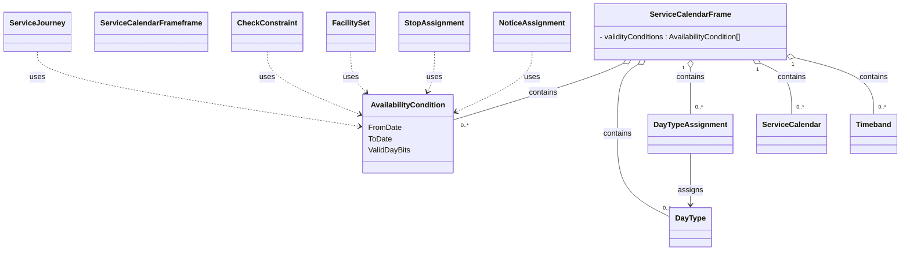

# Service calendars

In this chapter:
- [ServiceCalendarFrame](#ServiceCalendarFrame)
- [AvailabilityCondition](#AvailabilityCondition)
- [ServiceCalendar](#ServiceCalendar)
- [DayType](#daytype)
- [Timeband](#timeband)
- [DayTypeAssignment](#daytypeassignment)

##  ServiceCalendarFrame
*→ [Glossary definition](A4_annex_glossary.md#servicecalendarframe)*

### Purpose
See the following class diagram for the most important objects of the SERVICE CALENDAR FRAME and their relationships to the other frames.

#### Table
- [Swiss profile NeTEx definition](../generated/markdown-examples/ServiceCalendarFrame.md)

*→ [General NeTEx definition](../generated/netex-html/ServiceCalendarFrame.html)*

#### Example
- [Example snippet](../generated/xml-snippets/ServiceCalendarFrame.xml)

*→ [Template](../templates/ServiceCalendarFrame.xml)*

#### Usage Notes
- Note that VALIDITY CONDITIONs could be combined and ANDed (all the conditions must be fullfiled at the same time) thanks to the WITH CONDITION REF attribute. We will work with FromDate/ToDate and ValidDayBits of AvailabilityCondition only.

### AvailabilityCondition
*→ [Glossary definition](A4_annex_glossary.md#availabilitycondition)*

#### Purpose
- An AVAILABILITY CONDITION can be defined by specific DAY TYPEs and/or OPERATING DAYs. It may be further qualified by one or more of TIME BANDs. The DATED AVAILABILITY CONDITION being the instance of VALIDITY CONDITION on a specific CALENDAR DAY.

#### Table
-[Swiss profile NeTEx definition](../generated/markdown-examples/AvailabilityCondition.md)

*→ [General NeTEx definition](../generated/netex-html/AvailabilityCondition.html)*

#### Example
- [Example snippet](../generated/xml-snippets/AvailabilityCondition.xml)

*→ [Template](../templates/AvailabilityCondition.xml)*

#### Usage Notes
- Examples of use of AVAILABILITY CONDITION include ENTRANCEs, EQUIPMENTs, STOP PLACEs, etc.
- AvailabilityCondition replaces OperatingDay and OperatingPeriod. Whenever a reference to a VP (“Verkehrsperiode” or operating period in english) is needed, we use an `AvailabilityConditionRef`:
-	The referenced `AvailabilityCondition`s are centrally stored in the `ServiceCalendarFrame`.
- The element ValidDayBits directly indicates the days on which some service is provided or not. They are similar to the HRDF bitfields. 
- ValidDayBits is required whenever the `AvailabilityCondition` is of temporal nature (more often than not). Examples include:
  -	`ServiceJourney`
  -	`JourneyMeeting`
  -	`NoticeAssignment`
  -	`ServiceFacilitySet`
  -	`ServiceJourneyInterchange`
  -	`InterchangeRule`
- Hint: The frames `TimetableFrame`, `ServiceFrame` and `ServiceCalendarFrame` and their elements must have the same validity.

### ServiceCalendar
*→ [Glossary definition](A4_annex_glossary.md#servicecalendar)*

#### Purpose
The transport offering of a public transport company is tailored to accommodate different levels of demand. In order to simplify the supply planning almost all operators design their production plan using a classification by type of day, which summarises the level of demand or other characteristics: for example, workday, weekend, school holiday, market day,etc. Long-term planned schedules are designed through the so-called transportation calendar, in which calendar days are classified as specific DAY TYPEs.

#### Table
- [Swiss profile NeTEx definition](../generated/markdown-examples/ServiceCalendar.md)

*→ [General NeTEx definition](../generated/netex-html/ServiceCalendar.html)*

#### Example
- [Example snippet](../generated/xml-snippets/ServiceCalendar.xml)

*→ [Template](../templates/ServiceCalendar.xml)*

### DayType
*→ [Glossary definition](A4_annex_glossary.md#daytype)*

#### Purpose
In Transmodel, a DAY TYPE is defined as a combination of various different properties a day may have, and which will influence the transport demand and the running conditions. 
The day type is used to describe the validity of the holidays in Switzerland. Each day is de-scripted with a day Type. 

#### Table
- [Swiss profile NeTEx definition](../generated/markdown-examples/DayType.md)

*→ [General NeTEx definition](../generated/netex-html/DayType.html)*

#### Example
- [Example snippet](../generated/xml-snippets/DayType.xml)

*→ [Template](../templates/DayType.xml)*

### Timeband
*→ [Glossary definition](A4_annex_glossary.md#timeband)*

#### Purpose
A period in a day, significant for some aspect of public transport, e.g. similar traffic conditions or fare category.

#### Table
- [Swiss profile NeTEx definition](../generated/markdown-examples/Timeband.md)

*→ [General NeTEx definition](../generated/netex-html/Timeband.html)*

#### Example
- [Example snippet](../generated/xml-snippets/Timeband.xml)

*→ [Template](../templates/Timeband.xml)*

#### Usage Hints
Currently `Timeband` is used for `InterchangeRuleTiming`s, later also used for the opening hours in `StopPlace` models. 

## DayTypeAssignment
*→ [Glossary definition](A4_annex_glossary.md#daytypeassignment)*

#### Purpose
This assignment overrides the DAY TYPE which was generally chosen for this OPERATING DAY in the overall DAY TYPE assignment plan.
Designation of one day or group of days

#### Table
- [Swiss profile NeTEx definition](../generated/markdown-examples/DayTypeAssignment.md)

*→ [General NeTEx definition](../generated/netex-html/DayTypeAssignment.html)*

#### Example
[Example snippet](../generated/xml-snippets/DayTypeAssignment.xml)

*→ [Template](../templates/DayTypeAssignment.xml)*

#### Usage Notes
We also use DayTypeAssignment currently only for the national holidays.

