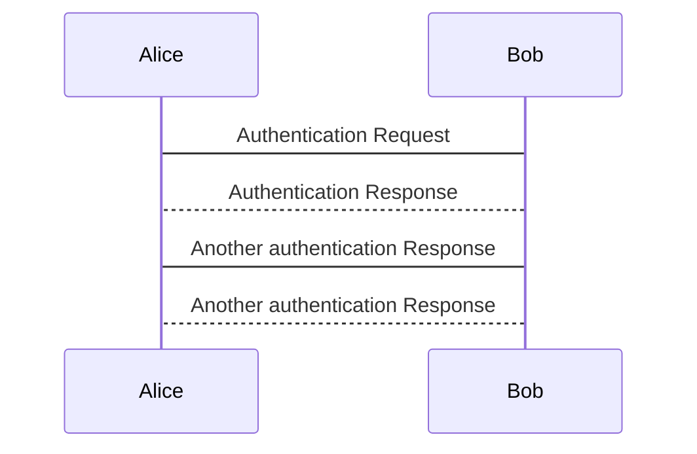

# Timetables

## TimetableFrame
The `TimeTableFrame` contains the following allowed elements:
* vehicleJourneys:
  * the actual journeys. We only use journeys that are available for passenger 
  * only ServiceJourney and TemplateServiceJourney are allowed. TemplateServiceJourney is only used together with frequency traffic   
* trainNumber:
  * Each journey is mapped to a train number.
* serviceFacilitySets
* typesOfService
* journeyMeetings
* interchangeRules

* [Template](../examples/templates/TimetableFrame.xml)

## ServiceJourney

* The table defining the full element can be found here:
* The template of a ServiceJourney can be found here:
* The template of a TemplateServiceJourney can be found here:

The following restrictions occur:
* The attributs id, version and responsibilitySetRef must be set.
* The validityConditions contain only one AvailablityCondition that contains only the elements FromDate, ToDate and ValidDayBits.
* In the keyList a KeyValue pair with the Key `sjyid` must exists. The Value contains a valid Swiss Journey ID.
* privateCodes: tbd
* TransportMode: tbd
* TypeOfProductCategoryRef: tbd
* TypeOfServiceRef is always set to tbd
* noticeAssignments contain all notices. Attention: they may be restricted to a given set of stops.
* ServiceAlteration is set.
* DepartureTime:
* DepartureDayOffset:
* LineRef is mandatory.
* DirectionType is only inbound or outbound
* trainNumbers contains at least one TrainNumberRef. TrainNumber i not allowed in it.
* Destination: xxx
* passingTimes: ddd
* calls are not to be used.

## TemplateServiceJourney
tbd

## PassingTime
tbd
