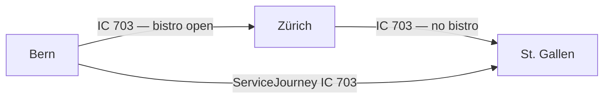

# Journey Parts

## Overview

A `JourneyPart` is a sub-section of a `ServiceJourney` that differs from the rest of the journey in at least one relevant characteristic — such as a different train number, operator, or on-board facilities. The `ServiceJourney` as a whole still runs from start to finish; `JourneyPart`s subdivide it into meaningful segments for passenger information or operational purposes.

**When to use:** When a `ServiceJourney` changes its train number, operator, or on-board service (e.g. bistro available only on part of the route).



## Mapping between HRDF and NeTEx

| HRDF | NeTEx RG1 | NeTEx RG2 | Use Case |
|------|-----------|-----------|----------|
| `[attribut]` per Teilstrecke | `JourneyPart` | `JourneyPart` | Change of train number, operator, or on-board facilities |

## Use Cases in the Swiss Profile

### 1. Change of on-board facilities (`PurposeOfJourneyPartition:FacilityChange`)

**When to use:** When a service (e.g. bistro, wifi) is only available on part of the route.

> In the example **IC 703 Bern – St. Gallen**, the bistro is open between Bern and Zürich (05:29–06:28) and again between Zürich and Wil SG (06:57–07:52), but not on the full journey.

```xml
<ServiceJourney id="ch:1:ServiceJourney:703" version="1">
  <!-- ... passingTimes ... -->
  <parts>
    <JourneyPart id="ch:1:JourneyPart:703-bistro-1" version="1">
      <FromStopPointRef ref="ch:1:sloid:7000:4:7" version="1"/>
      <ToStopPointRef ref="ch:1:sloid:218:7" version="1"/>
      <StartTime>05:29:00</StartTime>
      <StartTimeDayOffset>0</StartTimeDayOffset>
      <EndTime>06:28:00</EndTime>
      <EndTimeDayOffset>0</EndTimeDayOffset>
      <PurposeOfJourneyPartitionRef ref="ch:1:PurposeOfJourneyPartition:FacilityChange" version="1"/>
      <facilities>
        <ServiceFacilitySetRef ref="ch:1:ServiceFacilitySet:bistro-open" version="1"/>
      </facilities>
    </JourneyPart>
    <JourneyPart id="ch:1:JourneyPart:703-bistro-2" version="1">
      <FromStopPointRef ref="ch:1:sloid:3000:501:33" version="1"/>
      <ToStopPointRef ref="ch:1:sloid:6302:1" version="1"/>
      <StartTime>06:57:00</StartTime>
      <StartTimeDayOffset>0</StartTimeDayOffset>
      <EndTime>07:52:00</EndTime>
      <EndTimeDayOffset>0</EndTimeDayOffset>
      <PurposeOfJourneyPartitionRef ref="ch:1:PurposeOfJourneyPartition:FacilityChange" version="1"/>
      <facilities>
        <ServiceFacilitySetRef ref="ch:1:ServiceFacilitySet:bistro-open" version="1"/>
      </facilities>
    </JourneyPart>
  </parts>
</ServiceJourney>
```
- [Example](../examples/NeEX_CH_Bern_Olten_ZuerichHB_Winterthur_StGallen_with_Facilities.xml)

### 2. Change of train number (`TrainNumberRef`)

**When to use:** When a train operates under different train numbers on different sections of the same `ServiceJourney`.

```xml
<JourneyPart id="ch:1:JourneyPart:4171-BernSpiez" version="1">
  <TrainNumberRef ref="ch:1:TrainNumber:4171" version="1"/>
  <FromStopPointRef ref="ch:1:ScheduledStopPoint:Bern" version="1"/>
  <ToStopPointRef ref="ch:1:ScheduledStopPoint:Spiez" version="1"/>
  <StartTime>12:39:00</StartTime>
  <EndTime>13:12:00</EndTime>
  <PurposeOfJourneyPartitionRef ref="ch:1:PurposeOfJourneyPartition:TrainNumberChange" version="1"/>
</JourneyPart>
```

## Key Elements

| Element | Usage | Description |
|---------|-------|-------------|
| `FromStopPointRef` | mandatory | `ScheduledStopPoint` where the part begins |
| `ToStopPointRef` | mandatory | `ScheduledStopPoint` where the part ends |
| `StartTime` / `EndTime` | mandatory | Time bounds of the part |
| `PurposeOfJourneyPartitionRef` | expected | Reason for the partition (e.g. `FacilityChange`, `TrainNumberChange`) |
| `TrainNumberRef` | optional | Train number valid for this part |
| `facilities` | optional | `ServiceFacilitySet` valid for this part only |
| `JourneyPartCoupleRef` | optional | Links to a coupled section (Flügelzug) — not used in Swiss profile |

## Usage Notes

- `JourneyPart`s are nested directly within the `ServiceJourney` under `<parts>`.
- A `JourneyPart` always references the same `ScheduledStopPoint`s as the parent `ServiceJourney` — it cannot introduce new stops.
- `ServiceFacilitySet` defined on a `JourneyPart` overrides the one on the `ServiceJourney` for that section.
- `JourneyPartCouple` is **not used** in the Swiss profile for splitting and joining — use `ServiceJourneyInterchange` instead. See [uc02 Joining and splitting](uc02_joining_splitting.md).
- `JourneyPart` may become relevant for train composition (Wagenreihung) data in a future version of the profile. See [uc15 Formations](uc15_formations.md).

## Related use cases

- [uc02 Joining and splitting](uc02_joining_splitting.md)
- [uc03 Transfers](uc03_transfers.md)
- [uc15 Formations](uc15_formations.md)
