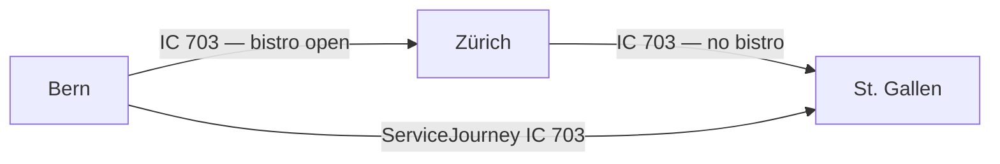

# Journey Parts

## Overview

A `JourneyPart` is a subsection of a `ServiceJourney` that differs from the rest of the journey in at least one relevant characteristic — such as a different train number, operator, or on-board facilities. The `ServiceJourney` as a whole still runs from start to finish; `JourneyPart`s subdivide it into meaningful segments for passenger information or operational purposes.

**When to use:** When a `ServiceJourney` changes its train number, operator, or on-board service (e.g. bistro available only on part of the route).



## Mapping between HRDF and NeTEx

| HRDF | NeTEx RG1 | NeTEx RG2 | Use Case |
|------|-----------|-----------|----------|
| `[attribut]` per Teilstrecke | `JourneyPart` | `JourneyPart` | Change of train number, operator, or on-board facilities |

## Use Cases in the Swiss Profile

### 1. Change of on-board facilities (`PurposeOfJourneyPartition:FacilityChange`)

**When to use:** When a service (e.g. bistro, wifi) is only available on part of the route.

> In the example **IC 703 Bern – St. Gallen**, the bistro is open between Bern and Zürich (05:29–06:28) and again between Zürich and Wil SG (06:57–07:52), but not on the full journey.

```xml
<ServiceJourney id="ch:1:ServiceJourney:703" version="1">
  <!-- ... passingTimes ... -->
  <parts>
    <JourneyPart id="ch:1:JourneyPart:703-bistro-1" version="1">
      <FromStopPointRef ref="ch:1:sloid:7000:4:7" version="1"/>
      <ToStopPointRef ref="ch:1:sloid:218:7" version="1"/>
      <StartTime>05:29:00</StartTime>
      <StartTimeDayOffset>0</StartTimeDayOffset>
      <EndTime>06:28:00</EndTime>
      <EndTimeDayOffset>0</EndTimeDayOffset>
      <PurposeOfJourneyPartitionRef ref="ch:1:PurposeOfJourneyPartition:FacilityChange" version="1"/>
      <facilities>
        <ServiceFacilitySetRef ref="ch:1:ServiceFacilitySet:bistro-open" version="1"/>
      </facilities>
    </JourneyPart>
    <JourneyPart id="ch:1:JourneyPart:703-bistro-2" version="1">
      <FromStopPointRef ref="ch:1:sloid:3000:501:33" version="1"/>
      <ToStopPointRef ref="ch:1:sloid:6302:1" version="1"/>
      <StartTime>06:57:00</StartTime>
      <StartTimeDayOffset>0</StartTimeDayOffset>
      <EndTime>07:52:00</EndTime>
      <EndTimeDayOffset>0</EndTimeDayOffset>
      <PurposeOfJourneyPartitionRef ref="ch:1:PurposeOfJourneyPartition:FacilityChange" version="1"/>
      <facilities>
        <ServiceFacilitySetRef ref="ch:1:ServiceFacilitySet:bistro-open" version="1"/>
      </facilities>
    </JourneyPart>
  </parts>
</ServiceJourney>
```
- [Example](./examples/08_NeTEX_CH_Bern_Olten_ZuerichHB_Winterthur_StGallen_with_Facilities.xml)

### 2. Change of ProductCategoryRef
We will do this with `"ch:1:PurposeOfJouryneyPartition:TypeOfProductCategoryChange"` 

> *LATER* Example

### 3. Change of train number — NOT USED in the Swiss profile

**Status:** This use case is intentionally **not implemented** via `JourneyPart` in the Swiss profile.

Although passenger displays may show a train number change as if it were a single continuous journey, 
in the underlying data this is always modeled as **two separate `ServiceJourney`s linked via a 
`ServiceJourneyInterchange`** (suppressed in passenger-facing presentation). See 
[uc02 Joining and splitting](uc02_joining_splitting.md).
**When to use:** When a train operates under different train numbers on different sections of the same `ServiceJourney`.

### 4. Splitting and Joining
`JourneyPart` together with `CoupledJourney`could be used for a different modeling of joining and splitting (see [relevant use case](uc02_joining_splitting.md).
However, we currently won't do that.

### 5. Integrating data from different sources to have something to load into a trip planner in international travel

A `ServiceJourney` may exist in the Swiss system only up to the first commercial stop abroad and completely but with less information in the Austrian system. To make sure that real-time data is easily applied the aggregated NeTEx timetable may still wish to keep the original delivered `ServiceJourney`. The relevant parts are then also modeled with `JourneyPart` and `CoupledJourney`. We won't do this either. But we study this for some international projects we have on aggregation of timetables. 

### 6. Notice only for a part of the ServiceJourney
We don't use `JourneyPart` for this. `NoticeAssignment` can be valid only for a part of the `ServiceJourney` (`StartPointInPatternRef` and `EndPointInPatternRef`).


### Table


For some use cases e.g. change of Facilities during ServiceJourney

*Table: parts*

| Sub | Element | Usage | Card | Type | Description | Note |
|-----|---------|-------|------|------|-------------|------|
|  | JourneyPart | optional | 1..* | JourneyPart_VersionStructure | A part of a VEHICLE JOURNEY created according to a specific functional purpose, for instance in situations when vehicle coupling or separating occurs. |  |
| + | validityConditions | optional | 1..1 | validityConditions_RelStructure | VALIDITY CONDITIONs conditioning entity. | We prefer to not use those |
| ++ | AvailabilityConditionRef | optional | 0..* | AvailabilityConditionRefStructure | Reference to an AVAILABILITY CONDITION. A VALIDITY CONDITION defined in terms of temporal attributes. |  |
| + | MainPartRef | optional | 0..1 | JourneyPartRefStructure | Main JOURNEY PART for journey. | For the use cases we support, this is not necessary |
| + | TrainNumberRef | optional | 1..1 | TrainNumberRefStructure | Reference to a TRAIN NUMBER. | TrainNumber used for this part |
| + | FromStopPointRef | mandatory | 0..1 | ScheduledStopPointRefStructure | SCHEDULED STOP POINT feeding INTERCHANGE. If absent apply to all STOP POINTs. | `ScheduledStopPoint` where the part begins. On the level of Quay. |
| + | ToStopPointRef | expected | 0..1 | ScheduledStopPointRefStructure | SCHEDULED STOP POINT distributing from INTERCHANGE. If absent apply to all STOP POINTs. | `ScheduledStopPoint` where the part ends . If not present, it is to the end of the ServiceJourney. But we prefer to have it explicitly |
| + | StartTime | mandatory | 0..1 | xsd:time | The (inclusive) start date and time. | Time bounds of the part |
| + | StartTimeDayOffset | optional | 0..1 | DayOffsetType | Number of days after journey start time that start time is. |  |
| + | EndTime | mandatory | 0..1 | xsd:time | The (inclusive) end date and time. | Time bounds of the part. |
| + | EndTimeDayOffset | optional | 0..1 | DayOffsetType | Number of days after journey start time that end time is. |  |
| + | PurposeOfJourneyPartitionRef | mandatory | 1..1 | PurposeOfJourneyPartitionRefStructure | Reference to a PURPOSE OF JOURNEY PARTITION. | Reason for the partition (e.g. `FacilityChange`, `TrainNumberChange`, 'TypeOfProductCategorychage`). Only two values are allowed (see uc0_journey_parts). Other things are implemented with different elements. Especially Notices are done with NoticeAssignment and not ServiceJourneyPart. |
| + | facilities | expected | 0..1 | serviceFacilitySets_RelStructure | FACILITies available associated with LINE. It is always recommended to also model accessibility relevant things as equipment on the VEHICLE and physical elements, if real-time information is needed. | `ServiceFacilitySet` valid for this part only. Used when there is a change in facilities. |
| ++ | ServiceFacilitySetRef | expected | 0..* | ServiceFacilitySetRefStructure | Reference to a SERVICE FACILITY SET. |  |
| + | TypeOfProductCategoryRef | optional | 1..1 | TypeOfProductCategoryRefStructure | Reference to a TYPE OF PRODUCT CATEGORY. Product of a JOURNEY. e.g. ICS, Thales etc See ERA B.4 7037 Characteristic description code. | Used when the product category changes |


*→ [General NeTEx definition ](../xcore/netex/elements/JourneyPart.html)*

### Example


```xml
<?xml version="1.0" encoding="UTF-8"?>
<parts>
  <!-- For some use cases e.g. change of Facilities during ServiceJourney -->
  <JourneyPart id="ch:1:JourneyPart:703-bistro-1" version="1">
    <validityConditions>
      <!-- We prefer to not use those -->
      <AvailabilityConditionRef ref="generated" version="1"/>
    </validityConditions>
    <MainPartRef ref="ch:1:JourneyPart:703-bistro-1" version="1">
      <!-- For the use cases we support, this is not necessary -->
    </MainPartRef>
    <TrainNumberRef ref="ch:1:TrainNumber:231213" version="1">
      <!-- TrainNumber used for this part -->
    </TrainNumberRef>
    <FromStopPointRef ref="ch:1:sloid:7000:4:7" version="1">
      <!-- `ScheduledStopPoint` where the part begins. On the level of Quay. -->
    </FromStopPointRef>
    <ToStopPointRef ref="ch:1:sloid:218:7" version="1">
      <!-- `ScheduledStopPoint` where the part ends . If not present, it is to the end of the ServiceJourney. But we prefer to have it explicitly -->
    </ToStopPointRef>
    <StartTime>05:29:00
      <!-- Time bounds of the part -->
    </StartTime>
    <StartTimeDayOffset>0</StartTimeDayOffset>
    <EndTime>06:28:00
      <!-- Time bounds of the part. -->
    </EndTime>
    <EndTimeDayOffset>0</EndTimeDayOffset>
    <PurposeOfJourneyPartitionRef ref="ch:1:PurposeOfJourneyPartition:FacilityChange" version="1">
      <!-- Reason for the partition (e.g. `FacilityChange`, `TrainNumberChange`, 'TypeOfProductCategorychage`). Only two values are allowed (see uc0_journey_parts). Other things are implemented with different elements. Especially Notices are done with NoticeAssignment and not ServiceJourneyPart. -->
    </PurposeOfJourneyPartitionRef>
    <facilities>
      <!-- `ServiceFacilitySet` valid for this part only. Used when there is a change in facilities. -->
      <ServiceFacilitySetRef ref="ch:1:ServiceFacilitySet:bistro-open" version="1"/>
    </facilities>
    <TypeOfProductCategoryRef ref="ch:1:TypeOfProductCategory:B" version="1">
      <!-- Used when the product category changes -->
    </TypeOfProductCategoryRef>
  </JourneyPart>
  <JourneyPart id="ch:1:JourneyPart:703-bistro-2" version="1">
    <FromStopPointRef ref="ch:1:sloid:3000:501:33" version="1"/>
    <ToStopPointRef ref="ch:1:sloid:6302:1" version="1"/>
    <StartTime>06:57:00</StartTime>
    <StartTimeDayOffset>0</StartTimeDayOffset>
    <EndTime>07:52:00</EndTime>
    <EndTimeDayOffset>0</EndTimeDayOffset>
    <PurposeOfJourneyPartitionRef ref="ch:1:PurposeOfJourneyPartition:FacilityChange" version="1"/>
    <facilities>
      <ServiceFacilitySetRef ref="ch:1:ServiceFacilitySet:bistro-open" version="1"/>
    </facilities>
  </JourneyPart>
</parts>
```


*→ [Template](./templates/JourneyPart.xml)*

## Usage Notes

- `JourneyPart`s are nested directly within the `ServiceJourney` under `<parts>`.
- A `JourneyPart` always references the same `ScheduledStopPoint`s as the parent `ServiceJourney` — it cannot introduce new stops.
- `ServiceFacilitySet` defined on a `JourneyPart` overrides the one on the `ServiceJourney` for that section.
- `JourneyPartCouple` is **not used** in the Swiss profile for splitting and joining — use `ServiceJourneyInterchange` instead. See [uc02 Joining and splitting](uc02_joining_splitting.md).
- `JourneyPart` may become relevant for train composition (Wagenreihung) data in a future version of the profile. See [uc15 Formations](uc15_formations.md).

## Related use cases

- [uc02 Joining and splitting](uc02_joining_splitting.md)
- [uc03 Transfers](uc03_transfers.md)
- [uc15 Formations](uc15_formations.md)
