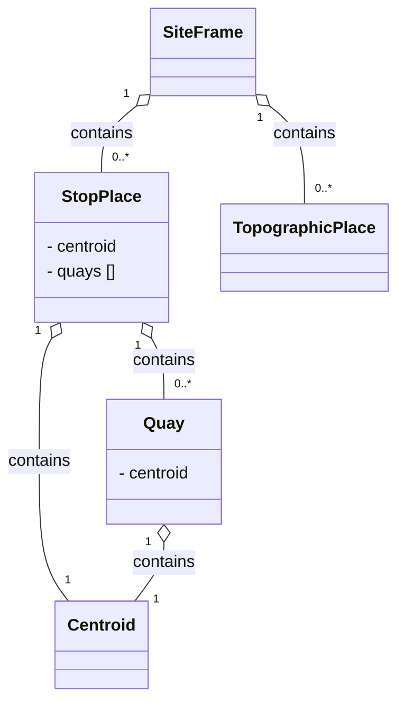

# Stop Modelling

- [SiteFrame](06_stops.md#siteframe)
- [StopPlace](06_stops.md#StopPlace)
- [Quay](06_stops.md#Quay)
- [TopographicPlace](06_stops.md#TopographicPlace)
- [Centroid](06_stops.md#Centroid)

## SiteFrame
*→ [Glossary definition](A4_annex_glossary.md#siteframe)*

### Purpose
A `SiteFrame` contains the physical infrastructure model for public transport — `StopPlace`s, `Quay`s, and topographic context. It defines the spatial elements that passengers interact with and that other frames reference for stop assignments.




### Contained Elements

- `StopPlace`s – stations and stops 
  - `Quay`s - platforms where passengers can board a vehicle
- `TopographicPlace`s - geographical and administrative area context for stops
- Not currently modelled: entrances, levels, equipments, paths, accessibility properties, points of interest

### Table


| Sub | Element | Usage | Card | Type | Description | Note |
|-----|---------|-------|------|------|-------------|------|
|  | SiteFrame | expected | 1..1 | unknown | A coherent set of SITE data to which the same frame VALIDITY CONDITIONs have been assigned. |  |
| + | topographicPlaces | expected | 0..1 | topographicPlacesInFrame_RelStructure | PLACEs in frame. |  |
| ++ | [TopographicPlace](TopographicPlace.md) | expected | 1..1 | unknown | A town, city, village, suburb, quarter or other name settlement within a country. Provides a Gazetteer of Transport related place names. | Used to represent countries if outside CH, cantons and communes if in CH. Cantons are referenced from StopPlaces. **TODO** Is that the correct meaning? (previously: The value will be set to the cantons for stops.) |
| + | stopPlaces | mandatory | 0..1 | stopPlacesInFrame_RelStructure | STOP PLACEs in frame. |  |
| ++ | [StopPlace](StopPlace.md) | mandatory | 1..1 | unknown | Version of a named place where public transport may be accessed. May be a building complex (e.g. a station) or an on-street location. Can be a STOP PLACE, VEHICLE MEETING POINT, TAXI RANK. Note: If a master id exists for a StopPlace (must be stable and globally unique), then it is best used in the id. Optimally it would be built according IFOPT. It can also be put into one of the privateCodes in addition. If it is stored in KeyValue, then it should be documented well, so that importing systems know, which id is the relevant one. |  |
| + | siteFacilitySets | optional | 0..1 | siteFacilitySetsInFrame_RelStructure |  | We expect the SiteFacilitySet in the ResourceFrame |
| ++ | [SiteFacilitySet](SiteFacilitySet.md) | optional | 1..1 | unknown | Set of enumerated FACILITY values that are relevant to a SITE (names based on TPEG classifications, augmented with UIC etc.). |  |


*→ [General NeTEx definition ](../generated/xcore/SiteFrame.html)*

### Example


```xml
<?xml version="1.0" encoding="UTF-8"?>
<SiteFrame  id="ch:1:SiteFrame" version="1">
  <topographicPlaces>
    <TopographicPlace id="ch:1:TopoGraphicPlace:CH-BE" version="1">
      <!-- Used to represent countries if outside CH, cantons and communes if in CH. Cantons are referenced from StopPlaces. **TODO** Is that the correct meaning? (previously: The value will be set to the cantons for stops.) -->
      <Descriptor>
        <Name>Bern</Name>
      </Descriptor>
    </TopographicPlace>
  </topographicPlaces>
  <stopPlaces>
    <StopPlace id="ch:1:sloid:7000" version="1"/>
  </stopPlaces>
  <siteFacilitySets>
    <!-- We expect the SiteFacilitySet in the ResourceFrame -->
    <SiteFacilitySet id="generated" version="1"/>
  </siteFacilitySets>
</SiteFrame>

```


*→ [Template](../templates/SiteFrame.xml)*

### Frame Relationships
`SiteFrame` is independent of other frames but provides the physical stop infrastructure that `ServiceFrame` references through `PassengerStopAssignments`. `TimetableFrame` indirectly depends on `SiteFrame` through the `JourneyPattern` stop sequence. `SiteFrame` is typically wrapped in a `CompositeFrame` within a `PublicationDelivery`.

## StopPlace
*→ [Glossary definition](A4_annex_glossary.md#StopPlace)*

### Purpose
A named physical or virtual location where passengers can board or alight from public transport, containing one or more `Quays`.
Note that a `StopPlace` is a distinct concept from the representation of the stop in a timetable – the `ScheduledStopPoint`. The two can be connected using a `StopPointAssignment`. 


### Table


| Sub | Element | Usage | Card | Type | Description | Note |
|-----|---------|-------|------|------|-------------|------|
|  | StopPlace | mandatory | 1..1 | unknown | Version of a named place where public transport may be accessed. May be a building complex (e.g. a station) or an on-street location. Can be a STOP PLACE, VEHICLE MEETING POINT, TAXI RANK. Note: If a master id exists for a StopPlace (must be stable and globally unique), then it is best used in the id. Optimally it would be built according IFOPT. It can also be put into one of the privateCodes in addition. If it is stored in KeyValue, then it should be documented well, so that importing systems know, which id is the relevant one. | Structure of the id, example: "ch:2:StopPlace:8503000" |
| + | ValidBetween | optional | 1..1 | unknown | OPTIMISATION. Simple version of a VALIDITY CONDITION. Comprises a simple period. NO UNIQUENESS CONSTRAINT. | **TODO** We could transport the validity here. We prefer not to do this as we don't support versions |
| ++ | FromDate | mandatory | 0..1 | xsd:dateTime | Start date of AVAILABILITY CONDITION. |  |
| ++ | ToDate | mandatory | 0..1 | xsd:dateTime | End of AVAILABILITY CONDITION. Date is INCLUSIVE. |  |
| + | alternativeTexts | optional | 0..1 | alternativeTexts_RelStructure | Additional Translations of text elements. |  |
| ++ | [AlternativeText](AlternativeText.md) | optional | 1..1 | unknown | Alternative Text. +v1.1 | Used for abbreviated name of the StopPlace  **TODO** really? Also see ShortName below and note that we don't seem to use PublicCode |
| + | keyList | mandatory | 1..1 | KeyListStructure | A list of alternative Key values for an element. | Key value pairs for DIDOK number and SLOID |
| ++ | KeyValue | mandatory | 1..* | KeyValueStructure | Key value pair for Entity. |  |
| +++ | Key | mandatory | 1..1 | xsd:normalizedString | Identifier of value e.g. System. | DIDOK number **TODO** Cf. duplicates in privatCode below |
| +++ | Value | mandatory | 0..1 | xsd:anyType | Value associated with QUALITY STRUCTURE FACTOR. |  |
| + | privateCodes | mandatory | 1..1 | PrivateCodesStructure | A list of private codes that uniquely identifiy the element. May be used for inter-operating with other (legacy) systems. +v2.0 |  |
| ++ | PrivateCode | mandatory | 1..1 | PrivateCodeStructure | A private code that uniquely identifies the element. May be used for inter-operating with other (legacy) systems. | In Switzerland to be filled with the DiDok number. Replaces single PublicCode from NeTEx 1.0 |
| + | Extensions | optional | 1..1 | ExtensionsStructure | User defined Extensions to ENTITY in schema. (Wrapper tag used to avoid problems with handling of optional 'any' by some validators). |  |
| ++ | HafasPriority | optional | 1..1 | unknown |  | Interchange priority if several alternative interchange possibilities exist. Integer allows for finer grained value than standard element Weighting. |
| ++ | HafasKMInfo | optional | 1..1 | unknown |  | **TODO** ...Value for Interchange points. |
| + | Name | mandatory | 0..1 | MultilingualString | Name of Traveller |  |
| + | alternativeNames | optional | 0..1 | alternativeNames_RelStructure | ALTERNATIVE NAMES for MACHINE READABILITY. | **TODO** To what extent are AlternativeNames used? Adapt everything below accordingly. |
| ++ | AlternativeName | optional | 1..1 | unknown | Alternative Name. |  |
| +++ | Lang | expected | 0..1 | xsd:language | Language of the ALTERNATIVE NAME. |  |
| +++ | NameType | optional | 0..1 | NameTypeEnumeration | Type of Name - fixed value. Default is alias. |  |
| +++ | Abbreviation | optional | 0..1 | MultilingualString | Abbreviation of the entity. |  |
| + | Centroid | mandatory | 0..1 | SimplePoint_VersionStructure | Centre Coordinates of GROUP of STOP PLACEs. | Global or national location |
| ++ | Location | mandatory | 0..1 | LocationStructure | Absolute location of EQUIPMENT. | Note concerning coordinates - The main coordinates are given as **WSG84**. - The Swiss coordinates are added as well if available. (**TODO** How?)- INFO+ will not use the data from the import, instead DIDOK master data will be used for all Swiss coordinates. INFO+ will use the data of foreign places. |
| +++ | Longitude | mandatory | 1..1 | LongitudeType | Longitude from Greenwich Meridian. -180 (East) to +180 (West). |  |
| +++ | Latitude | mandatory | 1..1 | LatitudeType | Latitude from equator. -90 (South) to +90 (North). |  |
| +++ | Altitude | optional | 0..1 | AltitudeType | Altitude. |  |
| + | TopographicPlaceRef | optional | 1..* | TopographicPlaceRefStructure | Reference to the identifier of a TOPOGRAPHIC PLACE. | **TODO** more details |
| + | StopPlaceType | optional | 0..1 | StopTypeEnumeration | Type of STOP PLACE. |  |
| + | Weighting | optional | 0..1 | InterchangeWeightingEnumeration | Default rating of the STOP PLACE for making interchanges. | Default relative weighting to be used for stop place. Cf. HafasPriority in Extensions. |
| + | quays | expected | 1..1 | quays_RelStructure | QUAYs within the STOP PLACE. | The Quays contained in the StopPlace - platforms, jetties, bays, taxi ranks, and other points of physical access to vehicles. |
| ++ | [Quay](Quay.md) | expected | 1..1 | unknown | A place such as platform, stance, or quayside where passengers have access to PT vehicles, Taxi


*→ [General NeTEx definition ](../generated/xcore/StopPlace.html)*

### Example


```xml
<?xml version="1.0" encoding="UTF-8"?>
<StopPlace  id="ch:1:sloid:7000" version="1">
  <!-- Structure of the id, example: "ch:2:StopPlace:8503000" -->
  <ValidBetween>
    <!-- **TODO** We could transport the validity here. We prefer not to do this as we don't support versions -->
    <FromDate>2026-01-01T00:00:00</FromDate>
    <ToDate>2026-12-31T00:00:00</ToDate>
  </ValidBetween>
  <alternativeTexts>
    <AlternativeText id="ch:1:sloid:7000:AlternativeText">
      <!-- Used for abbreviated name of the StopPlace  **TODO** really? Also see ShortName below and note that we don't seem to use PublicCode -->
      <Text>CHR</Text>
    </AlternativeText>
  </alternativeTexts>
  <keyList>
    <!-- Key value pairs for DIDOK number and SLOID -->
    <KeyValue>
      <Key>DIDOK</Key>
      <!-- DIDOK number **TODO** Cf. duplicates in privatCode below -->
      <Value>7000</Value>
    </KeyValue>
    <KeyValue>
      <Key>SLOID</Key>
      <!-- SLOID **TODO** really mandatory, stations outside CH? -->
      <Value>ch:1:sloid:7000</Value>
    </KeyValue>
  </keyList>
  <privateCodes>
    <PrivateCode type="didok">7000</PrivateCode>
    <!-- In Switzerland to be filled with the DiDok number. Replaces single PublicCode from NeTEx 1.0 -->
    <PrivateCode type="sloid">ch:1:sloid:7000</PrivateCode>
    <!-- In Switzerland to be filled with the SLOID. Replaces single PublicCode from NeTEx 1.0 -->
  </privateCodes>
  <Extensions>
    <HafasPriority>
      <!-- Interchange priority if several alternative interchange possibilities exist. Integer allows for finer grained value than standard element Weighting. -->
      <Value>4</Value>
      <!-- **TODO** Allowed range... -->
    </HafasPriority>
    <HafasKMInfo>
      <!-- **TODO** ...Value for Interchange points. -->
      <Value>1000</Value>
      <!-- km -->
    </HafasKMInfo>
  </Extensions>
  <Name>Bern</Name>
  <ShortName>BE</ShortName>
  <!-- Used to transmit the abbreviation of the StopPlace. Not available for every StopPlace. -->
  <alternativeNames>
    <!-- **TODO** To what extent are AlternativeNames used? Adapt everything below accordingly. -->
    <AlternativeName id="generated" version="1">
      <Lang>it</Lang>
      <NameType>label</NameType>
      <Name>Berna</Name>
      <ShortName>Berna</ShortName>
      <Abbreviation>BE</Abbreviation>
    </AlternativeName>
  </alternativeNames>
  <Centroid>
    <!-- Global or national location -->
    <Name/>
    <Location>
      <!-- Note concerning coordinates - The main coordinates are given as **WSG84**. - The Swiss coordinates are added as well if available. (**TODO** How?)- INFO+ will not use the data from the import, instead DIDOK master data will be used for all Swiss coordinates. INFO+ will use the data of foreign places. -->
      <Longitude>7.43913088992</Longitude>
      <Latitude>46.94883228914</Latitude>
      <Altitude>540.2</Altitude>
    </Location>
  </Centroid>
  <alternativeNames>
    <!-- **TODO** Alternative names for the StopPlace. We will also use these for synonyms. From INFO+ the synonyms are used on the Stop-Place. -->
    <AlternativeName id="ch:1:sloid:7000:it" version="1">
      <Name lang="it">Berna</Name>
    </AlternativeName>
  </alternativeNames>
  <TopographicPlaceRef ref="BE-bern" version="1">
    <!-- **TODO** more details -->
  </TopographicPlaceRef>
  <StopPlaceType>railStation</StopPlaceType>
  <Weighting>preferredInterchange</Weighting>
  <!-- TODO fix validation issue with Weighting element. --><!-- Default relative weighting to be used for stop place. Cf. HafasPriority in Extensions. -->
  <quays>
    <!-- The Quays contained in the StopPlace - platforms, jetties, bays, taxi ranks, and other points of physical access to vehicles. -->
    <Quay id="ch:1:sloid:7000:5:9" version="1"/>
  </quays>
</StopPlace>

```


*→ [Template](../templates/StopPlace.xml)*

### Usage Notes
- All `StopPlace`s in Switzerland are identifiable by both a DIDOK number and a SLOID. DIDOK number are under the responsability of the Department of Transport (BAV). It is possible that in the future the BAV will also regulate “Haltepunkte” and “Haltekanten” and, therefore, the identifiers of `Quays`.
- Foreign `StopPlace`s may be mapped to Swiss DIDOK codes. 
- The main connection between DIDOK codes and the NeTEx export are the `ScheduledStopPoints`. They typically have the same `Id` (except for the <Element Name> in the identifier string) as the `StopPlace`. Exceptions are meta stations and local public transport already using assignment to “Haltekanten”. In such cases the `ScheduledStopPoint` is more refined than the DIDOK and UIC codes. 
- Meta-stations will have their own codes. In some cases these are added for operational or searching reasons. 


## Quay
*→ [Glossary definition](A4_annex_glossary.md#Quay)*

### Purpose
A specific boarding or alighting position (platform, stand, bay) within a `StopPlace` where passengers physically meet vehicles. 


### Table


| Sub | Element | Usage | Card | Type | Description | Note |
|-----|---------|-------|------|------|-------------|------|
|  | StopPlace | mandatory | 1..1 | unknown | Version of a named place where public transport may be accessed. May be a building complex (e.g. a station) or an on-street location. Can be a STOP PLACE, VEHICLE MEETING POINT, TAXI RANK. Note: If a master id exists for a StopPlace (must be stable and globally unique), then it is best used in the id. Optimally it would be built according IFOPT. It can also be put into one of the privateCodes in addition. If it is stored in KeyValue, then it should be documented well, so that importing systems know, which id is the relevant one. | Structure of the id, example: "ch:2:StopPlace:8503000" |
| + | ValidBetween | optional | 1..1 | unknown | OPTIMISATION. Simple version of a VALIDITY CONDITION. Comprises a simple period. NO UNIQUENESS CONSTRAINT. | **TODO** We could transport the validity here. We prefer not to do this as we don't support versions |
| ++ | FromDate | mandatory | 0..1 | xsd:dateTime | Start date of AVAILABILITY CONDITION. |  |
| ++ | ToDate | mandatory | 0..1 | xsd:dateTime | End of AVAILABILITY CONDITION. Date is INCLUSIVE. |  |
| + | alternativeTexts | optional | 0..1 | alternativeTexts_RelStructure | Additional Translations of text elements. |  |
| ++ | [AlternativeText](AlternativeText.md) | optional | 1..1 | unknown | Alternative Text. +v1.1 | Used for abbreviated name of the StopPlace  **TODO** really? Also see ShortName below and note that we don't seem to use PublicCode |
| + | keyList | mandatory | 1..1 | KeyListStructure | A list of alternative Key values for an element. | Key value pairs for DIDOK number and SLOID |
| ++ | KeyValue | mandatory | 1..* | KeyValueStructure | Key value pair for Entity. |  |
| +++ | Key | mandatory | 1..1 | xsd:normalizedString | Identifier of value e.g. System. | DIDOK number **TODO** Cf. duplicates in privatCode below |
| +++ | Value | mandatory | 0..1 | xsd:anyType | Value associated with QUALITY STRUCTURE FACTOR. |  |
| + | privateCodes | mandatory | 1..1 | PrivateCodesStructure | A list of private codes that uniquely identifiy the element. May be used for inter-operating with other (legacy) systems. +v2.0 |  |
| ++ | PrivateCode | mandatory | 1..1 | PrivateCodeStructure | A private code that uniquely identifies the element. May be used for inter-operating with other (legacy) systems. | In Switzerland to be filled with the DiDok number. Replaces single PublicCode from NeTEx 1.0 |
| + | Extensions | optional | 1..1 | ExtensionsStructure | User defined Extensions to ENTITY in schema. (Wrapper tag used to avoid problems with handling of optional 'any' by some validators). |  |
| ++ | HafasPriority | optional | 1..1 | unknown |  | Interchange priority if several alternative interchange possibilities exist. Integer allows for finer grained value than standard element Weighting. |
| ++ | HafasKMInfo | optional | 1..1 | unknown |  | **TODO** ...Value for Interchange points. |
| + | Name | mandatory | 0..1 | MultilingualString | Name of Traveller |  |
| + | alternativeNames | optional | 0..1 | alternativeNames_RelStructure | ALTERNATIVE NAMES for MACHINE READABILITY. | **TODO** To what extent are AlternativeNames used? Adapt everything below accordingly. |
| ++ | AlternativeName | optional | 1..1 | unknown | Alternative Name. |  |
| +++ | Lang | expected | 0..1 | xsd:language | Language of the ALTERNATIVE NAME. |  |
| +++ | NameType | optional | 0..1 | NameTypeEnumeration | Type of Name - fixed value. Default is alias. |  |
| +++ | Abbreviation | optional | 0..1 | MultilingualString | Abbreviation of the entity. |  |
| + | Centroid | mandatory | 0..1 | SimplePoint_VersionStructure | Centre Coordinates of GROUP of STOP PLACEs. | Global or national location |
| ++ | Location | mandatory | 0..1 | LocationStructure | Absolute location of EQUIPMENT. | Note concerning coordinates - The main coordinates are given as **WSG84**. - The Swiss coordinates are added as well if available. (**TODO** How?)- INFO+ will not use the data from the import, instead DIDOK master data will be used for all Swiss coordinates. INFO+ will use the data of foreign places. |
| +++ | Longitude | mandatory | 1..1 | LongitudeType | Longitude from Greenwich Meridian. -180 (East) to +180 (West). |  |
| +++ | Latitude | mandatory | 1..1 | LatitudeType | Latitude from equator. -90 (South) to +90 (North). |  |
| +++ | Altitude | optional | 0..1 | AltitudeType | Altitude. |  |
| + | TopographicPlaceRef | optional | 1..* | TopographicPlaceRefStructure | Reference to the identifier of a TOPOGRAPHIC PLACE. | **TODO** more details |
| + | StopPlaceType | optional | 0..1 | StopTypeEnumeration | Type of STOP PLACE. |  |
| + | Weighting | optional | 0..1 | InterchangeWeightingEnumeration | Default rating of the STOP PLACE for making interchanges. | Default relative weighting to be used for stop place. Cf. HafasPriority in Extensions. |
| + | quays | expected | 1..1 | quays_RelStructure | QUAYs within the STOP PLACE. | The Quays contained in the StopPlace - platforms, jetties, bays, taxi ranks, and other points of physical access to vehicles. |
| ++ | [Quay](Quay.md) | expected | 1..1 | unknown | A place such as platform, stance, or quayside where passengers have access to PT vehicles, Taxi


*→ [General NeTEx definition ](../generated/xcore/StopPlace.html)*

### Example


```xml
<?xml version="1.0" encoding="UTF-8"?>
<StopPlace  id="ch:1:sloid:7000" version="1">
  <!-- Structure of the id, example: "ch:2:StopPlace:8503000" -->
  <ValidBetween>
    <!-- **TODO** We could transport the validity here. We prefer not to do this as we don't support versions -->
    <FromDate>2026-01-01T00:00:00</FromDate>
    <ToDate>2026-12-31T00:00:00</ToDate>
  </ValidBetween>
  <alternativeTexts>
    <AlternativeText id="ch:1:sloid:7000:AlternativeText">
      <!-- Used for abbreviated name of the StopPlace  **TODO** really? Also see ShortName below and note that we don't seem to use PublicCode -->
      <Text>CHR</Text>
    </AlternativeText>
  </alternativeTexts>
  <keyList>
    <!-- Key value pairs for DIDOK number and SLOID -->
    <KeyValue>
      <Key>DIDOK</Key>
      <!-- DIDOK number **TODO** Cf. duplicates in privatCode below -->
      <Value>7000</Value>
    </KeyValue>
    <KeyValue>
      <Key>SLOID</Key>
      <!-- SLOID **TODO** really mandatory, stations outside CH? -->
      <Value>ch:1:sloid:7000</Value>
    </KeyValue>
  </keyList>
  <privateCodes>
    <PrivateCode type="didok">7000</PrivateCode>
    <!-- In Switzerland to be filled with the DiDok number. Replaces single PublicCode from NeTEx 1.0 -->
    <PrivateCode type="sloid">ch:1:sloid:7000</PrivateCode>
    <!-- In Switzerland to be filled with the SLOID. Replaces single PublicCode from NeTEx 1.0 -->
  </privateCodes>
  <Extensions>
    <HafasPriority>
      <!-- Interchange priority if several alternative interchange possibilities exist. Integer allows for finer grained value than standard element Weighting. -->
      <Value>4</Value>
      <!-- **TODO** Allowed range... -->
    </HafasPriority>
    <HafasKMInfo>
      <!-- **TODO** ...Value for Interchange points. -->
      <Value>1000</Value>
      <!-- km -->
    </HafasKMInfo>
  </Extensions>
  <Name>Bern</Name>
  <ShortName>BE</ShortName>
  <!-- Used to transmit the abbreviation of the StopPlace. Not available for every StopPlace. -->
  <alternativeNames>
    <!-- **TODO** To what extent are AlternativeNames used? Adapt everything below accordingly. -->
    <AlternativeName id="generated" version="1">
      <Lang>it</Lang>
      <NameType>label</NameType>
      <Name>Berna</Name>
      <ShortName>Berna</ShortName>
      <Abbreviation>BE</Abbreviation>
    </AlternativeName>
  </alternativeNames>
  <Centroid>
    <!-- Global or national location -->
    <Name/>
    <Location>
      <!-- Note concerning coordinates - The main coordinates are given as **WSG84**. - The Swiss coordinates are added as well if available. (**TODO** How?)- INFO+ will not use the data from the import, instead DIDOK master data will be used for all Swiss coordinates. INFO+ will use the data of foreign places. -->
      <Longitude>7.43913088992</Longitude>
      <Latitude>46.94883228914</Latitude>
      <Altitude>540.2</Altitude>
    </Location>
  </Centroid>
  <alternativeNames>
    <!-- **TODO** Alternative names for the StopPlace. We will also use these for synonyms. From INFO+ the synonyms are used on the Stop-Place. -->
    <AlternativeName id="ch:1:sloid:7000:it" version="1">
      <Name lang="it">Berna</Name>
    </AlternativeName>
  </alternativeNames>
  <TopographicPlaceRef ref="BE-bern" version="1">
    <!-- **TODO** more details -->
  </TopographicPlaceRef>
  <StopPlaceType>railStation</StopPlaceType>
  <Weighting>preferredInterchange</Weighting>
  <!-- TODO fix validation issue with Weighting element. --><!-- Default relative weighting to be used for stop place. Cf. HafasPriority in Extensions. -->
  <quays>
    <!-- The Quays contained in the StopPlace - platforms, jetties, bays, taxi ranks, and other points of physical access to vehicles. -->
    <Quay id="ch:1:sloid:7000:5:9" version="1"/>
  </quays>
</StopPlace>

```


*→ [Template](../templates/StopPlace.xml)*

### Usage Notes
- In standard NeTEx, a `Quay` may serve one or more `VehicleStoppingPlace`s and be associated with one or more `StopPoints`s. The Swiss profile does not currently model that.
- A `Quay` may contain other sub `Quay`s. A child `Quay` must be physically contained within its parent `Quay`.  Furthermore: 
  - A nested `Quay` is always physically contiguous with its parent and so has the same accessibility characteristics 
as it parents. 
  - Nested `Quay`s should not be used to mark individual positions on a platform – `BoadingPosition` serve this function. 
  - Nested `Quay`s and `AccessSpace`s must always be on the same `Level` as their parent (not currently modelled).
- If the SLOID for platforms is not unique, it will be formed according to the schema:
{StopPlace SLOID}_gen:{Quay SLOID}_pf:{Platform Code*}.
- If no platform SLOID is available {StopPlace SLOID}_gen:missingSLOID_pf:{Platform Code*} will be used instead.
- 👉 Please note: Special characters in the track identifier will be replaced with a dot («.»), for example 21/22 → 21.22.

In the table below you will find an overview of the possible cases. For more information on SLOID, see [Swiss Location Identification (SLOID) | öv-info.ch](https://www.oev-info.ch/de/datenmanagement/swiss-identification-public-transport-sid4pt/swiss-location-identification-sloid "https://www.oev-info.ch/de/datenmanagement/swiss-identification-public-transport-sid4pt/swiss-location-identification-sloid")
	

> **TODO** If OK move table to media folder - or put and adjust things in a md table

> QUAYs are mapped with the following resolution: **TODO** not clear
> - No hierarchy between the different definitions of quays is foreseen at the moment 
> - All combinations between sectors of the same quay are considered as independent quays. 
> - Combinations of several quays are considered as independent quays. 

## TopographicPlace
*→ [Glossary definition](A4_annex_glossary.md#TopographicPlace)*

### Purpose
A named geographic area such as a city, municipality, county, or region - used to provide spatial context for `StopPlaces`, for example when interactively searching for the origin or destination of a trip.


### Table


| Sub | Element | Usage | Card | Type | Description | Note |
|-----|---------|-------|------|------|-------------|------|
|  | TopographicPlace | mandatory | 1..1 | unknown | A town, city, village, suburb, quarter or other name settlement within a country. Provides a Gazetteer of Transport related place names. |  |
| + | Descriptor | mandatory | 1..1 | TopographicPlaceDescriptor_VersionedChildStructure | Structured text descriptor of TOPOGRAPHIC PLACE. |  |
| ++ | Name | mandatory | 0..1 | MultilingualString | Name of Traveller |  |
| ++ | ShortName | expected | 0..1 | MultilingualString | Short Name for service | Abbreviation of the canton (leave empty if TopographicPlaceType is country) |
| + | TopographicPlaceType | mandatory | 0..1 | TopographicPlaceTypeEnumeration | Classification of the TOPOGRAPHIC PLACE as a settlement. Enumerated value. | Allowed values: country, county |
| + | ParentTopographicPlaceRef | optional | 0..1 | TopographicPlaceRefStructure | Parent TOPOGRAPHIC PLACE. Reference to another TOPOGRAPHIC PLACE that contains the child TOPOGRAPHIC PLACE completely. Must not be cyclic. | **TODO ** ? Only used if TopographicPlaceType of referencing element is county. |


*→ [General NeTEx definition ](../generated/xcore/TopographicPlace.html)*


### Example


```xml
<?xml version="1.0" encoding="UTF-8"?>
<TopographicPlace  id="ch:1:TopoGraphicPlace:CH-BE" version="1">
  <Descriptor>
    <Name>Bern</Name>
    <ShortName>BE</ShortName>
    <!-- Abbreviation of the canton (leave empty if TopographicPlaceType is country) -->
  </Descriptor>
  <TopographicPlaceType>county</TopographicPlaceType>
  <!-- Allowed values: country, county -->
  <ParentTopographicPlaceRef ref="ch:1:TopoGraphicPlace:CH-BE-Bern" version="1">
    <!-- **TODO ** ? Only used if TopographicPlaceType of referencing element is county. -->
  </ParentTopographicPlaceRef>
</TopographicPlace>

```


*→ [Template](../templates/TopographicPlace.xml)*

### Usage Notes
The `TopographicPlace` represent the cantons and communes in Switzerland. Each `StopPlace` should reference the `TopographicPlace` representing its canton.  


## Centroid

### Purpose
It provides precise geographic coordinates (WGS84) of a central reference point representing a single point or an area such as a `Quay`or a `StopPlace`. 

### Table


| Sub | Element | Usage | Card | Type | Description | Note |
|-----|---------|-------|------|------|-------------|------|
| + | Location | mandatory | 0..1 | LocationStructure | Absolute location of EQUIPMENT. | Note concerning coordinates - The main coordinates are given as **WSG84**. - The Swiss coordinates are added as well if available. (**TODO** How?)- INFO+ will not use the data from the import, instead DIDOK master data will be used for all Swiss coordinates. INFO+ will use the data of foreign places. |
| ++ | Longitude | mandatory | 1..1 | LongitudeType | Longitude from Greenwich Meridian. -180 (East) to +180 (West). |  |
| ++ | Latitude | mandatory | 1..1 | LatitudeType | Latitude from equator. -90 (South) to +90 (North). |  |
| ++ | Altitude | optional | 0..1 | AltitudeType | Altitude. |  |


*→ [General NeTEx definition ](../generated/xcore/Centroid.html)*

### Example


```xml
<?xml version="1.0" encoding="UTF-8"?>
<Centroid >
  <!-- Global or national location -->
  <Location>
    <!-- Note concerning coordinates - The main coordinates are given as **WSG84**. - The Swiss coordinates are added as well if available. (**TODO** How?)- INFO+ will not use the data from the import, instead DIDOK master data will be used for all Swiss coordinates. INFO+ will use the data of foreign places. -->
    <Longitude>7.43913088992</Longitude>
    <Latitude>46.94883228914</Latitude>
    <Altitude>540.2</Altitude>
  </Location>
</Centroid>

```


*→ [Template](../templates/Centroid.xml)*

### Usage Notes
The `Centroid` always contains a location. 
- The main coordinates are given as WSG84.
- Required accuracy 4+ decimal positions.
- The Swiss coordinates are added as well, when available (see below) **TODO**
- INFO+ will not use the data from the NeTEx import, it will rely on the DIDOK master data for all Swiss coordinates. INFO+ will, however, use the imported location data of foreign places without DIDOK numbers. 


