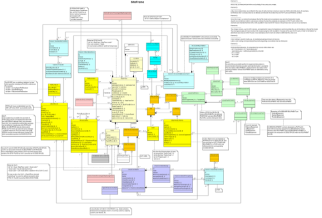

# Stop Modelling

# Site Frame 
The SITE FRAME holds a coherent set of Site elements for data exchange. These elements are explained in subsequent sections. 
A set of SITE data (and other data logically related to these) to which the same VALIDITY CONDITIONs have been assigned. 
 
The SITE MODEL provides a general description of common properties of a physically situated location, such as a station or 
point of interest, including its entrances, levels, equipment, paths, accessibility properties, etc.  
 
The SITE FRAME comprises among other classes: 
- STOP PLACE: models a station or stop with its properties like location, levels and access features. 
- QUAY: models the places of a station or stop where passengers can board a vehicle. 
 
See the following class diagram for the most important objects of the SITE FRAME and their relationships to the other frames. 




| Sub | Element | Usage | Card | Type | Description | Note |
|-----|---------|-------|------|------|-------------|------|
|  | StopPlace | mandatory | 1..1 | unknown | Version of a named place where public transport may be accessed. May be a building complex (e.g. a station) or an on-street location. Can be a STOP PLACE, VEHICLE MEETING POINT, TAXI RANK. Note: If a master id exists for a StopPlace (must be stable and globally unique), then it is best used in the id. Optimally it would be built according IFOPT. It can also be put into one of the privateCodes in addition. If it is stored in KeyValue, then it should be documented well, so that importing systems know, which id is the relevant one. | **todo** all texts are missing in this file yet |
| + | keyList | mandatory | 1..1 | KeyListStructure | A list of alternative Key values for an element. |  |
| ++ | KeyValue | mandatory | 1..* | KeyValueStructure | Key value pair for Entity. |  |
| +++ | Key | mandatory | 1..1 | xsd:normalizedString | Identifier of value e.g. System. |  |
| +++ | Value | mandatory | 0..1 | xsd:anyType | Value associated with QUALITY STRUCTURE FACTOR. |  |
| + | Name | mandatory | 0..1 | MultilingualString | Name of Traveller |  |
| + | PrivateCode | mandatory | 1..1 | PrivateCodeStructure | A private code that uniquely identifies the element. May be used for inter-operating with other (legacy) systems. |  |
| + | Centroid | mandatory | 0..1 | SimplePoint_VersionStructure | Centre Coordinates of GROUP of STOP PLACEs. |  |
| ++ | Location | mandatory | 0..1 | LocationStructure | Absolute location of EQUIPMENT. |  |
| +++ | Longitude | mandatory | 1..1 | LongitudeType | Longitude from Greenwich Meridian. -180 (East) to +180 (West). |  |
| +++ | Latitude | mandatory | 1..1 | LatitudeType | Latitude from equator. -90 (South) to +90 (North). |  |
| +++ | Altitude | mandatory | 0..1 | AltitudeType | Altitude. |  |
| + | alternativeNames | optional | 0..1 | alternativeNames_RelStructure | ALTERNATIVE NAMES for MACHINE READABILITY. |  |
| + | StopPlaceType | optional | 0..1 | StopTypeEnumeration | Type of STOP PLACE. |  |
| + | quays | expected | 1..1 | quays_RelStructure | QUAYs within the STOP PLACE. |  |


```xml
<?xml version="1.0" encoding="UTF-8"?>
<StopPlace  id="ch:1:sloid:7000" version="any">
  <!-- **todo** all texts are missing in this file yet -->
  <keyList>
    <KeyValue>
      <Key>DIDOK</Key>
      <Value>7000</Value>
    </KeyValue>
    <KeyValue>
      <Key>SLOID</Key>
      <Value>ch:1:sloid:7000</Value>
    </KeyValue>
  </keyList>
  <Name>Bern</Name>
  <PrivateCode>7000</PrivateCode>
  <Centroid>
    <Location>
      <Longitude>7.43913088992</Longitude>
      <Latitude>46.94883228914</Latitude>
      <Altitude>540.2</Altitude>
    </Location>
  </Centroid>
  <alternativeNames>
    <AlternativeName id="ch:1:sloid:7000:it">
      <Name lang="it">Berna</Name>
    </AlternativeName>
  </alternativeNames>
  <StopPlaceType>railStation</StopPlaceType>
  <quays>
    <Quay id="ch:1:sloid:7000:5:9" version="any"/>
  </quays>
</StopPlace>

```


- [General NeTEx definition ](../generated/xcore/StopPlace.html)

# StopPlace

(NeTEx-1, 8.5.4.5.1, NeTEx-8.5.3.3.1) 
The STOP PLACE model describes different aspects of a physical point of access to transport, 
such as a stop or station.  
 
A STOP PLACE represents physical stop or station; that is an interchange, a pair of stops or a cluster of stops on a LINE. 
A STOP PLACE is a type of SITE. Note that a STOP PLACE is a distinct concept from the representation of the stop in a 
timetable – the SCHEDULED STOP POINT. The two can be connected using a STOP ASSIGNMENT. 
 
The various spaces of which a STOP PLACE is comprised are described as different types of SITE COMPONENT specific to a 
STOP PLACE, such as platforms (QUAYs).  

## Business Requirements

In Switzerland all these StopPlace codes are defined in Didok by order of the Department of Transport (BAV). If the BAV will regulate also “Haltepunkte” and “Haltekante” then also the Quays will be regulated. Foreign StopPlaces may be mapped to Swiss Didok codes. 
 
It is important to notice that the main connection between Didok codes and the NeTEx export are the ScheduledStopPoints. Those will have the same Id (besides the different <Element Name> as the StopPlace in many cases. Exceptions are meta stations and local public transport that already uses assignment to “Haltekanten”. In that case the ScheduledStopPoint is more refined than the DiDok UIC like codes. 
 
There will be meta-stations added with their own code. In some cases these are added for operational or searching reasons. 


| Sub | Element | Usage | Card | Type | Description | Note |
|-----|---------|-------|------|------|-------------|------|
|  | StopPlace | mandatory | 1..1 | unknown | Version of a named place where public transport may be accessed. May be a building complex (e.g. a station) or an on-street location. Can be a STOP PLACE, VEHICLE MEETING POINT, TAXI RANK. Note: If a master id exists for a StopPlace (must be stable and globally unique), then it is best used in the id. Optimally it would be built according IFOPT. It can also be put into one of the privateCodes in addition. If it is stored in KeyValue, then it should be documented well, so that importing systems know, which id is the relevant one. | **todo** all texts are missing in this file yet |
| + | keyList | mandatory | 1..1 | KeyListStructure | A list of alternative Key values for an element. |  |
| ++ | KeyValue | mandatory | 1..* | KeyValueStructure | Key value pair for Entity. |  |
| +++ | Key | mandatory | 1..1 | xsd:normalizedString | Identifier of value e.g. System. |  |
| +++ | Value | mandatory | 0..1 | xsd:anyType | Value associated with QUALITY STRUCTURE FACTOR. |  |
| + | Name | mandatory | 0..1 | MultilingualString | Name of Traveller |  |
| + | PrivateCode | mandatory | 1..1 | PrivateCodeStructure | A private code that uniquely identifies the element. May be used for inter-operating with other (legacy) systems. |  |
| + | Centroid | mandatory | 0..1 | SimplePoint_VersionStructure | Centre Coordinates of GROUP of STOP PLACEs. |  |
| ++ | Location | mandatory | 0..1 | LocationStructure | Absolute location of EQUIPMENT. |  |
| +++ | Longitude | mandatory | 1..1 | LongitudeType | Longitude from Greenwich Meridian. -180 (East) to +180 (West). |  |
| +++ | Latitude | mandatory | 1..1 | LatitudeType | Latitude from equator. -90 (South) to +90 (North). |  |
| +++ | Altitude | mandatory | 0..1 | AltitudeType | Altitude. |  |
| + | alternativeNames | optional | 0..1 | alternativeNames_RelStructure | ALTERNATIVE NAMES for MACHINE READABILITY. |  |
| + | StopPlaceType | optional | 0..1 | StopTypeEnumeration | Type of STOP PLACE. |  |
| + | quays | expected | 1..1 | quays_RelStructure | QUAYs within the STOP PLACE. |  |


```xml
<?xml version="1.0" encoding="UTF-8"?>
<StopPlace  id="ch:1:sloid:7000" version="any">
  <!-- **todo** all texts are missing in this file yet -->
  <keyList>
    <KeyValue>
      <Key>DIDOK</Key>
      <Value>7000</Value>
    </KeyValue>
    <KeyValue>
      <Key>SLOID</Key>
      <Value>ch:1:sloid:7000</Value>
    </KeyValue>
  </keyList>
  <Name>Bern</Name>
  <PrivateCode>7000</PrivateCode>
  <Centroid>
    <Location>
      <Longitude>7.43913088992</Longitude>
      <Latitude>46.94883228914</Latitude>
      <Altitude>540.2</Altitude>
    </Location>
  </Centroid>
  <alternativeNames>
    <AlternativeName id="ch:1:sloid:7000:it">
      <Name lang="it">Berna</Name>
    </AlternativeName>
  </alternativeNames>
  <StopPlaceType>railStation</StopPlaceType>
  <quays>
    <Quay id="ch:1:sloid:7000:5:9" version="any"/>
  </quays>
</StopPlace>

```


- [General NeTEx definition ](../generated/xcore/StopPlace.html)

> The **Centroid** always contains a location:
> - The main coordinates are given as WSG84.
> - The Swiss coordinates are added as well, when available (see below) 
> - INFO+ will not use the data from the import. Always the DIDOK master data will be used for all Swiss coordinates. INFO+ will use the data of foreign places.

# Quay

(NeTEx-1 8.5.4.5.6) 
A place such as platform, stance, or quayside where passengers have access to PT vehicles, taxi, cars or other means of transportation. A QUAY may serve one or more VEHICLE STOPPING PLACEs and be associated with one or more STOP POINTs.  
 
A QUAY may contain other sub QUAYs. A child QUAY must be physically contained within its parent QUAY.  

Further more: 
- A nested QUAY is always physically contiguous with its parent and so has the same accessibility characteristics 
as it parents. 
- Nested QUAYs should not be used to mark individual positions on a platform – BOARDING POSITIONs service this function. 
- Nested QUAYs and ACCESS PLACES must always be on the same LEVEL as their parent

## Business Requirements   

QUAYs are mapped with the following resolution: 
- No hierarchy between the different definitions of quays is foreseen at the moment 
- All combinations between sectors of the same quay are considered as independent quays. 
- Combinations of several quays are considered as independent quays. 
 
In future the modelling of the Quays might adhere to EPIAP (NeTEx part 6) more to make sure that accessibility features can be modelled 
correctly.. 


| Sub | Element | Usage | Card | Type | Description | Note |
|-----|---------|-------|------|------|-------------|------|
| + | keyList | mandatory | 1..1 | KeyListStructure | A list of alternative Key values for an element. |  |
| ++ | KeyValue | mandatory | 1..* | KeyValueStructure | Key value pair for Entity. |  |
| +++ | Key | mandatory | 1..1 | xsd:normalizedString | Identifier of value e.g. System. |  |
| +++ | Value | mandatory | 0..1 | xsd:anyType | Value associated with QUALITY STRUCTURE FACTOR. |  |
| + | Centroid | mandatory | 0..1 | SimplePoint_VersionStructure | Centre Coordinates of GROUP of STOP PLACEs. |  |
| ++ | Location | mandatory | 0..1 | LocationStructure | Absolute location of EQUIPMENT. |  |
| +++ | Longitude | mandatory | 1..1 | LongitudeType | Longitude from Greenwich Meridian. -180 (East) to +180 (West). |  |
| +++ | Latitude | mandatory | 1..1 | LatitudeType | Latitude from equator. -90 (South) to +90 (North). |  |
| +++ | Altitude | mandatory | 0..1 | AltitudeType | Altitude. |  |


```xml
<?xml version="1.0" encoding="UTF-8"?>
<Quay  id="ch:1:sloid:7000:5:9" version="any">
  <keyList>
    <KeyValue>
      <Key>SLOID</Key>
      <Value>ch:1:sloid:7000:5:9</Value>
    </KeyValue>
  </keyList>
  <Centroid>
    <Location>
      <Longitude>7.43913088992</Longitude>
      <Latitude>46.94883228914</Latitude>
      <Altitude>540.2</Altitude>
    </Location>
  </Centroid>
</Quay>

```


- [General NeTEx definition ](../generated/xcore/Quay.html)

# TopographicPlace

(prCEN TS 16614-PI Profile FV (E)-v7_v3, section 6.2.6) 
A TOPOGRAPHIC PLACE is a geographical settlement which provides topographical context when searching for or presenting travel information, for example as the origin or destination of a trip.  


| Sub | Element | Usage | Card | Type | Description | Note |
|-----|---------|-------|------|------|-------------|------|
|  | TopographicPlace | mandatory | 1..1 | unknown | A town, city, village, suburb, quarter or other name settlement within a country. Provides a Gazetteer of Transport related place names. |  |
| + | Descriptor | mandatory | 1..1 | TopographicPlaceDescriptor_VersionedChildStructure | Structured text descriptor of TOPOGRAPHIC PLACE. |  |
| ++ | Name | mandatory | 0..1 | MultilingualString | Name of Traveller |  |
| ++ | ShortName | mandatory | 0..1 | MultilingualString | Short Name for service |  |
| + | TopographicPlaceType | mandatory | 0..1 | TopographicPlaceTypeEnumeration | Classification of the TOPOGRAPHIC PLACE as a settlement. Enumerated value. |  |


```xml
<?xml version="1.0" encoding="UTF-8"?>
<TopographicPlace  id="ch:1:TopoGraphicPlace:CH-BE" version="any">
  <Descriptor>
    <Name>Bern</Name>
    <ShortName>BE</ShortName>
  </Descriptor>
  <TopographicPlaceType>county</TopographicPlaceType>
</TopographicPlace>

```


- [General NeTEx definition ](../generated/xcore/TopographicPlace.html)

## Business Requirements

The TopograficPlace represent the cantons and communes in Switzerland. The value will be set to the cantons for stops. 

[//]: # (TODO: Comment to Centroid is repeated.)
Comment to Centroid:

The “Centroid” always contains a location. 
- The main coordinates are given as WSG84. 
- The Swiss coordinates are added as well, when available (see below) 
- INFO+ will not use the data from the import. Always the DIDOK master data will be used for all Swiss coordinates. INFO+ will use the data of foreign places. 
