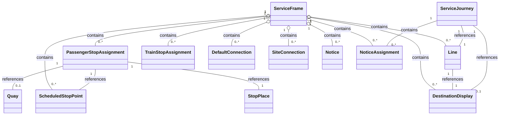

# Services
In this chapter:
- [Line](#line)
- [DestinationDisplay](#destinationdisplay)
- [ScheduledStopPoint](#scheduledstoppoint)
- [PassengerStopAssignment](#passengerstopassignment)
- [TrainStopAssignment](**TODO**)
- [DefaultConnection](#defaultconnection)
- [SiteConnection](#siteconnection)
- [ServiceJourneyPattern](#servicejourneypattern)
- [Notice](#NoticeAssignment)
- [NoticeAssignment](#NoticeAssignment)

## ServiceFrame
*→ [Glossary definition](A4_annex_glossary.md#serviceframe)*

### Purpose
See the following class diagram for the most important objects of the `ServiceFrame` and their relationships to the other frames.



### Contained Elements
The `ServiceFrame` model comprises among others:
-	Route model: fixed and flexible  `Line`s and `Route`s of a transport network.
-	Line network model: overall topology of the `Line` and line sections that make up a transport network.
-	Service pattern model: `ScheduledStopPoint`s, `ServiceLink`, i.e., points and links referenced by schedules.

Other important classes of the `ServiceFrame` include:
-	`PassengerStopAssignment`s and `TrainStopAssignment` which model the relationship between stops in the timetable and the physical platforms of an actual station or other stop.
-	`Connection`s as the topological model of interchanges. They model the possibility of a transfer between two `ScheduledStopPoints`.
-	`Notice`s which are then assigned to `Journey` and `Passingtime` of the `TimetableFrame` through `NoticeAssignment`s. They model the association of footnotes and passenger information content such as stop announcements and the network.

### Table
[Swiss profile NeTEx definition](../generated/markdown-examples/ServiceFrame.md)

*→ [General NeTEx definition ](../generated/xcore/ServiceFrame.html)*

### Example
[Example snippet](../generated/xml-snippets/ServiceFrame.xml)

*→ [Template](../templates/ServiceFrame.xml)*

### Frame Relationships
`ServiceFrame` depends on `ResourceFrame` for `Operator` definitions. `VehicleScheduleFrame` may reference journeys defined here for block and duty scheduling. `PassengerStopAssignment`s build the connection between `ScheduledStopPoints` and the physical model in`SiteFrame`. ServiceFrame` is typically wrapped in a `CompositeFrame`within a `PublicationDelivery`.


## Direction
We don't use `Direction` but only `DirectionType`. For this we need NeTEx 2.1.

This means that the old two defined dirctions `ch:1:Direction:H` and `ch:1:Direction:R` will no longer be supported.


## Line
*→ [Glossary definition](A4_annex_glossary.md#Line)*
### Purpose
Transmodel defines a LINE as a grouping of ROUTEs that is generally known to the public by a similar name or number. These ROUTEs are usually very similar to each other from the topological point of view.
Each LINE has a unique number  PrivateCode, a ShortName and a Name.  Passengers recognise a LINE by its published “PublicCode”. The transport mode is specified in  “TransportMode”, e.g.  metro, tram, bus etc. 
The assignment of a LINE to an ORGANISATION is done by the element OperatorRef and to the operationalContext with OperationalContextRef.
Note that there exist journeys in Switzerland and neighbouring countries that are not associated with a Line. In NeTEx, however, the ServiceJourneys corresponding to such journeys must still reference something in LineRef. To ensure this, we introduce a placeholder Line called "NoLine" for each Operator that has journeys without a Line. 
For more information about SwissLineID: see https://www.xn--v-info-vxa.ch/sites/default/files/2023-06/slnid-spezifikation_v1.25_0.pdf
Be aware that there might be for mixed lines multiple lines in NeTEx. Otherwise, the relevant operator must at least be set on the ServiceJourney.

### Table


| Sub | Element | Usage | Card | Type | Description | Note |
|-----|---------|-------|------|------|-------------|------|
|  | Line | mandatory | 1..1 | unknown | A group of ROUTEs which is generally known to the public by a similar name or number. | We have a duplication with responsibilitySet and OperatorRef. With AuthorityRef we currently have a problem, because we can't use the same organisation **TODO** |
| + | ValidBetween | expected | 1..1 | unknown | OPTIMISATION. Simple version of a VALIDITY CONDITION. Comprises a simple period. NO UNIQUENESS CONSTRAINT. | Usually set to the whole timetable year |
| ++ | FromDate | expected | 0..1 | xsd:dateTime | Start date of AVAILABILITY CONDITION. |  |
| ++ | ToDate | expected | 0..1 | xsd:dateTime | End of AVAILABILITY CONDITION. Date is INCLUSIVE. |  |
| + | keyList | mandatory | 1..1 | KeyListStructure | A list of alternative Key values for an element. |  |
| ++ | KeyValue | expected | 1..* | KeyValueStructure | Key value pair for Entity. | The SLNID is mandatory, when it exists |
| +++ | Key | expected | 1..1 | xsd:normalizedString | Identifier of value e.g. System. |  |
| +++ | Value | expected | 0..1 | xsd:anyType | Value associated with QUALITY STRUCTURE FACTOR. |  |
| + | Name | mandatory | 0..1 | MultilingualString | Name of Traveller | contains attribute D T from HRDF. Is not translated on purpose. |
| + | ShortName | expected | 0..1 | MultilingualString | Short Name for service | contains the LinieKurzName (attribut N T in HRDF) |
| + | TransportMode | mandatory | 0..1 | AllModesEnumeration | MODE. |  |
| ++ | RailSubmode | expected | 1..1 | RailSubmodeEnumeration | TPEG pti02 Rail submodes loc13.


*-> [General NeTEx definition](../generated/xcore/Line.html)*

### Example


```xml
<?xml version="1.0" encoding="UTF-8"?>
<Line  id="use swiss line id where possible" version="1" responsibilitySetRef="dsa">
  <!-- We have a duplication with responsibilitySet and OperatorRef. With AuthorityRef we currently have a problem, because we can't use the same organisation **TODO** -->
  <ValidBetween>
    <!-- Usually set to the whole timetable year -->
    <FromDate>2022-12-11T00:00:00</FromDate>
    <ToDate>2023-12-09T23:59:59</ToDate>
  </ValidBetween>
  <keyList>
    <KeyValue>
      <!-- The SLNID is mandatory, when it exists -->
      <Key>SLNID</Key>
      <Value>ch:1:slnid:102846</Value>
    </KeyValue>
  </keyList>
  <Name>3</Name>
  <!-- contains attribute D T from HRDF. Is not translated on purpose. -->
  <ShortName>3</ShortName>
  <!-- contains the LinieKurzName (attribut N T in HRDF) -->
  <TransportMode>rail</TransportMode>
  <TransportSubmode>
    <RailSubmode>suburbanRailway</RailSubmode>
  </TransportSubmode>
  <PublicCode>3</PublicCode>
  <!-- Contains LinieLangName (attribute LT from HRDF) -->
  <AuthorityRef ref="ch:1:Operator:11" version="1">
    <!-- Contains the AUTHORITY OF the LINE. -->
  </AuthorityRef>
  <OperatorRef ref="ch:1:Operator:11" version="1">
    <!-- The operator is the transport organisation that really will do the operation. If different from AuthorityRef -->
  </OperatorRef>
  <TypeOfProductCategoryRef ref="ch:1:TypeOfProductCategory:TER" version="1">
    <!-- **TODO** needs tobe clarified from BS KI -->
  </TypeOfProductCategoryRef>
</Line>

```


*->[Template](../templates/Line.xml)*

### Usage Notes
- slnid will be integrated wherever possible. We currently think that - where it exists - it has the necessary properties to be used in the `id`-attribute.
- For foreign lines and id might need to be generated.
- We store the slnid whenever possible in `id`, `privateCodes/PrivateCode` and `KeyList`.
- **TODO** link to migration concept slnid
- **TODO** handling of mixed lines
- 

## DestinationDisplay
*→ [Glossary definition](A4_annex_glossary.md#DestinationDisplay)*

### Purpose
Showing the destination of a `ServiceJourney`.

### Table


| Sub | Element | Usage | Card | Type | Description | Note |
|-----|---------|-------|------|------|-------------|------|
|  | DestinationDisplay | expected | 1..1 | unknown | An advertised destination of a specific JOURNEY PATTERN, usually displayed on a head sign or at other on-board locations. | We only allow fully formed content of destinationDisplays |
| + | Name | mandatory | 0..1 | MultilingualString | Name of Traveller | Is always language neutral. The data is taken from the Des-tination or from the reference in *R (HRDF). If DURCHBI is used then the destination display shows the final destination. |
| + | @lang | mandatory | 1..1 | xsd:string | Attribute lang | |
| + | DriverDisplayText | optional | 0..1 | MultilingualString | Text to show to Driver or Staff for the DESTINATION DISPLAY. | Text to display to DRIVER. |
| + | PrivateCode | mandatory | 1..1 | PrivateCodeStructure | A private code that uniquely identifies the element. May be used for inter-operating with other (legacy) systems. | **TODO** were do we get this code from. |


*-> [General NeTEx definition](../generated/xcore/DestinationDisplay.html)*

### Example


```xml
<?xml version="1.0" encoding="UTF-8"?>
<DestinationDisplay  id="generated-id" version="1">
  <!-- We only allow fully formed content of destinationDisplays -->
  <Name lang="de">Porrentruy</Name>
  <!-- Is always language neutral. The data is taken from the Des-tination or from the reference in *R (HRDF). If DURCHBI is used then the destination display shows the final destination. -->
  <DriverDisplayText>Porrentruy</DriverDisplayText>
  <!-- Text to display to DRIVER. -->
  <PrivateCode>212</PrivateCode>
  <!-- **TODO** were do we get this code from. -->
  <Presentation/>
</DestinationDisplay>

```


*->[Template](../templates/DestinationDisplay.xml)*

### Usage Notes
- In HRDF sometimes the destination is not set (`*R`). This results in NeTEX in a calculated destination definition. 
- The `DestinationDiplay` is usually be set on the `ServiceJourney`. If it changes during the run, it needs to be changed in the `ServiceJourneyPattern`. If it changes on that, then the new destination should be used. In our output, we will fill all remaining `PointsInJourneyPattern`with the relevant change.
- See also the [use case on changes in destination](uc13_changes_in_destination.md) 

> **TODO** the rules for defining need to be clarified.

## ScheduledStopPoint
*→ [Glossary definition](A4_annex_glossary.md#ScheduledStopPoint)*

### Purpose
`ScheduledStopPoint` is a core concept. It is the “Point” used in the timetable for the services to stop. A `ScheduledStopPoint` can refer to a `Quay` or only a `StopPlace`. So the level of hierarchy is not determined by the element (see [PassengerStopAssignment](#passengerstopassignment)).

A `ScheduledStopPoint` can represent two types of stop points:
-	In most cases, the `ScheduledStopPoint` is the station named in the timetable, especially as some organisations don’t have a full physical model of their StopPlaces. 
-	In some cases, the `ScheduledStopPoint` may be mapped to the `Quay`. The more detailed mapping is also done with the `PassengerStopAssignment`.


### Table


| Sub | Element | Usage | Card | Type | Description | Note |
|-----|---------|-------|------|------|-------------|------|
| + | ScheduledStopPoint | mandatory | 1..1 | unknown | A POINT where passengers can board or alight from vehicles. It is open, which hierarchical level such a point has. It can represent a single door (BoardingPosition) or a whole ZONE. The association to the physical model is done with STOP ASSIGNMENTs. | Swiss ScheduledStopPoint are using the sloid in the id, when possible. |
| ++ | keyList | mandatory | 1..1 | KeyListStructure | A list of alternative Key values for an element. |  |
| +++ | KeyValue | mandatory | 1..* | KeyValueStructure | Key value pair for Entity. | We expect a DIDOK key and a SLOID, whereever possible. |
| ++++ | Key | mandatory | 1..1 | xsd:normalizedString | Identifier of value e.g. System. |  |
| ++++ | Value | mandatory | 0..1 | xsd:anyType | Value associated with QUALITY STRUCTURE FACTOR. |  |
| ++ | Name | mandatory | 0..1 | MultilingualString | Name of Traveller | The names are the same in all languages. |
| ++ | ShortName | mandatory | 0..1 | MultilingualString | Short Name for service | StopPlace : Name of the Place, Quay : ShortName of the Quay |


*-> [General NeTEx definition](../generated/xcore/ScheduledStopPoint.html)*

### Example


```xml
<?xml version="1.0" encoding="UTF-8"?>
<scheduledStopPoints >
  <ScheduledStopPoint id="ch:1:ScheduledStopPoint:8504128:1" version="any">
    <!-- Swiss ScheduledStopPoint are using the sloid in the id, when possible. -->
    <keyList>
      <KeyValue>
        <!-- We expect a DIDOK key and a SLOID, whereever possible. -->
        <Key>DIDOK</Key>
        <Value>8504128</Value>
      </KeyValue>
      <KeyValue>
        <Key>SLOID</Key>
        <Value>ch:1:sloid:4128</Value>
      </KeyValue>
    </keyList>
    <Name lang="de">Murten/Morat</Name>
    <!-- The names are the same in all languages. -->
    <ShortName lang="de">1</ShortName>
    <!-- StopPlace : Name of the Place, Quay : ShortName of the Quay -->
  </ScheduledStopPoint>
</scheduledStopPoints>

```


*->[Template](../templates/ScheduledStopPoint.xml)*

## PassengerStopAssignment
*→ [Glossary definition](A4_annex_glossary.md#PassengerStopAssignment)*

### Purpose

`PassengerStopAssignment`s bring the Site model and the Service model in alignment. We have two general cases:
-	A `ScheduledStopPoint` in a `ServiceJourneyPattern` is linked to a `StopPlace` for arrival and departure.
-	A `ScheduledStopPoint` in a `ServiceJourneyPattern` is linked to a `Quay` for arrival and departure.

### Table


| Sub | Element | Usage | Card | Type | Description | Note |
|-----|---------|-------|------|------|-------------|------|
|  | PassengerStopAssignment | mandatory | 1..1 | unknown | The default allocation of a SCHEDULED STOP POINT to a specific STOP PLACE, and also possibly a QUAY and BOARDING POSITION. |  |
| + | ScheduledStopPointRef | mandatory | 0..1 | ScheduledStopPointRefStructure | Specific SCHEDULED STOP POINT at end of CONNECTION. |  |
| + | StopPlaceRef | mandatory | 0..1 | StopPlaceRefStructure | System identifier of a STOP PLACE. May be omitted if given by context. |  |
| + | QuayRef | expected | 0..1 | QuayRefStructure | QUAY to which SCHEDULED STOP POINT is to be assigned. | Not having the track may be problematic, but it can happen |


*-> [General NeTEx definition](../generated/xcore/PassengerStopAssignment.html)*

### Example


```xml
<?xml version="1.0" encoding="UTF-8"?>
<PassengerStopAssignment  id="generated-85003000-12" version="1">
  <ScheduledStopPointRef ref="ch:1:sloid:3000:503:12" version="1"/>
  <StopPlaceRef ref="ch:1:sloid:3000" version="1"/>
  <QuayRef ref="ch:1:sloid:3000:503:12" version="1">
    <!-- Not having the track may be problematic, but it can happen -->
  </QuayRef>
</PassengerStopAssignment>

```


*->[Template](../templates/PassengerStopAssignment.xml)*

### Usage Notes

> ** TODO ** Suppose a vehicle arrives at quay 2A and departs on quay 2D. In this case we model only the SCHEDULED STOP POINT for QUAY 2 but assign this STOP POINT to both QUAYs by using two different PASSENGER STOP ASSIGNMENTS.

## DefaultConnection
*→ [Glossary definition](A4_annex_glossary.md#DefaultConnection)*

### Purpose
`DefaultConnections` are used to transmit the connection times for the following constellations:
-	between 2 `ProductCategory`s
-	between 2 `Operator`s
-	In a defined `StopPlace`
-	In a defined `StopPlace` and 2 `Operator`s
-	in a defined `StopPlace`, 2 `Operator`s and 2 `ProductCategory`s


### Table


| Sub | Element | Usage | Card | Type | Description | Note |
|-----|---------|-------|------|------|-------------|------|
|  | DefaultConnection | expected | 1..1 | unknown | Specifies the default transfer times to transfer between MODEs and / or OPERATORs within a region. | Be aware only some combinations areallowed  mode - mode, operator/type of product category - operator/type of  product category. |
| + | Extensions | optional | 1..1 | ExtensionsStructure | User defined Extensions to ENTITY in schema. (Wrapper tag used to avoid problems with handling of optional 'any' by some validators). | When also ProductCategory is relevant, then this extension must be used |
| ++ | FromProductCategoryRef | mandatory | 1..1 | unknown |  | Extension needed to map "Verkehrsmittel-Gattung", which is similar to but more detailed than Trans-portSubmode, for transfer times of interchanges. |
| ++ | ToProductCategoryRef | mandatory | 1..1 | unknown |  | Extension needed to map "Verkehrsmittel-Gattung", which is similar to but more detailed than Trans-portSubmode, for transfer times of interchanges. |
| + | TransferDuration | mandatory | 0..1 | TransferDurationStructure | Timings for the transfer. | We use WalkTransferDuration sometimes. need to clarify **TODO** |
| ++ | DefaultDuration | mandatory | 0..1 | xsd:duration | Default time needed for a traveller to make a TRANSFER. |  |
| + | BothWays | optional | 0..1 | xsd:boolean | Whether timings and validity applies to both directions (true) or just to the from-to direction of the TRANSFER. | **TODO** to use or not |
| + | From | mandatory | 0..1 | ConnectionEndStructure | Origin end of CONNECTION. |  |
| ++ | TransportMode | optional | 0..1 | AllModesEnumeration | MODE. |  |
| ++ | OperatorView | optional | 1..1 | unknown | Simplified view of OPERATOR. All data except the identifier will be derived through the relationship. |  |
| +++ | OperatorRef | mandatory | 1..1 | OperatorRefStructure | Reference to an OPERATOR. |  |
| + | To | mandatory | 0..1 | ConnectionEndStructure | Destination end of CONNECTION. |  |
| + | StopPlaceRef | optional | 0..1 | StopPlaceRefStructure | System identifier of a STOP PLACE. May be omitted if given by context. | Is a sloid usually. Not set, means whole network. |


*-> [General NeTEx definition](../generated/xcore/DefaultConnection.html)*

### Example


```xml
<?xml version="1.0" encoding="UTF-8"?>
<DefaultConnection  id="11-11" version="1">
  <!-- Be aware only some combinations areallowed  mode - mode, operator/type of product category - operator/type of  product category. -->
  <Extensions>
    <!-- When also ProductCategory is relevant, then this extension must be used -->
    <FromProductCategoryRef ref="ch:1:TypeOfProductCategory:ICE" version="1">
      <!-- Extension needed to map "Verkehrsmittel-Gattung", which is similar to but more detailed than Trans-portSubmode, for transfer times of interchanges. -->
    </FromProductCategoryRef>
    <ToProductCategoryRef ref="ch:1:TypeOfProductCategory:TE2" version="1">
      <!-- Extension needed to map "Verkehrsmittel-Gattung", which is similar to but more detailed than Trans-portSubmode, for transfer times of interchanges. -->
    </ToProductCategoryRef>
  </Extensions>
  <TransferDuration>
    <!-- We use WalkTransferDuration sometimes. need to clarify **TODO** -->
    <DefaultDuration>PT2M</DefaultDuration>
  </TransferDuration>
  <BothWays>false</BothWays>
  <!-- **TODO** to use or not -->
  <From>
    <TransportMode>all</TransportMode>
    <OperatorView>
      <OperatorRef ref="ch:1:Operator:11" version="1"/>
    </OperatorView>
  </From>
  <To>
    <TransportMode>all</TransportMode>
    <OperatorView>
      <OperatorRef ref="ch:1:Operator:11" version="1"/>
    </OperatorView>
  </To>
  <StopPlaceRef ref="ch:1:sloid:19231" version="1">
    <!-- Is a sloid usually. Not set, means whole network. -->
  </StopPlaceRef>
</DefaultConnection>

```


*->[Template](../templates/DefaultConnection.xml)*

### Usage Notes
For more details see the [use case on transfers](uc03_transfers.md).


## SiteConnection
*→ [Glossary definition](A4_annex_glossary.md#SiteConnection)*

### Purpose
The `SiteConnection` describes the transfer times between two adjacent `StopPlace`s. 


### Table


| Sub | Element | Usage | Card | Type | Description | Note |
|-----|---------|-------|------|------|-------------|------|
|  | SiteConnection | expected | 1..1 | unknown | The physical (spatial) possibility to connect from one point to another in a SITE. | SiteConnection are used only in the main file and not in timetable files. |
| + | WalkTransferDuration | mandatory | 0..1 | TransferDurationStructure | Timings for walking over TRANSFER if different from the JOURNEY PATTERN transfer duration, |  |
| ++ | DefaultDuration | mandatory | 0..1 | xsd:duration | Default time needed for a traveller to make a TRANSFER. |  |
| + | BothWays | mandatory | 0..1 | xsd:boolean | Whether timings and validity applies to both directions (true) or just to the from-to direction of the TRANSFER. |  |
| + | From | mandatory | 0..1 | ConnectionEndStructure | Origin end of CONNECTION. | Could also refer to a Quay or a different SiteElement. Currently we only transfer StopPlaceRefs. |
| ++ | StopPlaceRef | mandatory | 0..1 | StopPlaceRefStructure | System identifier of a STOP PLACE. May be omitted if given by context. |  |
| + | To | mandatory | 0..1 | ConnectionEndStructure | Destination end of CONNECTION. | Could also refer to a Quay or a different SiteElement. Currently we only transfer StopPlaceRefs. |


*-> [General NeTEx definition](../generated/xcore/SiteConnection.html)*

### Example


```xml
<?xml version="1.0" encoding="UTF-8"?>
<SiteConnection  id="ch:1:SiteConnection:8506302-8589913" version="1">
  <!-- SiteConnection are used only in the main file and not in timetable files. -->
  <WalkTransferDuration>
    <DefaultDuration>PT13M</DefaultDuration>
  </WalkTransferDuration>
  <BothWays>false</BothWays>
  <From>
    <!-- Could also refer to a Quay or a different SiteElement. Currently we only transfer StopPlaceRefs. -->
    <StopPlaceRef ref="ch:2:StopPlace:8506302" version="1"/>
  </From>
  <To>
    <!-- Could also refer to a Quay or a different SiteElement. Currently we only transfer StopPlaceRefs. -->
    <StopPlaceRef ref="ch:2:StopPlace:8589913" version="1"/>
  </To>
</SiteConnection>

```


*->[Template](../templates/SiteConnection.xml)*

### Usage Notes
For more details see the [use case on transfers](uc03_transfers.md).


## ServiceJourneyPattern
*→ [Glossary definition](A4_annex_glossary.md#ServiceJourneyPattern)*

### Purpose
`ServiceJourneyPattern` are used to describe the basic patterns of `ServiceJourney`s.


### Table


| Sub | Element | Usage | Card | Type | Description | Note |
|-----|---------|-------|------|------|-------------|------|
|  | ServiceJourneyPattern | mandatory | 1..1 | unknown | The JOURNEY PATTERN for a (passenger carrying) SERVICE JOURNEY. |  |
| + | Name | optional | 0..1 | MultilingualString | Name of Traveller |  |
| + | RouteView | mandatory | 1..1 | unknown | Annotated reference to a ROUTE. |  |
| ++ | LineRef | mandatory | 1..1 | LineRefStructure | Reference to a LINE. |  |
| + | DirectionType | mandatory | 0..1 | RelativeDirectionEnumeration | For fares for DISTANCE MATRIXE LEMENTs, DIRECTION in which price applies. |  |
| + | pointsInSequence | mandatory | 0..1 | vehicleMeetingPointsInSequence_RelStructure |  |  |
| ++ | StopPointInJourneyPattern | mandatory | 1..1 | unknown | The use of a SCHEDULED STOP POINT in a specified order. within a JOURNEY PATTERN or SERVICE PATTERN. |  |
| +++ | ScheduledStopPointRef | mandatory | 0..1 | ScheduledStopPointRefStructure | Specific SCHEDULED STOP POINT at end of CONNECTION. |  |
| +++ | ForAlighting | mandatory | 0..1 | xsd:boolean | Whether alighting is allowed at the stop Default is true. |  |
| +++ | ForBoarding | mandatory | 0..1 | xsd:boolean | Whether boarding is allowed at the stop. Default is true. |  |
| +++ | DestinationDisplayRef | optional | 1..1 | DestinationDisplayRefStructure | Reference to a DESTINATION DISPLAY. | Indicates that the destination has changed. Superseeds Line or ServiceJourney |
| +++ | RequestStop | optional | 0..1 | xsd:boolean | Whether stop is a request stop for this journey. Default is false. |  |
| +++ | StopUse | optional | 0..1 | StopUseEnumeration | Nature of use of stop, e.g. access, interchange only, or pass through. Default is Access. | All values possible |
| +++ | bookingArrangements | optional | 0..1 | bookingArrangements_RelStructure | Set of possible Booking Arrangements for Cancellations. +v2.0 |  |
| ++++ | BookingArrangementRef | optional | 1..1 | BookingArrangementRefStructure | Reference to a BOOKING ARRANGEMENT. | Specially we use bookingArrangementRef here to model the information that a stop is flexible. From the HRDF conversion only a BookingNote can be passed at the moment. With native NeTEx handling we can transfer more information. |
| ++++ | BookingArrangement | we expect a BookingArrangementRef. We use this here to show how native NeTEx handling could improve transfering information here | 1..1 | unknown | Details of the booking arrangements for a given LINE, STOP, SERVICE etc. |  |
| + | ServiceJourneyPatternType | expected | 0..1 | ServiceJourneyPatternTypeEnumeration | Type of SERVICE JOURNEY PATTERN. |  |


*-> [General NeTEx definition](../generated/xcore/ServiceJourneyPattern.html)*

### Example


```xml
<?xml version="1.0" encoding="UTF-8"?>
<ServiceJourneyPattern  id="ch:1:ServiceJourneyPattern:1" version="1">
  <Name>Bern-Spiez</Name>
  <RouteView>
    <LineRef ref="ch:1:slnid:1024437" version="1"/>
  </RouteView>
  <DirectionType>outbound</DirectionType>
  <pointsInSequence>
    <StopPointInJourneyPattern id="ch:1:PointInJourneyPattern:1.1" version="1">
      <ScheduledStopPointRef ref="ch:1:sloid:7000:5:9" version="1"/>
      <ForAlighting>false</ForAlighting>
      <ForBoarding>true</ForBoarding>
      <DestinationDisplayRef ref="DestinationDisplay:1" version="1">
        <!-- Indicates that the destination has changed. Superseeds Line or ServiceJourney -->
      </DestinationDisplayRef>
      <RequestStop>false</RequestStop>
      <StopUse>access</StopUse>
      <!-- All values possible -->
      <bookingArrangements>
        <BookingArrangementRef ref="generated" version="1">
          <!-- Specially we use bookingArrangementRef here to model the information that a stop is flexible. From the HRDF conversion only a BookingNote can be passed at the moment. With native NeTEx handling we can transfer more information. -->
        </BookingArrangementRef>
      </bookingArrangements>
    </StopPointInJourneyPattern>
    <StopPointInJourneyPattern id="ch:1:PointInJourneyPattern:1.2" version="1">
      <ScheduledStopPointRef ref="ch:1:sloid:7100:1:1" version="1"/>
      <ForAlighting>true</ForAlighting>
      <ForBoarding>true</ForBoarding>
    </StopPointInJourneyPattern>
    <StopPointInJourneyPattern id="ch:1:PointInJourneyPattern:1.3" version="1">
      <ScheduledStopPointRef ref="ch:1:sloid:7483:0:954324" version="1"/>
      <ForAlighting>true</ForAlighting>
      <ForBoarding>false</ForBoarding>
    </StopPointInJourneyPattern>
  </pointsInSequence>
  <ServiceJourneyPatternType>passenger</ServiceJourneyPatternType>
</ServiceJourneyPattern>

```


*->[Template](../templates/ServiceJourneyPattern)*

### Usage Notes
>** TODO**


## Notice
*→ [Glossary definition](A4_annex_glossary.md#Notice)*

### Purpose
> **TODO** needs to be described in more detail
 

### Table


| Sub | Element | Usage | Card | Type | Description | Note |
|-----|---------|-------|------|------|-------------|------|
|  | Notice | expected | 1..1 | unknown | A note or footnote about any aspect of a service, e.g. an announcement, notice, etc. May have different DELIVERY VARIANTs for different media. |  |
| + | alternativeTexts | expected | 0..1 | alternativeTexts_RelStructure | Additional Translations of text elements. |  |
| ++ | [AlternativeText](AlternativeText.md) | expected | 1..1 | unknown | Alternative Text. +v1.1 |  |
| + | Text | expected | 0..1 | MultilingualString | Text content of NOTICe. |  |
| + | @lang | mandatory | 1..1 | xsd:string | Attribute lang | |
| + | PublicCode | mandatory | 0..1 | PublicCodeStructure | Public code for JOURNEY. | The public code is transmitted when it is to be published and when it is the type of notice 10 |
| + | ShortCode | expected | 0..1 | CleardownCodeType | A 20 bit number used for wireless cleardown of stop displays by some AVL systems. | A duplication, but we want it. |
| + | PrivateCode | expected | 1..1 | PrivateCodeStructure | A private code that uniquely identifies the element. May be used for inter-operating with other (legacy) systems. | A duplication, but we want it. |
| + | TypeOfNoticeRef | expected | 1..1 | TypeOfNoticeRefStructure | Reference to a TYPE OF NOTICE. |  |
| + | CanBeAdvertised | expected | 0..1 | xsd:boolean | Whether NOTICE is advertised to public. This may be overridden on an assignment. | Wheter the NOTICE is advertised |


*-> [General NeTEx definition](../generated/xcore/Notice.html)*

### Example


```xml
<?xml version="1.0" encoding="UTF-8"?>
<Notice  id="ch:1:Notice:generated-1229900" version="1">
  <alternativeTexts>
    <AlternativeText attributeName="Text">
      <Text>Catering zone / Vending machine</Text>
    </AlternativeText>
    <AlternativeText attributeName="Text">
      <Text>Zone catering / Distributeur</Text>
    </AlternativeText>
    <AlternativeText attributeName="Text">
      <Text>Zona catering / Distributore</Text>
    </AlternativeText>
  </alternativeTexts>
  <Text lang="de">Cateringzone / Automaten</Text>
  <PublicCode>
    <!-- The public code is transmitted when it is to be published and when it is the type of notice 10 -->
  </PublicCode>
  <ShortCode>A__SN</ShortCode>
  <!-- A duplication, but we want it. -->
  <PrivateCode>A__SN</PrivateCode>
  <!-- A duplication, but we want it. -->
  <TypeOfNoticeRef ref="ch:1:TypeOfNotice:10" version="any"/>
  <CanBeAdvertised>true</CanBeAdvertised>
  <!-- Wheter the NOTICE is advertised -->
</Notice>

```


*->[Template](../templates/Notice.xml)*

### Usage Notes
> ** TODO** do we need a special use case?


## NoticeAssignment
*→ [Glossary definition](A4_annex_glossary.md#NoticeAssignment)*

### Purpose
Assign a `Notice` to an element. 

### Table


| Sub | Element | Usage | Card | Type | Description | Note |
|-----|---------|-------|------|------|-------------|------|
| + | validityConditions | optional | 1..1 | validityConditions_RelStructure | VALIDITY CONDITIONs conditioning entity. |  |
| ++ | AvailabilityConditionRef | optional | 1..1 | AvailabilityConditionRefStructure | Reference to an AVAILABILITY CONDITION. A VALIDITY CONDITION defined in terms of temporal attributes. |  |
| + | NoticeRef | expected | 1..1 | NoticeRefStructure | Reference to a NOTICE i.e. footnote, note, announcement or other informational text element. |  |


*-> [General NeTEx definition](../generated/xcore/NoticeAssignment.html)*

### Example


```xml
<?xml version="1.0" encoding="UTF-8"?>
<NoticeAssignment  id="ch:1:NoticeAssignment:ch_1_ServiceJourney_ch_1_sjyid_100001_71707-003_1_0" version="1">
  <!-- Attribute `id` must be unique. -->
  <validityConditions>
    <AvailabilityConditionRef ref="ch:1:AvailabilityCondition:c3" version="1"/>
  </validityConditions>
  <NoticeRef ref="ch:1:Notice:Hin-1229900" version="1"/>
</NoticeAssignment>

```


*->[Template](../templates/NoticeAssignment.xml)*
