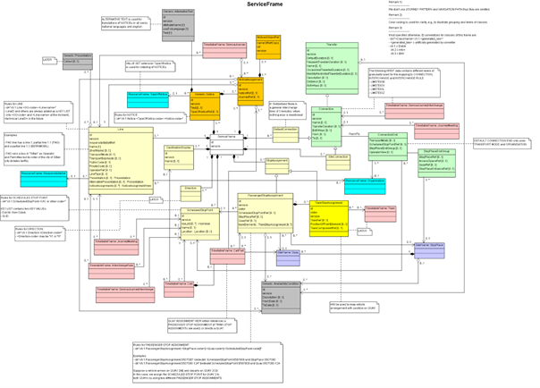

# ServiceFrame

The service related elements of the Network Description model can be grouped into a SER-VICE FRAME which holds a coherent set of elements for data exchange.

The Service Frame model comprises among others:
-	Route model: fixed LINEs and ROUTEs of a transport network.
-	Flexible Network model: flexible LINEs and ROUTEs of a demand responsive transport network.
-	Line Network model: overall topology of the LINEs and LINE SECTIONs that make up a transport network.
-	Service Pattern model: SCHEDULED STOP POINTs and SERVICE LINKs, i.e., points and links referenced by schedules.

Other important classes of the SERVICE FRAME include:
-	PASSENGER STOP ASSIGNMENTs and TRAIN STOP ASSIGNMENTs which model the relationship between stops in the timetable and the physical platforms of an actual station or other stop.
-	CONNECTIONs as the topological model of INTERCHANGES. They model the possi-bility of a transfer between two SCHEDULED STOP POINTs.
-	NOTICEs which are then assigned to JOURNEYs and CALLs of the TIMETABLE FRAME through NOTICE ASSIGNMENTs. They model the association of footnotes and passenger information content such as stop announcements and the network.

See the following class diagram for the most important objects of the RESOURCE FRAME and their relationships to the other frames.



| Sub | Element | Usage | Card | Type | Description | Note |
|-----|---------|-------|------|------|-------------|------|
| + | lines | mandatory | 0..1 | lineRefs_RelStructure | Lines for FLEXIBLE STOP PLACE. | Only Line is used and not FlexibleLine |
| ++ | [Line](Line.md) | mandatory | 1..1 | unknown | A group of ROUTEs which is generally known to the public by a similar name or number. |  |
| + | destinationDisplays | expected | 0..1 | destinationDisplayRefs_RelStructure | Destinations associated with this GROUP OF SERVICEs, including via points. | We only allow fully formed content of destinationDisplays |
| ++ | [DestinationDisplay](DestinationDisplay.md) | expected | 1..1 | unknown | An advertised destination of a specific JOURNEY PATTERN, usually displayed on a head sign or at other on-board locations. | We only allow fully formed content of destinationDisplays |
| + | scheduledStopPoints | mandatory | 0..1 | scheduledStopPointsInFrame_RelStructure | SCHEDULED STOP POINTs in frame. | Swiss ScheduledStopPoint are using the sloid in the id, when possible. |
| ++ | [SiteConnection](SiteConnection.md) | expected | 1..1 | unknown | The physical (spatial) possibility to connect from one point to another in a SITE. | SiteConnection are used only in the main file and not in timetable files. |
| ++ | [Connection](Connection.md) | expected | 1..1 | unknown | The physical (spatial) possibility for a passenger to change from one public transport vehicle to another to continue the trip. Different times may be necessary to cover this link, depending on the kind of passenger. | Connection is used only used in the site file |
| ++ | [DefaultConnection](DefaultConnection.md) | expected | 1..1 | unknown | Specifies the default transfer times to transfer between MODEs and / or OPERATORs within a region. | DefaultConnection is only used in the site file |
| + | stopAssignments | expected | 0..1 | stopAssignmentsInFrame_RelStructure | STOP ASSIGNMENTs in frame. |  |
| ++ | [PassengerStopAssignment](PassengerStopAssignment.md) | expected | 1..1 | unknown | The default allocation of a SCHEDULED STOP POINT to a specific STOP PLACE, and also possibly a QUAY and BOARDING POSITION. | are only used in a special PSA file in the export. |
| + | notices | expected | 0..1 | noticesInFrame_RelStructure | NOTICEs in frame. | notices may be present or not |
| ++ | [Notice](Notice.md) | expected | 1..1 | unknown | A note or footnote about any aspect of a service, e.g. an announcement, notice, etc. May have different DELIVERY VARIANTs for different media. | if notices are present, one Notice must be. |


```xml
<?xml version="1.0" encoding="UTF-8"?>
<ServiceFrame  id="ch:1:ServiceFrame" version="any">
  <!-- A minimal ServiceFrame must be present in all timetable files. TODO: analyse which part is in the general one. -->
  <!-- TODO how would we describe additional id and which ones are mandatory? -->
  <directions>
    <!-- We don't use directions, but only direction type -->
  </directions>
  <lines>
    <!-- Only Line is used and not FlexibleLine -->
    <Line id="use swiss line id where possible" version="1" responsibilitySetRef="dsa">
      <Name>Name is needed</Name>
    </Line>
    <FlexibleLine id="notUsed" version="none">
      <!-- We work with Line only. -->
    </FlexibleLine>
  </lines>
  <destinationDisplays>
    <!-- We only allow fully formed content of destinationDisplays -->
    <DestinationDisplay id="generated-id" version="1">
      <!-- We only allow fully formed content of destinationDisplays -->
    </DestinationDisplay>
  </destinationDisplays>
  <scheduledStopPoints>
    <!-- Swiss ScheduledStopPoint are using the sloid in the id, when possible. -->
    <ScheduledStopPoint id="sloid_where_possible" version="1">
      <!-- TODO full or not -->
    </ScheduledStopPoint>
  </scheduledStopPoints>
  <connections>
    <SiteConnection id="generated" version="1">
      <!-- SiteConnection are used only in the main file and not in timetable files. -->
    </SiteConnection>
    <Connection id="generated" version="1">
      <!-- Connection is used only used in the site file -->
    </Connection>
    <DefaultConnection id="generated" version="1">
      <!-- DefaultConnection is only used in the site file -->
    </DefaultConnection>
  </connections>
  <stopAssignments>
    <PassengerStopAssignment id="generated" version="1">
      <!-- are only used in a special PSA file in the export. -->
    </PassengerStopAssignment>
  </stopAssignments>
  <notices>
    <!-- notices may be present or not -->
    <Notice id="generated" version="1">
      <!-- if notices are present, one Notice must be. -->
    </Notice>
  </notices>
</ServiceFrame>

```


- [General NeTEx definition](../generated/xcore/ServiceFrame.html)

## Direction

**TBD** DO we use Direction. 
<Direction version="any" id="ch:1:Direction:H">
<Direction-Type>outbound</DirectionType></Direction>


## Line 
Transmodel defines a LINE as a grouping of ROUTEs that is generally known to the public by a similar name or number. These ROUTEs are usually very similar to each other from the top-ological point of view.
Each LINE has a unique number  PrivateCode, a ShortName and a Name.  Passengers rec-ognise a LINE by its published “PublicCode”. The transport mode is specified in  “TransportMode”, e.g  metro, tram, bus etc.. 
The assignement of a LINE to an ORGANISATION is done by the element OperatorRef and to the operationalContext with OperationalContextRef.
Note that there exist journeys in Switzerland and neighbouring countries that are not associat-ed with a Line. In NeTEx, however, the ServiceJourneys corresponding to such journeys must still reference something in LineRef. To ensure this, we introduce a placeholder Line called "NoLine" for each Operator that has journeys without a Line. 
For more information about SwissLineID: see https://www.xn--v-info-vxa.ch/sites/default/files/2023-06/slnid-spezifikation_v1.25_0.pdf
Be aware that there might be for mixed lines multiple lines in NeTEx. Otherwise the relevant operator must at least be set on the ServiceJourney.


| Sub | Element | Usage | Card | Type | Description | Note |
|-----|---------|-------|------|------|-------------|------|
|  | Line | mandatory | 1..1 | unknown | A group of ROUTEs which is generally known to the public by a similar name or number. | We have a duplication with responsibilitySet and OperatorRef. With AuthorityRef we currently have a problem, because we can't use the same organisation **TODO** |
| + | ValidBetween | expected | 1..1 | unknown | OPTIMISATION. Simple version of a VALIDITY CONDITION. Comprises a simple period. NO UNIQUENESS CONSTRAINT. | Usually set to the whole timetable year |
| ++ | FromDate | expected | 0..1 | xsd:dateTime | Start date of AVAILABILITY CONDITION. |  |
| ++ | ToDate | expected | 0..1 | xsd:dateTime | End of AVAILABILITY CONDITION. Date is INCLUSIVE. |  |
| + | keyList | mandatory | 1..1 | KeyListStructure | A list of alternative Key values for an element. |  |
| ++ | KeyValue | expected | 1..* | KeyValueStructure | Key value pair for Entity. | The SLNID is mandatory, when it exists |
| +++ | Key | expected | 1..1 | xsd:normalizedString | Identifier of value e.g. System. |  |
| +++ | Value | expected | 0..1 | xsd:anyType | Value associated with QUALITY STRUCTURE FACTOR. |  |
| + | Name | mandatory | 0..1 | MultilingualString | Name of Traveller | contains attribute D T from HRDF. Is not translated on purpose. |
| + | ShortName | expected | 0..1 | MultilingualString | Short Name for service | contains the LinieKurzName (attribut N T in HRDF) |
| + | TransportMode | mandatory | 0..1 | AllModesEnumeration | MODE. |  |
| ++ | RailSubmode | expected | 1..1 | RailSubmodeEnumeration | TPEG pti02 Rail submodes loc13.


```xml
<?xml version="1.0" encoding="UTF-8"?>
<Line  id="use swiss line id where possible" version="1" responsibilitySetRef="dsa">
  <!-- We have a duplication with responsibilitySet and OperatorRef. With AuthorityRef we currently have a problem, because we can't use the same organisation **TODO** -->
  <ValidBetween>
    <!-- Usually set to the whole timetable year -->
    <FromDate>2022-12-11T00:00:00</FromDate>
    <ToDate>2023-12-09T23:59:59</ToDate>
  </ValidBetween>
  <keyList>
    <KeyValue>
      <!-- The SLNID is mandatory, when it exists -->
      <Key>SLNID</Key>
      <Value>ch:1:slnid:102846</Value>
    </KeyValue>
  </keyList>
  <Name>3</Name>
  <!-- contains attribute D T from HRDF. Is not translated on purpose. -->
  <ShortName>3</ShortName>
  <!-- contains the LinieKurzName (attribut N T in HRDF) -->
  <TransportMode>rail</TransportMode>
  <TransportSubmode>
    <RailSubmode>suburbanRailway</RailSubmode>
  </TransportSubmode>
  <PublicCode>3</PublicCode>
  <!-- Contains LinieLangName (attribute LT from HRDF) -->
  <AuthorityRef ref="ch:1:Operator:11" version="1">
    <!-- Contains the AUTHORITY OF the LINE. -->
  </AuthorityRef>
  <OperatorRef ref="ch:1:Operator:11" version="1">
    <!-- The operator is the transport organisation that really will do the operation. If different from AuthorityRef -->
  </OperatorRef>
  <TypeOfProductCategoryRef ref="ch:1:TypeOfProductCategory:TER" version="1">
    <!-- **TODO** needs tobe clarified from BS KI -->
  </TypeOfProductCategoryRef>
</Line>

```


- [General NeTEx definition](../generated/xcore/ServiceFrame.html)

## DestinationDisplay
(NeTEx-1, 8.4.5.8.4)
The DESTINATION DISPLAY is an advertised destination of a specific LINE, usually displayed on a head-sign 

**TODO We need to discuss this in a lot more detail **


| Sub | Element | Usage | Card | Type | Description | Note |
|-----|---------|-------|------|------|-------------|------|
|  | DestinationDisplay | expected | 1..1 | unknown | An advertised destination of a specific JOURNEY PATTERN, usually displayed on a head sign or at other on-board locations. | We only allow fully formed content of destinationDisplays |
| + | Name | mandatory | 0..1 | MultilingualString | Name of Traveller | Is always language neutral. The data is taken from the Des-tination or from the reference in *R (HRDF). If DURCHBI is used then the destination display shows the final destination. |
| + | @lang | mandatory | 1..1 | xsd:string | Attribute lang | |
| + | DriverDisplayText | optional | 0..1 | MultilingualString | Text to show to Driver or Staff for the DESTINATION DISPLAY. | Text to display to DRIVER. |
| + | PrivateCode | mandatory | 1..1 | PrivateCodeStructure | A private code that uniquely identifies the element. May be used for inter-operating with other (legacy) systems. | **TODO** were do we get this code from. |


```xml
<?xml version="1.0" encoding="UTF-8"?>
<DestinationDisplay  id="generated-id" version="1">
  <!-- We only allow fully formed content of destinationDisplays -->
  <Name lang="de">Porrentruy</Name>
  <!-- Is always language neutral. The data is taken from the Des-tination or from the reference in *R (HRDF). If DURCHBI is used then the destination display shows the final destination. -->
  <DriverDisplayText>Porrentruy</DriverDisplayText>
  <!-- Text to display to DRIVER. -->
  <PrivateCode>212</PrivateCode>
  <!-- **TODO** were do we get this code from. -->
  <Presentation/>
</DestinationDisplay>

```


- [General NeTEx definition](../generated/xcore/DestinationDisplay.html)

## ScheduledStopPoint
(NeTEx-1, 8.6.3.4.2)
A POINT where passengers can board or alight from vehicles. Where a STOP PLACE models stop points with the desired level of topographic details (areas, entrances, paths etc.), a SCHEDULED STOP POINT corresponds to the simpler network representation used for LINEs, STOP ASSIGNMENTs, JOURNEYs and so on. The connection of these network points with their respective STOP PLACEs is done via STOP ASSIGNEMTNs.

ScheduledStopPoint is a core concept. It is the “Point” used in the timetable for the services to stop. A ScheduledStopPoint can refer to a Quay or only a StopPlace. So the level of hierarchy is not determined by the element (see PassengerStopAssignment).

A ScheduledStopPoint can represent two types of stop points:
-	In most cases, the ScheduledStopPoint is the station named in the timetable, especial-ly as some organisations don’t have a full physical model of their StopPlaces. 
-	In some cases, the ScheduledStopPoint may be mapped to the Quay. The more de-tailed mapping is also done with the PassengerStopAssignment.


| Sub | Element | Usage | Card | Type | Description | Note |
|-----|---------|-------|------|------|-------------|------|
| + | ScheduledStopPoint | mandatory | 1..1 | unknown | A POINT where passengers can board or alight from vehicles. It is open, which hierarchical level such a point has. It can represent a single door (BoardingPosition) or a whole ZONE. The association to the physical model is done with STOP ASSIGNMENTs. | Swiss ScheduledStopPoint are using the sloid in the id, when possible. |
| ++ | keyList | mandatory | 1..1 | KeyListStructure | A list of alternative Key values for an element. |  |
| +++ | KeyValue | mandatory | 1..* | KeyValueStructure | Key value pair for Entity. | We expect a DIDOK key and a SLOID, whereever possible. |
| ++++ | Key | mandatory | 1..1 | xsd:normalizedString | Identifier of value e.g. System. |  |
| ++++ | Value | mandatory | 0..1 | xsd:anyType | Value associated with QUALITY STRUCTURE FACTOR. |  |
| ++ | Name | mandatory | 0..1 | MultilingualString | Name of Traveller | The names are the same in all languages. |
| ++ | ShortName | mandatory | 0..1 | MultilingualString | Short Name for service | StopPlace : Name of the Place, Quay : ShortName of the Quay |


```xml
<?xml version="1.0" encoding="UTF-8"?>
<scheduledStopPoints >
  <ScheduledStopPoint id="ch:1:ScheduledStopPoint:8504128:1" version="any">
    <!-- Swiss ScheduledStopPoint are using the sloid in the id, when possible. -->
    <keyList>
      <KeyValue>
        <!-- We expect a DIDOK key and a SLOID, whereever possible. -->
        <Key>DIDOK</Key>
        <Value>8504128</Value>
      </KeyValue>
      <KeyValue>
        <Key>SLOID</Key>
        <Value>ch:1:sloid:4128</Value>
      </KeyValue>
    </keyList>
    <Name lang="de">Murten/Morat</Name>
    <!-- The names are the same in all languages. -->
    <ShortName lang="de">1</ShortName>
    <!-- StopPlace : Name of the Place, Quay : ShortName of the Quay -->
  </ScheduledStopPoint>
</scheduledStopPoints>

```


- [General NeTEx definition](../generated/xcore/ScheduledStopPoint.html)

## PassengerStopAssignment
(NeTEx-1, 8.6.6.4.2)
The allocation of a SCHEDULED STOP POINT to a specific STOP PLACE for a PASSENGER SERVICE and, also possibly, a QUAY or BOARDING POSITION.
PassengerStopAssignments bring the SiteModel and the ServiceModel in alignment. We have two general cases:
-	A ScheduledStopPoint in a Call is linked to a StopPlace for arrival and departure.
-	A ScheduledStopPoint in a Call is linked to a Quay for arrival and departure.

Suppose a vehicle arrives on QUAY 2A and departs on QUAY 2D. In this case we model only the SCHEDULED STOP POINT for QUAY 2 but assign this STOP POINT to both QUAYs by using two different PASSENGER STOP ASSIGNMENTS.


| Sub | Element | Usage | Card | Type | Description | Note |
|-----|---------|-------|------|------|-------------|------|
|  | PassengerStopAssignment | mandatory | 1..1 | unknown | The default allocation of a SCHEDULED STOP POINT to a specific STOP PLACE, and also possibly a QUAY and BOARDING POSITION. |  |
| + | ScheduledStopPointRef | mandatory | 0..1 | ScheduledStopPointRefStructure | Specific SCHEDULED STOP POINT at end of CONNECTION. |  |
| + | StopPlaceRef | mandatory | 0..1 | StopPlaceRefStructure | System identifier of a STOP PLACE. May be omitted if given by context. |  |
| + | QuayRef | expected | 0..1 | QuayRefStructure | QUAY to which SCHEDULED STOP POINT is to be assigned. | Not having the track may be problematic, but it can happen |


```xml
<?xml version="1.0" encoding="UTF-8"?>
<PassengerStopAssignment  id="generated-85003000-12" version="1">
  <ScheduledStopPointRef ref="ch:1:sloid:3000:503:12" version="1"/>
  <StopPlaceRef ref="ch:1:sloid:3000" version="1"/>
  <QuayRef ref="ch:1:sloid:3000:503:12" version="1">
    <!-- Not having the track may be problematic, but it can happen -->
  </QuayRef>
</PassengerStopAssignment>

```


- [General NeTEx definition](../generated/xcore/PassengerStopAssignment.html)

## DefaultConnection
(NeTEx-1, 8.5.14)
A CONNECTION expresses that there is a possible walking link  that is suitable for a passen-ger to interchange from one public transport vehicle to another between two specified SCHEDULED STOP POINTs and the time allocated for a passenger to traverse the link. Soft-ware used to control guaranteed interchanges can use the time information given to use a CONNECTION link as to assist calculating how long a distributor SERVICE JOURNEY needs to wait after a fetcher SERVICE JOURNEY has arrived before it can depart. If no specific CONNECTION link is available, timings from a DEFAULT CONNECTION must be used.

DefaultConnections are used to transmit the ConnectionTimes for the following constellations:
-	between 2 ProductCategories
-	between 2 Operators
-	In a defined StopPlace
-	In a defined StopPlace and 2 Operators
-	in a defined StopPlace, 2 Operators and 2 ProductCategories
For more Detail see 11 Appendix **TODO**

For the details of Connections see [here](uc03_transfer.md).


| Sub | Element | Usage | Card | Type | Description | Note |
|-----|---------|-------|------|------|-------------|------|
|  | DefaultConnection | expected | 1..1 | unknown | Specifies the default transfer times to transfer between MODEs and / or OPERATORs within a region. | Be aware only some combinations areallowed  mode - mode, operator/type of product category - operator/type of  product category. |
| + | Extensions | optional | 1..1 | ExtensionsStructure | User defined Extensions to ENTITY in schema. (Wrapper tag used to avoid problems with handling of optional 'any' by some validators). | When also ProductCategory is relevant, then this extension must be used |
| ++ | FromProductCategoryRef | mandatory | 1..1 | unknown |  | Extension needed to map "Verkehrsmittel-Gattung", which is similar to but more detailed than Trans-portSubmode, for transfer times of interchanges. |
| ++ | ToProductCategoryRef | mandatory | 1..1 | unknown |  | Extension needed to map "Verkehrsmittel-Gattung", which is similar to but more detailed than Trans-portSubmode, for transfer times of interchanges. |
| + | TransferDuration | mandatory | 0..1 | TransferDurationStructure | Timings for the transfer. | We use WalkTransferDuration sometimes. need to clarify **TODO** |
| ++ | DefaultDuration | mandatory | 0..1 | xsd:duration | Default time needed for a traveller to make a TRANSFER. |  |
| + | BothWays | optional | 0..1 | xsd:boolean | Whether timings and validity applies to both directions (true) or just to the from-to direction of the TRANSFER. | **TODO** to use or not |
| + | From | mandatory | 0..1 | ConnectionEndStructure | Origin end of CONNECTION. |  |
| ++ | TransportMode | optional | 0..1 | AllModesEnumeration | MODE. |  |
| ++ | OperatorView | optional | 1..1 | unknown | Simplified view of OPERATOR. All data except the identifier will be derived through the relationship. |  |
| +++ | OperatorRef | mandatory | 1..1 | OperatorRefStructure | Reference to an OPERATOR. |  |
| + | To | mandatory | 0..1 | ConnectionEndStructure | Destination end of CONNECTION. |  |
| + | StopPlaceRef | optional | 0..1 | StopPlaceRefStructure | System identifier of a STOP PLACE. May be omitted if given by context. | Is a sloid usually. Not set, means whole network. |


```xml
<?xml version="1.0" encoding="UTF-8"?>
<DefaultConnection  id="11-11" version="1">
  <!-- Be aware only some combinations areallowed  mode - mode, operator/type of product category - operator/type of  product category. -->
  <Extensions>
    <!-- When also ProductCategory is relevant, then this extension must be used -->
    <FromProductCategoryRef ref="ch:1:TypeOfProductCategory:ICE" version="1">
      <!-- Extension needed to map "Verkehrsmittel-Gattung", which is similar to but more detailed than Trans-portSubmode, for transfer times of interchanges. -->
    </FromProductCategoryRef>
    <ToProductCategoryRef ref="ch:1:TypeOfProductCategory:TE2" version="1">
      <!-- Extension needed to map "Verkehrsmittel-Gattung", which is similar to but more detailed than Trans-portSubmode, for transfer times of interchanges. -->
    </ToProductCategoryRef>
  </Extensions>
  <TransferDuration>
    <!-- We use WalkTransferDuration sometimes. need to clarify **TODO** -->
    <DefaultDuration>PT2M</DefaultDuration>
  </TransferDuration>
  <BothWays>false</BothWays>
  <!-- **TODO** to use or not -->
  <From>
    <TransportMode>all</TransportMode>
    <OperatorView>
      <OperatorRef ref="ch:1:Operator:11" version="1"/>
    </OperatorView>
  </From>
  <To>
    <TransportMode>all</TransportMode>
    <OperatorView>
      <OperatorRef ref="ch:1:Operator:11" version="1"/>
    </OperatorView>
  </To>
  <StopPlaceRef ref="ch:1:sloid:19231" version="1">
    <!-- Is a sloid usually. Not set, means whole network. -->
  </StopPlaceRef>
</DefaultConnection>

```


- [General NeTEx definition](../generated/xcore/DefaultConnection.html)


## SiteConnection
(NeTEx-1, 8.5.14.7.3)
The physical (spatial) possibility for a passenger to change from one public transport vehicle to another to continue the trip. The ends of connection can be specified STOP PLACE or STOP AREA.

The SiteConnection describes the transfer times between two adjacent StopPlaces 
For more Detail see 11 Appendix


| Sub | Element | Usage | Card | Type | Description | Note |
|-----|---------|-------|------|------|-------------|------|
|  | SiteConnection | expected | 1..1 | unknown | The physical (spatial) possibility to connect from one point to another in a SITE. | SiteConnection are used only in the main file and not in timetable files. |
| + | WalkTransferDuration | mandatory | 0..1 | TransferDurationStructure | Timings for walking over TRANSFER if different from the JOURNEY PATTERN transfer duration, |  |
| ++ | DefaultDuration | mandatory | 0..1 | xsd:duration | Default time needed for a traveller to make a TRANSFER. |  |
| + | BothWays | optional | 0..1 | xsd:boolean | Whether timings and validity applies to both directions (true) or just to the from-to direction of the TRANSFER. |  |
| + | From | mandatory | 0..1 | ConnectionEndStructure | Origin end of CONNECTION. |  |
| ++ | StopPlaceRef | mandatory | 0..1 | StopPlaceRefStructure | System identifier of a STOP PLACE. May be omitted if given by context. |  |
| + | To | mandatory | 0..1 | ConnectionEndStructure | Destination end of CONNECTION. |  |


- [Example snippet](../generated/xml-snippets/SiteConnection.xml)


- [General NeTEx definition](../generated/xcore/SiteConnection.html)


## Notice
(NeTEx-1, 7.7.18.4.1)
The NOTICE Model defines reusable text note elements that may be attached to timetables as footnotes, used as announcements, etc. NOTICES are associated with other entities using a NOTICE ASSIGNMENT. NOTICES may be classified with a TYPE OF NOTICE.


| Sub | Element | Usage | Card | Type | Description | Note |
|-----|---------|-------|------|------|-------------|------|
|  | Notice | expected | 1..1 | unknown | A note or footnote about any aspect of a service, e.g. an announcement, notice, etc. May have different DELIVERY VARIANTs for different media. |  |
| + | alternativeTexts | expected | 0..1 | alternativeTexts_RelStructure | Additional Translations of text elements. |  |
| ++ | [AlternativeText](AlternativeText.md) | expected | 1..1 | unknown | Alternative Text. +v1.1 |  |
| + | Text | expected | 0..1 | MultilingualString | Text content of NOTICe. |  |
| + | @lang | mandatory | 1..1 | xsd:string | Attribute lang | |
| + | PublicCode | mandatory | 0..1 | PublicCodeStructure | Public code for JOURNEY. | The public code is transmitted when it is to be published and when it is the type of notice 10 |
| + | ShortCode | expected | 0..1 | CleardownCodeType | A 20 bit number used for wireless cleardown of stop displays by some AVL systems. | A duplication, but we want it. |
| + | PrivateCode | expected | 1..1 | PrivateCodeStructure | A private code that uniquely identifies the element. May be used for inter-operating with other (legacy) systems. | A duplication, but we want it. |
| + | TypeOfNoticeRef | expected | 1..1 | TypeOfNoticeRefStructure | Reference to a TYPE OF NOTICE. |  |
| + | CanBeAdvertised | expected | 0..1 | xsd:boolean | Whether NOTICE is advertised to public. This may be overridden on an assignment. | Wheter the NOTICE is advertised |


```xml
<?xml version="1.0" encoding="UTF-8"?>
<Notice  id="ch:1:Notice:generated-1229900" version="1">
  <alternativeTexts>
    <AlternativeText attributeName="Text">
      <Text>Catering zone / Vending machine</Text>
    </AlternativeText>
    <AlternativeText attributeName="Text">
      <Text>Zone catering / Distributeur</Text>
    </AlternativeText>
    <AlternativeText attributeName="Text">
      <Text>Zona catering / Distributore</Text>
    </AlternativeText>
  </alternativeTexts>
  <Text lang="de">Cateringzone / Automaten</Text>
  <PublicCode>
    <!-- The public code is transmitted when it is to be published and when it is the type of notice 10 -->
  </PublicCode>
  <ShortCode>A__SN</ShortCode>
  <!-- A duplication, but we want it. -->
  <PrivateCode>A__SN</PrivateCode>
  <!-- A duplication, but we want it. -->
  <TypeOfNoticeRef ref="ch:1:TypeOfNotice:10" version="any"/>
  <CanBeAdvertised>true</CanBeAdvertised>
  <!-- Wheter the NOTICE is advertised -->
</Notice>

```


- [General NeTEx definition](../generated/xcore/Notice.html)
