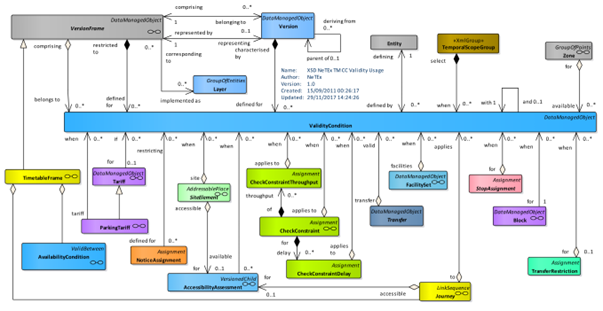
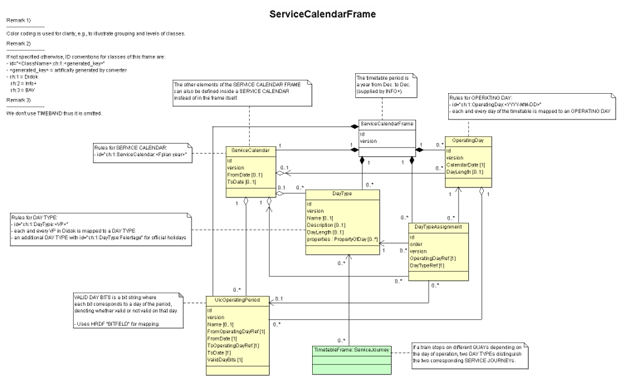

# Service calendars
(NeTEx-1, 7.7.5)
The Calendar elements are grouped in a SERVICE CALENDAR FRAME. This allows the same SERVICE CALENDAR to be shared with many other functional frames (especially TIMETABLE FRAMEs), and for a given functional frame to be used with different SERVICE CALENDARs just by changing the SERVICE CALENDAR FRAME associated with it.

See the following class diagram for the most important objects of the SERVICE CALENDAR FRAME and their relationships to the other frames.

Note that VALIDITY CONDITIONs could be combined and ANDed (all the conditions must be fullfiled at the same time) thanks to the WITH CONDITION REF attribute. We will work with FromDate/ToDate and ValidDayBits of AvailabilityCondition only.



- [Swiss profile NeTEx definition](../generated/markdown-examples/ServiceCalendarFrame.md)


- [Example snippet](../generated/xml-snippets/ServiceCalendarFrame.xml)


- [General NeTEx definition](../generated/xcore/ServiceCalendarFrame.html)

## AvailabilityCondition
(NeTEx-1 7.7.6)
AVAILABILITY CONDITION is a specialisation of VALIDITY CONDITION to specify precise temporal conditions. For example, an ENTRANCE of a STOP PLACE may be valid (it exists) but not available for some of the time (it is closed between 9 pm and 6 am). Both VALIDITY CONDITIONs and AVAILABILITY CONDITIONs may be associated for the same entity.

An AVAILABILITY CONDITION can be defined by specific DAY TYPEs and/or OPERATING DAYs. It may be further qualified by one or more of TIME BANDs. The DATED AVAILABILITY CONDITION being the instance of VALIDITY CONDITION on a specific CALENDAR DAY.

Examples of use of AVAILABILITY CONDITION include ENTRANCEs, EQUIPMENTs, STOP PLACEs, etc.

AvailabilityCondition replaces OperatingDay and OperatingPeriod. Whenever a reference to a VP (“Verkehrsperiode” or operating period in english) is needed, we use an AvailabilityCondi-tionRef:
-	The referenced AvailabilityConditions are centrally stored in the ServiceCalendar-Frame.


The element ValidDayBits directly indicates the days on which some service is provided or not. They are similar to the HRDF bitfields. 

ValidDayBits is required whenever the AvailabilityCondition is of temporal nature (more often than not). Examples include:
-	ServiceJourney
-	JourneyMeeting 
-	NoticeAssignment
-	ServiceFacilitySet
-	ServiceJourneyInterchange
-	InterchangeRule

Hint: The frames TimetableFrame, ServiceFrame and ServiceCalendarFrame and their elements must have the same validity.


| Sub | Element | Usage | Card | Type | Description | Note |
|-----|---------|-------|------|------|-------------|------|
| + | FromDate | optional | 0..1 | xsd:dateTime | Start date of AVAILABILITY CONDITION. | Is equal to the start date of the timetable year or, more generally, the period in which the ValidDayBits apply. |
| + | ToDate | optional | 0..1 | xsd:dateTime | End of AVAILABILITY CONDITION. Date is INCLUSIVE. | Is equal to the end date of the timetable year or, more generally, the period in which the ValidDayBits apply. |
| + | IsAvailable | mandatory | 0..1 | xsd:boolean | Whether condition makes resource available or not available. Default is available. | madatory by NeTEx **TODO** really? |
| + | ValidDayBits | mandatory | 0..1 | xsd:normalizedString | For UIC style encoding of day types String of bits, one for each day in period: whether valid or not valid on the day. Normally there will be a bit for every day between start and end date. If bit is missing, assume available. |  |
| + | timebands | optional | 0..1 | timebandRefs_RelStructure | TIMEBANDS associated with JOURNEY FREQUENCY GROUP. |  |
| ++ | [Timeband](Timeband.md) | optional | 1..1 | unknown | A period in a day, significant for some aspect of public transport, e.g. similar traffic conditions or fare category. |  |


```xml
<?xml version="1.0" encoding="UTF-8"?>
<AvailabilityCondition  id="generated" version="1">
  <FromDate>2026-05-17T00:00:00Z</FromDate>
  <!-- Is equal to the start date of the timetable year or, more generally, the period in which the ValidDayBits apply. -->
  <ToDate>2026-05-17T00:00:00Z</ToDate>
  <!-- Is equal to the end date of the timetable year or, more generally, the period in which the ValidDayBits apply. -->
  <IsAvailable>true</IsAvailable>
  <!-- madatory by NeTEx **TODO** really? -->
  <ValidDayBits>01010010111</ValidDayBits>
  <timebands>
    <Timeband id="ch:1:Timeband:4937" version="1">
      <StartTime>06:00:00</StartTime>
      <EndTime>06:01:00</EndTime>
    </Timeband>
  </timebands>
</AvailabilityCondition>

```


- [General NeTEx definition](../generated/xcore/AvailabilityCondition.html)

## ServiceCalendar
(NeTEx-1, 7.7.5.5.1.
The transport offering of a public transport company is tailored to accommodate different lev-els of demand. In order to simplify the supply planning almost all operators design their pro-duction plan using a classification by type of day, which summarises the level of demand or other characteristics: for example, workday, weekend, school holiday, market day,etc. Long-term planned schedules are designed through the so-called transportation calendar, in which calendar days are classified as specific DAY TYPEs.


- [Swiss profile NeTEx definition](../generated/markdown-examples/ServiceCalendar.md)


- [Example snippet](../generated/xml-snippets/ServiceCalendar.xml)


- [General NeTEx definition](../generated/xcore/ServiceCalendar.html)

## DayType
(NeTEx-1, 7.7.5.5.2)
In Transmodel, a DAY TYPE is defined as a combination of various different properties a day may have, and which will influence the transport demand and the running conditions. 
The day type is used to describe the validity of the holidays in Switzerland. Each day is de-scripted with a day Type. 


- [Swiss profile NeTEx definition](../generated/markdown-examples/DayType.md)


- [Example snippet](../generated/xml-snippets/DayType.xml)


- [General NeTEx definition](../generated/xcore/DayType.html)

## Timeband
(NeTEx-1, 7.7.5.5.6)
A period in a day, significant for some aspect of public transport, e.g. similar traffic conditions or fare category.
Currently used for InterchangeRuleTimings, later also used for the opening hours in StopPlace models. 


- [Swiss profile NeTEx definition](../generated/markdown-examples/DayType.md)


- [Example snippet](../generated/xml-snippets/DayType.xml)


- [General NeTEx definition](../generated/xcore/DayType.html)

## DayTypeAssignment
(NeTEx-1, 7.7.5.5.5)
This assignment overrides the DAY TYPE which was generally chosen for this OPERATING DAY in the overall DAY TYPE assignment plan..
Designation of one day or group of days

We also use DayTypeAssignment currently only for the national holidays.


- [Swiss profile NeTEx definition](../generated/markdown-examples/DayTypeAssignmen.md)


- [Example snippet](../generated/xml-snippets/DayTypeAssignmen.xml)


- [General NeTEx definition](../generated/xcore/DayTypeAssignmen.html)
