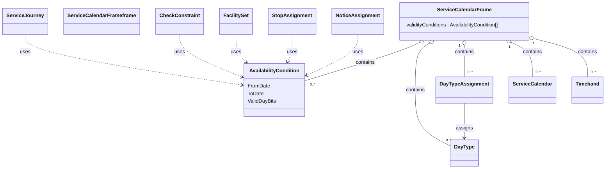

# Service calendars

In this chapter:
- [ServiceCalendarFrame](#servicecalendarframe)
- [AvailabilityCondition](#availabilitycondition)
- [ServiceCalendar](#servicecalendar)
- [DayType](#daytype)
- [Timeband](#timeband)
- [DayTypeAssignment](#daytypeassignment)

##  ServiceCalendarFrame
*→ [Glossary definition](A4_annex_glossary.md#servicecalendarframe)*

### Purpose
Groups calendar definitions that describe when services operate - `DayType`s, [operating periods, **TODO** we don't define / use OperatingPeriod, do we?] and `DayTypeAssignment`s. Wilfried 10.6.

See the following class diagram for the most important objects of the `ServiceCalendarFrame` and their relationships to the other frames.


#### Table


| Sub | Element | Usage | Card | Type | Description | Note |
|-----|---------|-------|------|------|-------------|------|
|  | ServiceCalendarFrame | expected | 1..1 | unknown | A SERVICE CALENDAR. A coherent set of OPERATING DAYS and DAY TYPES comprising a Calendar. That may be used to state the temporal VALIDITY of other NeTEx entities such as Timetables, STOP PLACEs, etc. Covers a PERIOD with a collection of assignments of OPERATING DAYS to DAY TYPES. | A minimal ServiceCalendarFrame must be present in all timetable files. |
| + | validityConditions | mandatory | 1..1 | validityConditions_RelStructure | VALIDITY CONDITIONs conditioning entity. |  |
| ++ | [AvailabilityCondition](AvailabilityCondition.md) | mandatory | 1..1 | unknown | VALIDITY CONDITION stated in terms of DAY TYPES and PROPERTIES OF DAYs. |  |
| + | [ServiceCalendar](ServiceCalendar.md) | expected | 1..1 | unknown | A SERVICE CALENDAR. A collection of DAY TYPE ASSIGNMENTs. |  |
| + | dayTypes | optional | 0..1 | unknown | DAY TYPEs for BLOCK. |  |
| ++ | [DayType](DayType.md) | optional | 1..1 | unknown | A type of day characterized by one or more properties which affect public transport operation. For example: weekday in school holidays. |  |
| + | timebands | expected | 0..1 | timebandRefs_RelStructure | TIMEBANDS associated with JOURNEY FREQUENCY GROUP. |  |
| ++ | Timeband | expected | 1..1 | unknown | A period in a day, significant for some aspect of public transport, e.g. similar traffic conditions or fare category. |  |


*→ [General NeTEx definition](../generated/netex-html/ServiceCalendarFrame.html)*

#### Example


```xml
<?xml version="1.0" encoding="UTF-8"?>
<ServiceCalendarFrame  id="ch:1:ServiceCalendarFrame" version="1">
  <!-- A minimal ServiceCalendarFrame must be present in all timetable files. -->
  <validityConditions>
    <AvailabilityCondition id="ch:1:AvailabilityCondition:b7" version="1"/>
  </validityConditions>
  <ServiceCalendar id="ch:1:ServiceCalendar:j23" version="1"/>
  <dayTypes>
    <DayType id="ch:1:DayType:ycy10_1" version="1"/>
  </dayTypes>
  <timebands>
    <Timeband id="ch:1:Timeband:1140:1260" version="1"/>
  </timebands>
</ServiceCalendarFrame>

```


*→ [Template](../templates/ServiceCalendarFrame.xml)*

#### Usage Notes
- Note that VALIDITY CONDITIONs could be combined and ANDed (all the conditions must be fullfiled at the same time) thanks to the WITH CONDITION REF attribute. We will work with FromDate/ToDate and ValidDayBits of AvailabilityCondition only.

### AvailabilityCondition
*→ [Glossary definition](A4_annex_glossary.md#availabilitycondition)*

#### Purpose
Temporal availability in terms of `Date`s, `Timeband`s, `ValidDayBits`.

#### Table
-

| Sub | Element | Usage | Card | Type | Description | Note |
|-----|---------|-------|------|------|-------------|------|
| + | FromDate | optional | 0..1 | xsd:dateTime | Start date of AVAILABILITY CONDITION. | Is equal to the start date of the timetable year or, more generally, the period in which the ValidDayBits apply. |
| + | ToDate | optional | 0..1 | xsd:dateTime | End of AVAILABILITY CONDITION. Date is INCLUSIVE. | Is equal to the end date of the timetable year or, more generally, the period in which the ValidDayBits apply. |
| + | ValidDayBits | mandatory | 0..1 | xsd:normalizedString | For UIC style encoding of day types String of bits, one for each day in period: whether valid or not valid on the day. Normally there will be a bit for every day between start and end date. If bit is missing, assume available. |  |
| + | timebands | optional | 0..1 | timebandRefs_RelStructure | TIMEBANDS associated with JOURNEY FREQUENCY GROUP. | Can also be referenced |
| ++ | [Timeband](Timeband.md) | optional | 1..1 | unknown | A period in a day, significant for some aspect of public transport, e.g. similar traffic conditions or fare category. |  |
| ++ | TimebandRef | optional | 1..1 | TimebandRefStructure | Reference to a TIME BAND. |  |


*→ [General NeTEx definition](../generated/netex-html/AvailabilityCondition.html)*

#### Example


```xml
<?xml version="1.0" encoding="UTF-8"?>
<AvailabilityCondition  id="generated" version="1">
  <FromDate>2026-05-17T00:00:00Z</FromDate>
  <!-- Is equal to the start date of the timetable year or, more generally, the period in which the ValidDayBits apply. -->
  <ToDate>2026-05-17T00:00:00Z</ToDate>
  <!-- Is equal to the end date of the timetable year or, more generally, the period in which the ValidDayBits apply. -->
  <ValidDayBits>01010010111</ValidDayBits>
  <timebands>
    <!-- Can also be referenced -->
    <Timeband id="ch:1:Timeband:4937" version="1">
      <StartTime>06:00:00</StartTime>
      <EndTime>06:01:00</EndTime>
    </Timeband>
    <TimebandRef ref="ch:1:Timeband:4937-2" version="1"/>
  </timebands>
</AvailabilityCondition>

```


*→ [Template](../templates/AvailabilityCondition.xml)*

#### Usage Notes
- Examples of use of AVAILABILITY CONDITION include ENTRANCEs, EQUIPMENTs, STOP PLACEs, etc.
- AvailabilityCondition replaces OperatingDay and OperatingPeriod. Whenever a reference to a VP (“Verkehrsperiode” or operating period in english) is needed, we use an `AvailabilityConditionRef`:
-	The referenced `AvailabilityCondition`s are centrally stored in the `ServiceCalendarFrame`.
- The element ValidDayBits directly indicates the days on which some service is provided or not. They are similar to the HRDF bitfields. 
- ValidDayBits is required whenever the `AvailabilityCondition` is of temporal nature (more often than not). Examples include:
  -	`ServiceJourney`
  -	`JourneyMeeting`
  -	`NoticeAssignment`
  -	`ServiceFacilitySet`
  -	`ServiceJourneyInterchange`
  -	`InterchangeRule`
- Hint: The frames `TimetableFrame`, `ServiceFrame` and `ServiceCalendarFrame` and their elements must have the same validity.

### ServiceCalendar
*→ [Glossary definition](A4_annex_glossary.md#servicecalendar)*

#### Purpose
Long-term planning uses calendar days that are classified as specific DayTypes (example: weekday in school holidays). A ServiceCalendar defines a mapping between DayTypes and OperatingDays.

#### Table


| Sub | Element | Usage | Card | Type | Description | Note |
|-----|---------|-------|------|------|-------------|------|
|  | ServiceCalendar | expected | 1..1 | unknown | A SERVICE CALENDAR. A collection of DAY TYPE ASSIGNMENTs. |  |
| + | Name | mandatory | 0..1 | MultilingualString | Name of Traveller | timetable year |
| + | FromDate | mandatory | 0..1 | xsd:dateTime | Start date of AVAILABILITY CONDITION. | Beginning of timetable year |
| + | ToDate | mandatory | 0..1 | xsd:dateTime | End of AVAILABILITY CONDITION. Date is INCLUSIVE. | End of timetable year |


*→ [General NeTEx definition](../generated/netex-html/ServiceCalendar.html)*

#### Example


```xml
<?xml version="1.0" encoding="UTF-8"?>
<ServiceCalendar  id="ch:1:ServiceCalendar:j23" version="1">
  <Name>Fahrplan 2018</Name>
  <!-- timetable year -->
  <FromDate>2017-12-10</FromDate>
  <!-- Beginning of timetable year -->
  <ToDate>2018-12-08</ToDate>
  <!-- End of timetable year -->
</ServiceCalendar>

```


*→ [Template](../templates/ServiceCalendar.xml)*


### DayType
*→ [Glossary definition](A4_annex_glossary.md#daytype)*

#### Purpose
A classification of days on which a specific set of transport services operates (e.g., Weekdays, Saturdays, Public Holidays). The `DayType`s of the Swiss profile represent national holidays.


#### Table


| Sub | Element | Usage | Card | Type | Description | Note |
|-----|---------|-------|------|------|-------------|------|
|  | DayType | optional | 1..1 | unknown | A type of day characterized by one or more properties which affect public transport operation. For example: weekday in school holidays. | In Switzerland only used for holidays and the like |
| + | alternativeTexts | expected | 0..1 | alternativeTexts_RelStructure | Additional Translations of text elements. |  |
| ++ | AlternativeText | mandatory | 1..1 | unknown | Alternative Text. +v1.1 |  |
| +++ | Text | mandatory | 0..1 | MultilingualString | Text content of NOTICe. |  |
| + | Name | mandatory | 0..1 | MultilingualString | Name of Traveller |  |
| + | properties | expected | 0..1 | propertiesOfDay_RelStructure | Properties of the DAY TYPE. |  |
| ++ | PropertyOfDay | mandatory | 1..1 | unknown | A property which a day may possess, such as school holiday, weekday, summer, winter etc. | Holidays only |
| +++ | HolidayTypes | expected | 0..1 | HolidayTypesListOfEnumerations | Type of holiday. Default is Any day. |  |
| +++ | DayEvent | optional | 0..1 | DayEventEnumeration | Events happening on day. |  |


*→ [General NeTEx definition](../generated/netex-html/DayType.html)*

#### Example


```xml
<?xml version="1.0" encoding="UTF-8"?>
<DayType  id="ch:1:DayType:Bundesfeier" version="1">
  <!-- In Switzerland only used for holidays and the like -->
  <alternativeTexts>
    <AlternativeText attributeName="Name">
      <Text lang="it">Festa nazionale</Text>
    </AlternativeText>
    <AlternativeText attributeName="Name">
      <Text lang="en">National Day</Text>
    </AlternativeText>
    <AlternativeText attributeName="Name">
      <Text lang="fr">Fête nationale</Text>
    </AlternativeText>
  </alternativeTexts>
  <Name>Bundesfeier</Name>
  <properties>
    <PropertyOfDay>
      <!-- Holidays only -->
      <HolidayTypes>NationalHoliday</HolidayTypes>
      <DayEvent>normalDay</DayEvent>
    </PropertyOfDay>
  </properties>
</DayType>

```


*→ [Template](../templates/DayType.xml)*


### Timeband
*→ [Glossary definition](A4_annex_glossary.md#timeband)*

#### Purpose
A period of time within a day, usually defined by a start and end time.


#### Table


| Sub | Element | Usage | Card | Type | Description | Note |
|-----|---------|-------|------|------|-------------|------|
|  | Timeband | mandatory | 1..1 | unknown | A period in a day, significant for some aspect of public transport, e.g. similar traffic conditions or fare category. |  |
| + | StartTime | mandatory | 0..1 | xsd:time | Start time of USAGE VALIDITY PERIOD. | Local time (not Zulu), i.e., without “Z” or “hh:mm:ss” suffix. Seconds are not used. |
| + | EndTime | mandatory | 0..1 | xsd:time | End time of USAGE VALIDITY PERIOD. | Local time (not Zulu), i.e., without “Z” or “hh:mm:ss” suffix. Seconds are not used. |


*→ [General NeTEx definition](../generated/netex-html/Timeband.html)*

#### Example


```xml
<?xml version="1.0" encoding="UTF-8"?>
<Timeband  id="ch:1:Timeband:4937" version="1">
  <StartTime>06:00:00</StartTime>
  <!-- Local time (not Zulu), i.e., without “Z” or “hh:mm:ss” suffix. Seconds are not used. -->
  <EndTime>06:01:00</EndTime>
  <!-- Local time (not Zulu), i.e., without “Z” or “hh:mm:ss” suffix. Seconds are not used. -->
</Timeband>

```


*→ [Template](../templates/Timeband.xml)*


#### Usage Notes
Currently `Timeband` is used for `InterchangeRuleTiming`s, later also used for the opening hours in `StopPlace` models. 

## DayTypeAssignment
*→ [Glossary definition](A4_annex_glossary.md#daytypeassignment)*


#### Purpose
Assignment of a date to `DayType`. The `DayType`s of the Swiss profile represent national holidays.

This assignment overrides the `DayType` specified for the day in the overall plan. (**TODO** should be stated more clearly / precisely) Wilfried 10.6.


#### Table


| Sub | Element | Usage | Card | Type | Description | Note |
|-----|---------|-------|------|------|-------------|------|
|  | DayTypeAssignment | expected | 1..1 | unknown | Associates a DAY TYPE with an OPERATING DAY within a specific Calendar. A specification of a particular DAY TYPE which will be valid during a TIME BAND on an OPERATING DAY. | We currently use DayType to store the national holidays. |
| + | Date | mandatory | 0..1 | xsd:date | Date of the review |  |
| + | DayTypeRef | mandatory | 1..* | DayTypeRefStructure | The DAY TYPE of all the services in this group. |  |


*→ [General NeTEx definition](../generated/netex-html/DayTypeAssignment.html)*

#### Example


```xml
<?xml version="1.0" encoding="UTF-8"?>
<DayTypeAssignment  id="BundesfeierAssignment" version="1">
  <!-- We currently use DayType to store the national holidays. -->
  <Date>2023-08-01</Date>
  <DayTypeRef ref="ch:1:DayType:Bundesfeier" version="1"/>
</DayTypeAssignment>

```


*→ [Template](../templates/DayTypeAssignment.xml)*


#### Usage Notes
We currently use `DayTypeAssignment` only for the national holidays.


