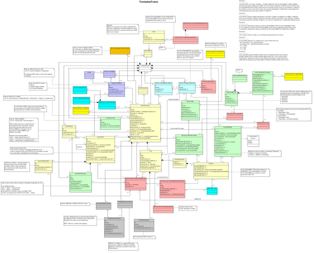

# Timetables




## TimetableFrame

A set of timetable data (VEHICLE JOURNEYs, etc.) to which the same VALIDITY CONDITIONs have been assigned. 
A TIMETABLE FRAME holds a coherent set of timetable related elements for data exchange. 
The primary component exchanged by a TIMETABLE FRAME in NeTEx / Transmodel terms is the VEHICLE JOURNEY. The Swiss profile only uses the more specific SERVICE JOURNEY (which describes an individual journey) and the TEMPLATE SERVICE JOURNEY (which describes a set of journeys repeating at a certain frequency). 


The `TimetableFrame` contains the following allowed elements:
* `ServiceJourney` and `TemplateServiceJourney`
  * `TemplateServiceJourney` is only used for frequency traffic
  * We only model journeys that are available for passenger  
* `TrainNumber`
  * Each (TEMPLATE) SERVICE JOURNEY is mapped one-to-one to exactly one TRAIN NUMBER
* `PassingTime`s describe the times of vehicles at points in their journey
* `InterchangeRule`s describe interchanges between journeys
* `JourneyMeeting`s and `JourneyPart`s describe multipart journeys which join and split **TODO**
* `ServiceFacilitySet`s describe the various services and facilities offered by the vehicles of a journey


[//]: # (TODO: Add TimetableFrame links)


| Sub | Element | Usage | Card | Type | Description | Note |
|-----|---------|-------|------|------|-------------|------|
| + | vehicleJourneys | expected | 0..1 | journeysInFrame_RelStructure | VEHICLE JOURNEYs in frame. | Contains the ServiceJourneys and TemplateServiceJourneys. |
| ++ | [ServiceJourney](ServiceJourney.md) | expected | 1..1 | unknown | A passenger carrying VEHICLE JOURNEY for one specified DAY TYPE. The pattern of working is in principle defined by a SERVICE JOURNEY PATTERN.


```xml
<?xml version="1.0" encoding="UTF-8"?>
<TimetableFrame  id="ch:1:TimetableFrame:j23" version="1">
  <vehicleJourneys>
    <!-- Contains the ServiceJourneys and TemplateServiceJourneys. -->
    <ServiceJourney id="generatedOrsjyid" version="1">
      <!-- ServiceJourney is used for common Journeys. -->
    </ServiceJourney>
    <TemplateServiceJourney id="generatedOrsjyid1" version="1">
      <!-- TemplateServiceJourney is only to be used if a line is serviced at a certain frequency. -->
    </TemplateServiceJourney>
    <TemplateServiceJourney id="generated2" version="1"/>
  </vehicleJourneys>
  <trainNumbers>
    <TrainNumber id="2123" version="1"/>
  </trainNumbers>
  <serviceFacilitySets>
    <ServiceFacilitySet id="86558" version="1"/>
  </serviceFacilitySets>
  <typesOfService>
    <TypeOfService id="ch:1:TypeOfService:1" version="1">
      <!-- This is exactly how the TypeOfService should be defined for Switzerland. Attention: Only once per file. -->
      <Name lang="en">PublicJourney</Name>
      <ShortName lang="en">PJ</ShortName>
      <PrivateCode>1</PrivateCode>
    </TypeOfService>
  </typesOfService>
  <journeyMeetings>
    <JourneyMeeting id="ch:1:JourneyMeeting:1" version="1">
      <!-- Check latest policy - InterchangeRule may be the preferred alternative. **TODO** -->
      <FromJourneyRef ref="sjyid1" version="1"/>
      <ToJourneyRef ref="sjyid2" version="1"/>
    </JourneyMeeting>
  </journeyMeetings>
  <interchangeRules>
    <InterchangeRule id="ch:1:InterchangeRule:1" version="1"/>
  </interchangeRules>
</TimetableFrame>

```


- [General NeTEx definition ](../generated/xcore/TimetableFrame.html)


> [Template](../templates/TimetableFrame.xml)

## ServiceJourney

A SERVICE JOURNEY is a VEHICLE JOURNEY on which passengers will be allowed to board or alight from vehicles at stops. It describes the service between an origin and a destination, as advertised to the public.

[//]: # (TODO: Add ServiceJourney links)
- [General NeTEx definition ](../generated/xcore/ServiceJourney.html)


| Sub | Element | Usage | Card | Type | Description | Note |
|-----|---------|-------|------|------|-------------|------|
| + | validityConditions | expected | 1..1 | unknown |  |  |
| ln++ | [AvailabilityCondition](AvailabilityCondition.md) | expected | 1..1 | unknown |  |  |
| + | keyList | mandatory | 1..1 | unknown |  |  |
| ++ | KeyValue | mandatory | 1..1 | unknown |  |  |
| +++ | Key | mandatory | 1..1 | unknown |  |  |
| +++ | Value | mandatory | 1..1 | unknown |  |  |
| + | Extensions | optional | 1..1 | unknown |  |  |
| ++ | facilities | optional | 1..1 | unknown |  |  |
| ln+++ | [Facility](Facility.md) | optional | 1..1 | unknown |  |  |
| + | PrivateCode | optional | 1..1 | unknown |  |  |
| + | TransportMode | optional | 1..1 | unknown |  |  |
| + | TypeOfProductCategoryRef | expected | 1..1 | unknown |  |  |
| + | TypeOfServiceRef | optional | 1..1 | unknown |  |  |
| + | noticeAssignments | optional | 1..1 | unknown |  |  |
| ln++ | [NoticeAssignment](NoticeAssignment.md) | optional | 1..1 | unknown |  |  |
| + | occupancies | optional | 1..1 | unknown |  |  |
| ln++ | [OccupancyView](OccupancyView.md) | optional | 1..1 | unknown |  |  |
| + | ServiceAlteration | optional | 1..1 | unknown |  |  |
| + | DepartureTime | expected | 1..1 | unknown |  |  |
| + | DepartureTimeOffset | optional | 1..1 | unknown |  |  |
| + | LineRef | mandatory | 1..1 | unknown |  |  |
| + | DirectionType | optional | 1..1 | unknown |  |  |
| + | trainNumbers | mandatory | 1..1 | unknown |  |  |
| ++ | TrainNumberRef | mandatory | 1..1 | unknown |  |  |
| + | passingTimes | mandatory | 1..1 | unknown |  |  |
| ln++ | [TimetabledPassingTime](TimetabledPassingTime.md) | expected | 1..1 | unknown |  |  |


```xml
<?xml version="1.0" encoding="UTF-8"?>
<ServiceJourney xmlns="http://www.netex.org.uk/netex" id="generated" version="1">
  <!-- ServiceJourney is used for common Journeys. -->
  <validityConditions>
    <!-- A specific type of VALIDITY CONDITION used to specify a set of temporal conditions that can be associated with the SERVICE JOURNEY, for example that the corresponding journey only applies on particular days of a period (indicated by ValidDayBits, “Verkehrstagebitfeld”). -->
    <AvailabilityCondition id="gernerated" version="1">
      <FromDate>2026-02-15T00:00:00Z</FromDate>
      <ToDate>2026-06-15T00:00:00Z</ToDate>
      <ValidDayBits>01010231</ValidDayBits>
      <timebands>
        <Timeband id="generated" version="1"/>
      </timebands>
    </AvailabilityCondition>
  </validityConditions>
  <keyList>
    <!-- KEY LIST with the KEY VALUEs beloning to the SERVICE JOURNEY. Will contain the SJYID. -->
    <KeyValue>
      <Key>SJYID</Key>
      <Value>ch:1:sjyid:100001:71707-003</Value>
    </KeyValue>
  </keyList>
  <Extensions>
    <!-- Used to indicate Facility changes. -->
    <facilities>
      <Facility id="ch:1:facility:f1" version="any" order="1">
        <validityConditions>
          <AvailabilityConditionRef ref="ch:1:AvailabilityCondition:c3" version="any"/>
        </validityConditions>
        <ServiceFacilitySetRef ref="ch:1:ServiceFacilitySet:A___1" version="any"/>
      </Facility>
    </facilities>
  </Extensions>
  <PrivateCode>1<!-- Private code of SERVICE JOURNEY. --></PrivateCode>
  <TransportMode>rail</TransportMode>
  <TypeOfProductCategoryRef ref="ch:1:TypeOfProductCategory:IR" version="any">
    <!-- **TODO** I am not sure if it is not mandatory for us. -->
  </TypeOfProductCategoryRef>
  <TypeOfServiceRef ref="ch:1:TypeOfService:1" version="any"/>
  <noticeAssignments>
    <NoticeAssignment id="ch:1:NoticeAssignment:ch_1_ServiceJourney_ch_1_sjyid_100001_71707-003_1_0" version="any">
      <validityConditions>
        <AvailabilityConditionRef ref="ch:1:AvailabilityCondition:c3" version="any"/>
      </validityConditions>
      <NoticeRef ref="ch:1:Notice:A___1" version="any"/>
    </NoticeAssignment>
  </noticeAssignments>
  <occupancies>
    <OccupancyView id="generated" version="1"/>
  </occupancies>
  <ServiceAlteration>planned<!-- Only the value planned is allowed. --></ServiceAlteration>
  <DepartureTime>06:21:00</DepartureTime>
  <DepartureTimeOffset>0</DepartureTimeOffset>
  <LineRef ref="ch:2:Line:11.IR.90" version="any"/>
  <DirectionType>
    <!-- Allowed are: inbound, outbound -->
  </DirectionType>
  <trainNumbers>
    <TrainNumberRef ref="ch:1:TrainNumber:71707" version="1"/>
  </trainNumbers>
  <passingTimes>
    <TimetabledPassingTime id="generated" version="1">
      <PointInJourneyPatternRef ref="generated" version="1"/>
    </TimetabledPassingTime>
  </passingTimes>
</ServiceJourney>

```


> [Template](../templates/ServiceJourney.xml)

((The following restrictions occur:
* DONE: The attributs id, version and responsibilitySetRef must be set.
* DONE: The validityConditions contain only one AvailablityCondition that contains only the elements FromDate, ToDate and ValidDayBits.
* DONE: In the keyList a KeyValue pair with the Key `sjyid` must exists. The Value contains a valid Swiss Journey ID.
* privateCodes: tbd
* TransportMode: tbd
* TypeOfProductCategoryRef: tbd
* TypeOfServiceRef is always set to tbd
* DONE: noticeAssignments contain all notices. Attention: they may be restricted to a given set of stops.
* DONE: ServiceAlteration is set.
* DepartureTime:
* DepartureDayOffset:
* DONE: LineRef is mandatory.
* DONE: DirectionType is only inbound or outbound
* DONE: trainNumbers contains at least one TrainNumberRef. TrainNumber i not allowed in it.
* Destination: xxx
* passingTimes: ddd
* DONE: calls are not to be used.

## ServiceJourney (alternative to previous section)

### 1. Purpose

A **ServiceJourney** represents a planned trip in the timetable operating on a recurring schedule. It defines the stop sequence via reference to a JourneyPattern, includes scheduled passing times, and specifies operational details such as operator and days of operation. Unlike DatedServiceJourney, which represents a concrete instance on a specific date, ServiceJourney is the reusable template used across multiple dates via DayType definitions

### 2. Table

[//]: # (TODO: Add ServiceJourney links)


| Sub | Element | Usage | Card | Type | Description | Note |
|-----|---------|-------|------|------|-------------|------|
| + | validityConditions | expected | 1..1 | unknown |  |  |
| ln++ | [AvailabilityCondition](AvailabilityCondition.md) | expected | 1..1 | unknown |  |  |
| + | keyList | mandatory | 1..1 | unknown |  |  |
| ++ | KeyValue | mandatory | 1..1 | unknown |  |  |
| +++ | Key | mandatory | 1..1 | unknown |  |  |
| +++ | Value | mandatory | 1..1 | unknown |  |  |
| + | Extensions | optional | 1..1 | unknown |  |  |
| ++ | facilities | optional | 1..1 | unknown |  |  |
| ln+++ | [Facility](Facility.md) | optional | 1..1 | unknown |  |  |
| + | PrivateCode | optional | 1..1 | unknown |  |  |
| + | TransportMode | optional | 1..1 | unknown |  |  |
| + | TypeOfProductCategoryRef | expected | 1..1 | unknown |  |  |
| + | TypeOfServiceRef | optional | 1..1 | unknown |  |  |
| + | noticeAssignments | optional | 1..1 | unknown |  |  |
| ln++ | [NoticeAssignment](NoticeAssignment.md) | optional | 1..1 | unknown |  |  |
| + | occupancies | optional | 1..1 | unknown |  |  |
| ln++ | [OccupancyView](OccupancyView.md) | optional | 1..1 | unknown |  |  |
| + | ServiceAlteration | optional | 1..1 | unknown |  |  |
| + | DepartureTime | expected | 1..1 | unknown |  |  |
| + | DepartureTimeOffset | optional | 1..1 | unknown |  |  |
| + | LineRef | mandatory | 1..1 | unknown |  |  |
| + | DirectionType | optional | 1..1 | unknown |  |  |
| + | trainNumbers | mandatory | 1..1 | unknown |  |  |
| ++ | TrainNumberRef | mandatory | 1..1 | unknown |  |  |
| + | passingTimes | mandatory | 1..1 | unknown |  |  |
| ln++ | [TimetabledPassingTime](TimetabledPassingTime.md) | expected | 1..1 | unknown |  |  |


- [General NeTEx definition ](../generated/xcore/ServiceJourney.html)

> [Template](../templates/ServiceJourney.xml)

### 3. Example

[//]: # (TODO: Add ServiceJourney links)


```xml
<?xml version="1.0" encoding="UTF-8"?>
<ServiceJourney xmlns="http://www.netex.org.uk/netex" id="generated" version="1">
  <!-- ServiceJourney is used for common Journeys. -->
  <validityConditions>
    <!-- A specific type of VALIDITY CONDITION used to specify a set of temporal conditions that can be associated with the SERVICE JOURNEY, for example that the corresponding journey only applies on particular days of a period (indicated by ValidDayBits, “Verkehrstagebitfeld”). -->
    <AvailabilityCondition id="gernerated" version="1">
      <FromDate>2026-02-15T00:00:00Z</FromDate>
      <ToDate>2026-06-15T00:00:00Z</ToDate>
      <ValidDayBits>01010231</ValidDayBits>
      <timebands>
        <Timeband id="generated" version="1"/>
      </timebands>
    </AvailabilityCondition>
  </validityConditions>
  <keyList>
    <!-- KEY LIST with the KEY VALUEs beloning to the SERVICE JOURNEY. Will contain the SJYID. -->
    <KeyValue>
      <Key>SJYID</Key>
      <Value>ch:1:sjyid:100001:71707-003</Value>
    </KeyValue>
  </keyList>
  <Extensions>
    <!-- Used to indicate Facility changes. -->
    <facilities>
      <Facility id="ch:1:facility:f1" version="any" order="1">
        <validityConditions>
          <AvailabilityConditionRef ref="ch:1:AvailabilityCondition:c3" version="any"/>
        </validityConditions>
        <ServiceFacilitySetRef ref="ch:1:ServiceFacilitySet:A___1" version="any"/>
      </Facility>
    </facilities>
  </Extensions>
  <PrivateCode>1<!-- Private code of SERVICE JOURNEY. --></PrivateCode>
  <TransportMode>rail</TransportMode>
  <TypeOfProductCategoryRef ref="ch:1:TypeOfProductCategory:IR" version="any">
    <!-- **TODO** I am not sure if it is not mandatory for us. -->
  </TypeOfProductCategoryRef>
  <TypeOfServiceRef ref="ch:1:TypeOfService:1" version="any"/>
  <noticeAssignments>
    <NoticeAssignment id="ch:1:NoticeAssignment:ch_1_ServiceJourney_ch_1_sjyid_100001_71707-003_1_0" version="any">
      <validityConditions>
        <AvailabilityConditionRef ref="ch:1:AvailabilityCondition:c3" version="any"/>
      </validityConditions>
      <NoticeRef ref="ch:1:Notice:A___1" version="any"/>
    </NoticeAssignment>
  </noticeAssignments>
  <occupancies>
    <OccupancyView id="generated" version="1"/>
  </occupancies>
  <ServiceAlteration>planned<!-- Only the value planned is allowed. --></ServiceAlteration>
  <DepartureTime>06:21:00</DepartureTime>
  <DepartureTimeOffset>0</DepartureTimeOffset>
  <LineRef ref="ch:2:Line:11.IR.90" version="any"/>
  <DirectionType>
    <!-- Allowed are: inbound, outbound -->
  </DirectionType>
  <trainNumbers>
    <TrainNumberRef ref="ch:1:TrainNumber:71707" version="1"/>
  </trainNumbers>
  <passingTimes>
    <TimetabledPassingTime id="generated" version="1">
      <PointInJourneyPatternRef ref="generated" version="1"/>
    </TimetabledPassingTime>
  </passingTimes>
</ServiceJourney>

```


### 4. Usage Notes / Pitfalls

- **Template vs. Instance:** ServiceJourney is the template; DatedServiceJourney represents concrete daily instances.
- **Consistency:** A ServiceJourney must reference exactly one JourneyPattern. The pattern's stop sequence is authoritative.
- **Stop Times:** Each stop in the referenced JourneyPattern must have exactly one TimetabledPassingTime entry with ArrivalTime and/or DepartureTime.
- **Day Governance:** DayType references control on which days the journey operates; per-date deviations belong to DatedServiceJourney.
- **Validation:** Ensure journeyPatternRef, lineRef, and operatorRef are consistent and reference existing objects.


## TemplateServiceJourney

A TEMPLATE SERVICE JOURNEY is a VEHICLE JOURNEY on which passengers will be allowed to board or alight from vehicles at stops and that reapeats with a certain frequency. It describes the service between an origin and a destination, as advertised to the public. Only to be used if a frequency has been specified for the JOURNEY. 

[//]: # (TODO: Add TemplateServiceJourney links)


| Sub | Element | Usage | Card | Type | Description | Note |
|-----|---------|-------|------|------|-------------|------|
| + | validityConditions | expected | 1..1 | validityConditions_RelStructure | VALIDITY CONDITIONs conditioning entity. | A specific type of VALIDITY CONDITION used to specify a set of temporal conditions that can be associated with the SERVICE JOURNEY, for example that the corresponding journey only applies on particular days of a period (indicated by ValidDayBits, “Verkehrstagebitfeld”). |
| ++ | [AvailabilityCondition](AvailabilityCondition.md) | expected | 1..1 | unknown | VALIDITY CONDITION stated in terms of DAY TYPES and PROPERTIES OF DAYs. | **TODO** Expand the element, see ServiceJourney: more spacific requirements than standard AvailabilityCondition. |
| + | keyList | mandatory | 1..1 | KeyListStructure | A list of alternative Key values for an element. | KEY LIST with the KEY VALUEs belonging to the repeating SERVICE JOURNEYs. Will contain the SJYID. |
| ++ | KeyValue | mandatory | 1..* | KeyValueStructure | Key value pair for Entity. | A KeyValue pair with the Key SJYID must exist. The Value contains a valid Swiss Journey ID. |
| +++ | Key | mandatory | 1..1 | xsd:normalizedString | Identifier of value e.g. System. |  |
| +++ | Value | mandatory | 0..1 | xsd:anyType | Value associated with QUALITY STRUCTURE FACTOR. |  |
| + | Extensions | optional | 1..1 | ExtensionsStructure | User defined Extensions to ENTITY in schema. (Wrapper tag used to avoid problems with handling of optional 'any' by some validators). | Used to indicate Facility changes. |
| ++ | facilities | optional | 0..1 | serviceFacilitySets_RelStructure | FACILITies available associated with JOURNEY. |  |
| +++ | Facility | optional | 1..1 | unknown |  |  |
| ++++ | ServiceFacilitySetRef | mandatory | 1..1 | ServiceFacilitySetRefStructure | Reference to a SERVICE FACILITY SET. |  |
| + | PrivateCode | optional | 1..1 | PrivateCodeStructure | A private code that uniquely identifies the element. May be used for inter-operating with other (legacy) systems. | Private code of the repeating SERVICE JOURNEY. |
| + | TransportMode | optional | 0..1 | AllModesEnumeration | MODE. |  |
| + | TypeOfProductCategoryRef | expected | 1..1 | TypeOfProductCategoryRefStructure | Reference to a TYPE OF PRODUCT CATEGORY. Product of a JOURNEY. e.g. ICS, Thales etc


```xml
<?xml version="1.0" encoding="UTF-8"?>
<TemplateServiceJourney  id="generated" version="1">
  <!-- TemplateServiceJourney is used for repeating SERVICE JOURNEYs. -->
  <validityConditions>
    <!-- A specific type of VALIDITY CONDITION used to specify a set of temporal conditions that can be associated with the SERVICE JOURNEY, for example that the corresponding journey only applies on particular days of a period (indicated by ValidDayBits, “Verkehrstagebitfeld”). -->
    <AvailabilityCondition id="generated" version="1">
      <!-- **TODO** Expand the element, see ServiceJourney: more spacific requirements than standard AvailabilityCondition. -->
      <FromDate>2026-02-15T00:00:00Z</FromDate>
      <ToDate>2026-06-15T00:00:00Z</ToDate>
      <IsAvailable>true</IsAvailable>
      <ValidDayBits>01010231</ValidDayBits>
    </AvailabilityCondition>
  </validityConditions>
  <keyList>
    <!-- KEY LIST with the KEY VALUEs belonging to the repeating SERVICE JOURNEYs. Will contain the SJYID. -->
    <KeyValue>
      <!-- A KeyValue pair with the Key SJYID must exist. The Value contains a valid Swiss Journey ID. -->
      <Key>SJYID</Key>
      <Value>ch:1:sjyid:100001:71707-003</Value>
    </KeyValue>
  </keyList>
  <Extensions>
    <!-- Used to indicate Facility changes. -->
    <facilities>
      <Facility id="ch:1:facility:f1" version="1" order="1">
        <validityConditions>
          <AvailabilityConditionRef ref="ch:1:AvailabilityCondition:c3" version="1"/>
        </validityConditions>
        <ServiceFacilitySetRef ref="ch:1:ServiceFacilitySet:A___1" version="1"/>
      </Facility>
    </facilities>
  </Extensions>
  <PrivateCode>1</PrivateCode>
  <!-- Private code of the repeating SERVICE JOURNEY. -->
  <TransportMode>rail</TransportMode>
  <TypeOfProductCategoryRef ref="ch:1:TypeOfProductCategory:IR" version="1"/>
  <TypeOfServiceRef ref="ch:1:TypeOfService:1" version="1"/>
  <noticeAssignments>
    <!-- The complete set of all applicable notices. Attention: Notices may be restricted to a given set of stops. -->
    <NoticeAssignment id="ch:1:NoticeAssignment:ch_1_ServiceJourney_ch_1_sjyid_100001_71707-003_1_0" version="1">
      <validityConditions>
        <AvailabilityConditionRef ref="ch:1:AvailabilityCondition:c3" version="1"/>
      </validityConditions>
      <NoticeRef ref="ch:1:Notice:A___1" version="1"/>
    </NoticeAssignment>
  </noticeAssignments>
  <occupancies>
    <OccupancyView id="generated" version="1"/>
  </occupancies>
  <ServiceAlteration>planned</ServiceAlteration>
  <!-- Only the value planned is allowed. -->
  <DepartureTime>06:21:00</DepartureTime>
  <!-- **TODO** - does this make sense given that repeated journeys are described ? -->
  <DepartureDayOffset>0</DepartureDayOffset>
  <!-- **TODO** - same question as above -->
  <LineRef ref="ch:2:Line:11.IR.90" version="1"/>
  <DirectionType>inbound</DirectionType>
  <!-- Allowed are: inbound, outbound -->
  <trainNumbers>
    <TrainNumberRef ref="ch:1:TrainNumber:71707" version="1"/>
  </trainNumbers>
  <Destination>
    <!-- **TODO** needs to be created as well -->
    <ScheduledStopPointRef ref="ch:1:sloid:3412" version="1"/>
  </Destination>
  <passingTimes>
    <TimetabledPassingTime id="generated" version="1">
      <PointInJourneyPatternRef ref="generated" version="1"/>
    </TimetabledPassingTime>
  </passingTimes>
  <TemplateVehicleJourneyType>headway</TemplateVehicleJourneyType>
  <frequencyGroups>
    <!-- We strictly map one JOURNEY FREQUENCY per SERVICE JOURNEY. -->
    <RhythmicalJourneyGroup version="1" id="ch:1:RhythmicalJourneyGroup:0253">
      <Name>Regular Interval service between 10am and 17:00 pm</Name>
      <!-- **TODO** - wanted? more advice on how to handle language? -->
      <Description>At 20 &amp; 45 Minutes past the hour</Description>
      <FirstDepartureTime>10:00:00</FirstDepartureTime>
      <FirstDayOffset>0</FirstDayOffset>
      <LastDepartureTime>17:00:00</LastDepartureTime>
      <LastDayOffset>0</LastDayOffset>
      <timebands>
        <TimebandRef ref="hde:TM_20" version="1"/>
      </timebands>
    </RhythmicalJourneyGroup>
    <HeadwayJourneyGroup version="1" id="ch:1:HeadwayJourneyGroup:432">
      <Name>Regular Interval service between 12am and 18:00 pm</Name>
      <Description>About every 20 minutes</Description>
      <FirstDepartureTime>12:00:00</FirstDepartureTime>
      <FirstDayOffset>0</FirstDayOffset>
      <LastDepartureTime>18:00:00</LastDepartureTime>
      <LastDayOffset>0</LastDayOffset>
      <ScheduledHeadwayInterval>PT20M</ScheduledHeadwayInterval>
      <HeadwayDisplay>DisplayInsteadOfPassingTimes</HeadwayDisplay>
      <!-- Allowed values: displayPassingTimesOnly displayInsteadOfPassingTimes displayAsWellAsPassingTimes. We only export displayPassingTimesOnly. -->
    </HeadwayJourneyGroup>
  </frequencyGroups>
</TemplateServiceJourney>

```


- [General NeTEx definition ](../generated/xcore/TemplateServiceJourney.html)

> [Template](../templates/TemplateServiceJourney.xml)


## AvailabilityCondition -> TODO: move to Common

A specific type of VALIDITY CONDITION used to specify a set of temporal conditions that can be associated with an ENTITY, for example that a STOP PLACE is open on a particular DAY TYPE.

[//]: # (TODO: Add AvailabilityCondition links)


| Sub | Element | Usage | Card | Type | Description | Note |
|-----|---------|-------|------|------|-------------|------|
| + | FromDate | optional | 0..1 | xsd:dateTime | Start date of AVAILABILITY CONDITION. | Is equal to the start date of the timetable year or, more generally, the period in which the ValidDayBits apply. |
| + | ToDate | optional | 0..1 | xsd:dateTime | End of AVAILABILITY CONDITION. Date is INCLUSIVE. | Is equal to the end date of the timetable year or, more generally, the period in which the ValidDayBits apply. |
| + | IsAvailable | mandatory | 0..1 | xsd:boolean | Whether condition makes resource available or not available. Default is available. | madatory by NeTEx **TODO** really? |
| + | ValidDayBits | mandatory | 0..1 | xsd:normalizedString | For UIC style encoding of day types String of bits, one for each day in period: whether valid or not valid on the day. Normally there will be a bit for every day between start and end date. If bit is missing, assume available. |  |
| + | timebands | optional | 0..1 | timebandRefs_RelStructure | TIMEBANDS associated with JOURNEY FREQUENCY GROUP. |  |
| ++ | [Timeband](Timeband.md) | optional | 1..1 | unknown | A period in a day, significant for some aspect of public transport, e.g. similar traffic conditions or fare category. |  |


```xml
<?xml version="1.0" encoding="UTF-8"?>
<AvailabilityCondition  id="generated" version="1">
  <FromDate>2026-05-17T00:00:00Z</FromDate>
  <!-- Is equal to the start date of the timetable year or, more generally, the period in which the ValidDayBits apply. -->
  <ToDate>2026-05-17T00:00:00Z</ToDate>
  <!-- Is equal to the end date of the timetable year or, more generally, the period in which the ValidDayBits apply. -->
  <IsAvailable>true</IsAvailable>
  <!-- madatory by NeTEx **TODO** really? -->
  <ValidDayBits>01010010111</ValidDayBits>
  <timebands>
    <Timeband id="ch:1:Timeband:4937" version="1">
      <StartTime>06:00:00</StartTime>
      <EndTime>06:01:00</EndTime>
    </Timeband>
  </timebands>
</AvailabilityCondition>

```


- [General NeTEx definition ](../generated/xcore/AvailabilityCondition.html)

> [Template](../templates/AvailabilityCondition.xml)


## Timeband -> TODO: move to Common


[//]: # (TODO: Add Timeband links)


| Sub | Element | Usage | Card | Type | Description | Note |
|-----|---------|-------|------|------|-------------|------|
| + | StartTime | mandatory | 0..1 | xsd:time | Start time of USAGE VALIDITY PERIOD. | Local time (not Zulu), i.e., without “Z” or “hh:mm:ss” suffix. Seconds are not used. |
| + | EndTime | mandatory | 0..1 | xsd:time | End time of USAGE VALIDITY PERIOD. | Local time (not Zulu), i.e., without “Z” or “hh:mm:ss” suffix. Seconds are not used. |


```xml
<?xml version="1.0" encoding="UTF-8"?>
<Timeband  id="ch:1:Timeband:4937" version="1">
  <StartTime>"06:00:00"</StartTime>
  <!-- Local time (not Zulu), i.e., without “Z” or “hh:mm:ss” suffix. Seconds are not used. -->
  <EndTime>"06:01:00"</EndTime>
  <!-- Local time (not Zulu), i.e., without “Z” or “hh:mm:ss” suffix. Seconds are not used. -->
</Timeband>

```


- [General NeTEx definition ](../generated/xcore/Timeband.html)

> [Template](../templates/Timeband.xml)


## NoticeAssignment -> TODO: move to Common

The assignment of a NOTICE to any model element. Can be used in particular to show an exception in a JOURNEY PATTERN, a COMMON SECTION, or a VEHICLE JOURNEY, possibly specifying at which POINT IN JOURNEY PATTERN the validity of the NOTICE starts and ends respectively.

[//]: # (TODO: Add NoticeAssignment links)


- [Swiss profile NeTEx definition](../generated/markdown-examples/NoticeAssignment.md)


- [Example snippet](../generated/xml-snippets/NoticeAssignment.xml)


- [General NeTEx definition ](../generated/xcore/NoticeAssignment.html)

> [Template](../templates/NoticeAssignment.xml)


## OccupancyView

The OccupancyView element can be used on the JOURNEY, JOURNEY PART, and TIMETABLED PASSING TIME elements. Used for predicted and planned occupancies of vehicles.

[//]: # (TODO: Add OccupancyView links)


- [Swiss profile NeTEx definition](../generated/markdown-examples/OccupancyView.md)


- [Example snippet](../generated/xml-snippets/OccupancyView.xml)


- [General NeTEx definition ](../generated/xcore/OccupancyView.html)

> [Template](../templates/OccupancyView.xml)


## TrainNumber

Codes assigned to particular VEHICLE JOURNEYs when operated by TRAINs or COMPOUND TRAINs. ServiceJourneys can in principle have multiple different TrainNumbers whereas a JourneyPart can only reference a single one.

[//]: # (TODO: Add TrainNumber links)


| Sub | Element | Usage | Card | Type | Description | Note |
|-----|---------|-------|------|------|-------------|------|
| + | ForAdvertisment | optional | 1..1 | unknown |  | TRAIN NUMBER to use for advertisement to public. Use iff different from ID. |
| + | ForProduction | optional | 0..1 | xsd:normalizedString | TRAIN NUMBER to use for production -If different from Id. | TRAIN NUMBER to use for production purposes, for instance towards technical systems that require an odd or even value according to safety regulations. Use iff different from ID. |
| + | Description | optional | 0..1 | MultilingualString | Description of contents. |  |


```xml
<?xml version="1.0" encoding="UTF-8"?>
<TrainNumber  id="71707" version="1">
  <!-- The TRAIN NUMBERs are currently a maximum of 6 digits long. TRAIN NUMBERs for advertisment und production are identical. **TODO**: Is this ture, i.e. is the id supposed to be a pure number and not something like ch:1:TrainNumber:71707 ? -->
  <ForAdvertisment>
    <!-- TRAIN NUMBER to use for advertisement to public. Use iff different from ID. -->
  </ForAdvertisment>
  <ForProduction>
    <!-- TRAIN NUMBER to use for production purposes, for instance towards technical systems that require an odd or even value according to safety regulations. Use iff different from ID. -->
  </ForProduction>
  <Description/>
</TrainNumber>

```


- [General NeTEx definition ](../generated/xcore/TrainNumber.html)

> [Template](../templates/TrainNumber.xml)


## TimetabledPassingTime

Long-term planned time data concerning public transport vehicles passing a particular POINT IN JOURNEY PATTERN on a specified VEHICLE JOURNEY for a certain DAY TYPE. Note that for Journeys lasting more than one day, DayOffset is available. If DepartureTime is not on the same day as ArrivalTime this information will be provided using WaitingTime.

[//]: # (TODO: Add TimetabledPassingTime links)


| Sub | Element | Usage | Card | Type | Description | Note |
|-----|---------|-------|------|------|-------------|------|
| + | PointInJourneyPatternRef | mandatory | 0..1 | PointInJourneyPatternRefStructure | Point in JOURNEY PATTERN upon which this DEAD RUN CALL is based. Can be used to obtain full association sets. |  |
| + | AlightAndReboard | optional | 0..1 | xsd:boolean | Whether can alight and reboard at stop. |  |
| + | ArrivalTime | expected | 0..1 | xsd:time | Timetabled Arrival time. | Not used if departure only. |
| + | ArrivalDateOffset | optional | 1..1 | unknown |  |  |
| + | DepartureTime | expected | 0..1 | xsd:time | Departure time. | Not used if arrival only. |
| + | DepartureDateOffset | optional | 1..1 | unknown |  |  |
| + | WaitingTime | optional | 0..1 | xsd:duration | Timetabled waiting interval. |  |
| + | LatestArrivalTime | optional | 0..1 | xsd:time | Latest Arrival Time. |  |
| + | LatestArrivalDayOffset | optional | 0..1 | DayOffsetType | Number of days after the starting time of the journey if not same calendar day. Default is 0 for same day. |  |
| + | EarliestDepartureTime | optional | 0..1 | xsd:time | Earliest Timetabled departure time. |  |
| + | EarliestDepartureDayOffset | optional | 0..1 | DayOffsetType | Number of days after the starting time of the journey if not same calendar day. Default is 0 for same day. |  |
| + | CheckConstraint | optional | 1..1 | unknown | Characteristics of a SITE COMPONENT representing a process, such as check-in, security


```xml
<?xml version="1.0" encoding="UTF-8"?>
<TimetabledPassingTime  id="generated" version="1">
  <!-- Long-term planned time data concerning public transport vehicles passing a particular POINT IN JOURNEY PATTERN on a specified VEHICLE JOURNEY for a certain DAY TYPE. -->
  <PointInJourneyPatternRef ref="generated" version="1"/>
  <AlightAndReboard/>
  <ArrivalTime>
    <!-- Not used if departure only. -->
  </ArrivalTime>
  <ArrivalDateOffset/>
  <DepartureTime>
    <!-- Not used if arrival only. -->
  </DepartureTime>
  <DepartureDateOffset/>
  <WaitingTime/>
  <LatestArrivalTime/>
  <LatestArrivalDayOffset/>
  <EarliestDepartureTime/>
  <EarliestDepartureDayOffset/>
  <CheckConstraint>
    <!-- **TODO - Planned for V2.1** Allows for specifying delays due to longer boarding times. -->
  </CheckConstraint>
  <IsFlexible>false</IsFlexible>
  <!-- **TODO - Planned for V2.1** Stop is only served upon prior request (e.g., booking by phone). -->
  <occupancies>
    <OccupancyView/>
  </occupancies>
</TimetabledPassingTime>

```


- [General NeTEx definition ](../generated/xcore/TimetabledPassingTime.html)

> [Template](../templates/TimetabledPassingTime.xml)

## ServiceFacilitySet -> TODO: move to Common

Set of FACILITies available for a SERVICE JOURNEY or a JOURNEY PART. The set may be available only for a specific VEHICLE TYPE within the SERVICE (e.g. carriage equipped with low floor). 

[//]: # (TODO: Add ServiceFacilitySet links)


| Sub | Element | Usage | Card | Type | Description | Note |
|-----|---------|-------|------|------|-------------|------|
| + | NuisanceFacilityList | optional | 1..1 | NuisanceFacilityListOfEnumerations | List of NUISANCE FACILITies. |  |
| + | SanitaryFacilityList | optional | 1..1 | SanitaryFacilityListOfEnumerations | List of SANITARY FACILITies. |  |
| + | CouchetteFacilityList | optional | 1..1 | CouchetteFacilityListOfEnumerations | List of COUCHETTE FACILITies. |  |
| + | GroupBookingFacility | optional | 1..1 | GroupBookingEnumeration | Classification of GROUP FACILITY type - TPEG pti23. |  |


```xml
<?xml version="1.0" encoding="UTF-8"?>
<ServiceFacilitySet  id="generated" version="1">
  <!-- List of ServiceFacility. Be careful: not all are supported. Consult profile. Make sure to not generate identical ServiceFacilitySets. Reuse them. -->
  <NuisanceFacilityList>animalsAllowed</NuisanceFacilityList>
  <SanitaryFacilityList>toilet</SanitaryFacilityList>
  <CouchetteFacilityList>wheelchair</CouchetteFacilityList>
  <GroupBookingFacility>groupsAllowed</GroupBookingFacility>
</ServiceFacilitySet>

```


- [General NeTEx definition ](../generated/xcore/ServiceFacilitySet.html)

> [Template](../templates/ServiceFacilitySet.xml)

## JourneyMeeting
**todo** we will have to check if we continue to use it

(NeTEx-2, 7.2.7.3.5)
A JOURNEY MEETING describes the possibility to plan the schedules according to various interchange possibilities:
•	Interchange with another service, of which only the arrival or departure time is known.
•	More generally, service scheduled according to the time fixed for an external event, which will feed, or be fed by, this service.
•	Organisation of a meeting (hub) between several services, during a defined time band; this is a simplified specification of several interchanges. If needed this could be de-scribed in detail using several INTERCHANGE RULEs or SERVICE JOURNEY IN-TERCHANGEs.
•	Specification of a rendez-vous (time and place) for any journey that can meet the ap-pointment.

A JOURNEY MEETING may be related to one or several SERVICE JOURNEYs, which are planned according to this JOURNEY MEETING. It may be timed by an earliest time (e.g. the arrival time of a feeder line, plus the duration of a possible transfer) or by a latest time (e.g. the opening hour of the school served by the journey), or both (e.g. the time band of a hub).

A JOURNEY MEETING is located at one or several STOP POINTs, which shall be also clas-sified as TIMING POINTs. It is planned in principle for VEHICLE JOURNEYs specified for the same DAY TYPE. The timing reference of these VEHICLE JOURNEYs will probably be chosen according to the JOURNEY MEETING specified.

In NeTEx consequences of any DEFAULT INTERCHANGE or JOURNEY MEETING used in the planning phase that needs to be exchanged should be expressed as the resulting SERVICE JOURNEY timings, INTERCHANGE RULEs and/or SERVICE JOURNEY INTERCHANGEs.
InterchangeRules are used to connect different ServiceJourney

[//]: # (TODO: Add JourneyMeeting links)


- [Swiss profile NeTEx definition](../generated/markdown-examples/JourneyMeeting.md)


- [Example snippet](../generated/xml-snippets/JourneyMeeting.xml)


- [General NeTEx definition ](../generated/xcore/JourneyMeeting.html)
- 
> [Template](../templates/JourneyMeeting.xml)


## InterchangeRule

An INTERCHANGE RULE defines the possibility of interchanging between two SERVICE JOURNEYs at the same or different SCHEDULED STOP POINTs — where at least one journey is specified indirectly via DIRECTION, LINE or VEHICLE JOURNEY, rather than as an explicit journey pair.
The rule specifies criteria (e.g. MODE, LINE, DIRECTION) that a candidate feeder or distributor SERVICE JOURNEY must fulfil. The SCHEDULED STOP POINT is defined separately for the feeder and distributor side.


- [Swiss profile NeTEx definition](https://github.com/openTdataCH/netexRealisationGuideSwitzerland/blob/3825500c6a13a9a2cc1e89f3f6993acf881a3507/generated/markdown-examples/InterchangeRule_UMTEIGZ.md)
- [Example snippet](https://github.com/openTdataCH/netexRealisationGuideSwitzerland/blob/c543acb1750e60bb369f53e3cbd10e1fac884ab0/generated/xml-snippets/InterchangeRule_UMTEIGZ.xml)
- [General NeTEx definition ](../generated/xcore/InterchangeRule.html)
## InterchangeRuleParameter
(NeTEx-2, 7.2.8.3.2) 
Type for INTERCHANGE RULE PARAMETER of the InterchangeRuleFilteringGroup. 

- [Swiss profile NeTEx definition](todo)
- [Example snippet](todo)
- [General NeTEx definition ](../generated/xcore/InterchangeRuleParameter.html)
## InterchangeRuleTiming
(NeTEx-2, 7.2.8.3.3) 
Conditions for considering JOURNEYs to meet or not to meet, specified indirectly: by a particular MODE, DIRECTION or LINE. Such conditions may alternatively be specified directly, indicating the corresponding services. In this case they are either a SERVICE JOURNEY PATTERN INTERCHANGE or a SERVICE JOURNEY INTERCHANGE. 

- [Swiss profile NeTEx definition](todo)
- [Example snippet](todo)
- - [General NeTEx definition ](../generated/xcore/InterchangeRuleTiming.html)


