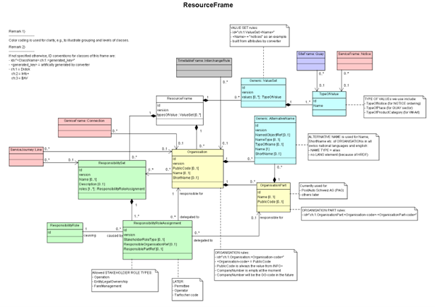

# Common Building Blocks

This chapter deals with the elements, attributes, formats and types that are commonly used.

In this chapter:
- [Rules for common Attributes ](#rules-for-common-attributes)
  - [Rules for IDs](#ids)
- Common Types
  - [MultilingualString](#multilingualstring)
- [FrameDefaults](#framedefaults)
- [Time formatting and journey after midnight](#time-formatting-and-journey-after-midnight)
- [AlternativeName](#alternativename)
- [AlternativeText](#alternativetext)
- [ResourceFrame](#resourceframe)
  - [ResponsibilitySet](#responsibilityset)
  - [TypeOfValue / Valuesets](#typeofvalue--valuesets)
    - [TypeOfProductCategory](#typeofproductcategory)
    - [TypeOfService](#typeofservice)
  - [Organisation / Operator / Authority](#organisation--operator--authority)
  - [ServiceFacilitySet](#servicefacilityset)
  - [SiteFacilitySet](#servicefacilityset)

## Rules for common Attributes

The following rules apply to common attributes:

| Attribute              | Rule                                                        |
|------------------------|-------------------------------------------------------------|
| `id`                   | See description regarding [technical IDs](#ids) below       |
| `version`              | is always set to `"1"`                                      |
| `responsibilitySetRef` | We use `responsibilitySetRef` in the following elements xxx |
| `nameOfClass`          | We use `nameOfClass` in the XXXRef elements.                |

### IDs
IDs must be globally unique during importation. 
They may also be partially or completely artificially generated. The persistence of these IDs between exports is then 
usually not guaranteed. 
Important business level keys are stored in elements (`PublicKey`, `PrivateKey`, `KeyList`), not in IDs.

It is important to note that internal or artificially generated IDs should not be used to extract content whenever 
business keys and attributes are available. 

For readability and easy referencing, we will use the following principles:
-	We use the class of the object to prefix the technical ID like `ch:1:TypeOfNotice:3"` for a `TypeOfNotice` element.
-   We use appropriate business values to build technical IDs where available, e.g. `ch:1:TypeOfProductCategory:TER` 
where the value of `ShortName` of the `TypeOfProductCategory` is used to build the ID, or `ch:1:Operator:11`.
-	Where there is a compelling need for global stability, the ID will be a global ID. 
This information will be also provided separately in a `KeyList`. 

> [!CAUTION] 
> **TODO** Must be revisited and updated. #83

All other defined attributes like `created`, `changed`, `modification` are not used. If we need one, we will inform about it in the table associated with the element.

## Common Types

### MultilingualString
*→ [Glossary definition](A4_annex_glossary.md#multilingualstring)*

#### Purpose

NeTEx uses the type `MultilingualString` for descriptive text elements (e.g. `Notice` text, `Name`, `ShortName` etc.).
However, only one language can be set for a given element (e.g. `<MultilingualString lang=”fr”>`). 
Additional languages are introduced through the [AlternativeName](#alternativename) and [AlternativeText](#alternativetext) element.

#### Usage Notes

- For [Organisations](#organisation--operator--authority) e.g. there are all languages present.
- The `StopPlace` names in Switzerland are language-independent.

## Time Formatting and Journey after Midnight

The time format consists only of the hours, minutes (and seconds) of a 24-hour clock, e.g. `23:55:00`. 

Times that pass midnight of the current `OperatingDay` are marked with a `DayOffset` element. 
If a `ServiceJourney` (in a particular `Call`) runs over midnight, then `DayOffset` must be set to `1`.

## FrameDefaults
*→ [Glossary definition](A4_annex_glossary.md#framedefaults)*

### Purpose
Holds default values for certain basic parameters. 

### Table


| Sub | Element | Usage | Card | Type | Description | Note |
|-----|---------|-------|------|------|-------------|------|
|  | FrameDefaults | expected | 0..1 | VersionFrameDefaultsStructure | Default values to use on elements in the frame that do not explicitly state a value. |  |
| + | DefaultLocale | mandatory | 0..1 | LocaleStructure | Default LOCAL for frame elements. Assume this value for timezone and language of elements if not specified on individual elements. | The default locale is German (de) for SBB and Swiss public transport. |
| ++ | TimeZoneOffset | mandatory | 0..1 | TimeZoneOffsetType | Timezone offset from Greenwich at LOCALE. | We prefer times without the suf-fix "+hh:mm". Instead we specify a default TimeZoneOffset (+2) and SummerTimeZoneOffset (+1) |
| ++ | TimeZone | mandatory | 0..1 | xsd:normalizedString | Timezone name at LOCALE. |  |
| ++ | SummerTimeZoneOffset | mandatory | 0..1 | TimeZoneOffsetType | Summer timezone offset if different from Time zone offset. | We prefer times without the suf-fix "+hh:mm". Instead we specify a default TimeZoneOffset (+2) and SummerTimeZoneOffset (+1) |
| ++ | DefaultLanguage | mandatory | 0..1 | xsd:language | Default Language for LOCALE. Assume language use is "normally used" | Is always set to “de” for SKI and Swiss public transport. |
| + | DefaultLocationSystem | mandatory | 0..1 | xsd:normalizedString | Default spatial coordinate system (srsName). E.g. WGS84 Value to use for location elements using coordinates if not specified on individual elements. |  |


*→ [General NeTEx definition](../generated/netex-html/FrameDefaults.html)*

### Example


```xml
<?xml version="1.0" encoding="UTF-8"?>
<FrameDefaults >
  <DefaultLocale>
    <!-- The default locale is German (de) for SBB and Swiss public transport. -->
    <TimeZoneOffset>1</TimeZoneOffset>
    <!-- We prefer times without the suf-fix "+hh:mm". Instead we specify a default TimeZoneOffset (+2) and SummerTimeZoneOffset (+1) -->
    <TimeZone>Europe/Berlin</TimeZone>
    <SummerTimeZoneOffset>2</SummerTimeZoneOffset>
    <!-- We prefer times without the suf-fix "+hh:mm". Instead we specify a default TimeZoneOffset (+2) and SummerTimeZoneOffset (+1) -->
    <DefaultLanguage>de</DefaultLanguage>
    <!-- Is always set to “de” for SKI and Swiss public transport. -->
  </DefaultLocale>
  <DefaultLocationSystem>urn:ogc:def:crs:EPSG::4326</DefaultLocationSystem>
</FrameDefaults>

```


*→ [Template](../templates/FrameDefaults.xml)*

### Usage Notes
For values not set in `FrameDefaults` we use the values as indicated in the table and example above.

## AlternativeName

*→ [Glossary definition](A4_annex_glossary.md#alternativetext)*

### Purpose

`AlternativeName` is used to provide an alternative (alias or translation) of a name, e.g. of 
a `StopPlace` or `Organisation`. 

For all other alternative texts use `AlternativeText`.

### Table


| Sub | Element | Usage | Card | Type | Description | Note |
|-----|---------|-------|------|------|-------------|------|
|  | AlternativeName | mandatory | 1..1 | unknown | Alternative Name. | In some cases we need translations or alias of the Name element. This is done with AlternativeName. |
| + | TypeOfName | optional | 0..1 | xsd:normalizedString | Type of Name - open value. |  |
| + | Name | mandatory | 0..1 | MultilingualString | Name of Traveller |  |
| + | @lang | mandatory | 1..1 | xsd:string | Attribute lang | |


*→ - [General NeTEx definition](../generated/netex-html/AlternativeName.html)*
 
### Example


```xml
<?xml version="1.0" encoding="UTF-8"?>
<AlternativeName >
  <!-- In some cases we need translations or alias of the Name element. This is done with AlternativeName. -->
  <NameType>alias</NameType>
  <TypeOfName>offical</TypeOfName>
  <Name lang="de">Die Übersetzung des Namens.</Name>
</AlternativeName>

```


*→ - [Template](../templates/AlternativeName.xml)*

### Usage Notes

We only allow the following values for `NameType`: 
- `alias`
- `translation`

## AlternativeText

*→ [Glossary definition](A4_annex_glossary.md#alternativetext)*

### Purpose

The `AlternativeText` is a generic way to provide an alternative text (translation or alias).
For example, it can be used for the translation of `Notice` texts.

### Table


| Sub | Element | Usage | Card | Type | Description | Note |
|-----|---------|-------|------|------|-------------|------|
|  | AlternativeText | mandatory | 1..1 | unknown | Alternative Text. +v1.1 |  |
| + | Text | mandatory | 0..1 | MultilingualString | Text content of NOTICe. |  |


*→ - [General NeTEx definition](../generated/netex-html/AlternativeText.html)*
 
### Example


```xml
<?xml version="1.0" encoding="UTF-8"?>
<AlternativeText  id="ch:1:AlternativeText:Notice-Hin_1229900-fr" version="1" attributeName="Text" useForLanguage="fr">
  <!--  -->
  <Text>Départ de la voie 2.</Text>
</AlternativeText>

```


*→ - [Template](../templates/AlternativeText.xml)*

## Usage Notes

The `AlternativeText` is part of a `DataManagedObject` and references the name of the node, for which it provides an alternative. 
It contains the alternative text as an attribute of type `MultilingualString` which indicates the language. 

In addition, the `AlternativeText` element may have a `useForLanguage` attribute to indicate a second language for which it may be used as 
an acceptable presentation, if there is no native language alternative; normally this will be the same as the language 
of the string, but might be different.

Alternative names (translations or aliases) of a `StopPlace` or `Organisation` are modelled with [AlternativeNames](#AlternativeName).

# ResourceFrame

*→ [Glossary definition](A4_annex_glossary.md#resourceframe)*

## Purpose
Contains shared resources used / referenced in other frames - organisations (`Authoritiy`s and `Operator`s), `VehicleType`s, codespaces, and other common reference data.

See the following class diagram for the most important objects of the RESOURCE FRAME and their relationships to the other frames.



## Contained Elements

- ResponsabilitySet
- TypeOfValue / ValueSets
- TypeOfNotice
- TypeOfProductCategory
- TypeOfService
- Organisation / Operator / Authority
- ServiceFacilitySet
- SiteFacilitySet

## Table


| Sub | Element | Usage | Card | Type | Description | Note |
|-----|---------|-------|------|------|-------------|------|
|  | ResourceFrame | mandatory | 1..1 | unknown | A coherent set of reference values for TYPE OF VALUEs , ORGANISATIONs, VEHICLE TYPEs etc that have a common validity, as specified by a set of frame VALIDITY CONDITIONs. Used to define common resources that will be referenced by other types of FRAME. |  |
| + | responsibilitySets | mandatory | 0..1 | responsibilitySetsInFrame_RelStructure | RESPONSIBILITY SETs used in frame. | RESPONSIBILITY SETs contained in RESOURCE FRAME. ResponsibilitySets are used for the cases in which the LegalEntity, the Operator and the organisation selling the tickets are different. |
| ++ | [ResponsibilitySet](ResponsibilitySet.md) | mandatory | 1..1 | unknown | A set of responsibility roles assignments that can be associated with a DATA MANAGED OBJECT. A Child ENTITY has the same responsibilities as its parent. | Each combination of Authority and Operator needs a ResponsibilitySet. |
| + | typesOfValue | mandatory | 0..1 | typesOfValueInFrame_RelStructure | VALUE SETs and TYPE OF VALUEs in frame. | Sets of TYPE OF VALUE contained in the RESOURCE FRAME. |
| ++ | ValueSet | mandatory | 1..1 | unknown | An extensible set of code values which may be added to by user applications and is used to validate the properties of Entities. |  |
| + | organisations | mandatory | 0..1 | organisationsInFrame_RelStructure | ORGANISATIONs in frame. | ORGANISATIONs contained in RESOURCE FRAME. Contains the relevant Operators and other Organisations. We currently face a problem that the same sboid might be reused for Operator and Authority. We will have to check, if we only define Operators, but ue them in Authority as well. TBD |
| ++ | [Operator](Operator.md) | mandatory | 1..1 | unknown | A company providing public transport services. | We will use this organisation also in AuthorityRef. The problem is that the sboid can be used only once. |
| + | siteFacilitySets | optional | 0..1 | siteFacilitySetsInFrame_RelStructure |  | Depending on the export/import part, there will be SiteFacilitySets to be included or not. |
| ++ | [SiteFacilitySet](SiteFacilitySet.md) | optional | 1..1 | unknown | Set of enumerated FACILITY values that are relevant to a SITE (names based on TPEG classifications, augmented with UIC etc.). |  |
| ++ | [ServiceFacilitySet](ServiceFacilitySet.md) | optional | 1..1 | unknown | Service FACILITY. Set of enumerated FACILITY values (Where available names are based on TPEG classifications, augmented with UIC etc.). |  |


*→ - [General NeTEx definition](../generated/netex-html/ResourceFrame.html)*

## Example


```xml
<?xml version="1.0" encoding="UTF-8"?>
<ResourceFrame  id="ch:1:ResourceFrame" version="any">
  <responsibilitySets>
    <!-- RESPONSIBILITY SETs contained in RESOURCE FRAME. ResponsibilitySets are used for the cases in which the LegalEntity, the Operator and the organisation selling the tickets are different. -->
    <ResponsibilitySet id="ch:1:ResponsbilitySet-gen" version="1">
      <!-- Each combination of Authority and Operator needs a ResponsibilitySet. -->
    </ResponsibilitySet>
  </responsibilitySets>
  <typesOfValue>
    <!-- Sets of TYPE OF VALUE contained in the RESOURCE FRAME. -->
    <ValueSet id="ch:1:ValueSet:notices" version="1" nameOfClass="TypeOfNotice">
      <values>
        <TypeOfNotice id="ch:1:TypeOfNotice:1" version="1">
          <Name>Allgemeiner Hinweis</Name>
          <PrivateCode>1</PrivateCode>
        </TypeOfNotice>
        <TypeOfNotice id="ch:1:TypeOfNotice:10" version="1">
          <Name>Angebot</Name>
          <PrivateCode>10</PrivateCode>
        </TypeOfNotice>
      </values>
    </ValueSet>
    <ValueSet id="ch:1:ValueSet:TypesOfProductCategory" version="1" nameOfClass="TypeOfProductCategory">
      <values>
        <TypeOfProductCategory id="ch:1:TypeOfProductCategory:TER" version="1">
          <alternativeTexts>
            <AlternativeText attributeName="Name">
              <Text lang="it">Train Express Regional</Text>
            </AlternativeText>
            <AlternativeText attributeName="Name">
              <Text lang="en">Train Express Regional</Text>
            </AlternativeText>
            <AlternativeText attributeName="Name">
              <Text lang="fr">Train Express Regional</Text>
            </AlternativeText>
          </alternativeTexts>
          <Name lang="de">TER</Name>
          <ShortName>TER</ShortName>
        </TypeOfProductCategory>
      </values>
    </ValueSet>
  </typesOfValue>
  <organisations>
    <!-- ORGANISATIONs contained in RESOURCE FRAME. Contains the relevant Operators and other Organisations. We currently face a problem that the same sboid might be reused for Operator and Authority. We will have to check, if we only define Operators, but ue them in Authority as well. TBD -->
    <Operator id="sboid" version="1">
      <!-- We will use this organisation also in AuthorityRef. The problem is that the sboid can be used only once. -->
    </Operator>
  </organisations>
  <siteFacilitySets>
    <!-- Depending on the export/import part, there will be SiteFacilitySets to be included or not. -->
    <SiteFacilitySet id="generated" version="1"/>
  </siteFacilitySets>
  <serviceFacilitySets>
    <!-- Depending on the export/import part, there will be ServiceFacilitySets to be included. If there are ServiceJourneys we expect there to be some. -->
    <ServiceFacilitySet id="generated" version="1"/>
  </serviceFacilitySets>
</ResourceFrame>

```


*→ - [Template](../templates/ResourceFrame.xml)*

## Frame Relationships

Elements of the `ResourceFrame` can be referenced in other frames like `SiteFrame`, `ServiceFrame`, `ServiceCalendarFrame` 
and/or `TimetableFrame`.

## ResponsibilitySet

*→ [Glossary definition](A4_annex_glossary.md#responsibilityset)*

### Purpose
The set of roles and organisations responsible for managing data, operations, or contractual obligations within a defined scope.
We use this element to  describe the different roles of the participating companies. For the most part, the company code is used to fully identify the provided services. 


| value of `StakeholderRoleType` | Description                                                                        |
|--------------------------------|------------------------------------------------------------------------------------|
| `EntityLegalOwnership`         | Role of the **concession company** holding the concession for the original service |
| `Operation`                    | role of the **operator company** responsible for providing the transport service   |
### Table


| Sub | Element | Usage | Card | Type | Description | Note |
|-----|---------|-------|------|------|-------------|------|
|  | ResponsibilitySet | mandatory | 1..1 | unknown | A set of responsibility roles assignments that can be associated with a DATA MANAGED OBJECT. A Child ENTITY has the same responsibilities as its parent. | Each combination of Authority and Operator needs a ResponsibilitySet. EntitiyLegalOwnership ismandatory. All other roles are optional. However, we prefer to have the Operation part as well. If given Journeys are operated by a different Operator, then a different ResponsibilitySet should be referenced in the ServiceJourney from the Line. |
| + | Name | mandatory | 0..1 | MultilingualString | Name of Traveller |  |
| + | PrivateCode | expected | 1..1 | PrivateCodeStructure | A private code that uniquely identifies the element. May be used for inter-operating with other (legacy) systems. |  |
| + | roles | mandatory | 0..1 | responsibilityRoleAssignments_RelStructure | Roles defined by this RESPONSIBILITY SET. |  |
| ++ | ResponsibilityRoleAssignment | mandatory | 1..1 | unknown | Assignment of a specific RESPONSIBILITY ROLE to a specific organisation and/or subdivision. |  |
| +++ | StakeholderRoleType | mandatory | 0..1 | StakeholderRoleTypeListOfEnumerations | Stakeholder roles which this assignment assigns. | "EntityLegalOwnership" must be defined once and "Operator" should be too. |
| +++ | ResponsibleOrganisationRef | mandatory | 0..1 | OrganisationRefStructure | Responsible ORGANISATION. |  |


*→ - [General NeTEx definition](../generated/netex-html/ResponsibilitySet.html)*

### Example


```xml
<?xml version="1.0" encoding="UTF-8"?>
<ResponsibilitySet  id="ch:1:ResponsbilitySet-gen" version="1">
  <!-- Each combination of Authority and Operator needs a ResponsibilitySet. EntitiyLegalOwnership ismandatory. All other roles are optional. However, we prefer to have the Operation part as well. If given Journeys are operated by a different Operator, then a different ResponsibilitySet should be referenced in the ServiceJourney from the Line. -->
  <Name lang="de">Basler Verkehrsbetriebe</Name>
  <PrivateCode>BVB</PrivateCode>
  <roles>
    <ResponsibilityRoleAssignment id="ch:1:ResponsibilityRoleAssignment:823_823:1" version="1">
      <StakeholderRoleType>EntityLegalOwnership</StakeholderRoleType>
      <!-- "EntityLegalOwnership" must be defined once and "Operator" should be too. -->
      <ResponsibleOrganisationRef ref="ch:1:sboid:100622" version="1"/>
    </ResponsibilityRoleAssignment>
    <ResponsibilityRoleAssignment id="ch:1:ResponsibilityRoleAssignment:823_823:2" version="1">
      <StakeholderRoleType>Operation</StakeholderRoleType>
      <ResponsibleOrganisationRef ref="ch:1:sboid:100622" version="1"/>
    </ResponsibilityRoleAssignment>
  </roles>
</ResponsibilitySet>

```


*→ - [Template](../templates/ResponsibilitySet.xml)*

### Usage Notes

> [!CAUTION] 
> US: Why is there an exception for the PAG? Is it still needed?

For the PAG company (801), the attribute `ResponsibleArea(Ref)` must also be taken into account.

Services (e.g. replacement services) can be associated with different roles. These roles can be defined inside the `ResponsibilitySet` element.

Only the values defined below are allowed in Switzerland for `StakeholderRoleType` in `ResponsbilityRoleAssignment`:
-	`Operation`
-	`EntityLegalOwnership`
-	`FareManagement`
-	`Planning`

`FareManagement` and `Planning` are currently not used. Not all roles must be filled.

## TypeOf... / ValueSet
**TODO**#74 This is an alternative presentation or the next section... (because `TypeOfValue` and `ValueSets` do not exist)

*→ [Glossary definition: TypeOf...](A4_annex_glossary.md#typeof...)*\
*→ [Glossary definition: ValueSet](A4_annex_glossary.md#valueset)*

### Purpose
TypeOf... (examples: `TypeOfNotice`, `TypeOfProductCategory`, `TypeOfService`) are used for classification of NeTEx entities.  They are listed in `ValueSet`s as part of the `ResourceFrame`. 

### Usage Notes
We use TypeOfValue references in various Frames in objects including:
-	`Notice`: references `TypeOfNotice`
-	`ServiceJourney`: references `TypeOfProductCategory`

## TypeOfValue / ValueSets
The ResourceFrame contains all the `ValueSets` and `TypeOfValues`. These are used for classification of NeTEx entities like `Notice`, `ProductCategory` etc.
It is preferred that the `TypeOfValue` are copied from the SKI files and no individual `TypeOfValue` are created.

> [!CAUTION] 
> **TODO**#73 add more examples for TypeOfValue usage

`TypeOfValue` elements are stored in `ValueSets` as part of the ResourceFrame. We use TypeOfValue references in various Frames in objects including:
-	`Notice`: references `TypeOfNotice`
-	`ServiceJourney`: references `TypeOfProductCategory`

## TypeOfNotice

### Purpose
`TypeOfNotice` is used within a [Notice](07_service.md#notice) to give information, what it is about. The table below shows the `TypeOfNotice` we use in Switzerland.


| PrivateCode | Name                | Description                                                                                                                                                                                                                                                      |
|-------------|---------------------|------------------------------------------------------------------------------------------------------------------------------------------------------------------------------------------------------------------------------------------------------------------|
| 1           | Allgemeiner Hinweis | General information text                                                                                                                                                                                                                                         |
| 2           | ~~Zugname~~         | Name of the train. Is not used, as this is stored in ServiceJourneyName.                                                                                                                                                                                         |
| 3           | ~~Gleis-Angabe~~    | Quay and Quay section information. Is no longer used. Is put into Quay.                                                                                                                                                                                          |
| 10          | Angebot             | Most of the `ServiceFacilitySet` are also transmitted as `Notice`. On top of that we have multiple services and facilities in Switzerland that cannot be mapped to `ServiceFacilitySets`. This `TypeOfNotice` is used to deliver those special cases as Notices. |
| 11          | ~~Region~~          | Postauto is divided into several regions. Will be omitted. If anything this will be done with different constructs.                                                                                                                                              |

``` xml
<ValueSet id="ch:1:ValueSet:notices" version="1" nameOfClass="TypeOfNotice">
  <values>
    <TypeOfNotice id="ch:1:TypeOfNotice:1" version="1">
      <Name>Allgemeiner Hinweis</Name>
      <PrivateCode>1</PrivateCode>
    </TypeOfNotice>
    <TypeOfNotice id="ch:1:TypeOfNotice:10" version="1">
      <Name>Angebot</Name>
      <PrivateCode>10</PrivateCode>
    </TypeOfNotice>
  </values>
</ValueSet>
```
## TypeOfProductCategory

### Purpose

For the ServiceJourneys exclusively provided in Switzerland, only the ProductCategories defined in the document [06 Harmonisierung Verkehrsmittel](https://www.allianceswisspass.ch/de/tarife-vorschriften/uebersicht/V580/Produkte-der-V580-FIScommun-1) may be referenced. 
For ServiceJourneys provided in other countries or partially in Switzerland, there are no restrictions, provided that the category does not overlap with the ProductCategories defined for Switzerland.

### Table


| Sub | Element | Usage | Card | Type | Description | Note |
|-----|---------|-------|------|------|-------------|------|
|  | TypeOfProductCategory | mandatory | 1..1 | unknown | Classification of a PRODUCT CATEGORY. |  |
| + | alternativeTexts | mandatory | 0..1 | alternativeTexts_RelStructure | Additional Translations of text elements. | For each language an AlternativeText is needed |
| ++ | AlternativeText | mandatory | 1..1 | unknown | Alternative Text. +v1.1 |  |
| + | Name | mandatory | 0..1 | MultilingualString | Name of Traveller |  |
| + | ShortName | mandatory | 0..1 | MultilingualString | Short Name for service |  |


*→ [General NeTEx definition](../generated/netex-html/TypeOfProductCategory.html)*


###  Example


```xml
<?xml version="1.0" encoding="UTF-8"?>
<TypeOfProductCategory  id="ch:1:TypeOfProductCategory:TER" version="any">
  <alternativeTexts>
    <!-- For each language an AlternativeText is needed -->
    <AlternativeText attributeName="Name">
      <Text lang="it">Train Express Regional</Text>
    </AlternativeText>
    <AlternativeText attributeName="Name">
      <Text lang="en">Train Express Regional</Text>
    </AlternativeText>
    <AlternativeText attributeName="Name">
      <Text lang="fr">Train Express Regional</Text>
    </AlternativeText>
  </alternativeTexts>
  <Name lang="de">TER</Name>
  <ShortName>TER</ShortName>
</TypeOfProductCategory>

```


*→ [Template](../templates/TypeOfProductCategory.xml)*

## TypeOfService
`TypeOfService` is dealt with in the `TimetableFrame`.

## Organisation / Operator / Authority

*→ [Glossary definition: Operator](A4_annex_glossary.md#operator)*\
*→ [Glossary definition: Authority](A4_annex_glossary.md#authority)*

### Purpose
A legally incorporated body associated with any aspect of public transportation. Authority and Operator are Organisations. An Operator provides public transport services under contract with an Authority.
Organisations located in Switzerland are identified by their [GO-number](https://opentransportdata.swiss/de/dataset/didok/resource/d66259a0-a77c-4aee-b7bd-e4fba99dcbb1) 
in Switzerland. The TU-Code is to be used for operators of other countries. 

### Table


| Sub | Element | Usage | Card | Type | Description | Note |
|-----|---------|-------|------|------|-------------|------|
|  | Operator | mandatory | 1..1 | unknown | A company providing public transport services. | We will use this organisation also in AuthorityRef. The problem is that the sboid can be used only once. |
| + | keyList | expected | 1..1 | KeyListStructure | A list of alternative Key values for an element. |  |
| ++ | KeyValue | expected | 1..* | KeyValueStructure | Key value pair for Entity. |  |
| + | privateCodes | expected | 1..1 | PrivateCodesStructure | A list of private codes that uniquely identifiy the element. May be used for inter-operating with other (legacy) systems. +v2.0 |  |
| ++ | PrivateCode | expected | 1..1 | PrivateCodeStructure | A private code that uniquely identifies the element. May be used for inter-operating with other (legacy) systems. | Busines organisation |
| + | Name | expected | 0..1 | MultilingualString | Name of Traveller |  |
| + | ShortName | expected | 0..1 | MultilingualString | Short Name for service | there may be cases, when it can't be set. However, when no sboid is there, then ShortName must be filled (especially for foreign operators. |
| + | parts | optional | 0..1 | blockParts_RelStructure | BLOCK PARTs which make up COMPOUND BLOCK. |  |
| +++ | administrativeZones | optional | 0..1 | administrativeZones_RelStructure | Zones managed by ORGANISATION PART. |  |
| ++++ | TransportAdministrativeZone | optional | 1..1 | unknown | A ZONE relating to the management responsibilities of an ORGANISATION. For example to allocate bus stop identifiers for a region. |  |


*→ [General NeTEx definition](../generated/netex-html/Operator.html)*

### Example


```xml
<?xml version="1.0" encoding="UTF-8"?>
<Operator  id="ch:1:sboid:100602" version="1">
  <!-- We will use this organisation also in AuthorityRef. The problem is that the sboid can be used only once. -->
  <keyList>
    <KeyValue>
      <Key>GO</Key>
      <Value>801</Value>
    </KeyValue>
    <KeyValue>
      <Key>SBOID</Key>
      <Value>ch:1:sboid:100602</Value>
    </KeyValue>
  </keyList>
  <privateCodes>
    <PrivateCode type="GO">801</PrivateCode>
    <!-- Busines organisation -->
    <PrivateCode type="sboid">ch:1:sboid:100602</PrivateCode>
  </privateCodes>
  <PrivateCode>801</PrivateCode>
  <Name>PostAuto AG</Name>
  <ShortName>PAG</ShortName>
  <!-- there may be cases, when it can't be set. However, when no sboid is there, then ShortName must be filled (especially for foreign operators. -->
  <parts>
    <OrganisationPart id="ch:1:OrganisationPart:801-5678" version="1">
      <administrativeZones>
        <TransportAdministrativeZone id="ch:1:TransportAdministrativeZone:801-5678" version="1">
          <PrivateCode>5678</PrivateCode>
        </TransportAdministrativeZone>
      </administrativeZones>
    </OrganisationPart>
  </parts>
</Operator>

```


*→ - [Template](../templates/Operator.xml)*

### Usage Notes

> [!NOTE] From 2024, organisations will also be identified 
> by [SBOIDs](https://transportdatamanagement.ch/content/uploads/2021/05/SwissBusinessOrganisationID_DE_1_2.pdf).

The list contains all transport enterprises for which timetable information is delivered. 
The Operators are identified by their GO-number in Switzerland. The TU-Code is to be used for operators of other countries. 

>The **PAG company** (GO = 801) is organised in different parts for managing and identifying journeys. 
>These parts are represented by the `OrganisationPart` and `TransportAdministrativeZone` elements. 

The SBOID and GO number shall always also be stored in the `KeyList`.

> [!CAUTION]\
> **TODO**#67: `OrganisationPart` needs to be studied! 6.4.1

`OperatorRef` on a `Line` is always the "Konzessionär". 
If a different `Operator` is running a given `ServiceJourney`, then this is reflected in the `ServiceJourney` having 
a different `OperatorRef`.

## ServiceFacilitySet
*→ [Glossary definition](A4_annex_glossary.md#servicefacilityset)*

### Purpose
Set of `Facilitiy`s available for a `ServiceJourney` or a `JourneyPart`. 

> [!CAUTION]\
> **TODO**#53 10.13.2ff
> a lot more detail needed. But probably in uc

### Table


| Sub | Element | Usage | Card | Type | Description | Note |
|-----|---------|-------|------|------|-------------|------|
| + | NuisanceFacilityList | optional | 1..1 | NuisanceFacilityListOfEnumerations | List of NUISANCE FACILITies. |  |
| + | SanitaryFacilityList | optional | 1..1 | SanitaryFacilityListOfEnumerations | List of SANITARY FACILITies. |  |
| + | CouchetteFacilityList | optional | 1..1 | CouchetteFacilityListOfEnumerations | List of COUCHETTE FACILITies. |  |
| + | GroupBookingFacility | optional | 1..1 | GroupBookingEnumeration | Classification of GROUP FACILITY type - TPEG pti23. |  |


*→ [General NeTEx definition](../generated/netex-html/ServiceFacilitySet.html)*

### Example


```xml
<?xml version="1.0" encoding="UTF-8"?>
<ServiceFacilitySet  id="generated" version="1">
  <!-- List of ServiceFacility. Be careful: not all are supported. Consult profile. Make sure to not generate identical ServiceFacilitySets. Reuse them. -->
  <NuisanceFacilityList>animalsAllowed</NuisanceFacilityList>
  <SanitaryFacilityList>toilet</SanitaryFacilityList>
  <CouchetteFacilityList>wheelchair</CouchetteFacilityList>
  <GroupBookingFacility>groupsAllowed</GroupBookingFacility>
</ServiceFacilitySet>

```


*→ - [Template](../templates/ServiceFacilitySet.xml)*

### Usage Notes

SKI uses the following groups to classify `facilities`:
-	Accommodation facility
-	Catering facility
-	Fare classes
-	Group booking facility
-	Luggage carriage facility
-	Mobility facility
-	Nuisance facility
-	Passenger communications facility
-	Service reservation facility
-	Ticketing facility
-	Uic train rate

If necessary, this list can be revised. In case of additions, this can be done, as long as the desired category is defined in the NeTEx specifications. 

This means that a given Facility (e.g. restaurant or diaper changing table) is shown in the appropriate 
subcategory `MealFacilityList` or `FamilyFacilityList`, and a passenger information system can show these categories in 
a reasonable order. The categories themselves are from type `xsd:list`, meaning that the values of a category are a 
separated list of elements. 

## SiteFacilitySet
*→ [Glossary definition](A4_annex_glossary.md#servicefacilityset)*

### Purpose
Set of `Facilitiy`s available at a `StopPlace`, `Quay` or other site elements.

> [!CAUTION]\
> **TODO**#53 @tuxalp not decribed in RG 1.01.\@tuxalp missing in glossary\ @tuxalp missing elements in template.

A `SiteFacilitySet` defines a set of facilities like sanitary facilities, ticket service, lockers etc. that can be 
referenced to define facilities of a site.

### Table


| Sub | Element | Usage | Card | Type | Description | Note |
|-----|---------|-------|------|------|-------------|------|
|  | SiteFacilitySet | mandatory | 1..1 | unknown | Set of enumerated FACILITY values that are relevant to a SITE (names based on TPEG classifications, augmented with UIC etc.). | List of SiteFacility. Be careful: not all are supported. Consult profile. Make sure to not generate identical SiteFacilitySets. Reuse them. |
| + | validityConditions | optional | 1..1 | validityConditions_RelStructure | VALIDITY CONDITIONs conditioning entity. |  |
| ++ | [AvailabilityCondition](AvailabilityCondition.md) | mandatory | 1..1 | unknown | VALIDITY CONDITION stated in terms of DAY TYPES and PROPERTIES OF DAYs. |  |
| + | FareClasses | optional | 1..1 | FareClassListOfEnumerations | List of FARE CLASSes. |  |
| + | SanitaryFacilityList | optional | 1..1 | SanitaryFacilityListOfEnumerations | List of SANITARY FACILITies. |  |
| + | TicketingServiceFacilityList | optional | 1..1 | TicketingServiceFacilityListOfEnumerations | List of TICKETING SERVICE FACILITies, e.g. purchase, collection. top up. |  |
| + | LuggageLockerFacilityList | optional | 1..1 | LuggageLockerFacilityListOfEnumerations | List of LUGGAGE LOCKER FACILITies. |  |


*→ [General NeTEx definition](../generated/netex-html/SiteFacilitySet.html)*

### Example


```xml
<?xml version="1.0" encoding="UTF-8"?>
<SiteFacilitySet  id="generated" version="1">
  <!-- List of SiteFacility. Be careful: not all are supported. Consult profile. Make sure to not generate identical SiteFacilitySets. Reuse them. -->
  <validityConditions>
    <AvailabilityCondition id="generated" version="1">
      <FromDate>2026-03-30T12:00:00</FromDate>
      <ToDate>2026-04-01T12:00:00</ToDate>
      <ValidDayBits>01</ValidDayBits>
    </AvailabilityCondition>
  </validityConditions>
  <FareClasses>firstClass</FareClasses>
  <SanitaryFacilityList>babyChange</SanitaryFacilityList>
  <TicketingServiceFacilityList>reservations</TicketingServiceFacilityList>
  <LuggageLockerFacilityList>lockers</LuggageLockerFacilityList>
</SiteFacilitySet>

```


*→ - [Template](../templates/SiteFacilitySet.xml)*

### Usage Notes

Make sure to not generate identical SiteFacilitySets. Reuse them.

## VehicleType
*→ [Glossary definition](A4_annex_glossary.md#vehicletype)*

### Purpose
A typified vehicle configuration (model or series) defining reusable characteristics such as capacity, dimensions, propulsion, and accessibility features.

### Usage Notes
We currently don't use `VehicleType` or `VehicleModel`. We will need those at some point.

