# Comparison of the NeTEx Profiles of Switzerland, France and Norway

This comparison is focused on the actual productive data rather than on the documentation

## Comparison of the File Structure

### France

The national access point offers NeTEx data feeds from several different regions and/or transport organisations:
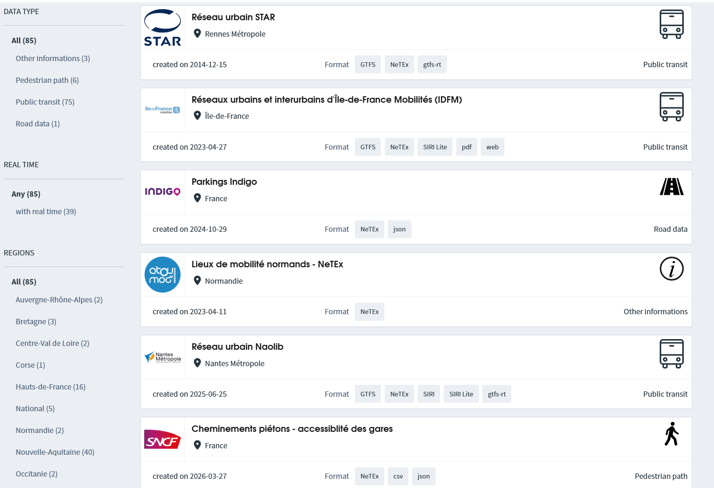

The file structure of the data feeds is not totally identical. Ile de France Mobilite provides:
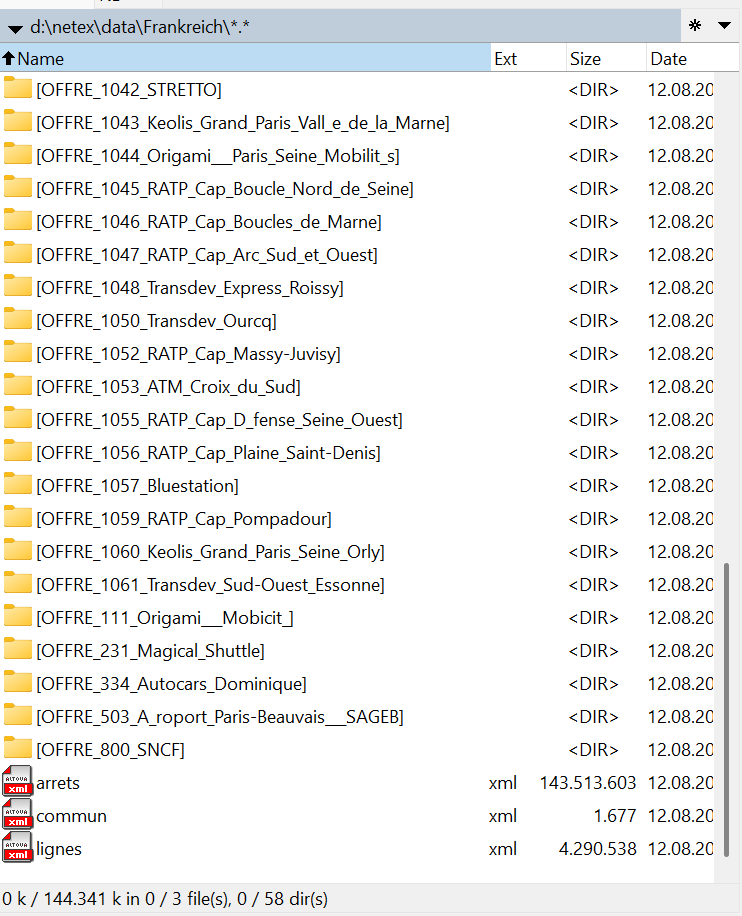

There are common files
- arrets.xml: Stop places and quays
- commun.xml: Common reference data
- lignes.xml: A directory of the LINEs contained in the dataset
There are subdirectories per operator. These contain a  NeTEx file for each LINE run by the operator. These files contain routes, servicepatterns and journey. 
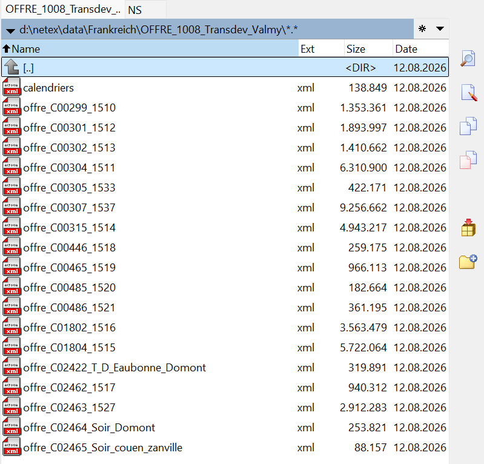
The subdirectories also contain a "calendrier" file containig the service calendar for the LINEs contained in the directory.

The data feeld of Nouvelle Aquitaine is similar in structure, but has file naming variants:
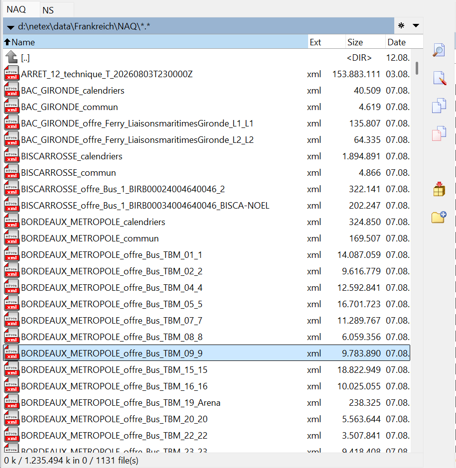
Instead of using subdirectories, the region name of the data is coded into the file name, e.g BORDEAUX_METROPOLE_calendriers.xml. However, the principle is the same.

Aditionally, the SNCF publishes a feed containing accessibility on stations. The SNCF timetable datset is not separated into files per LINE. They publish a dataset containing several LINEs.

### Norway

The Norwegian NAP provides datasets for each region / operator. There is also a dataset for the whole of Norway, but this just contains all files of the individual data sets.
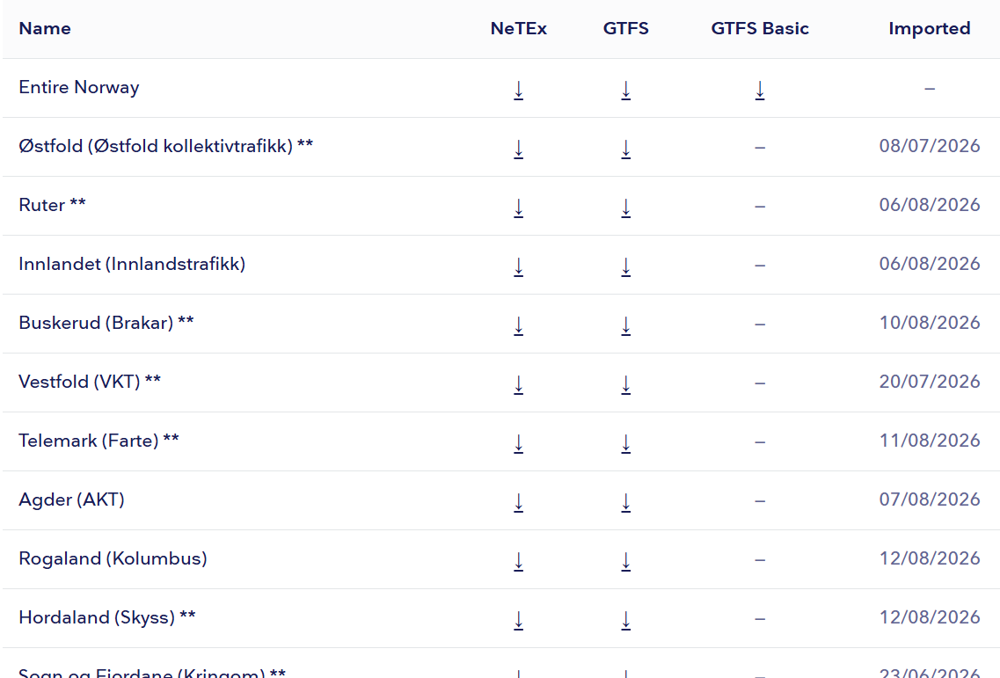

Each Dataset contains a "shared data" file and individual files per LINE. The same applies for flexible services.

The SiteFrame containing stops and quays can also be downloaded either as one file containing all norwegian stops or as separate files per region.

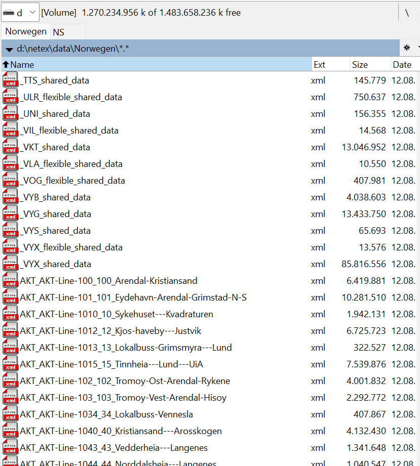

### Future Swiss Profile 2.0

There will be 
- one file containing the SiteFrame with all stops and quays 
- NETWORK_OFFER files containing ServiceFrame and Timetable for a certain region and data provider. Common reference data are contained in the files
- a file containing ServiceInterchange between lines and service journeys.

### Summary
- While file naming conventions differ, both NO and FR provide files per LINE to make file size more manageable. Common reference data are put into extra files per data feed / data provider, but there is no common reference dataset for the whole country.
- The CH profile is also aimed at making file size more manageable, but places more emphasis on having self-contained files where all reference data are contained and can be validated.
- In Norway and Switzerland, the file naming convention makes sure that the file name is unique across all datasets.
  
  
## Comparison of the Resource Frame - Common Reference Data

### France

The french profile does not use the predefined NeTEx Frames like ResourceFrame, SiteFrame, ServiceFrame etc., but uses GeneralFrame with TypeOfFrameRef indicating the content.

A GeneralFrame with TypeOfFrameRef "NETEX_COMMUN" may contain elements such as:
- Operator
- Authority
- Network
- Line
- Notice
- BookingContact (for flexible services)

Note that the frame content can still be split into different files

### Norway

The ResourceFrame contains the elements
 - Operator
 - Authority
 - typesOfValue/Branding

However, the "shared" files also contain ServiceFrame and ServiceCalendarFrame. 

ServiceFrame contains:
- Network
- Route
- RoutePoint with projection to ScheduledStopPoint
- ScheduledStopPoint
- PassengerStopAssignment
- Notice
  
ServiceCalenderFrame contains:
- DayType
- DayTypeAssignment

These elements are treated as general reference data which can be used by different TimetableFrames containing the actual services

### Future Swiss Profile 2.0

The ResourceFrame contains the following main elements:
- ResponsibilitySet
- TypeOfValue / ValueSets
- TypeOfNotice
- TypeOfProductCategory
- TypeOfService
- Organisation / Operator / Authority
- ServiceFacilitySet
- SiteFacilitySet
- VehicleType (not confirmed yet)

While a ResourceFrame is included in each NETWORK_OFFER file, the actual element keys and values are the same for all datasets.

### Summary

The Swiss profile places more emphasis on having a consolidated and mandatory set of reference data for all data providers.

## Comparison of the SiteFrame - Stops and Quays

### France

The french profile does not use SiteFrame for information on stops and quays, but uses GeneralFrame with TypeOfFrameRef "NETEX_ARRET" instead

Elements contained are
- TopographicPlace
- StopPlace
- Quay
- TariffZone
- Authority

Stop places may be nested. Monomodal stops are grouped into multimodal stops. Quay elements are not child elements of StopPlace, but are referenced by StopPlace/QuayRef. Quay elements can also be nested. TypeOfQuay is not provided.

Stop and quay coordinates are either WGS84 or the french national projection (EPSG 2154), examples for both can be found.

AccessibilityAssessment is provided for stops and quays.

### Norway

Norway provides a SiteFrame containing all StopPlaces of Norway and also used stops from neighbour countries. 
Elements contained in the SiteFrame are:

- TopographicPlace
- StopPlace
- Quay
- GroupOfStopPlace
- Parking
- TariffZone
- GroupOfTariffZones

Stops can be nested and grouped. Grouping is used to indicate the central stops of a city. TopographicPlaces are provided in great detail including ParentTopographicPlace and border coordinates.

### Future Swiss Profile 2.0

The main elements contained in SiteFrame are:
- [StopPlace](#stopplace)
- [Quay](#quay)
- [TopographicPlace](#topographicplace)

Quays can be nested in order to model rail island platforms and tracks. TopographicPlace contains the hierarchy canton to district to locality. Default connection times for stops are provided in ServiceFrame. All stops originate from the Swiss central stop register and are identified by the SLOID (Swiss Location ID)

### Summary

Even though there are some differneces in detail, the model of stops and quays is relatively similar in the three profiles.

## Comparison of the Service Frame - Lines, Routes and JourneyPatterns

### France

The french profile does not use ServiceFrame, but a GeneralFrame with typeOfFrameRef "NETEX_STRUCTURE"

The Frame contains the main elements:
- Route including pointsInSequence/PointOnRoute
- RoutePoint
- Direction
- ServiceJourneyPattern
- DestinationDisplay
- ScheduledStopPoint
- PassengerStopAssignment
- DataSource

Surprisingly the Line element is not contained. It is contained in the NETEX_COMMUN frame. 
DirectionType is used to distinguish between inbound/outbound, whereas Direction indicates the name of the final destination of the Route.

### Norway

The Frame contains the main elements:
- Network (including additionalNetworks)
- GroupOfLines
- Line
- FlexibleLine
- Route including pointsInSequence/PointOnRoute
- RoutePoint
- PointProjection
- Direction
- ServiceJourneyPattern
- DestinationDisplay
- ScheduledStopPoint
- ServiceLink
- PassengerStopAssignment
- FlexibleStopAssignment
- Notice
- NoticeAssignment (to StopPointInJourneyPattern)
  

The norwegian profile separates between route and journeypattern, but it additionally uses the PointProjection element to map RoutePoint to ScheduledStopPoint. ServiceLinks are treated as shared data between different Lines and ServiceJourneyPatterns. ServiceLinks contain the coordinate sequence of the roads or tracks travelled. The Route element does not seem to provide any additional information except that it enables the link between ServiceJourneyPattern and Line.

### Future Swiss Profile 2.0

The future Swiss profile contains the elements:
- ServiceFrame
- Line
- GroupOfLines
- DestinationDisplay
- ScheduledStopPoint
- PassengerStopAssignment
- DefaultConnection
- SiteConnection
- TimingLink
- ServiceJourneyPattern
- TimeDemandType
- Notice
- NoticeAssignment

GroupOfLines is used to group lines which the same line from a passenger perspective, but are operated by different operators and which are therefore split into different technical lines.
TimeDemandType and TimingLink provide information on scheduled running times between stops of a ServiceJourneyPattern and scheduled waiting times at stops.

### Summary

The main differences between CH and NO,FR are
- The Swiss profile does not use the Route element
- The Swiss profile provides relative running times between stops. This enables consumers to calculate PassingTimes themselves and allows for more compact timetable files.
- The Swiss profile will not provide ServiceLinks / coordinates of the route run. This may be added in a later version.

## Comparison of the TimetableFrame - Journeys and Interchanges

### France
The french profile does not use the TimetableFrame, it uses a GeneralFrame with TypeOfFrameRef "NETEX_HORAIRE"

The frame contains only ServiceJourney Elements. The main child elements are
- Name: Obviously contains a journey number
- dayTypes/daytypeRef
- JourneyPatternRef
- trainNumbers/TrainNumber
- passingTime

### Norway

The TimetableFrame contains the elements
- ServiceJourney
- DatedServiceJourney
- ServiceJourneyInterchange
- NoticeAssignment

The child elements of ServiceJourney are:

- DepartureTime
- Name
- dayTypes/daytypeRef
- LineRef
- JourneyPatternRef
- OperatorRef
- trainNumbers/TrainNumber
- passingTime

### Future Swiss Profile 2.0

The main elements contained in a TimetableFrame are:

- ServiceJourney
- TemplateServiceJourney: describes a set of journeys repeating at a certain frequency. Used e.g. for cable cars.
- ServiceJourneyInterchange: Describes cases where standard interchange times are overriden or where passengers may remain in the same vehicle
- NoticeAssignment
- ServiceFacilitySet: various services and facilities offered by the vehicles of a journey

The main child elements of ServiceJourney and TemplateServiceJourney are:
- ResponsibilitySetRef: Detailed assignment of organisations and their roles
- OperatorRef: operator running the journey
- DepartureTime
- ServiceJourneyPatternRef
- AvailabilityConditionRef: Operating days of journey
- privateCodes/privateCode: Swiss journey id (SYID)
- TransportMode
- TypeOfProductCategoryRef
- TrainNumber
- NoticeAssignment
- OccupancyView
- VehicleTypeRef
- JourneyPartRef: Used where properties change within the journey

ServiceJourneys and TemplateServiceJourneys refer to a ServiceJourneyPattern and a TimeDemandType. They do not contain a PassingTimes child element. Consumers of the data need to calculate the passing times on the fly.
Validity of ServiceJourneys is given by a reference to an AvailabilityCondition 

### Summary

There are two main conceptual differences between the Swiss profile and NO/FR:
- passingTimes are not provided, the consumer needs to calculate them (not difficult)
- Operating Days of journeys are not provided by DayType, but by reference to an AvailabilityCondition element

## Comparison of the ServiceCalendarFrame - Daytypes and Operating Days

### France
The french profile does not use ServiceCalendarFrame, but uses a GeneralFrame with TypeOfFrame "NETEX_CALENDRIER" instead.

The main elements contained in the frame are
- Daytype
- DaytypeAssignment

Daytypes have in part meaningful names and "property of day" is often set

### Norway
The main elements contained in ServiceCalendarFrame are
- Daytype
- OperatingPeriod
- DaytypeAssignment

Daytypes can be either assigned to OperatingPeriods or to Dates. Both variants can be found in the same file.

### Future Swiss Profile 2.0
The elements contained in ServiceCalendarFrame are
- ServiceCalendar: Only one element spanning the entire annual timetable
- DayType: There is one DayType for each Swiss public holiday, but DayTypes are NOT used for operating periods of journeys.
- AvailabilityCondition: Used for describing operating days of journeys. The ValidDayBits element is used to express OperatingDays in a compact manner.
- TimeBand: Used for operating time intervals of TemplateServiceJourneys
  
## Summary
The main difference here is thet FR and NO use DayType and DayTypeAssignment for expressing operating days of journeys, whereas the Swiss profile uses AvailabilityCondition

## Comparison of DemandResponsiveServices
> *Draft!!!*

### France

According to the documentation, the following elements are used
- FlexibleLine
- BookingContact
- FlexibleStopPlace
- FlexiblePointProperties
- FlexibleServiceProperties

Alas no complete examples have been found yet which show the usage of all elements together
*TODO:* Find meaningful examples actually using FlexibleStopPlace

### Norway

Norway uses the FlexibleLine element to indicate flexible services:

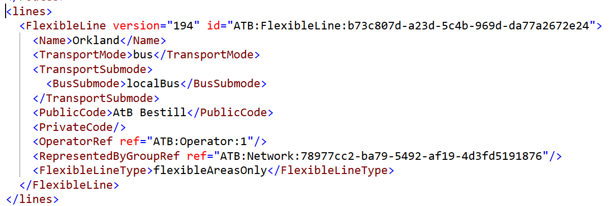

The ServicePattern describes a sequence of ScheduledStopPoints which stand for the individual FlexibleStopPlaces:

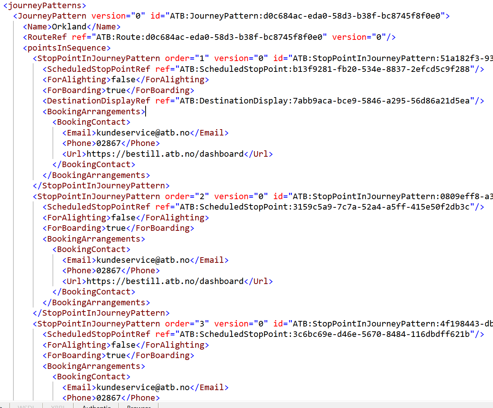

The "BookingContact" is repeated at every area served. 

ScheduledStopPoints are assigned to a FlexibleStopPlace:
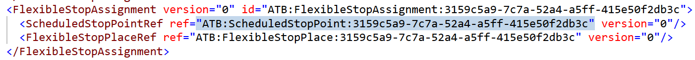

The FlexibleStop itsself contains a FlexibleArea with a poligon describing the area of operation:

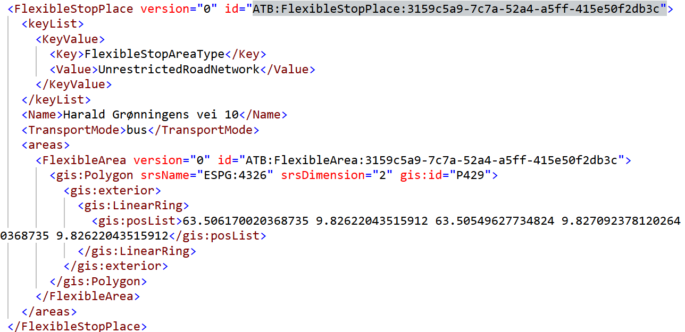

The ServiceJourney element contains PassingTimes with a time range (EarliestDeparture and LatestArrival)

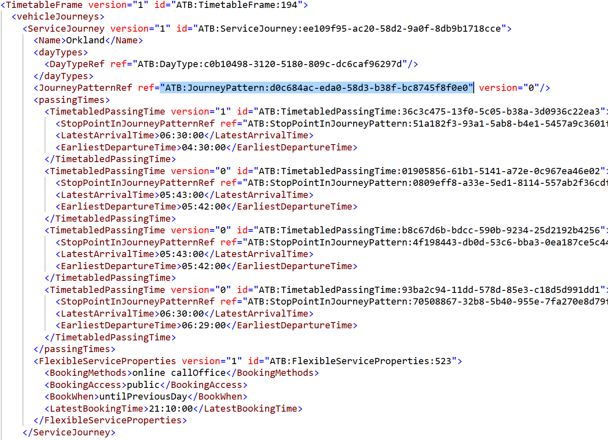

The FlexibleServiceProperties element describes booking conditions.

*TODO:* 
- FlexibleStopPlaces containing regular stops or virtual stop points? 
- Journeys without fixed departures but just a time range of operaton?

### Future Swiss Profile 2.0

---
---

## Second Part: Profile Comparison Considering Used and Unused Elements

The data exctraction for this analysis and a large part of the analysis itself have been done using AI, there may be errors here and there. 

An element is considered as actually *used* if identified and stated in the previous sections. 

### Overview: Element Usage vs. Definition

| Profile            | Defined Elements | Used in Examples | Usage Rate |
| ------------------ | ---------------- | ---------------- | ---------- |
| **France**         | 115              | 28               | 24%        |
| **Norway (Entur)** | 84               | 24               | 29%        |
| **Switzerland**    | 43               | 43               | 100%       |

**Key Insight:** Both France and Norway define a significantly larger profile than they actually use in their productive data. The core "routing and scheduling" elements are universally used, while the "facility and accessibility" elements are largely unused in practice. The Swiss profile is a focused, pragmatic subset where every defined element is actively used.

### Core Elements (Used by All Three)

The 16 core "routing and scheduling" elements used across all three profiles.

| Element                       | Category     |
| ----------------------------- | ------------ |
| **TopographicPlace**          | StopPlace    |
| **StopPlace**                 | StopPlace    |
| **Quay**                      | StopPlace    |
| **Line**                      | Line         |
| **GroupOfLines**              | Line         |
| **DestinationDisplay**        | Journey      |
| **ScheduledStopPoint**        | Journey      |
| **PassengerStopAssignment**   | Journey      |
| **ServiceJourneyPattern**     | Journey      |
| **Notice**                    | Notice       |
| **ServiceJourney**            | Timetable    |
| **TrainNumber**               | Timetable    |
| **DayType**                   | Calendar     |
| **DayTypeAssignment**         | Calendar     |
| **Operator**                  | Organization |
| **ServiceJourneyInterchange** | Interchange  |

### Profile-Specific Elements in Use

#### France (4 elements not used in Norwegian or Swiss examples)

| Element                     | Category      |
| --------------------------- | ------------- |
| **Authority**               | Organization  |
| **Direction**               | Journey       |
| **AccessEquipment**         | Accessibility |
| **AccessibilityAssessment** | Accessibility |

#### Norway (2 elements not used in France or Switzerland)

**Almost all 24 Norway-used elements are found in either the France or Swiss used lists.** Norway's productive data is highly focused on core routing and scheduling, overlapping heavily with France's and Switzerland's used elements.

**Additional elements:**
   - Norway uses **ServiceLink** for coordinate sequences 
   - Norway uses **DatedServiceJourney** for dated services 

#### Switzerland (27 elements not used in France or Norway)

| Element                       | Category     |
| ----------------------------- | ------------ |
| **PublicationDelivery**       | Publishing   |
| **CompositeFrame**            | Publishing   |
| **ResourceFrame**             | Publishing   |
| **ResponsibilitySet**         | Organization |
| **SiteFrame**                 | Publishing   |
| **Centroid**                  | Common       |
| **ServiceFrame**              | Publishing   |
| **DefaultConnection**         | Interchange  |
| **SiteConnection**            | Interchange  |
| **TimingLink**                | Routing      |
| **StopPointInJourneyPattern** | Journey      |
| **CheckConstraint**           | Validation   |
| **TimeDemandType**            | Flexible     |
| **NoticeAssignment**          | Notice       |
| **ServiceCalendarFrame**      | Publishing   |
| **AvailabilityCondition**     | Calendar     |
| **ServiceCalendar**           | Calendar     |
| **Timeband**                  | Calendar     |
| **TimetableFrame**            | Publishing   |
| **TemplateServiceJourney**    | Timetable    |
| **HeadwayJourneyGroup**       | Timetable    |
| **OccupancyView**             | Timetable    |
| **TypeOfService**             | Timetable    |
| **TypeOfNotice**              | Notice       |
| **TypeOfProductCategory**     | Product      |
| **SiteFacilitySet**           | Facility     |
| **VehicleType**               | Vehicle      |

### Some Thoughts - TODO: to be reviewed / discussed / rewritten

Provided the above presented data is correct:
- The core "routing and scheduling" elements actually used by all three profiles cover the great majority of the elements used by France and Norway.
- In contrast to the others, the Swiss profile adds another 27 elements to the 16 core elements.  Was this necessary / a good choice?
- Regarding the "routing and scheduling" aspect all profiles care about basically the same underlying data. 
- Isn't it a bit disappointing then, that they use different ways how to encode this same kind of data (times, interchanges, journey patterns, frames, ...)?
- The comparisons done in this appendix only considered the top-level elements and remained blind to any differences in how the sub-elements are used.

---

### Used vs. Unused Elements per Profile

Note that the parking and tariff parts of the French profile aren't available yet and therefore not included. 

A more detailed comparison matrix of the three profiles based on the profile definitions (including both used and unused elements) can be found here:  [ComparisonMatrix_FR_NO_CH](https://github.com/openTdataCH/netexRealisationGuideSwitzerland/blob/main/media/ComparisonMatrix_FR_NO_CH.html). In addition to the top-level elements as discussed in this appendix, the comparison matrix also shows the contained sub-elements and whether the profiles define them as mandatory or optional. 

#### Table: Elements actually used in France examples

| # | Element | Where found in France data |
|---|---------|----------------------------|
| 1 | TopographicPlace | arrets.xml |
| 2 | StopPlace | arrets.xml |
| 3 | Quay | arrets.xml |
| 4 | TariffZone | arrets.xml |
| 5 | Authority | NETEX_COMMUN |
| 6 | Operator | NETEX_COMMUN |
| 7 | Network | NETEX_COMMUN |
| 8 | Line | NETEX_COMMUN |
| 9 | Notice | NETEX_COMMUN |
| 10 | BookingContact | Flexible services |
| 11 | Route | NETEX_STRUCTURE |
| 12 | RoutePoint | NETEX_STRUCTURE |
| 13 | Direction | NETEX_STRUCTURE |
| 14 | ServiceJourneyPattern | NETEX_STRUCTURE |
| 15 | DestinationDisplay | NETEX_STRUCTURE |
| 16 | ScheduledStopPoint | NETEX_STRUCTURE |
| 17 | PassengerStopAssignment | NETEX_STRUCTURE |
| 18 | DataSource | NETEX_STRUCTURE |
| 19 | ServiceJourney | NETEX_HORAIRE |
| 20 | TrainNumber | NETEX_HORAIRE |
| 21 | DayType | NETEX_CALENDRIER |
| 22 | DayTypeAssignment | NETEX_CALENDRIER |
| 23 | FlexibleLine | Demand-responsive |
| 24 | FlexibleStopPlace | Demand-responsive |
| 25 | FlexiblePointProperties | Demand-responsive |
| 26 | FlexibleServiceProperties | Demand-responsive |
| 27 | AccessEquipment | SNCF accessibility data |
| 28 | AccessibilityAssessment | Provided for stops and quays |

#### Table: Elements defined in France profile but NOT used in examples

| # | Element | Category |
|---|---------|----------|
| 1 | Accommodation | StopPlace |
| 2 | AddressablePlace | StopPlace |
| 3 | AssistanceService | StopPlace |
| 4 | Connection | Interchange |
| 5 | ConnectionEnd | Interchange |
| 6 | CoupledJourney | Interchange |
| 7 | Crossing | Interchange |
| 8 | CustomerService | Customer |
| 9 | CycleStorageEquipment | Accessibility |
| 10 | DefaultConnection | Interchange |
| 11 | DefaultConnectionEnd | Interchange |
| 12 | DestinationDisplayVariant | Destination |
| 13 | DynamicStopAssignment | Assignment |
| 14 | Entrance | StopPlace |
| 15 | EntranceEquipment | Accessibility |
| 16 | Equipment | General |
| 17 | EquipmentPlace | StopPlace |
| 18 | EquipmentPosition | StopPlace |
| 19 | Escalator | Accessibility |
| 20 | FacilitySet | StopPlace |
| 21 | FlexibleLinkProperties | Flexible |
| 22 | FlexibleRoute | Flexible |
| 23 | GeneralSign | Signage |
| 24 | GroupOfLines | Grouping |
| 25 | GroupOfServices | Grouping |
| 26 | GroupOfStopPlaces | Grouping |
| 27 | HeadingSign | Signage |
| 28 | HeadwayJourneyGroup | Timetable |
| 29 | Interchange | Interchange |
| 30 | InterchangeTimesGroup | Interchange |
| 31 | Journey | Journey |
| 32 | JourneyFrequencyGroup | Timetable |
| 33 | JourneyPart | Journey |
| 34 | JourneyPartCouple | Journey |
| 35 | JourneyPartPosition | Journey |
| 36 | JourneyPattern | Journey |
| 37 | Lift | Accessibility |
| 38 | LostPropertyService | Customer |
| 39 | LuggageLockerEquipment | Accessibility |
| 40 | LuggageService | Customer |
| 41 | MeetingPointService | Customer |
| 42 | NavigationPath | StopPlace |
| 43 | PassengerCapacity | General |
| 44 | PassengerEquipment | Accessibility |
| 45 | PassengerSafetyEquipment | Accessibility |
| 46 | PassingTime | Timetable |
| 47 | PathJunction | StopPlace |
| 48 | PathLink | StopPlace |
| 49 | PathLinkEnd | StopPlace |
| 50 | PathLinkInSequence | StopPlace |
| 51 | PlaceLighting | StopPlace |
| 52 | PlaceSign | Signage |
| 53 | PointInJourneyPattern | Journey |
| 54 | PointInLinkSequence | Route |
| 55 | PointOfInterest | StopPlace |
| 56 | PointOnRoute | Route |
| 57 | QueuingEquipment | Accessibility |
| 58 | RampEquipment | Accessibility |
| 59 | RoughSurface | Accessibility |
| 60 | RouteLink | Route |
| 61 | RoutingConstraintZone | Routing |
| 62 | RubbishDisposalEquipment | Accessibility |
| 63 | SanitaryEquipment | Accessibility |
| 64 | SchematicMap | Signage |
| 65 | SchematicMapMember | Signage |
| 66 | SeatingEquipment | Accessibility |
| 67 | ServiceFacilitySet | StopPlace |
| 68 | ServiceJourneyInterchange | Interchange |
| 69 | ShelterEquipment | Accessibility |
| 70 | Sign | Signage |
| 71 | Site | StopPlace |
| 72 | SiteComponent | StopPlace |
| 73 | SiteConnection | Interchange |
| 74 | SiteElement | StopPlace |
| 75 | SiteElementPropertiesGroup | StopPlace |
| 76 | Staircase | StopPlace |
| 77 | StopPlaceSpace | StopPlace |
| 78 | StopPointInJourneyPattern | Journey |
| 79 | TemplateServiceJourney | Timetable |
| 80 | TicketValidatorEquipment | Ticketing |
| 81 | TicketingEquipment | Ticketing |
| 82 | TicketingService | Ticketing |
| 83 | TimingPoint | Journey |
| 84 | TimingPointInJourneyPattern | Journey |
| 85 | TopographicPlaceDescriptor | StopPlace |
| 86 | Train | Journey |
| 87 | TrainComponent | Journey |
| 88 | TrainComponentLabelAssignment | Journey |
| 89 | TrainElement | Journey |
| 90 | TrainStopAssignment | Assignment |
| 91 | TransferRestriction | Interchange |
| 92 | Travelator | Accessibility |
| 93 | TrolleyStandEquipment | Accessibility |
| 94 | TypeOfEquipment | General |
| 95 | VehicleType | General |
| 96 | WaitingEquipment | Accessibility |
| 97 | WaitingRoomEquipment | Accessibility |

**Key takeaway:** The France profile defines a rich set of accessibility, signage, ticketing, and routing elements, but the actual productive data feeds use only the core 28 elements focused on **routing, scheduling, and stop infrastructure**. Most accessibility equipment, passenger facilities, and advanced routing concepts are defined in the profile but not represented in the data.

#### Table: Elements from Norway profile that ARE used in examples

| #   | Element                      | Category    |
| --- | ---------------------------- | ----------- |
| 1   | TopographicPlace             | StopPlace   |
| 2   | StopPlace                    | StopPlace   |
| 3   | Quay                         | StopPlace   |
| 4   | TariffZone                   | Tariff      |
| 5   | Network                      | Network     |
| 6   | Line                         | Line        |
| 7   | GroupOfLines                 | Line        |
| 8   | Route                        | Routing     |
| 9   | RoutePoint                   | Routing     |
| 10  | ServiceJourneyPattern        | Journey     |
| 11  | DestinationDisplay           | Journey     |
| 12  | ScheduledStopPoint           | Journey     |
| 13  | PassengerStopAssignment      | Journey     |
| 14  | ServiceJourney               | Timetable   |
| 15  | TrainNumber                  | Timetable   |
| 16  | FlexibleLine                 | Flexible    |
| 17  | FlexibleStopPlace            | Flexible    |
| 18  | FlexibleServiceProperties    | Flexible    |
| 19  | GroupOfStopPlaces            | StopPlace   |
| 20  | Parking                      | StopPlace   |
| 21  | ServiceJourneyInterchange    | Interchange |
| 22  | BookingArrangementsStructure | Flexible    |
| 23  | ServiceLink                  | Route       |
| 24  | DatedServiceJourney          | Timetable   |

#### Table: Elements from Norway profile NOT used in examples

| #   | Element                     | Category    |
| --- | --------------------------- | ----------- |
| 1   | TopographicPlaceDescriptor  | StopPlace   |
| 2   | AddressablePlace            | StopPlace   |
| 3   | SiteElement                 | StopPlace   |
| 4   | Site                        | StopPlace   |
| 5   | Level                       | StopPlace   |
| 6   | Entrance                    | StopPlace   |
| 7   | StopPlaceSpace              | StopPlace   |
| 8   | BoardingPosition            | StopPlace   |
| 9   | AccessSpace                 | StopPlace   |
| 10  | PathLink                    | StopPlace   |
| 11  | PathJunction                | StopPlace   |
| 12  | EquipmentPlace              | StopPlace   |
| 13  | SiteFacilitySet             | StopPlace   |
| 14  | FlexibleQuay                | Flexible    |
| 15  | FlexibleArea                | Flexible    |
| 16  | HailAndRideArea             | Flexible    |
| 17  | PointOfInterest             | StopPlace   |
| 18  | ParkingArea                 | Parking     |
| 19  | ParkingProperties           | Parking     |
| 20  | ParkingCapacity             | Parking     |
| 21  | NavigationPath              | StopPlace   |
| 22  | PathLinkEndStructure        | StopPlace   |
| 23  | FareZone                    | Tariff      |
| 24  | Presentation                | Line        |
| 25  | TimingPoint                 | Journey     |
| 26  | PointOnRoute                | Route       |
| 27  | RouteLink                   | Route       |
| 28  | SiteConnection              | Interchange |
| 29  | SiteConnectionEnd           | Interchange |
| 30  | StopAssignment              | Assignment  |
| 31  | FlexibleStopAssignment      | Assignment  |
| 32  | TrainStopAssignment         | Assignment  |
| 33  | StopPointInJourneyPattern   | Journey     |
| 34  | TimingPointInJourneyPattern | Journey     |
| 35  | LinkInJourneyPattern        | Journey     |
| 36  | TimingLinkInJourneyPattern  | Journey     |
| 37  | ServiceLinkInJourneyPattern | Journey     |
| 38  | DestinationDisplayVariant   | Destination |
| 39  | Via                         | Destination |
| 40  | Transfer                    | Interchange |
| 41  | TransferDuration            | Interchange |
| 42  | Journey                     | Journey     |
| 43  | JourneyEndpointStructure    | Journey     |
| 44  | VehicleJourney              | Timetable   |
| 45  | JourneyPart                 | Timetable   |
| 46  | Frequency                   | Timetable   |
| 47  | VehicleJourneyWaitTime      | Timetable   |
| 48  | VehicleJourneyRunTime       | Timetable   |
| 49  | VehicleJourneyHeadway       | Timetable   |
| 50  | DeadRun                     | Timetable   |
| 51  | TemplateServiceJourney      | Timetable   |
| 52  | JourneyFrequencyGroup       | Timetable   |
| 53  | RhythmicalJourneyGroup      | Timetable   |
| 54  | HeadwayJourneyGroup         | Timetable   |
| 55  | CoupledJourney              | Timetable   |
| 56  | JourneyPartCouple           | Timetable   |
| 57  | ServiceCalendar             | Calendar    |
| 58  | Interchange                 | Interchange |
| 59  | UsageValidityPeriod         | General     |
| 60  | FareProduct                 | Fares       |

**Norway uses only 24 elements** in productive data, all focused on core routing, scheduling, and stop data (very similar to France's 28 used elements).

#### Table: Elements of the Swiss profile

All elements are considered as actually used.

|                                   | Element                       |
| --------------------------------- | ----------------------------- |
| **Publishing Framework**          |                               |
| 1                                 | PublicationDelivery       |
| 2                                 | CompositeFrame            |
| 3                                 | ResourceFrame             |
| 4                                 | SiteFrame                 |
| 5                                 | ServiceFrame              |
| 6                                 | ServiceCalendarFrame      |
| 7                                 | TimetableFrame            |
| **Organization & Infrastructure** |                               |
| 8                                 | ResponsibilitySet         |
| 9                                 | Operator                  |
| 10                                | TopographicPlace          |
| 11                                | StopPlace                 |
| 12                                | Quay                      |
| 13                                | Centroid                  |
| 14                                | SiteFacilitySet           |
| 15                                | VehicleType               |
| **Routing & StopPlace**           |                               |
| 16                                | Line                      |
| 17                                | GroupOfLines              |
| 18                                | DestinationDisplay        |
| 19                                | ScheduledStopPoint        |
| 20                                | PassengerStopAssignment   |
| 21                                | DefaultConnection         |
| 22                                | SiteConnection            |
| **Routing & Journey**             |                               |
| 23                                | TimingLink                |
| 24                                | TimeDemandType            |
| 25                                | ServiceJourneyPattern     |
| 26                                | StopPointInJourneyPattern |
| **Timetable & Scheduling**        |                               |
| 27                                | ServiceJourney            |
| 28                                | TemplateServiceJourney    |
| 29                                | HeadwayJourneyGroup       |
| 30                                | OccupancyView             |
| 31                                | TrainNumber               |
| 32                                | TypeOfService             |
| 33                                | ServiceJourneyInterchange |
| **Calendar & Validity**           |                               |
| 34                                | AvailabilityCondition     |
| 35                                | ServiceCalendar           |
| 36                                | DayType                   |
| 37                                | Timeband                  |
| 38                                | DayTypeAssignment         |
| **Notices & Constraints**         |                               |
| 39                                | Notice                    |
| 40                                | NoticeAssignment          |
| 41                                | TypeOfNotice              |
| 42                                | CheckConstraint           |
| 43                                | TypeOfProductCategory     |

## References
The following references were used to compile this document.

### France

Profile documentation:
https://normes.transport.data.gouv.fr/

Github:
https://github.com/etalab/transport-profil-netex-fr

Sample data:
https://transport.data.gouv.fr/datasets/reseau-urbain-et-interurbain-dile-de-france-mobilites

### Norway

Profile documentation:
https://entur.atlassian.net/wiki/spaces/PUBLIC/pages/728891481/Nordic+NeTEx+Profile

Github:
https://github.com/entur/nordic-netex-documentation 
https://github.com/entur/profile-examples
https://github.com/entur/nordic-netex-ontology

Sample data (examples):
https://entur.atlassian.net/wiki/spaces/PUBLIC/pages/728891505/NeTEx+examples+catalogue

Sample data (Productive data feed)
https://developer.entur.no/open-data/timetable
