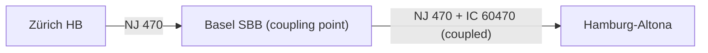

# Kurswagen (Direct carriage)

## Overview

A **Kurswagen** (direct carriage) is a vehicle group that travels as part of one train
composition and is **coupled onto a different, physically continuing train** at an
intermediate stop, or that is coupled onto an already-running train as a separate
commercial product for the remainder of the route. The rest of the feeder
composition does not necessarily continue further, and the carriages join a
composition that exists independently of them.

**Real-world example used in this use case:** the ÖBB Nightjet **NJ 470**
(Zürich HB → Hamburg-Altona) is a sleeper/couchette train. From **Basel SBB**
onward, seated carriages are coupled onto the NJ 470 composition and run together
with it all the way to Hamburg-Altona, sold as a separate product: **IC 60470**.
Passengers can book IC 60470 as an ordinary seat-only Intercity, without needing to
know it physically travels coupled to a Nightjet from Basel SBB onward.



> **Note:** This is structurally very close to a plain through-service
> ([uc01 Durchbindung](uc01_durchbindung.md)) at the `ServiceJourney` level — NeTEx
> does not track individual physical vehicles/carriages within a `ServiceJourney`.
> The two products (NJ 470 and IC 60470) are each modelled as their own complete
> `ServiceJourney`, linked at the coupling point. See
> [Relation to formations](#relation-to-formations) below for the more granular,
> not-yet-implemented alternative.

## Mapping between HRDF and NeTEx

| HRDF | NeTEx RG1 | NeTEx RG2 | Use Case |
|------|-----------|-----------|----------|
| `[durchbi]` | `JourneyMeeting` | `ServiceJourneyInterchange` with `StaySeated=true` and `ChangeWithinVehicle=false` | Kurswagen coupled onto a different train composition at an intermediate stop |

## Modelling with NeTEx RG 2.0 (`ServiceJourneyInterchange`)

Kurswagen is modelled exclusively using `ServiceJourneyInterchange`, exactly as for
[Durchbindung](uc01_durchbindung.md) and [Flügelzug](uc02_joining_splitting.md).
`JourneyPart` and `JourneyPartCouple` are **not used** for this in RG 2.0.

Both `ServiceJourney`s share the same `ServiceJourneyPattern` (simplified to three
stops: Zürich HB, Basel SBB, Hamburg-Altona). NJ 470 covers the pattern from the
first point (Zürich HB); IC 60470 covers it starting only from the second point
(Basel SBB).

```xml
<ServiceJourney id="ch:1:sjyid:100003:470" version="1" responsibilitySetRef="ch:1:ResponsibilitySet:OEBB">
  <validityConditions>
    <AvailabilityConditionRef ref="ch:1:AvailabilityCondition:NJ470_IC60470" version="1"/>
  </validityConditions>
  <privateCodes>
    <PrivateCode type="sjyid">ch:1:sjyid:100003:470</PrivateCode>
  </privateCodes>
  <TypeOfProductCategoryRef ref="ch:1:TypeOfProductCategory:NJ" version="1"/>
  <ServiceAlteration>planned</ServiceAlteration>
  <DepartureTime>21:02:00</DepartureTime>
  <JourneyPatternRef ref="ch:1:ServiceJourneyPattern:NJ470_IC60470" version="1" nameOfRefClass="ServiceJourneyPattern"/>
  <TimeDemandTypeRef ref="ch:1:TimeDemandType:NJ470" version="1"/>
  <OperatorRef ref="ch:1:sboid:100003" version="1"/>
  <LineRef ref="ch:1:slnid:NJ470" version="1"/>
  <DirectionType>outbound</DirectionType>
  <trainNumbers>
    <TrainNumberRef ref="ch:1:TrainNumber:470" version="1"/>
  </trainNumbers>
</ServiceJourney>

<ServiceJourney id="ch:1:sjyid:100001:60470" version="1" responsibilitySetRef="ch:1:ResponsibilitySet:SBB">
  <validityConditions>
    <AvailabilityConditionRef ref="ch:1:AvailabilityCondition:NJ470_IC60470" version="1"/>
  </validityConditions>
  <privateCodes>
    <PrivateCode type="sjyid">ch:1:sjyid:100001:60470</PrivateCode>
  </privateCodes>
  <TypeOfProductCategoryRef ref="ch:1:TypeOfProductCategory:IC" version="1"/>
  <ServiceAlteration>planned</ServiceAlteration>
  <DepartureTime>22:07:00</DepartureTime>
  <JourneyPatternRef ref="ch:1:ServiceJourneyPattern:NJ470_IC60470" version="1" nameOfRefClass="ServiceJourneyPattern"/>
  <TimeDemandTypeRef ref="ch:1:TimeDemandType:IC60470" version="1"/>
  <OperatorRef ref="ch:1:sboid:100001" version="1"/>
  <LineRef ref="ch:1:slnid:IC60470" version="1"/>
  <DirectionType>outbound</DirectionType>
  <trainNumbers>
    <TrainNumberRef ref="ch:1:TrainNumber:60470" version="1"/>
  </trainNumbers>
</ServiceJourney>

<ServiceJourneyInterchange id="ch:1:ServiceJourneyInterchange:470-60470-BaselSBB" version="1">
  <validityConditions>
    <AvailabilityConditionRef ref="ch:1:AvailabilityCondition:NJ470_IC60470" version="1"/>
  </validityConditions>
  <Description>Kurswagen IC 60470 wird in Basel SBB an NJ 470 gekoppelt</Description>
  <StaySeated>true</StaySeated>
  <CrossBorder>false</CrossBorder>
  <ChangeWithinVehicle>false</ChangeWithinVehicle>
  <StandardWaitTime>PT7M</StandardWaitTime>
  <StandardTransferTime>PT0M</StandardTransferTime>
  <FromPointRef ref="ch:1:SchedStopPoint:10" version="1" nameOfRefClass="ScheduledStopPoint"/>
  <ToPointRef ref="ch:1:SchedStopPoint:10" version="1" nameOfRefClass="ScheduledStopPoint"/>
  <FromServiceJourneyRef ref="ch:1:sjyid:100003:470" version="1"/>
  <ToServiceJourneyRef ref="ch:1:sjyid:100001:60470" version="1"/>
</ServiceJourneyInterchange>
```

> - `StaySeated=true`: a passenger already on board (in either NJ 470 or IC 60470)
>   does not need to leave the vehicle at Basel SBB.
> - `ChangeWithinVehicle=false`: unlike splitting (Flügelzug), where passengers may
>   need to move to the correct coach *before* the split, here the two products are
>   already in their correct, fixed carriages — no movement within the vehicle is
>   required.
> - `StandardWaitTime=PT7M`: the actual coupling time at Basel SBB — this field is
>   explicitly intended for *"joining/splitting and waiting in vehicle"* scenarios
>   like this one (per `src/templates/ServiceJourneyInterchange.xml`).
> - `StandardTransferTime=PT0M`: set to zero here since no passenger walking-transfer
>   applies in a Kurswagen scenario — the field itself is `expected` on every
>   `ServiceJourneyInterchange`.
> - Both `ServiceJourney`s carry their own `Line`, `TrainNumber`, `Operator`, and
>   `TypeOfProductCategoryRef` (`NJ` vs. `IC`) — this is deliberate: a single
>   physical composition can be sold as two entirely separate commercial products
>   for part of its route, and each product needs its own full `ServiceJourney`.
> - `sjyid` (SID4PT) is tracked via `privateCodes/PrivateCode type="sjyid"` on each
>   `ServiceJourney`.
>   `privateCodes` for all SID4PT identifiers (SJYID/SLOID/SBOID/SLNID).

The detailed handling is described for the element
[ServiceJourneyInterchange](09_timetable.md#servicejourneyinterchange).

- [Full example: NJ 470 / IC 60470 Kurswagen](./examples/19_NeTEx_CH_NJ470_IC60470_Kurswagen.xml)

## Related use cases

- [uc01 Durchbindung](uc01_durchbindung.md)
- [uc02 Joining and splitting of trains](uc02_joining_splitting.md)
