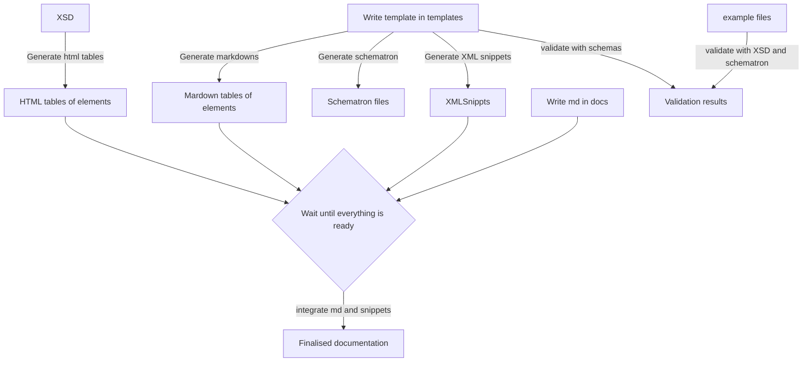

# Governance

## Issues
**TODO**

## Pull requests 
** TODO **

## The project board
**TODO**

## Toolchain ##

  

## Tools
The basics:
- [How to use and build the templates?](../templates/README.md)

Building stuff:
- [Building markdown tables for the documentation of the Swiss profile](../tools/md_builder/README.md)
- [Building XML snippets as example for individual sections in the Swiss profile](..tools/xml_snippet/README.md)
- [Building schematron files for each input/output XML file in the Swiss profile](../tools/schematron_builder/README.md)
- We will do an xcore implementation that produces a HTML of the original NeTEx XSD tables into single files to be linked into the md, too.

**TODO**
We may in future also update the way we have things done here in the docs folder: We may use it to create a series of md files, where the tables and examples are included in the md files.

Testing stuff:
- [Checking XML files with schematron](../tools/check_schematron/README.md)
- The XSD validation is to be done in a separate step.
