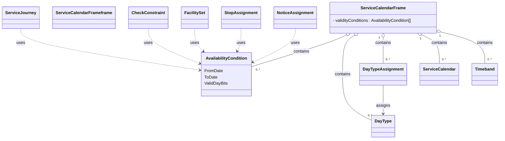

# Service Calendar Frame

In this chapter:
- [ServiceCalendarFrame](#servicecalendarframe)
- [AvailabilityCondition](#availabilitycondition)
- [ServiceCalendar](#servicecalendar)
- [DayType](#daytype)
- [Timeband](#timeband)
- [DayTypeAssignment](#daytypeassignment)

## ServiceCalendarFrame
*→ [Glossary definition](A4_annex_glossary.md#servicecalendarframe)*

### Purpose
Groups calendar definitions that describe **when** services operate. We do this with `AvailabilityCondition`s stored in this frame. We also have `DayType`s and `DayTypeAssignment`s for the holidays.

See the following class diagram for the most important objects of the `ServiceCalendarFrame` and their relationships to the other frames.


*Figure: Elements of ServiceCalendar and elements with AvailabilityCondition*

#### Table


A minimal ServiceCalendarFrame must be present in all timetable files.

*Table: ServiceCalendarFrame*

| Sub | Element | Usage | Card | Type | Description | Note |
|-----|---------|-------|------|------|-------------|------|
|  | @id | mandatory | 1..1 | xsd:string | Attribute id | |
|  | @version | mandatory | 1..1 | xsd:string | Attribute version | |
|  | validityConditions | mandatory | 1..1 | validityConditions_RelStructure | VALIDITY CONDITIONs conditioning entity. |  |
| + | [AvailabilityCondition](./tables/AvailabilityCondition.md) | mandatory | 0..* | AvailabilityCondition_VersionStructure | VALIDITY CONDITION stated in terms of DAY TYPES and PROPERTIES OF DAYs. | Our main mechanism for validity and operating days |
|  | [ServiceCalendar](./tables/ServiceCalendar.md) | expected | 0..1 | ServiceCalendar_VersionStructure | A SERVICE CALENDAR. A collection of DAY TYPE ASSIGNMENTs. | We only have one ServiceCalendar for the whole timetable year. It is not referenced. |
|  | dayTypes | optional | 0..1 | dayTypesInFrame_RelStructure | Reusable DAY TYPE in SERVICE CALENDAR FRAME. |  |
| + | [DayType](./tables/DayType.md) | optional | 1..1 | DayType_VersionStructure | A type of day characterized by one or more properties which affect public transport operation. For example: weekday in school holidays. | Used for holidays only |
|  | timebands | expected | 0..1 | timebandRefs_RelStructure | TIMEBANDs for the DAY TYPE. |  |
| + | [Timeband](./tables/Timeband.md) | expected | 1..* | Timeband_VersionedChildStructure | A period in a day, significant for some aspect of public transport, e.g. similar traffic conditions or fare category. | Mainly used for frequency-based lines. |
|  | dayTypeAssignments | optional | 0..1 | dayTypeAssignments_RelStructure | Assignments of DAY TYPEs to specific OPERATING DAYs. The same DAY TYPE may be assigned to multiple Operating dates, and vice versa. |  |
| + | [DayTypeAssignment](./tables/DayTypeAssignment.md) | optional | 1..* | DayTypeAssignment_VersionStructure | Associates a DAY TYPE with an OPERATING DAY within a specific Calendar. A specification of a particular DAY TYPE which will be valid during a TIME BAND on an OPERATING DAY. | Used for holidays only |


*→ [General NeTEx definition](../xcore/netex/elements/ServiceCalendarFrame.html)*

#### Example


```xml
<?xml version="1.0" encoding="UTF-8"?>
<ServiceCalendarFrame id="ch:1:ServiceCalendarFrame" version="1">
  <!-- A minimal ServiceCalendarFrame must be present in all timetable files. -->
  <validityConditions>
    <AvailabilityCondition id="ch:1:AvailabilityCondition:b7" version="1">
      <!-- Our main mechanism for validity and operating days -->
    </AvailabilityCondition>
  </validityConditions>
  <ServiceCalendar id="ch:1:ServiceCalendar:j23" version="1">
    <!-- We only have one ServiceCalendar for the whole timetable year. It is not referenced. -->
  </ServiceCalendar>
  <dayTypes>
    <DayType id="ch:1:DayType:ycy10_1" version="1">
      <!-- Used for holidays only -->
    </DayType>
  </dayTypes>
  <timebands>
    <Timeband id="ch:1:Timeband:1140:1260" version="1">
      <!-- Mainly used for frequency-based lines. -->
    </Timeband>
  </timebands>
  <dayTypeAssignments>
    <DayTypeAssignment id="none" version="not">
      <!-- Used for holidays only -->
      <OperatingPeriodRef ref="generated" version="1"/>
      <DayTypeRef ref="ch:1:DayType:ycy10_1" version="1"/>
    </DayTypeAssignment>
  </dayTypeAssignments>
</ServiceCalendarFrame>
```


*→ [Template](./templates/ServiceCalendarFrame.xml)*

#### Usage Notes
- Note that `AvailabilityCondition`s can be combined and ANDed (all the conditions must be fulfilled at the same time). Allowed elements to specify constraints are `FromDate`/ `ToDate`, `ValidDayBits`, and `timebands`. See the detailed explanation under [AvailabilityCondition](#availabilitycondition) below.

### AvailabilityCondition
*→ [Glossary definition](A4_annex_glossary.md#availabilitycondition)*

#### Purpose
Temporal availability in terms of `Date`s, `Timeband`s, `ValidDayBits`.

**How `AvailabilityCondition`/`ValidDayBits` work:** an `AvailabilityCondition` defines a validity period (`FromDate`/`ToDate`) together with a day-by-day pattern (`ValidDayBits`) indicating on which individual days within that period the condition applies. `ValidDayBits` is a bit string with exactly one bit per
calendar day of the period — `1` means the day is valid, `0` means it is not (directly equivalent to an HRDF bitfield). A `ServiceJourney` (or any other element that needs temporal validity) references one `AvailabilityCondition` via `AvailabilityConditionRef`; the referenced object itself is always defined centrally
in this frame, never inline.

#### Table


*Table: AvailabilityCondition*

| Sub | Element | Usage | Card | Type | Description | Note |
|-----|---------|-------|------|------|-------------|------|
|  | @id | mandatory | 1..1 | xsd:string | Attribute id | |
|  | @version | mandatory | 1..1 | xsd:string | Attribute version | |
|  | FromDate | optional | 0..1 | xsd:dateTime | Start date of AVAILABILITY CONDITION. | Is equal to the start date of the timetable year or, more generally, the period in which the ValidDayBits apply. |
|  | ToDate | optional | 0..1 | xsd:dateTime | End of AVAILABILITY CONDITION. Date is INCLUSIVE. | Is equal to the end date of the timetable year or, more generally, the period in which the ValidDayBits apply. |
|  | ValidDayBits | mandatory | 0..1 | xsd:normalizedString | String of bits, one for each day in period: whether valid or not valid on the day. Normally there will be a bit for every day between start and end date. If bit is missing, assume available. |  |
|  | timebands | optional | 0..1 | timebandRefs_RelStructure | TIMEBANDs for the DAY TYPE. | Can also be referenced |
| + | [Timeband](./tables/Timeband.md) | optional | 1..* | Timeband_VersionedChildStructure | A period in a day, significant for some aspect of public transport, e.g. similar traffic conditions or fare category. |  |
| + | TimebandRef | optional | 1..* | TimebandRefStructure | Reference to a TIME BAND. |  |


*→ [General NeTEx definition](../xcore/netex/elements/AvailabilityCondition.html)*

#### Example


```xml
<?xml version="1.0" encoding="UTF-8"?>
<AvailabilityCondition id="generated" version="1">
  <FromDate>2026-05-17T00:00:00Z
    <!-- Is equal to the start date of the timetable year or, more generally, the period in which the ValidDayBits apply. -->
  </FromDate>
  <ToDate>2026-05-17T00:00:00Z
    <!-- Is equal to the end date of the timetable year or, more generally, the period in which the ValidDayBits apply. -->
  </ToDate>
  <ValidDayBits>01010010111</ValidDayBits>
  <timebands>
    <!-- Can also be referenced -->
    <Timeband id="ch:1:Timeband:4937" version="1">
      <StartTime>06:00:00</StartTime>
      <EndTime>06:01:00</EndTime>
    </Timeband>
    <TimebandRef ref="ch:1:Timeband:4937-2" version="1"/>
  </timebands>
</AvailabilityCondition>
```


*→ [Template](./templates/AvailabilityCondition.xml)*

#### Usage Notes
- Examples of use of `AvailabilityCondition` include  `ServiceJourney`, `TemplateServiceJourney`, facilities.
- AvailabilityCondition replaces OperatingDay and OperatingPeriod. Whenever a reference to a VP (“Verkehrsperiode” or "operating period" in english) is needed, we use an `AvailabilityConditionRef`:
-	The referenced `AvailabilityCondition`s are centrally stored in the `ServiceCalendarFrame`.
- The element `ValidDayBits` directly indicates the days on which some service is provided or not. They are similar to the HRDF bitfields. 
- `ValidDayBits` is expected whenever the `AvailabilityCondition` expresses a recurring day-by-day pattern, which is the case for most `AvailabilityCondition`s in practice. Examples include:
  -	`ServiceJourney`
  -	`NoticeAssignment`
  -	`ServiceFacilitySet`
  -	`ServiceJourneyInterchange`
- `AvailabilityCondition`s can be combined and ANDed (all the conditions must be fulfilled at the same time). Allowed elements to specify constraints are `FromDate`/`ToDate`, `ValidDayBits`, and `timebands` — **none of these is mandatory on its own**; an `AvailabilityCondition` may consist of only one
  of them (e.g. only `FromDate`/`ToDate` for "summer only", only `timebands` for "school holiday period", or only `ValidDayBits` for "Sundays only").
  **Concrete use case we already have:** every `AvailabilityCondition` in our examples combines `FromDate`/`ToDate` (the overall timetable period, e.g. one `Fahrplanjahr`) **with** `ValidDayBits` (the day-by-day pattern within that period) — this is the everyday case of the ANDing mechanism, directly equivalent to an HRDF "Verkehrsperiode + Bitfeld" combination. We do **not** currently have a use case that additionally combines `timebands` with the other two — see the note under [Timeband](#timeband) below.
- Note: the frames `TimetableFrame`, `ServiceFrame` and `ServiceCalendarFrame` and their elements must have the same validity.
- `@id` does not need to be kept stable between exports.

### ServiceCalendar
*→ [Glossary definition](A4_annex_glossary.md#servicecalendar)*

#### Purpose
Long-term planning uses calendar days that are classified as specific `DayType`s (example: weekday in school holidays). In the general NeTEx model, a `ServiceCalendar` defines a mapping between `DayType`s and OperatingDays; in the Swiss profile, this mapping via OperatingDays is not used — `ServiceCalendar` serves only as a container for `DayType`s and `DayTypeAssignment`s, defining a mapping of `DayType`s to dates. 

#### Table


*Table: ServiceCalendar*

| Sub | Element | Usage | Card | Type | Description | Note |
|-----|---------|-------|------|------|-------------|------|
|  | @id | mandatory | 1..1 | xsd:string | Attribute id | |
|  | @version | mandatory | 1..1 | xsd:string | Attribute version | |
|  | Name | expected | 0..1 | MultilingualString | Name of VALIDITY CONDITION. | timetable year |
|  | FromDate | mandatory | 0..1 | xsd:dateTime | Start date of AVAILABILITY CONDITION. | Beginning of timetable year |
|  | ToDate | mandatory | 0..1 | xsd:dateTime | End of AVAILABILITY CONDITION. Date is INCLUSIVE. | End of timetable year |


*→ [General NeTEx definition](../xcore/netex/elements/ServiceCalendar.html)*

#### Example


```xml
<?xml version="1.0" encoding="UTF-8"?>
<ServiceCalendar id="ch:1:ServiceCalendar:j23" version="1">
  <Name>Fahrplan 2018
    <!-- timetable year -->
  </Name>
  <FromDate>2017-12-10
    <!-- Beginning of timetable year -->
  </FromDate>
  <ToDate>2018-12-08
    <!-- End of timetable year -->
  </ToDate>
</ServiceCalendar>
```


*→ [Template](./templates/ServiceCalendar.xml)*

#### Usage Note
- `@id` should to be kept stable between exports.


### DayType
*→ [Glossary definition](A4_annex_glossary.md#daytype)*

#### Purpose
A classification of days on which a specific set of transport services operates (e.g., Weekdays, Saturdays, Public Holidays). The `DayType`s of the Swiss profile represent national holidays.

#### Table


In Switzerland only used for holidays and the like

*Table: DayType*

| Sub | Element | Usage | Card | Type | Description | Note |
|-----|---------|-------|------|------|-------------|------|
|  | @id | mandatory | 1..1 | xsd:string | Attribute id | |
|  | @version | mandatory | 1..1 | xsd:string | Attribute version | |
| + | AlternativeText | mandatory | 1..* | AlternativeText_VersionedChildStructure | ALTERNATIVE TEXT for a text attribute of Element. |  |
| ++ | Text | mandatory | 0..1 | MultilingualString | Name of the entity. |  |
| +++ | @lang | mandatory | 1..1 | xsd:string | Attribute lang | |
|  | Name | mandatory | 0..1 | MultilingualString | Name of VALIDITY CONDITION. | German or default text |
| + | @lang | mandatory | 1..1 | xsd:string | Attribute lang | |
| + | Text | expected | 0..* | MultilingualString |  | Italian |
| ++ | @lang | mandatory | 1..1 | xsd:string | Attribute lang | |
| + | Text | expected | 0..* | MultilingualString |  | French |
| ++ | @lang | mandatory | 1..1 | xsd:string | Attribute lang | |
| + | Text | expected | 0..* | MultilingualString |  | English |
| ++ | @lang | mandatory | 1..1 | xsd:string | Attribute lang | |
|  | properties | expected | 0..1 | propertiesOfDay_RelStructure | Properties of the DAY TYPE. |  |
| + | PropertyOfDay | mandatory | 1..* | PropertyOfDayStructure | A property which a day may possess, such as school holiday, weekday, summer, winter etc. | Holidays only |
| ++ | HolidayTypes | expected | 0..1 | HolidayTypesListOfEnumerations | Type of holiday. Default is Any day. |  |
| ++ | DayEvent | optional | 0..1 | DayEventEnumeration | Events happening on day. |  |


*→ [General NeTEx definition](../xcore/netex/elements/DayType.html)*

#### Example


```xml
<?xml version="1.0" encoding="UTF-8"?>
<DayType id="ch:1:DayType:Bundesfeier" version="1">
  <!-- In Switzerland only used for holidays and the like -->
  <Name lang="de">Bundesfeier
    <!-- German or default text -->
    <Text lang="it">Festa nazionale
      <!-- Italian -->
    </Text>
    <Text lang="fr">Fête nationale
      <!-- French -->
    </Text>
    <Text lang="en">National Day
      <!-- English -->
    </Text>
  </Name>
  <properties>
    <PropertyOfDay>
      <!-- Holidays only -->
      <HolidayTypes>NationalHoliday</HolidayTypes>
      <DayEvent>normalDay</DayEvent>
    </PropertyOfDay>
  </properties>
</DayType>
```


*→ [Template](./templates/DayType.xml)*

#### Usage Note
- `@id` needs to be kept stable between exports.

### Timeband
*→ [Glossary definition](A4_annex_glossary.md#timeband)*

#### Purpose
A period of time within a day, usually defined by a start and end time (e.g. `06:00:00`–`09:00:00` for a morning peak window). Within an `AvailabilityCondition`, a `timebands` constraint restricts validity to journeys whose departure falls inside that daily time window, in addition to whichever `FromDate`/`ToDate`/`ValidDayBits` constraints are also present (all are ANDed, see [ServiceCalendarFrame](#servicecalendarframe) above).

**Example use case (illustrative, not yet implemented in the Swiss profile):** a `Timeband` `07:00:00`–`09:00:00` combined with `ValidDayBits` for weekdays could restrict a fare rule or a `NoticeAssignment` (e.g. "peak-hour surcharge applies") to weekday morning-peak journeys only, without needing a separate `AvailabilityCondition` per journey.

#### Table


*Table: Timeband*

| Sub | Element | Usage | Card | Type | Description | Note |
|-----|---------|-------|------|------|-------------|------|
|  | @id | mandatory | 1..1 | xsd:string | Attribute id | |
|  | @version | mandatory | 1..1 | xsd:string | Attribute version | |
|  | StartTime | mandatory | 0..1 | xsd:time | The (inclusive) start date and time. | Local time (not Zulu), i.e., without “Z” or “hh:mm:ss” suffix. Seconds are not used. |
|  | EndTime | mandatory | 0..1 | xsd:time | The (inclusive) end date and time. | Local time (not Zulu), i.e., without “Z” or “hh:mm:ss” suffix. Seconds are not used. |


*→ [General NeTEx definition](../xcore/netex/elements/Timeband.html)*

#### Example


```xml
<?xml version="1.0" encoding="UTF-8"?>
<Timeband id="ch:1:Timeband:4937" version="1">
  <StartTime>06:00:00
    <!-- Local time (not Zulu), i.e., without “Z” or “hh:mm:ss” suffix. Seconds are not used. -->
  </StartTime>
  <EndTime>06:01:00
    <!-- Local time (not Zulu), i.e., without “Z” or “hh:mm:ss” suffix. Seconds are not used. -->
  </EndTime>
</Timeband>
```


*→ [Template](./templates/Timeband.xml)*


#### Usage Notes
- `Timeband` was used in RG 1.0 for `InterchangeRuleTiming`s (not applicable in RG 2.0, since `InterchangeRule` is not used — see [uc03 Transfers](uc03_transfers.md)). It is planned for future use for opening hours in `StopPlace` models, but currently **has no active use case in the Swiss RG 2.0 profile** — we have not yet identified data that requires it.
- `@id` should be kept stable between exports.


### DayTypeAssignment
*→ [Glossary definition](A4_annex_glossary.md#daytypeassignment)*


#### Purpose
Assignment of a date to `DayType`. The `DayType`s of the Swiss profile represent national holidays.


#### Table


We currently use DayType to store the national holidays.

*Table: DayTypeAssignment*

| Sub | Element | Usage | Card | Type | Description | Note |
|-----|---------|-------|------|------|-------------|------|
|  | @id | mandatory | 1..1 | xsd:string | Attribute id | |
|  | @version | mandatory | 1..1 | xsd:string | Attribute version | |
|  | Date | mandatory | 0..1 | xsd:date | Calendar date of assignment. |  |
|  | DayTypeRef | mandatory | 1..* | DayTypeRefStructure | Reference to a DAY TYPE. |  |


*→ [General NeTEx definition](../xcore/netex/elements/DayTypeAssignment.html)*

#### Example


```xml
<?xml version="1.0" encoding="UTF-8"?>
<DayTypeAssignment id="BundesfeierAssignment" version="1">
  <!-- We currently use DayType to store the national holidays. -->
  <Date>2023-08-01</Date>
  <DayTypeRef ref="ch:1:DayType:Bundesfeier" version="1"/>
</DayTypeAssignment>
```


*→ [Template](./templates/DayTypeAssignment.xml)*


#### Usage Notes
- We currently use `DayTypeAssignment` only for the national holidays.
- `@id` should be kept stable between exports.


