# Basic concepts in NeTEx

NeTEx can support multiple use cases. Here we talk about the Swiss timetable delivery.

The following diagram shows the relevant core classes we will use. In the center is the ServiceJourney.

```mermaid
flowchart TD
    %% Resources at the very top
    subgraph Resources["Resources"]
        direction LR
        AN[AlternativeName]
        O[Operator]
    end

    %% Main content area
    subgraph MainContent["Main Content"]
        %% Timetable & Calendar
        subgraph TimetableCalendar["Timetable & Calendar"]
            direction LR
            subgraph TimetableFrame["TimetableFrame"]
                SJ[ServiceJourney]
                DT[DirectionType]
                TN[TrainNumber]
                SI[ServiceJourneyInterchange]
                JP[JourneyPart]
            end
            subgraph ServiceCalendarFrame["ServiceCalendarFrame"]
                AC[AvailabilityCondition]
                UOP[ValidDayBits]
            end
        end

        %% Service & Network
        subgraph ServiceNetwork["Service & Network"]
            direction LR
            subgraph ServiceFrame["ServiceFrame"]
                SJP[ServiceJourneyPattern]
                TDT[TimeDemandType]
                L[Line]
                SPtJP[StopPointInJourneyPattern]
                TL[TimingLink]
                SSP[ScheduledStopPoint]
                N[Notice]
                F[ServiceFacilities]
                PSA[PassengerStopAssignment]
            end
            subgraph SiteFrame["SiteFrame"]
                SP[StopPlace]
                CN[DefaultConnection]
                Q[Quay]
            end
        end
    end

    %% Relationships
    SJ --> DT
    SJ --> L
    SJ --> O
    SJ --> SJP
    SJ --> TDT
    SJ --> SI
    SJ --> JP
    SJ --> TN
    SJ --> AC
    AC --> UOP
    SJP --> L
    SJP --> DT
    SJP --> SPtJP
    SPtJP --> SSP
    TDT --> TL
    TDT --> SSP
    TDT --> SPtJP
    PSA --> SP
    PSA --> Q
    PSA --> SSP
    SP --> Q
    O --> AN

    %% Styling
    style SJ fill:#e6f9e6,stroke:#2ea44f,stroke-width:2px
    style SJP fill:#e6f9e6,stroke:#2ea44f,stroke-width:2px
    style TDT fill:#e6f9e6,stroke:#2ea44f,stroke-width:2px
    style PSA fill:#e6f9e6,stroke:#2ea44f,stroke-width:2px
    style TimetableFrame stroke:#999,stroke-width:1px,fill:none
    style ServiceCalendarFrame stroke:#999,stroke-width:1px,fill:none
    style ServiceFrame stroke:#999,stroke-width:1px,fill:none
    style SiteFrame stroke:#999,stroke-width:1px,fill:none
    style MainContent fill:none,stroke:none
```


*Core elements for timetables in NeTEx*

Notes:
* Every `ServiceJourney` belongs to one `Line` and has one `Operator`. Some more information can be stored in associated `ResponsibilitySet`s (difference between operator and legal "owner"). 
* The pattern of the stops is defined in a `ServiceJourneyPattern` with additional details about each stop.
* The timing behaviour is stored in `TimeDemandType`. They contain run times and where needed wait times. The `TimingLink`s are mostly based on `ScheduledStopPoint`s and may be used by multiple `ServiceJourneyPattern`.
* The physical stops are modeled as `StopPlace`s with `Quays`.
* `ScheduledStopPoint`s are the "logical" stops.
* The `PassengerStopAssignment` associates the physical and the logical stops.
* `DefaultConnection` and `SiteConnection` define transfers based on site elements.
* `ServiceJourneyInterchange`s are used for splitting, joining and connecting trains and for "Durchbindungen".
* `Notice`, `ServiceFacility` and `SiteFacility` model almost everything else (especially offers).
* The operating days are defined through `ValidDayBits` for the whole timetable year in `AvailabilityCondition`s.

## 

```
StopPlace SP
  * Quay Q1
  * Quay Q2
  
ScheduledStopPoint SPS

PassengerStopAssignment PSA
  -> ScheduledStopPoint SPS
  -> Quay Q1
  -> StopPlace SP 

TimingLink TL
  -> ScheduledStopPoint X
  -> ScheduledStopPoint y
  * some properties
  
 ServiceJourneyPattern SJP
   * StopPointInJourneyPattern
        -> ScheduledStopPoint X
        * multiple properties
   * lots of properties
        
  TimeDemandType TDT
    runTimes
      ServiceJourneyRunTime
        -> TimingLink TL
        * Duration
    waitTimes
       ServiceJourneyWaitTime
         -> ScheduledStopPoint A
         * Duration
         
  ServiceJourney
    -> ServiceJourneyPattern SJP
    -> TimeDemandType TDT
    * lots of properties
        
   
  
```
