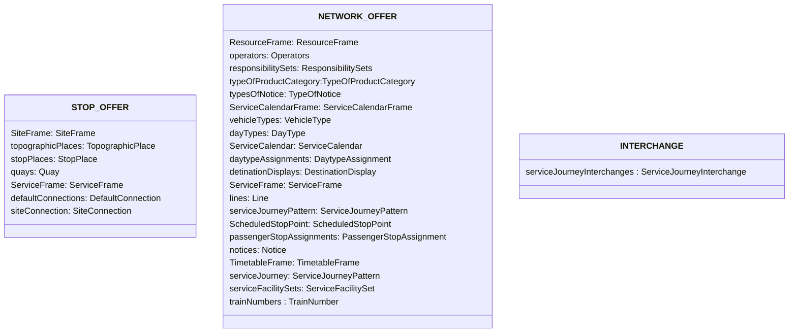

# File Exchange

NeTEx data will be transferred as files. 

## Guiding Principles
We want the following general principles to apply:

### Completeness

A delivery must always be complete: 
-	in the time dimension : for the whole timetable year (from December to December), but only one timetable.
-	in the scope of the information exchanged : for all operators and all their lines or sublines — the file must always contain everything.
This allows the receiver to overwrite the old delivery with the new one without loss of data

### Base Data
Some reference data are maintained by SKI. These data are identified by business values (Abbreviation, Number, ID, …).
These Business identifiers shall be used by the deliveries to enable their integration and homogenisation for the collection of timetable information. 
If attributes of these reference data are transmitted in the deliveries, SKI does not adopt the values of these attributes. SKI takes these values from the reference system.

The relevant reference data that is already available/defined by SKI:
- Organisations - in Atlas
- StopPlaces, Quays and the whole physical model - in Atlas
- Lines (in a future phase) - in Atlas
- Direction - only inbound and outbound are allowed
- Notices – some specialised IDs and/or types, according to the [mapping excel](media/Mappingtabellen_NeTEx_v2.0.xlsx).
- TypeOfValues - according to the lists defined here (namely in [the XML modeling](03_xml_modelling.md)). E.g. ProductCategory - in the [mappingexcel](media/Mappingtabellen_NeTEx_v2.0.xlsx).
- ValueSets - in [XML modeling](03_xml_modelling.md)
- Facilities - in [mapping excel](media/Mappingtabellen_NeTEx_v2.0.xlsx).

### Roles and Duties
#### Owner ("Konzessionär")
The designed owner according to Atlas is responsible for the overall delivery of the data.

#### Operator
An owner can operate everything himself or he can delegate this (per partial line). 

>NB: We still have to finalise whether the owner has to produce a single file for the whole line or if delivery of partial lines is  allowed and how. This is an organisational matter.
 

#### Responsibilities Data Provider
The data provider is responsible for the timely delivery of the complete timetable information with sufficient quality on the technical level. Complete means all timetable data in the responsibility of the provider for the whole timetable period.

> NB: In many cases the data provider may be identical to the Owner.

#### Responsibilties SKI
SKI is responsible for the timely delivery of the complete timetable information with sufficient quality of all timetable data for open data and for the consumption by the data consumers.

### Completeness of the delivery

We still work on this, and it is not a matter of NeTEx but of the basic process of the data provision to SKI. 

We will start with the following:
* All service journeys for a given timetable year with all facilities and notices, including service journeys driven by operators in the name of the owner for all lines the owner is responsible for
* With co-owners one owner is designed to deliver the data.
* We suggest that Atlas contains the information, which business organisation  provides the data for which line (on the technical level)
* Nobody should deliver lines that belong to a different business owner.

>NB: We discuss in the [use case on mixed lines](uc17_mixed_lines.md), what is possible. However, the rules of SKI are the ones to follow

>NB: Also replacement traffic will be defined in the general guidelines and not here. SKI will define, who has to provide what.

### Shared Responsibilities for Planning
While [use case on mixed lines](uc17_mixed_lines.md) shows, what is possible in the first iteration we assume that one data provider will furnish the whole line with all its partial lines. Different policies don't depend on NeTEx, but on the processing stream of INFO+.

Also, if problems occur in the end it is always the owner that is responsible to addressing them.

## Files

### File Types

We will have three different file types:
* STOP_OFFER: stops, quays, transfer times and accessibility related to sites at some point
* NETWORK_OFFER: lines, routes, timetables
* INTERCHANGE: interchanges, "Durchbindungen"

The first two are valid according to the XSD. INTERCHANGE only as far as we use `versionRef` instead of `version`.

NETWORK_OFFER is the core timetable data. It can be one file per business organisation (owner and or data provider). Or it can be two very different subsets within an organisation (e.g.  ships, carTransportRail,rail) or perhaps also per region (PAG). The distinction should not be done unilateraly by the data provider, but in collaboration with SKI. Possible criteria: (a) size of  the file remains manageable, (b) third parties can find out, in which file, which line is, without inspecting every NETWORK_OFFER, (c) sensible arrangement so that not all NETWORK_OFFER need to be consumed, if only a given subset is needed by the data consumer.

This repartition of the data into different file leads to some redundancy. However, the files can still be transferred efficiently.

### Content of each File Type

*Figure: Elements per file type in this profile*

STOP_OFFER:
* Contains everything related to (physical) stops
* Accessibility will be added in the future

NETWORK_OFFER:
* By operator (legal) and sometimes region (e.g. canton)
* Contains the `ResourceFrame`, `CalendarFrame`, `ServiceFrame`, `TimetableFrame`
* Is self-sufficient from ref/id side
* Eventually a reduced `StopPlace`, `Quay` could be added, but for the time being we won't do this.

INTERCHANGE
* Contains interchanges, spliting, joining and "Durchbindungen".
* ref/id can't be checked by the schema. Therefore we use the attribute `versionRef` instead of `version`. 

Swiss operators deliver NETWORK_OFFER and INTERCHANGE to INFO+.  STOP_OFFER is only needed for data not stored in ATLAS. INFO+ will deliver an aggregated, comprehensive STOP_OFFER.

### Naming Conventions of Files
IT-Environments:
- Development:	DEV
- Test:	TEST
- Integration:	INT
- Production:	PROD

The name of each XML file is composed of the following information:

| Content             | Example                                       | Description                                                                                            |
|---------------------|-----------------------------------------------|--------------------------------------------------------------------------------------------------------|
| IT-Environment      | `TEST`                                        |     DEV,TEST,INT,PROD                                                                                                      |
| Format of the file  | 	`NETEX`                                      | 	NETEX                                                                          |
| Content of the file | 	`TT`                                         | 	Timetable                                                                                             |
| Version             | 	 `2.1`                                       | 	Number of the version of the NeTEx .xsd schema                                                        |
| Country	            | `CHE`                                         | ISO code of the country for which the file was produced                                                |
| Provider	           | `SKI`	                                        | Name of the provider                                                                                   |
| Time table year	    | `2026`                                        | 	period of the data (always a year for now)                                                             |
| Name of Export	     | `oev-schweiz`	                                | Defines the scope of the timetable data (e.g. `bernmobil` or for the whole of Switzerland `oev-schweiz` |
| Type of file        | 	`STOP_OFFER`, `NETWORK_OFFER`, `INTERCHANGE` | 	Describes the content                                                                                 |
| Date and Time       | `202606101200`                                | 		Date and time the file was produced, format: YYYYMMDDHHMM                                        |

Example: `TEST_NETEX_TT_2.0_CHE_SKI_2026_OEV-SCHWEIZ_STOP_OFFER_202301250401.xml`

All Files are embedded in a zip-File. The name of the zip-file is composed of the following information:

| Content	             | Example	      | Description                                                                                                                                                                                 |
|----------------------|---------------|---------------------------------------------------------------------------------------------------------------------------------------------------------------------------------------------|
| IT-Environment	      | DEV,TEST,INT	 | In the production environment, the prefix PROD is not written in the name                                                                                                                   |
| Format  of the file	 | `NETEX`	      | Describe the format (NETEX)                                                                                                                                                                 |
| Content of the file	 | `TT`	         | Describe the content (TimeTable)                                                                                                                                                            |
| Version              | `2.1`         | 		Number of the version of the NeTEx .xsd schema                                                                                                                                              | 
| Country	             | `CHE`	        | ISO code of the country for which the file was produced                                                                                                                                     | 
| Provider	            | `SKI`	        | Name of the provider                                                                                                                                                                        | 
| Time period	         | `2026`        | 	Time period of the data                                                                                                                                                                     | 
| Name of Export	      | `oev-schweiz`	 | Defines the scope of the timetable data (e.g. `bernmobil` or for the whole of Switzerland `oev-schweiz`). Underscores (_) must not used here, as we use them as separator in the file name. | 
| Date and Time	       | `202606131500` | 	Date and time the file was produced, format: YYYYMMDDHHMM                                                                                                                                   | 

Example :`TEST_NETEX_TT_2.0_CHE_SKI_2026_OEV-SCHWEIZ_202602010402.zip`

### Zip Structure
All files in a delivery are zipped into a single one according to the name structure above.

### Encoding
All data is encoded as UTF-8 without BOM.

### Data Transfer
The data transfer will be defined by INFO+. A version of the full swiss data will be available on https://opentransportdata.swiss/ for download.

### Provisions for Deliveries Sent by Data Provider to SKI 
We suggest that the partner name consists of the short name of the partner and necessary additions to identify the system. In addition, the number of the timetable period is to be indicated in the name, as well as the date and time of creation of the file

Examples: `test_zvv_2024_20231112_095217.zip`, `prod_tl_2024_20231114_152836.zip`

The file name must be agreed on between the data provider and SKI. Generally it is agreed that delivery can be on network, operator or line base.

#### Partial Deliveries
No partial deliveries are accepted. They must contain:
- all relevant lines
- the whole timetable year

No incremental updates are supported.

> NB: We might reconsider some of those points for mixed lines. 

### Data Delivery from SKI to Data Consumers
As the quantity of the data is very large for a single XML-file, SKI provides the data a set of XML files (one SITE_OFFER.xml, multiple NETWORK_OFFER.xml and one INTERCHANGES.xml). In addition to the XML files, SKI provides a README file listing the contents of each XML file. 
