# XML Modelling

In this chapter:

[A first Glimpse at NeTEx Modelling](#a-first-glimpse)

[Rules to Observe](#rules-to-observe)
- [Attributes](#attributes)
  - [IDs](#ids)
  - [Version](#version)
- [FromDate and ToDate](#fromdate-and-todate)
- [Time formatting and journey after midnight](#time-formatting-and-journey-after-midnight)

[Common Elements and Types](#common-elements-and-types)
- [AlternativeName](#alternativename)
- [AlternativeText](#alternativetext)
- [MultilingualString](#multilingualstring)
- [FrameDefaults](#framedefaults)


## A First Glimpse

To support the Swiss timetable delivery, NeTEx uses various XML classes. The following diagram gives an overview. In the center is the `ServiceJourney`.

```mermaid
flowchart TD
    AN[AlternativeName]
    O[Operator]
    SJ[ServiceJourney]
    DT[DirectionType]
    TN[TrainNumber]
    SI[ServiceJourneyInterchange]
    JP[JourneyPart]
    AC[AvailabilityCondition]
    UOP[ValidDayBits]
    SJP[ServiceJourneyPattern]
    TDT[TimeDemandType]
    L[Line]
    SPtJP[StopPointInJourneyPattern]
    TL[TimingLink]
    SSP[ScheduledStopPoint]
    N[Notice]
    F[ServiceFacilities]
    PSA[PassengerStopAssignment]
    SP[StopPlace]
    CN[DefaultConnection]
    Q[Quay]
    
    %% Relationships
    SJ --> DT
    SJ --> L
    SJ --> O
    SJ --> SJP
    SJ --> TDT
    SJ --> SI
    SJ --> JP
    SJ --> TN
    SJ --> AC
    AC --> UOP
    SJP --> L
    SJP --> DT
    SJP --> SPtJP
    SPtJP --> SSP
    TDT --> TL
    TDT --> SSP
    TDT --> SPtJP
    PSA --> SP
    PSA --> Q
    PSA --> SSP
    SP --> Q
    O --> AN

    %% Styling ResourceFrame
    style O fill:#ffffff,stroke:#eea44f,stroke-width:2px
    style F fill:#ffffff,stroke:#eea44f,stroke-width:2px
  
    %% Styling ServiceCalendarFrame
    style AC fill:#ff8888,stroke:#eea44f,stroke-width:2px
    style UOP fill:#ff8888,stroke:#eea44f,stroke-width:2px


    %% everyhwere
      style AN fill:#88ff88,stroke:#eea44f,stroke-width:2px
      style DT fill:#88ff88,stroke:#eea44f,stroke-width:2px
   
    %% Styling SiteFrame
    style SP fill:#a6c9a6,stroke:#eea44f,stroke-width:2px
    style Q fill:#a6c9a6,stroke:#2ea44f,stroke-width:2px

    %% Styling TimetableFrame
    style SJ fill:#d6b9e6,stroke:#2ea44f,stroke-width:2px
    style TN fill:#d6b9e6,stroke:#2ea44f,stroke-width:2px

    
    %% Styling ServiceFrame
    style TDT fill:#e6f9e6,stroke:#2ea44f,stroke-width:2px
    style SJP fill:#e6f9e6,stroke:#2ea44f,stroke-width:2px
    style PSA fill:#e6f9e6,stroke:#2ea44f,stroke-width:2px
    style L fill:#e6f9e6,stroke:#2ea44f,stroke-width:2px
    style TL fill:#e6f9e6,stroke:#2ea44f,stroke-width:2px
    style SPtJP fill:#e6f9e6,stroke:#2ea44f,stroke-width:2px
    style JP fill:#e6f9e6,stroke:#2ea44f,stroke-width:2px
    style SI fill:#e6f9e6,stroke:#2ea44f,stroke-width:2px
    style SI fill:#e6f9e6,stroke:#2ea44f,stroke-width:2px
    style N fill:#e6f9e6,stroke:#2ea44f,stroke-width:2px
    style CN fill:#e6f9e6,stroke:#2ea44f,stroke-width:2px
    style SSP fill:#e6f9e6,stroke:#2ea44f,stroke-width:2px

```


*Core elements for timetables in NeTEx*

Notes:
* Every `ServiceJourney` belongs to one `Line` and has one `Operator`. Some more information can be stored in associated `ResponsibilitySet`s (difference between operator and legal "owner"). 
* The pattern of the stops is defined in a `ServiceJourneyPattern` with additional details about each stop.
* The timing behaviour is stored in `TimeDemandType`. They contain run times and where needed waiting times. The `TimingLink`s are mostly based on `ScheduledStopPoint`s and may be used by multiple `ServiceJourneyPattern`.
* The physical stops are modeled as `StopPlace`s with `Quays`.
* `ScheduledStopPoint`s are the "logical" stops.
* The `PassengerStopAssignment` associates the physical and the logical stops.
* `DefaultConnection` and `SiteConnection` define transfers based on site elements.
* `ServiceJourneyInterchange`s are used for splitting, joining and connecting trains and for "Durchbindungen".
* `Notice`, `ServiceFacility` and `SiteFacility` model almost everything else (especially offers).
* The operating days are defined through `ValidDayBits` for the whole timetable year in `AvailabilityCondition`s.

## 

```
StopPlace SP
  * Quay Q1
  * Quay Q2
  
ScheduledStopPoint SPS

PassengerStopAssignment PSA
  -> ScheduledStopPoint SPS
  -> Quay Q1
  -> StopPlace SP 

TimingLink TL
  -> ScheduledStopPoint X
  -> ScheduledStopPoint y
  * some properties
  
 ServiceJourneyPattern SJP
   * StopPointInJourneyPattern
        -> ScheduledStopPoint X
        * multiple properties
   * lots of properties
        
  TimeDemandType TDT
    runTimes
      ServiceJourneyRunTime
        -> TimingLink TL
        * Duration
    waitTimes
       ServiceJourneyWaitTime
         -> ScheduledStopPoint A
         * Duration
         
  ServiceJourney
    -> ServiceJourneyPattern SJP
    -> TimeDemandType TDT
    * lots of properties
        
   
  
```


## Rules to Observe

###  Attributes

The following rules apply to common attributes:

| Attribute              | Rule                                                                                                                                                                   |
|------------------------|------------------------------------------------------------------------------------------------------------------------------------------------------------------------|
| `id`                   | See description regarding [technical IDs](#ids) below                                                                                                                  |
| `version`              | is always set to `"1"`                                                                                                                                                 |
| `responsibilitySetRef` | We use `responsibilitySetRef` on `ServiceJourney` and `TemplateServiceJourney`.                                                                                        |
| `nameOfRefClass`       | We use `nameOfRefClass` explicitly where a reference target is ambiguous, e.g. on `PointRef` (which may resolve to `ScheduledStopPoint` mostly for us).                |
| `versionRef`           | is always set to `"1"`. Is used, when the element can't be referenced directly, because it is in a different file. This is in our files true for the INTERCHANGE file. |

*Table: Handling of the most used attributes for elements in NeTEx*

#### IDs
IDs must be globally unique during importation (in the `@id` of the element). By globally unique we mean:
- They are unique by object type.
- Also, they are unique within one delivery (may consist of multiple files). If two elements have the same `@id` then they must be the same element.
- Between delivery, they may change, unless when they are declared as stable (in this document). 
- They may also be partially or completely artificially generated. The persistence of these IDs between exports is then usually not guaranteed. However, for "primary" objects we expect object permanence. This is mentioned in the usage note of each element.
Important business level keys are stored in elements (`KeyList`, `privateCodes/PrivateCode`) in addition to the IDs.

It is important to note that internal or artificially generated IDs should not be used to extract content whenever business keys and attributes are available. 

For readability and easy referencing, we will use the following principles:
-	We use the class of the object to prefix the technical ID like `ch:1:TypeOfNotice:3` for a `TypeOfNotice` element.
-   We use appropriate business values to build technical IDs where available, e.g. `ch:1:TypeOfProductCategory:TER` 
where the value of `ShortName` of the `TypeOfProductCategory` is used to build the ID, or `ch:1:Operator:11`.
-	Where there is a compelling need for global stability, the ID will be a global ID. 


All other defined attributes like `created`, `changed`, `modification` are not used. If we need one, we will inform about it in the table associated with the element.

#### Version
We will use `version="1"` in Switzerland. In some cases we use `versionRef="1"` instead, when the referenced object is not in the same file in references (`XXXRef`-elements). We no longer use `any` and expect to remove that semantic if possible. Also, the version (or versionRef) always must be present.

Objects like lines, stop places can change during the timetable year. NeTEx would support to model this correctly with the versions (or different id). However, currently this is all flattened. In the deliveries before the change occurs, the old version is used for all service journeys and in the next export it would look like the new version (e.g. of the stop) was there all the time. Details can be obtained from ATLAS, if necessary and we might consider changing it. However, in the case of a change then all `ServiceJourney`, `ServiceJourneyPattern` etc. would need to be duplicated as well. 
As in the delivery to INFO+ the details like coordinates are ignored (because they are taken from ATLAS) the pressure to do it, is diminished. If this behaviour should be changed then we would probably have a long  discussion in AG Solldaten. For deliveries for the next timetable period the valid element from the first day of that period is used.

For NeTEx 3.0 there will be a general discussion, how and for what use cases `version` can be used. This can be for (a) change history, (b) change of behaviour during time, (c) planning variants. To do all in one attribute is too much and we will have to discuss this in detail for the European profile. 


 ### FromDate and ToDate
The dates we have are always operating days. Nevertheless, we use
* `2026-01-01T00:00:00`
* `2026-01-01T23:59:59`

to describe a single day.


### Time Formatting and Journey after Midnight

The time format consists only of the hours, minutes (and seconds) of a 24-hour clock, e.g. `23:55:00`. 

Times that pass midnight of the current `OperatingDay` are marked with a `DayOffset` element. 
If a `ServiceJourney` runs over midnight, `DepartureDayOffset` (on `ServiceJourney`) is used for the start of the journey. Since `TimeDemandType` only holds relative durations (`RunTime`/`WaitTime`), there is no separate `DayOffset` element within `TimeDemandType` — any midnight crossing during the journey follows implicitly from cumulating `DepartureTime` with the `RunTime`/`WaitTime` values.


### Ordering of Elements
XML is ordered by definition. If there are sequences of elements e.g. `PointsInJourneyPattern` they are always ordered.

### How to read the Tables
* Sub - How indented the element is
* Element - The element name
* Usage - How the element is used in the profile. Sometimes we would have liked to make it "mandatory", but for foreign `ServiceJourney` it was not possible. So it remains "expected". The notes will tell more then.
* Card - This is the cardinality of the schema. It may differ from Usage
* Type - The NeTEx type from the schema.
* Description - The original description from the schema.
* Note - Notes that we want to convey on elements. Currently, notes can't be put on attributes. There we relay on the general note for the element or the usage notes.

### Geometries
The Swiss profile does not contain any  geometries currently. If we would do it, we would do it the following simple and compact way: with `ServiceLinks`. This allows us to define a coordinate sequence. The advantage is (a) one coordinate sequence for all journeys using the link, which makes it very compact. We don't need the `LinkProjection` because we do not need to project different kinds of links onto each other.

## Common Elements and Types

### AlternativeName

*→ [Glossary definition](A4_annex_glossary.md#alternativetext)*

#### Purpose

`AlternativeName` is used to provide an alternative (alias) of a name, e.g. of 
a `StopPlace` or `Operator`. 

For all translations and other alternative texts use `MultilingualString`.

#### Table
- [Swiss profile NeTEx definition](../site/tables/AlternativeName.md)

*→ - [General NeTEx definition](../site/netex-html/AlternativeName.html)*
 
#### Example
- [XML Snippet](../site/xml-snippets/AlternativeName.xml)

*→ - [Template](./templates/AlternativeName.xml)*

#### Usage Notes

We only allow the following values for `NameType`: 
- `alias`


### AlternativeText
> `AlternativeText` is not used. We will use `MultilingualString`. This means that there are multiple `<Text>` elements with different `lang`-attributes. 

*→ [Glossary definition](A4_annex_glossary.md#alternativetext)*

### MultilingualString
*→ [Glossary definition](A4_annex_glossary.md#multilingualstring)*


#### Purpose

NeTEx uses the type `MultilingualString` for descriptive text elements (e.g. `Notice` text, `Name`, `ShortName` etc.).
However, only one language can be set for a given element (e.g. `<MultilingualString lang=”fr”>`). 

#### Example

```xml
<Text lang="de">Reservation erforderlich
  <Text lang="it">Prenotazione obbligatoria</Text>
  <Text lang="en">Reservation required</Text>
  <Text lang="fr">Réservation obligatoire</Text>
</Text>
```

#### Usage Notes

- For [Organisations](09_resources.md#organisation--operator--authority) e.g. there are all languages present.
- The `StopPlace` names in Switzerland are language-independent.
- Sometimes the parent element is `Text` as well. So we have `Text/Text`.


### FrameDefaults
*→ [Glossary definition](A4_annex_glossary.md#framedefaults)*

#### Purpose
Holds default values for certain basic parameters. 

#### Table
- [Swiss profile NeTEx definition](../site/tables/FrameDefaults.md)

*→ [General NeTEx definition](../site/netex-html/FrameDefaults.html)*

#### Example

- [XML Snippet](../site/xml-snippets/FrameDefaults.xml)

*→ [Template](./templates/FrameDefaults.xml)*

#### Usage Notes
- For values not set in `FrameDefaults` we use the values as indicated in the table and example above.
- We know that the use of the TimezoneOffset are redundant to the TimeZone, but we believe it may make consumption easier and the additional two lines are not really expensive.

