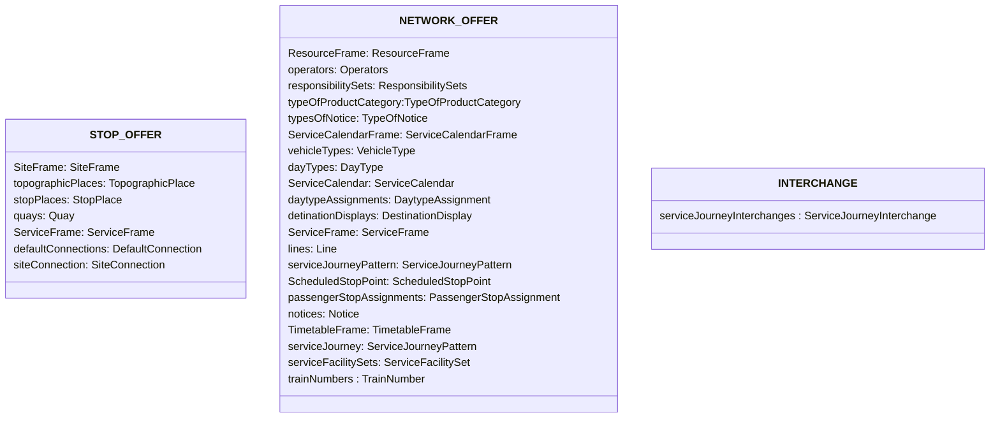

# Files

NeTEx data will be transferred as files.

We will have three different file types:
* STOP_OFFER: stops, quays, transfer times and accessibility related to sites at some point
* NETWORK_OFFER: lines, routes, timetables
* INTERCHANGE: interchanges, "Durchbindungen"

The first two are valid according to the XSD. INTERCHANGE only as far as we use `versionRef` instead of `version`.

NETWORK_OFFER is per operator and in some cases per area.

This repartition of the data into different file leads to some redundancy. However, the files can still be transferred efficiently.

## Content of each file

*Figure: Elements per file type*

STOP_OFFER:
* Contains everything related to (physical) stops
* Accessibility will be added in the future

NETWORK_OFFER:
* By operator (legal) and sometimes region (e.g. canton)
* Contains the `ResourceFrame`, `CalendarFrame`, `ServiceFrame`, `TimetableFrame`
* Is self-sufficient from ref/id side
* Eventually a reduced `StopPlace`, `Quay` could be added, but for the time being we won't do this.

INTERCHANGE
* Contains interchanges, spliting, joining and "Durchbindungen".
* ref/id can't be checked by the schema. Therefore we use the attribute `versionRef` instead of `version`. 

Swiss operators deliver NETWORK_OFFER and INTERCHANGE to INFO+.  STOP_OFFER is only needed for data not stored in ATLAS. INFO+ will deliver an aggregated, comprehensive STOP_OFFER.

## Naming conventions
IT-Environments:
- Development:	DEV
- Test:	TEST
- Integration:	INT
- Production:	PROD

The name of each XML file is composed of the following information:

| Content             | Example                                       | Description                                                                                            |
|---------------------|-----------------------------------------------|--------------------------------------------------------------------------------------------------------|
| IT-Environment      | `TEST`                                        |     DEV,TEST,INT,PROD                                                                                                      |
| Format of the file  | 	`NETEX`                                      | 	NETEX                                                                          |
| Content of the file | 	`TT`                                         | 	Timetable                                                                                             |
| Version             | 	 `2.1`                                       | 	Number of the version of the NeTEx .xsd schema                                                        |
| Country	            | `CHE`                                         | ISO code of the country for which the file was produced                                                |
| Provider	           | `SKI`	                                        | Name of the provider                                                                                   |
| Time table year	    | `2026`                                        | 	period of the data (always a year for now)                                                             |
| Name of Export	     | `oev-schweiz`	                                | Defines the scope of the timetable data (e.g. `bernmobil` or for the whole of Switzerland `oev-schweiz` |
| Type of file        | 	`STOP_OFFER`, `NETWORK_OFFER`, `INTERCHANGE` | 	Describes the content                                                                                 |
| Date and Time       | `202606101200`                                | 		Date and time the file was produced, format: YYYYMMDDHHMM                                        |

Example: `TEST_NETEX_TT_2.0_CHE_SKI_2026_OEV-SCHWEIZ_STOP_OFFER_202301250401.xml`

All Files are embedded in a zip-File. The name of the zip-file is composed of the following information:

| Content	             | Example	      | Description                                                                                            |
|----------------------|---------------|--------------------------------------------------------------------------------------------------------|
| IT-Environment	      | DEV,TEST,INT	 | In the production environment, the prefix PROD is not written in the name                              |
| Format  of the file	 | `NETEX`	      | Describe the format (NETEX)                                                                            |
| Content of the file	 | `TT`	         | Describe the content (TimeTable)                                                                       |
| Version              | `2.1`         | 		Number of the version of the NeTEx .xsd schema                                                       | 
| Country	             | `CHE`	        | ISO code of the country for which the file was produced                                                | 
| Provider	            | `SKI`	        | Name of the provider                                                                                   | 
| Time period	         | `2026`        | 	Time period of the data                                                                                | 
| Name of Export	      | `oev-schweiz`	 | Defines the scope of the timetable data (e.g. `bernmobil` or for the whole of Switzerland `oev-schweiz` | 
| Date and Time	       | `202606131500` | 	Date and time the file was produced, format: YYYYMMDDHHMM                                         | 

Example :`TEST_NETEX_TT_2.0_CHE_SKI_2026_OEV-SCHWEIZ_202602010402.zip`

## Zip structure
All files in a delivery are zipped into a single one according to the name structure above.

## Encoding
All data is encoded as UTF-8 without BOM.

## Data transfer
The data transfer will be defined by INFO+. A version of the full swiss data will be available on https://opentransportdata.swiss/ for download.

## File sent by data provider to SKI 
We suggest that the partner name consists of the short name of the partner and necessary additions to identify the system. In addition, the number of the timetable period is to be indicated in the name, as well as the date and time of creation of the file

Examples: `test_zvv_2024_20231112_095217.zip`, `prod_tl_2024_20231114_152836.zip`

The file name must be agreed on between the data provider and SKI. Generally it is agreed that delivery can be on network, operator or line base.

### Partial deliveries
No partial deliveries are accepted. They must contain:
- all relevant lines
- the whole timetable year

No incremental updates are supported.

> NB: We might reconsider some of those points for mixed lines. 

## File sent by SKI to data receivers 
As the quantity of the data is very large for a single XML-file, SKI provides the data a set of XML files. In addition to the XML files, SKI provides a README file listing the contents of each XML file. 
