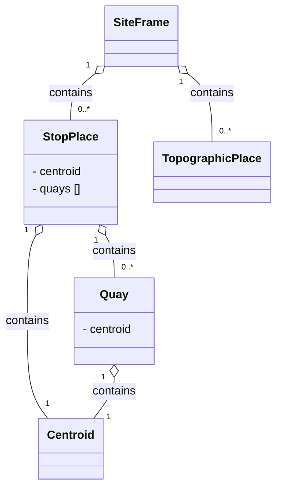

# Stop Modelling
In this chapter:

- [SiteFrame](#siteframe)
- [StopPlace](#stopplace)
- [Quay](#quay)
- [TopographicPlace](#topographicplace)
- [Centroid](#centroid)

## SiteFrame
*→ [Glossary definition](A4_annex_glossary.md#siteframe)*

### Purpose
A `SiteFrame` contains the physical infrastructure model for public transport — `StopPlace`s, `Quay`s, and topographic context. It defines the spatial elements that passengers interact with and that other frames reference for stop assignments.


*Figure: Elements in SiteFrame*

### Contained Elements

- `StopPlace`s – stations and stops 
  - `Quay`s - platforms where passengers can board a vehicle
- `TopographicPlace`s - geographical and administrative area context for stops
- Not currently modelled: entrances, levels, equipments, paths, accessibility properties, points of interest

### Table
- [Swiss profile NeTEx definition](../site/tables/SiteFrame.md)

*→ [General NeTEx definition ](../generated/netex-html/SiteFrame.html)*

### Example
- [Example snippet](../site/xml-snippets/SiteFrame.xml)

*→ [Template](./templates/SiteFrame.xml)*

### Frame Relationships
`SiteFrame` is independent of other frames but provides the physical stop infrastructure that `ServiceFrame` references through `PassengerStopAssignments`. `TimetableFrame` indirectly depends on `SiteFrame` through the `JourneyPattern` stop sequence. `SiteFrame` is typically wrapped in a `CompositeFrame` within a `PublicationDelivery`.

## StopPlace
*→ [Glossary definition](A4_annex_glossary.md#stopplace)*

### Purpose
A named physical or virtual location where passengers can board or alight from public transport, containing one or more `Quay`s.
Note that a `StopPlace` is a distinct concept from the representation of the stop in a timetable – the `ScheduledStopPoint`. The two can be connected using a `PassengerStopAssignment`. 


### Table
- [Swiss profile NeTEx definition](../site/tables/StopPlace.md)

*→ [General NeTEx definition ](../generated/netex-html/StopPlace.html)*

### Example
- [Example snippet](../site/xml-snippets/StopPlace.xml)

*→ [Template](./templates/StopPlace.xml)*

### Usage Notes
- All `StopPlace`s in Switzerland are identifiable by both a DIDOK number and a SLOID. DIDOK number are under the responsability of the Department of Transport (BAV). It is possible that in the future the BAV will also regulate “Haltepunkte” and “Haltekanten” and, therefore, the identifiers of `Quay`s.
- Foreign `StopPlace`s may be mapped to Swiss DIDOK codes. 
- Meta-stations will have their own codes. In some cases these are added for operational or searching reasons. 
- id-attribute needs to be kept stable between exports.
- DIDOK number placement: The DIDOK number is **not** transported as free text anywhere on `StopPlace`. It is placed in `privateCodes/PrivateCode` with `type="Didok"`, **and** the same value must additionally be listed in the `KeyList` (`KeyValue` with matching `Key`). Both are required — the `PrivateCode` for direct lookup, the `KeyList` entry for generic key/value tooling.
- `ShortName` is not used on `StopPlace`. In particular, the DIDOK number must **never** be placed in `ShortName` — this was common practice under Profile 1.0 / HRDF-based exports and is explicitly discontinued under RV 2.0.
- `ValidBetween`: Every `StopPlace` carries a `ValidBetween` with a `FromDate`. Since `StopPlace` is infrastructure master data (not a timetable-period object), **no `ToDate` is set** — validity is open-ended until a future change is published.

#### Example: DIDOK number and validity on `StopPlace`
```xml
<StopPlace id="ch:1:StopPlace:8503000" version="1">
  <ValidBetween>
    <FromDate>2026-01-01T00:00:00</FromDate>
  </ValidBetween>
  <Name>Zürich HB</Name>
  <privateCodes>
    <PrivateCode type="Didok">8503000</PrivateCode>
  </privateCodes>
  <keyList>
    <KeyValue>
      <Key>Didok</Key>
      <Value>8503000</Value>
    </KeyValue>
  </keyList>
  <!-- Quays, Centroid, etc. -->
</StopPlace>
```

## Quay
*→ [Glossary definition](A4_annex_glossary.md#quay)*

### Purpose
A specific boarding or alighting position (platform, stand, bay) within a `StopPlace` where passengers physically meet vehicles. 

### Table
- [Swiss profile NeTEx definition](../site/tables/Quay.md)

*→ [General NeTEx definition ](../generated/netex-html/Quay.html)*

### Example
- [Example snippet](../site/xml-snippets/Quay.xml)

*→ [Template](./templates/Quay.xml)*

### Usage Notes
- In standard NeTEx, a `Quay` may serve one or more `VehicleStoppingPlace`s and be associated with one or more `StopPoint`s. The Swiss profile does not currently model that.
- A `Quay` may contain other sub `Quay`s. A child `Quay` must be physically contained within its parent `Quay`.  Furthermore: 
  - A nested `Quay` is always physically contiguous with its parent and so has the same accessibility characteristics 
as its parent. 
  - Nested `Quay`s should not be used to mark individual positions on a platform – `BoardingPosition` serve this function. 
  - Nested `Quay`s and `AccessSpace`s must always be on the same `Level` as their parent (not currently modelled).
- If the SLOID for platforms is not unique, it will be formed according to the schema:
{StopPlace SLOID}_gen:{Quay SLOID}_pf:{Platform Code}.
- If no platform SLOID is available {StopPlace SLOID}_gen:missingSLOID_pf:{Platform Code*} will be used instead.
- >NB: Special characters in the track identifier will be replaced with a dot («.»), for example 21/22 → 21.22.
- id-attribute needs to be kept stable between exports.


In the table below you will find an overview of the possible cases. For more information on SLOID, see [Swiss Location Identification (SLOID)  öv-info.ch](https://www.oev-info.ch/de/datenmanagement/swiss-identification-public-transport-sid4pt/swiss-location-identification-sloid "https://www.oev-info.ch/de/datenmanagement/swiss-identification-public-transport-sid4pt/swiss-location-identification-sloid").

| Case | id | sloid in Key/Value, PrivateCode |
| -- | --|--|
| Unique track sloid | ch:1:sloid:7000:6:32 | ch:1:sloid:7000:6:32 |
| Non-unique track sloid | ch:1:sloid:7000_gen:ch:1:sloid:7000:0:349752_pf:2A-D | ch:1:sloid:7000:0:349752 |
| Non-unique SLOID with special characters "11/12" | ch:1:sloid:6206_gen:ch:1:sloid:6206:0:11_pf:11.12 | ch:1:sloid:6206:0:11 |
| non platform SLOID | ch:1:sloid:1102381_gen:missingSLOID_pf:1 | |
| No Sloid (abroad) | 8029701_gen:missingSLOID_pf:1 | |

*Table: SLOID and id in NeTEx*

`Quay`s are mapped with the following resolution: 
- No hierarchy between the different definitions of quays is foreseen at the moment 
- All combinations between sectors of the same quay are considered as independent quays. 
- Combinations of several quays are considered as independent quays. 

Further notes:
- We will at some point include also `Quay`s that are not used actually to have the base data, if they are needed in real-time.
- Atlas does model the hierarchy of the quays.

## TopographicPlace
*→ [Glossary definition](A4_annex_glossary.md#topographicplace)*

### Purpose
A named geographic area such as a city, municipality, county, or region - used to provide spatial context for `StopPlace`s, for example when interactively searching for the origin or destination of a trip.


### Table
- [Swiss profile NeTEx definition](../site/tables/TopographicPlace.md)

*→ [General NeTEx definition ](../generated/netex-html/TopographicPlace.html)*


### Example
- [Example snippet](../site/xml-snippets/TopographicPlace.xml)

*→ [Template](./templates/TopographicPlace.xml)*

### Usage Notes
- The `TopographicPlace` represent the cantons and communes in Switzerland. Each `StopPlace` should reference the `TopographicPlace` representing its canton.  
- id-attribute needs to be kept stable between exports.


## Centroid

### Purpose
It provides precise geographic coordinates (WGS84) of a central reference point representing a single point or an area such as a `Quay`or a `StopPlace`. 

### Table
- [Swiss profile NeTEx definition](../site/tables/Centroid.md)

*→ [General NeTEx definition ](../generated/netex-html/Centroid.html)*

### Example
- [Example snippet](../site/xml-snippets/Centroid.xml)

*→ [Template](./templates/Centroid.xml)*

### Usage Notes
- The `Centroid` always contains a location. 
- The main coordinates are given as WGS84.
- Required accuracy 4+ decimal positions.
- The Swiss coordinates are added as well, when available (for Swiss stops). The format is LV95. For imports they are not needed, however.
- INFO+ will not use the master data from NeTEx imports, it will rely on the Atlas master data for all Swiss coordinates. INFO+ will, however, use the imported location data of foreign places without DIDOK numbers. 
- no id-attribute
