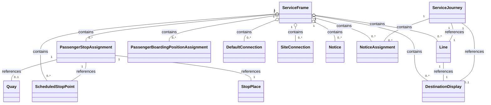

# Services
In this chapter:
- [Line](#line)
- [DestinationDisplay](#destinationdisplay)
- [ScheduledStopPoint](#scheduledstoppoint)
- [PassengerStopAssignment](#passengerstopassignment)
- LATER PassengerBoardingPositionAssignment
- [DefaultConnection](#defaultconnection)
- [SiteConnection](#siteconnection)
- [TimingLink](#timinglink)
- [ServiceJourneyPattern](#servicejourneypattern)
- [TimeDemandType](#timedemandtype)
- [Notice](#Notice)
- [NoticeAssignment](#NoticeAssignment)

## ServiceFrame
*→ [Glossary definition](A4_annex_glossary.md#serviceframe)*

### Purpose
Contains the network and route definitions - `Line`s, `ScheduledStopPoint`s, `DestinationDisplay`s, and `PassengerStopAssignment`s.

See the following class diagram for the most important objects of the `ServiceFrame` and their relationships to the other frames.

*Figure: Elements in ServiceFrame* 

### Contained Elements
The `ServiceFrame` model comprises among others:
-	Route model: fixed and flexible  `Line`s and `Route`s of a transport network.
-	Line network model: overall topology of the `Line` and line sections that make up a transport network.
-	Service pattern model: `ScheduledStopPoint`s, `ServiceLink`, i.e., points and links referenced by schedules.

Other important classes of the `ServiceFrame` include:
-	`PassengerStopAssignment`s and `PassengerBoardingPositionAssignment` which model the relationship between stops in the timetable and the physical platforms of an actual station or other stop.
-	`Connection`s as the topological model of interchanges. They model the possibility of a transfer between two `ScheduledStopPoints`.
-	`Notice`s which are then assigned to `Journey` and `Passingtime` of the `TimetableFrame` through `NoticeAssignment`s. They model the association of footnotes and passenger information content such as stop announcements and the network.

### Table
- [Swiss profile NeTEx definition](../site/tables/ServiceFrame.md)

*→ [General NeTEx definition ](../generated/netex-html/ServiceFrame.html)*

### Example
- [Example snippet](../site/xml-snippets/ServiceFrame.xml)

*→ [Template](./templates/ServiceFrame.xml)*

### Frame Relationships
`ServiceFrame` depends on `ResourceFrame` for `Operator` definitions. `VehicleScheduleFrame` may reference journeys defined here for block and duty scheduling. `PassengerStopAssignment`s build the connection between `ScheduledStopPoints` and the physical model in `SiteFrame`. ServiceFrame` is typically wrapped in a `CompositeFrame`within a `PublicationDelivery`.

## Direction
We don't use `Direction` but only `DirectionType`. For this we need NeTEx 2.1.

This means that the old two defined dirctions `ch:1:Direction:H` and `ch:1:Direction:R` will no longer be supported.

## Line
*→ [Glossary definition](A4_annex_glossary.md#line)*
### Purpose
A public transport service line, representing a marketed route with a `Name`, `TransportMode`, and `Operator`.

### Table
- [Swiss profile NeTEx definition](../site/tables/Line.md)

*-> [General NeTEx definition](../generated/netex-html/Line.html)*

### Example

- [Example snippet](../site/xml-snippets/Line.xml)

*->[Template](./templates/Line.xml)*

### Usage Notes
- slnid will be integrated wherever possible. We currently think that - where it exists - it has the necessary properties to be used in the `id`-attribute.
- For foreign lines and id might need to be generated.
- We store the slnid whenever possible in `id`, `privateCodes/PrivateCode` and `KeyList`.
- **TODO** link to migration concept slnid #48
- **TODO** handling of mixed lines #48
- Be aware that for mixed lines there might be multiple `Line`s in NeTEx. Otherwise, the relevant `Operator` must be set on the `ServiceJourney`.
- Note that there exist journeys in Switzerland and neighbouring countries that are not associated with a `Line`. In NeTEx, however, the `ServiceJourney`s corresponding to such journeys must still reference something in `LineRef`. To ensure this, we introduce a placeholder `Line` called "NoLine" for each `Operator` that has journeys without a Line.
- For more information about SwissLineID: see https://www.xn--v-info-vxa.ch/sites/default/files/2023-06/slnid-spezifikation_v1.25_0.pdf
- id-attribute needs to be kept stable between exports.

## DestinationDisplay
*→ [Glossary definition](A4_annex_glossary.md#destinationdisplay)*

### Purpose
Showing the destination of a `ServiceJourney`. The text shown on the front or side of a public transport vehicle to indicate its destination, including via-points and variant labels.

### Table
- [Swiss profile NeTEx definition](../site/tables/DestinationDisplay.md)

*-> [General NeTEx definition](../generated/netex-html/DestinationDisplay.html)*

### Example

- [Example snippet](../site/xml-snippets/DestinationDisplay.xml)

*->[Template](./templates/DestinationDisplay.xml)*

### Usage Notes
- In HRDF sometimes the destination is not set (`*R`). This results in NeTEX in a calculated destination definition. 
- The `DestinationDisplay` is usually set on the `ServiceJourney`. If it changes during the run, it needs to be changed in the `ServiceJourneyPattern`. If it changes on that, then the new destination should be used. In our output, we will fill all remaining `PointsInJourneyPattern`with the relevant change.
- See also the [use case on changes in destination](uc13_changes_in_destination.md) 
- id-attribute needs to be kept stable between exports.

> **TODO** the rules for defining need to be clarified. #81

## ScheduledStopPoint
*→ [Glossary definition](A4_annex_glossary.md#scheduledstoppoint)*

### Purpose
A logical point used in the timetable to indicate a stop of a service where passengers can board or alight. A `ScheduledStopPoint` is linked to a physical `Quay` or `StopPlace` via a [PassengerStopAssignment](#passengerstopassignment). 

A `ScheduledStopPoint` can represent two types of stop points:
-	In most cases, the `ScheduledStopPoint` is the station named in the timetable, especially as some organisations don’t have a full physical model of their StopPlaces. 
-	In some cases, the `ScheduledStopPoint` may be mapped to the `Quay`. The more detailed mapping is also done with the `PassengerStopAssignment`.

### Table
- [Swiss profile NeTEx definition](../site/tables/ScheduledStopPoint.md)

*-> [General NeTEx definition](../generated/netex-html/ScheduledStopPoint.html)*

### Example

- [Example snippet](../site/xml-snippets/ScheduledStopPoint.xml)

*->[Template](./templates/ScheduledStopPoint.xml)*

### Usage Notes
- id-attribute needs to be kept stable between exports.

## PassengerStopAssignment
*→ [Glossary definition](A4_annex_glossary.md#passengerstopassignment)*

### Purpose

`PassengerStopAssignment`s bring the Site model and the Service model in alignment. We have two general cases:
-	A `ScheduledStopPoint` in a `ServiceJourneyPattern` is linked to a `StopPlace` for arrival and departure.
-	A `ScheduledStopPoint` in a `ServiceJourneyPattern` is linked to a `Quay` for arrival and departure.

### Table
- [Swiss profile NeTEx definition](../site/tables/PassengerStopAssignment.md)

*-> [General NeTEx definition](../generated/netex-html/PassengerStopAssignment.html)*

### Example

- [Example snippet](../site/xml-snippets/PassengerStopAssignment.xml)

*->[Template](./templates/PassengerStopAssignment.xml)*

### Usage Notes
- id-attributes don't need to be stable.

## DefaultConnection
*→ [Glossary definition](A4_annex_glossary.md#defaultconnection)*

### Purpose
`DefaultConnections` are used to transmit the connection times for the following constellations:
-	between 2 `ProductCategory`s
-	between 2 `Operator`s
-	In a defined `StopPlace`
-	In a defined `StopPlace` and 2 `Operator`s
-	in a defined `StopPlace`, 2 `Operator`s and 2 `ProductCategory`s

### Table
- [Swiss profile NeTEx definition](../site/tables/DefaultConnection.md)

*-> [General NeTEx definition](../generated/netex-html/DefaultConnection.html)*

### Example

- [Example snippet](../site/xml-snippets/DefaultConnection.xml)

*->[Template](./templates/DefaultConnection.xml)*

### Usage Notes
- For more details see the [use case on transfers](uc03_transfers.md).
- id-attribute needs to be kept stable between exports.

## SiteConnection
*→ [Glossary definition](A4_annex_glossary.md#siteconnection)*

### Purpose
- The `SiteConnection` describes the transfer times between two adjacent `StopPlace`s. 
- id-attribute needs to be kept stable between exports.

### Table
- [Swiss profile NeTEx definition](../site/tables/SiteConnection.md)

*-> [General NeTEx definition](../generated/netex-html/SiteConnection.html)*

### Example

- [Example snippet](../site/xml-snippets/SiteConnection.xml)

*->[Template](./templates/SiteConnection.xml)*

### Usage Notes
For more details see the [use case on transfers](uc03_transfers.md).

## TimingLink
*→ [Glossary definition](A4_annex_glossary.md#timinglink)*

### Purpose
`TimingLink` defines the topological link between two `TimingPoint`s (in practice
`ScheduledStopPoint`s, referenced via `FromPointRef`/`ToPointRef`) used within a
`ServiceJourneyPattern`. `TimingLink` itself does **not** carry run or wait time
values — these are defined per `TimeDemandType` via `JourneyRunTime` (referencing
the `TimingLink` through `TimingLinkRef`) and `JourneyWaitTime` (referencing the
`ScheduledStopPoint` directly through `TimingPointRef`, not via `TimingLink`).
See [TimeDemandType](#timedemandtype).

### Table

- [Swiss profile NeTEx definition](../site/tables/TimingLink.md)

*-> [General NeTEx definition](../generated/netex-html/TimingLink.html)*

### Example

- [Example snippet](../site/xml-snippets/TimingLink.xml)

*->[Template](./templates/TimingLink.xml)*

### Usage Notes
- It must fit with the sequence defined in `ServiceJourneyPattern`.
- `FromPointRef`/`ToPointRef` reference `ScheduledStopPoint`s (technically typed
  as `TimingPointRef`, substituted by `ScheduledStopPointRef`).
- If there is maneuvering or a change of quay, then a separate `TimingLink`
  needs to be added for that too.
- **TODO** Multiple visits of the same `ScheduledStopPoint` within a
  `ServiceJourneyPattern` are currently not cleanly resolvable for `WaitTime`
  differentiation; see open NeTEx PR
  [#1031](https://github.com/TransmodelEcosystem/NeTEx/pull/1031), which adds
  `StopPointInServiceJourneyPatternRef` to `JourneyWaitTime` for this case.
- id-attribute needs to be kept stable between exports.

## ServiceJourneyPattern
*→ [Glossary definition](A4_annex_glossary.md#servicejourneypattern)*

### Purpose
`ServiceJourneyPattern` is used to describe the journey pattern (sequence and times of `ScheduledStopPoints`) of `ServiceJourney`.

### Table
- [Swiss profile NeTEx definition](../site/tables/ServiceJourneyPattern.md)

*-> [General NeTEx definition](../generated/netex-html/ServiceJourneyPattern.html)*

### Example

- [Example snippet](../site/xml-snippets/ServiceJourneyPattern.xml)

*->[Template](./templates/ServiceJourneyPattern.xml)*

### Usage Notes

ServiceJourneyPatterns are a common concept in the VDV interface world ("Linienfahrweg"). In order to model ServiceJourneys effictiently and to reduce overall file size, ServiceJourneys sharing the same stop sequence and the same boarding/alighting options should use the same ServiceJourneyPattern. Do not just generate one ServiceJourneyPattern for each ServiceJourney.
- id-attribute should be kept stable between exports.

## TimeDemandType
*→ [Glossary definition](A4_annex_glossary.md#timedemandtype)*

### Purpose
`TimeDemandType` describes the timing pattern of a `ServiceJourneyPattern`:
`RunTime`s between consecutive `ScheduledStopPoint`s (via `JourneyRunTime`,
referencing the relevant `TimingLink` through `TimingLinkRef`) and `WaitTime`s
at a `ScheduledStopPoint` (via `JourneyWaitTime`, referencing the
`ScheduledStopPoint` directly through `TimingPointRef`). Multiple
`TimeDemandType`s can be defined per `ServiceJourneyPattern` to represent
different traffic or dwell conditions (e.g. peak vs. off-peak).

### Table
- [Swiss profile NeTEx definition](../site/tables/TimeDemandType.md)

*-> [General NeTEx definition](../generated/netex-html/TimeDemandType.html)*

### Example

- [Example snippet](../site/xml-snippets/TimeDemandType.xml)

*->[Template](./templates/TimeDemandType.xml)*

### Usage Notes
- `WaitTime` is only needed when greater than 0.
- `RunTime` references the relevant `TimingLink` via `TimingLinkRef`;
  `WaitTime` references the relevant `ScheduledStopPoint` directly via
  `TimingPointRef` — not via `TimingLink`.
- **TODO** For stops visited multiple times within the same `ServiceJourneyPattern`
  with different wait times, see open NeTEx PR
  [#1031](https://github.com/TransmodelEcosystem/NeTEx/pull/1031).
- id-attribute needs to be kept stable between exports.

## Notice
*→ [Glossary definition](A4_annex_glossary.md#notice)*

### Purpose
Informational or regulatory text associated with public transport services, displayed to passengers.
 

### Table
- [Swiss profile NeTEx definition](../site/tables/Notice.md)

*-> [General NeTEx definition](../generated/netex-html/Notice.html)*

### Example

- [Example snippet](../site/xml-snippets/Notice.xml)

*->[Template](./templates/Notice.xml)*

### Usage Notes
- Notice elements should only be used to convey information which cannot be transported using specific model elements. Do not use Notice when the information could be expressed by specific elements, e.g. FacilitySet, DayType, ForAlighting, ForBoarding. Notices can be used to provide further information on ServiceFacilities but not as a replacement for them. Ideally, the description of a Notice is translated into common languages of CH (DE, IT, FR).
- id-attribute don't need to be kept stable between exports.

## NoticeAssignment
*→ [Glossary definition](A4_annex_glossary.md#noticeassignment)*

### Purpose
Assign a `Notice` to an element. 

### Table
- [Swiss profile NeTEx definition](../site/tables/NoticeAssignment.md)

*-> [General NeTEx definition](../generated/netex-html/NoticeAssignment.html)*

### Example

- [Example snippet](../site/xml-snippets/NoticeAssignment.xml)

*->[Template](./templates/NoticeAssignment.xml)*

### Usage Notes
- id-attribute does not to be kept stable.
