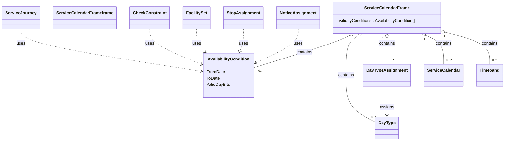

# Service Calendar Frame

In this chapter:
- [ServiceCalendarFrame](#servicecalendarframe)
- [AvailabilityCondition](#availabilitycondition)
- [ServiceCalendar](#servicecalendar)
- [DayType](#daytype)
- [Timeband](#timeband)
- [DayTypeAssignment](#daytypeassignment)

## ServiceCalendarFrame
*→ [Glossary definition](A4_annex_glossary.md#servicecalendarframe)*

### Purpose
Groups calendar definitions that describe **when** services operate. We do this with `AvailabilityCondition`s stored in this frame. We also have `DayType`s and `DayTypeAssignment`s for the holidays.

See the following class diagram for the most important objects of the `ServiceCalendarFrame` and their relationships to the other frames.

*Figure: Elements of ServiceCalendar and elements with AvailabilityCondition*

#### Table
- [Swiss profile NeTEx definition](../site/tables/ServiceCalendarFrame.md)

*→ [General NeTEx definition](../xcore/netex/elements/ServiceCalendarFrame.html)*

#### Example
- [Example snippet](../site/xml-snippets/ServiceCalendarFrame.xml)

*→ [Template](./templates/ServiceCalendarFrame.xml)*

#### Usage Notes
- Note that `AvailabilityCondition`s can be combined and ANDed (all the conditions must be fulfilled at the same time). Allowed elements to specify constraints are `FromDate`/ `ToDate`, `ValidDayBits`, and `timebands`. See the detailed explanation under [AvailabilityCondition](#availabilitycondition) below.

### AvailabilityCondition
*→ [Glossary definition](A4_annex_glossary.md#availabilitycondition)*

#### Purpose
Temporal availability in terms of `Date`s, `Timeband`s, `ValidDayBits`.

**How `AvailabilityCondition`/`ValidDayBits` work:** an `AvailabilityCondition` defines a validity period (`FromDate`/`ToDate`) together with a day-by-day pattern (`ValidDayBits`) indicating on which individual days within that period the condition applies. `ValidDayBits` is a bit string with exactly one bit per
calendar day of the period — `1` means the day is valid, `0` means it is not (directly equivalent to an HRDF bitfield). A `ServiceJourney` (or any other element that needs temporal validity) references one `AvailabilityCondition` via `AvailabilityConditionRef`; the referenced object itself is always defined centrally
in this frame, never inline.

#### Table
- [Swiss profile NeTEx definition](../site/tables/AvailabilityCondition.md)

*→ [General NeTEx definition](../xcore/netex/elements/AvailabilityCondition.html)*

#### Example
- [Example snippet](../site/xml-snippets/AvailabilityCondition.xml)

*→ [Template](./templates/AvailabilityCondition.xml)*

#### Usage Notes
- Examples of use of `AvailabilityCondition` include  `ServiceJourney`, `TemplateServiceJourney`, facilities.
- AvailabilityCondition replaces OperatingDay and OperatingPeriod. Whenever a reference to a VP (“Verkehrsperiode” or "operating period" in english) is needed, we use an `AvailabilityConditionRef`:
-	The referenced `AvailabilityCondition`s are centrally stored in the `ServiceCalendarFrame`.
- The element `ValidDayBits` directly indicates the days on which some service is provided or not. They are similar to the HRDF bitfields. 
- `ValidDayBits` is expected whenever the `AvailabilityCondition` expresses a recurring day-by-day pattern, which is the case for most `AvailabilityCondition`s in practice. Examples include:
  -	`ServiceJourney`
  -	`NoticeAssignment`
  -	`ServiceFacilitySet`
  -	`ServiceJourneyInterchange`
- `AvailabilityCondition`s can be combined and ANDed (all the conditions must be fulfilled at the same time). Allowed elements to specify constraints are `FromDate`/`ToDate`, `ValidDayBits`, and `timebands` — **none of these is mandatory on its own**; an `AvailabilityCondition` may consist of only one
  of them (e.g. only `FromDate`/`ToDate` for "summer only", only `timebands` for "school holiday period", or only `ValidDayBits` for "Sundays only").
  **Concrete use case we already have:** every `AvailabilityCondition` in our examples combines `FromDate`/`ToDate` (the overall timetable period, e.g. one `Fahrplanjahr`) **with** `ValidDayBits` (the day-by-day pattern within that period) — this is the everyday case of the ANDing mechanism, directly equivalent to an HRDF "Verkehrsperiode + Bitfeld" combination. We do **not** currently have a use case that additionally combines `timebands` with the other two — see the note under [Timeband](#timeband) below.
- Note: the frames `TimetableFrame`, `ServiceFrame` and `ServiceCalendarFrame` and their elements must have the same validity.
- `@id` does not need to be kept stable between exports.

### ServiceCalendar
*→ [Glossary definition](A4_annex_glossary.md#servicecalendar)*

#### Purpose
Long-term planning uses calendar days that are classified as specific `DayType`s (example: weekday in school holidays). In the general NeTEx model, a `ServiceCalendar` can itself contain `dayTypes`/`dayTypeAssignments`; in the Swiss profile this nested usage is not used. `ServiceCalendar` is used only as a label for the overall timetable year (`Name`, `FromDate`, `ToDate` — e.g. "Fahrplan 2026" / "Horaire 2026"). `DayType`s and `DayTypeAssignment`s are declared as siblings of `ServiceCalendar` directly within `ServiceCalendarFrame`, not nested inside it.

#### Table
- [Swiss profile NeTEx definition](../site/tables/ServiceCalendar.md)

*→ [General NeTEx definition](../xcore/netex/elements/ServiceCalendar.html)*

#### Example
- [Example snippet](../site/xml-snippets/ServiceCalendar.xml)

*→ [Template](./templates/ServiceCalendar.xml)*

#### Usage Note
- `@id` should to be kept stable between exports.

### DayType
*→ [Glossary definition](A4_annex_glossary.md#daytype)*

#### Purpose
A classification of days on which a specific set of transport services operates (e.g., Weekdays, Saturdays, Public Holidays). The `DayType`s of the Swiss profile represent national holidays.

#### Table
- [Swiss profile NeTEx definition](../site/tables/DayType.md)

*→ [General NeTEx definition](../xcore/netex/elements/DayType.html)*

#### Example
- [Example snippet](../site/xml-snippets/DayType.xml)

*→ [Template](./templates/DayType.xml)*

#### Usage Note
- `@id` needs to be kept stable between exports.

### Timeband
*→ [Glossary definition](A4_annex_glossary.md#timeband)*

#### Purpose
A period of time within a day, usually defined by a start and end time (e.g. `06:00:00`–`09:00:00` for a morning peak window). Within an `AvailabilityCondition`, a `timebands` constraint restricts validity to journeys whose departure falls inside that daily time window, in addition to whichever `FromDate`/`ToDate`/`ValidDayBits` constraints are also present (all are ANDed, see [ServiceCalendarFrame](#servicecalendarframe) above).

**Example use case (illustrative, not yet implemented in the Swiss profile):** a `Timeband` `07:00:00`–`09:00:00` combined with `ValidDayBits` for weekdays could restrict a fare rule or a `NoticeAssignment` (e.g. "peak-hour surcharge applies") to weekday morning-peak journeys only, without needing a separate `AvailabilityCondition` per journey.

#### Table
- [Swiss profile NeTEx definition](../site/tables/Timeband.md)

*→ [General NeTEx definition](../xcore/netex/elements/Timeband.html)*

#### Example
- [Example snippet](../site/xml-snippets/Timeband.xml)

*→ [Template](./templates/Timeband.xml)*

#### Usage Notes
- `Timeband` was used in RG 1.0 for `InterchangeRuleTiming`s (not applicable in RG 2.0, since `InterchangeRule` is not used — see [uc03 Transfers](uc03_transfers.md)). It is planned for future use for opening hours in `StopPlace` models, but currently **has no active use case in the Swiss RG 2.0 profile** — we have not yet identified data that requires it.
- `@id` should be kept stable between exports.

### DayTypeAssignment
*→ [Glossary definition](A4_annex_glossary.md#daytypeassignment)*

#### Purpose
Assignment of a date to `DayType`. The `DayType`s of the Swiss profile represent national holidays.

#### Table
- [Swiss profile NeTEx definition](../site/tables/DayTypeAssignment.md)

*→ [General NeTEx definition](../xcore/netex/elements/DayTypeAssignment.html)*

#### Example
[Example snippet](../site/xml-snippets/DayTypeAssignment.xml)

*→ [Template](./templates/DayTypeAssignment.xml)*

#### Usage Notes
- We currently use `DayTypeAssignment` only for the national holidays.
- `@id` should be kept stable between exports.

