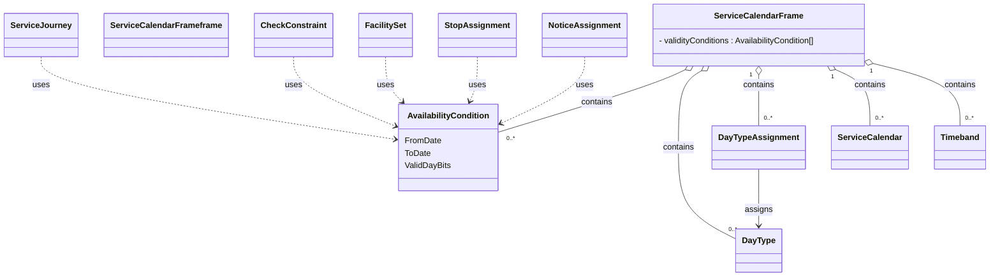

# Service calendars

In this chapter:
- [ServiceCalendarFrame](#servicecalendarframe)
- [AvailabilityCondition](#availabilitycondition)
- [ServiceCalendar](#servicecalendar)
- [DayType](#daytype)
- [Timeband](#timeband)
- [DayTypeAssignment](#daytypeassignment)

## ServiceCalendarFrame
*→ [Glossary definition](A4_annex_glossary.md#servicecalendarframe)*

### Purpose
Groups calendar definitions that describe **when** services operate. We do this with `AvailabilityCondition`s stored in this frame. We also have `DayType`s and `DayTypeAssignment`s for the holidays.

See the following class diagram for the most important objects of the `ServiceCalendarFrame` and their relationships to the other frames.

*Figure: Elements of ServiceCalendar and elements with AvailabilityCondition*

#### Table
- [Swiss profile NeTEx definition](../site/tables/ServiceCalendarFrame.md)

*→ [General NeTEx definition](../generated/netex-html/ServiceCalendarFrame.html)*

#### Example
- [Example snippet](../site/xml-snippets/ServiceCalendarFrame.xml)

*→ [Template](./templates/ServiceCalendarFrame.xml)*

#### Usage Notes
- Note that `AvailabilityCondition`s can be combined and ANDed (all the conditions must be fulfilled at the same time). Allowed elements to specify constraints are `FromDate`/ `ToDate`, `ValidDayBits`, and `timebands`. 

### AvailabilityCondition
*→ [Glossary definition](A4_annex_glossary.md#availabilitycondition)*

#### Purpose
Temporal availability in terms of `Date`s, `Timeband`s, `ValidDayBits`.

#### Table
- [Swiss profile NeTEx definition](../site/tables/AvailabilityCondition.md)

*→ [General NeTEx definition](../generated/netex-html/AvailabilityCondition.html)*

#### Example
- [Example snippet](../site/xml-snippets/AvailabilityCondition.xml)

*→ [Template](./templates/AvailabilityCondition.xml)*

#### Usage Notes
- Examples of use of `AvailabilityCondition` include  `ServiceJourney`, `TemplateServiceJourney`, facilities.
- AvailabilityCondition replaces OperatingDay and OperatingPeriod. Whenever a reference to a VP (“Verkehrsperiode” or "operating period" in english) is needed, we use an `AvailabilityConditionRef`:
-	The referenced `AvailabilityCondition`s are centrally stored in the `ServiceCalendarFrame`.
- The element `ValidDayBits` directly indicates the days on which some service is provided or not. They are similar to the HRDF bitfields. 
- `ValidDayBits` is required whenever the `AvailabilityCondition` is of temporal nature (more often than not). Examples include:
  -	`ServiceJourney`
  -	`NoticeAssignment`
  -	`ServiceFacilitySet`
  -	`ServiceJourneyInterchange`
- `AvailabilityCondition`s can be combined and ANDed (all the conditions must be fulfilled at the same time). Allowed elements to specify constraints are `FromDate`/`ToDate`, `ValidDayBits`, and `timebands` — **none of these is mandatory on its own**; an `AvailabilityCondition` may consist of only one
  of them (e.g. only `FromDate`/`ToDate` for "summer only", only `timebands` for "school holiday period", or only `ValidDayBits` for "Sundays only").
- Hint: The frames `TimetableFrame`, `ServiceFrame` and `ServiceCalendarFrame` and their elements must have the same validity.
- id-attribute does not need to be kept stable between exports.

### ServiceCalendar
*→ [Glossary definition](A4_annex_glossary.md#servicecalendar)*

#### Purpose
Long-term planning uses calendar days that are classified as specific `DayType`s (example: weekday in school holidays). In the general NeTEx model, a `ServiceCalendar` defines a mapping between `DayType`s and OperatingDays; in the Swiss profile, this mapping via OperatingDays is not used — `ServiceCalendar` serves only as a container for `DayType`s and `DayTypeAssignment`s, defining a mapping of `DayType`s to dates. 

#### Table
- [Swiss profile NeTEx definition](../site/tables/ServiceCalendar.md)

*→ [General NeTEx definition](../generated/netex-html/ServiceCalendar.html)*

#### Example
- [Example snippet](../site/xml-snippets/ServiceCalendar.xml)

*→ [Template](./templates/ServiceCalendar.xml)*

#### Usage Note
- id-attribute should to be kept stable between exports.

### DayType
*→ [Glossary definition](A4_annex_glossary.md#daytype)*

#### Purpose
A classification of days on which a specific set of transport services operates (e.g., Weekdays, Saturdays, Public Holidays). The `DayType`s of the Swiss profile represent national holidays.

#### Table
- [Swiss profile NeTEx definition](../site/tables/DayType.md)

*→ [General NeTEx definition](../generated/netex-html/DayType.html)*

#### Example
- [Example snippet](../site/xml-snippets/DayType.xml)

*→ [Template](./templates/DayType.xml)*

#### Usage Note
- id-attribute needs to be kept stable between exports.

### Timeband
*→ [Glossary definition](A4_annex_glossary.md#timeband)*

#### Purpose
A period of time within a day, usually defined by a start and end time.

#### Table
- [Swiss profile NeTEx definition](../site/tables/Timeband.md)

*→ [General NeTEx definition](../generated/netex-html/Timeband.html)*

#### Example
- [Example snippet](../site/xml-snippets/Timeband.xml)

*→ [Template](./templates/Timeband.xml)*

#### Usage Notes
- Currently `Timeband` is used in RG 1.0 for `InterchangeRuleTiming`s, later also used for the opening hours in `StopPlace` models. 
- id-attribute should be kept stable between exports.

### DayTypeAssignment
*→ [Glossary definition](A4_annex_glossary.md#daytypeassignment)*

#### Purpose
Assignment of a date to `DayType`. The `DayType`s of the Swiss profile represent national holidays.

#### Table
- [Swiss profile NeTEx definition](../site/tables/DayTypeAssignment.md)

*→ [General NeTEx definition](../generated/netex-html/DayTypeAssignment.html)*

#### Example
[Example snippet](../site/xml-snippets/DayTypeAssignment.xml)

*→ [Template](./templates/DayTypeAssignment.xml)*

#### Usage Notes
- We currently use `DayTypeAssignment` only for the national holidays.
- id-attribute should be kept stable between exports.

