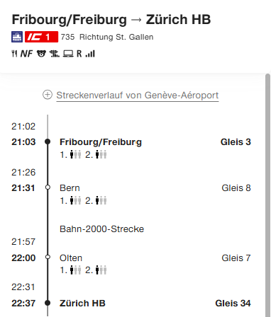
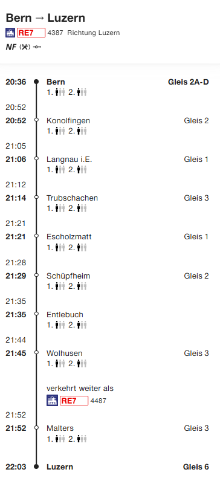

# Examples
This  folder contains the relevant examples for the realisation guide 2.0 based on NeTEX 2.0.

### Basic train with PassingTime
Example of a normal rail journey train Spiez - Interlaken Ost with various quay combinations.

[Link to example](NeTEx_Spiez_Interlaken_Ost_PassingTime.xml)

### Basic bus
Swiss NeTEx 2.0 models repeated stops within a journey using PassingTimes and JourneyPattern references, enabling quay-level differentiation (e.g. opposite sides of the road) without duplicating journeys or introducing additional segmentation structures

[Link to example](NeTEx_CH_PAG_11929.xml)

Another bus is an example from Nyon.

[Link to example](NeTEx_CH_Experimental_Passingtimes_Bus803_Nyon.xml)

### Bus with some DRT properties
We modeled some `ServiceJourney`s from the following bus: https://github.com/user-attachments/files/26309155/50.110.pdf

[Link to example](NeTEx_CH_DRT_Line_50.110.xml)

## Bus where there must be passengers present at the start
This example bases on ServiceJourney 11957 from the Line 50.119. The `ServiceJourney` has a fixed sequence of stops. also no reservation is necessary). However, during the run passengers can only alight. So, if no passengers are there at the first stop, then the bus is not running.

[Link to example](NeTEx_CH_DRT_Line_Dependent_On_Passengers_At_Start.xml)

### Example splitting train Bern - Zweisimmen | Brig
A simple splitting train without any additional information is shown in this example: `Bern - Thun - Spiez - (Zweisimmen | Brig)`

[Link to example](NeTEx_CH_Bern_Spiez_Zweisimmen_TimeDemandType.xml)

## Basic ThroughJourney
This example demonstrates a Swiss NeTEx 2.0 modeling of an international ThroughJourney (Durchbindung) extending beyond Swiss borders, highlighting the use of TimetabledPassingTimes, consistent KeyList and PrivateCode usage, and a complete mapping between ScheduledStopPoints and PassengerStopAssignments to ensure both temporal and spatial consistency.

[Link to example](NeTEx_CH_Interlaken_BS_Freiburg_Breisach_Durchbindung.xml)

## Train with ServiceFacilities and Notes
This example shows the usage of ServiceFacilities. It also shows when the ServiceFacility is:
- not available on all operating days
- is restricted to a part of the journey (here the bistro is not open between Olten and Zürich)

[Link to example](NeEX_CH_Bern_Olten_ZuerichHB_Winterthur_StGallen_with_Facilities.xml)

## Using a platform for a train
This is and example of a rail journey from Niederhasli Zürich HB Zürich Stadelhofen Uster, where Zürich HB is mapped via PassengerStopAssignment to a shared platform Quay “33/34”
This shows the problems with sloid.

We model a train that has the following stops Fribourg - Bern - Zürich. Zürich it uses Zürich Löwenstrasse 33/34

[Link to example](NeTEx_CH_Fribourg_Bern_Zuerich_Perron.xml)

## Special case: Destination changed
We use a BLS train from Bern to Luzern. Due to construction it is terminated at Wolhusen.
We assume that in Bern, Konolfingen and Langnau i.E. we want to show Destination Luzern. On the ServiceJourney we want to show Wolhusen. And in the stops after Langnau i.E. we show Wolhusen as destination.

[Link to example](NeTEx_CH_BLS_Bern_Luzern_DestinationChange.xml)

In a second modeling we want to model the change in the train number as also shown in the example. In this version the train goes to Luzern exactly as shown in the image.

[Link to example](NeTEx_CH_BLS_Bern_Luzern_Change_TrainNumber_and_other_stuff.xml)

## Special case: Destination display in a round trip

>**TODO** LATER

## Journey relationships

>**TODO** Examples from Adrian

## Special case: Umsteigebeziehungen und Metastations

>**TODO** by Adrian

## Postauto with Anhänger

>**TODO** PAG needed

## Formation for trains

>LATER **TODO** 

## carTransportRail

>LATER **TODO** 

### rail replacement

>LATER **TODO**

### Frequency based traffic
The following examples shows two `TemplateServiceJourney`s with frequencies. If there is continuous operation, then 1 minute is set as the interval.

[Link to example](NeTEx_CH_Frequency_Based_Line.xml)

## Other Demand Responsive Traffic (DRT)
Swiss NeTEx 2.0 replaces Call-based, order-dependent modeling with a flat, PassingTime-driven structure that separates stop sequence, timing, and operational semantics more clearly than previous version

We already have seen line-based DRT. Here we deal with area based DRT.

>LATER **TODO** 

## Accessibility
For NeTEx 2.0 EPIAP (European Passsenger accessibility Profile, NeTEx Part 6) Chur was used as an example. 
We don't do accessibility modeling in NeTEx even for RG 2.0

[Accessibility example in the main NeTEx repo](https://github.com/NeTEx-CEN/NeTEx/tree/v2.0/examples/standards/epiap)

