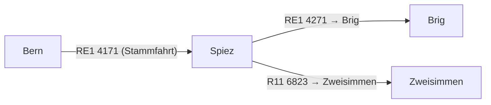

# Joining and splitting of trains

## Overview

Splitting (Flügelzug) and joining (Vereinigung) describe operational patterns where a
single coupled train separates into two independent trains at an intermediate stop, or
two trains merge into one.  
The Swiss example used throughout this use case is the
**RE1 4171 Bern – Spiez – Brig / Zweisimmen**: the coupled train runs from Bern to
Spiez (Flügelungspunkt), then splits into two branches — RE1 4271 towards Brig (via
Lötschberg) and R11 6823 towards Zweisimmen (via Simmental).



> **Note:** `ChangeWithinVehicle` should be set to `true` when a passenger may need
> to move to a different part of the train at the splitting point to continue their
> journey.
> See also [uc01 Durchbindung](uc01_durchbindung.md).

## Mapping between HRDF and NeTEx

| HRDF | NeTEx RG1 | NeTEx RG2 | Use Case |
|------|-----------|-----------|----------|
| `[durchbi]` | `JourneyMeeting` | `ServiceJourneyInterchange` with `StaySeated=true` and `ChangeWithinVehicle=true` | Splitting / Joining at splitting- / joining point |

**HRDF example (Bern – Spiez – Brig/Zweisimmen):**

Two `[durchbi]` records are needed — one per branch (Brig and Zweisimmen).
```
004171  000033  8507483  004271  000033  000000  8507483  %
004171  000033  8507483  006823  000033  000000  8507483  %
```

The coupling on the Bern–Spiez section is expressed via two `[durchbi]` records,
linking the feeder journey 4171 to each of the branch journeys (4271 and 6823) at
Spiez (DIDOK 8507483).

## Modelling with NeTEx RG 1.0 (`JourneyMeeting`)

In RG 1.0, each branch required a separate `JourneyMeeting` at the splitting point.

**Situation according to Realisation Guide 1.0**

```xml
<JourneyMeeting id="ch:1:JourneyMeeting:91001N-BLS-439-1-45540_91001N-BLS-777-1-47520_..." version="1">
  <validityConditions>
    <AvailabilityConditionRef ref="ch:1:AvailabilityCondition:c6300" versionRef="any"/>
  </validityConditions>
  <AtStopPointRef ref="ch:1:ScheduledStopPoint:8507483:3" versionRef="any"/>
  <FromJourneyRef ref="ch:1:ServiceJourney:ch:1:sjyid:100015:4171-001_91001N.j26_439" version="1"/>
  <ToJourneyRef ref="ch:1:ServiceJourney:ch:1:sjyid:100015:4271-001_91001N.j26_777" version="1"/>
  <EarliestTime>13:10:00</EarliestTime>
  <LatestTime>13:12:00</LatestTime>
</JourneyMeeting>

<JourneyMeeting id="ch:1:JourneyMeeting:91001N-BLS-440-1-45540_91011N-BLS-149-1-47520_..." version="1">
  <validityConditions>
    <AvailabilityConditionRef ref="ch:1:AvailabilityCondition:u7600" versionRef="any"/>
  </validityConditions>
  <AtStopPointRef ref="ch:1:ScheduledStopPoint:8507483:3" versionRef="any"/>
  <FromJourneyRef ref="ch:1:ServiceJourney:ch:1:sjyid:100015:4171-001_91001N.j26_440" version="1"/>
  <ToJourneyRef ref="ch:1:ServiceJourney:ch:1:sjyid:100015:6823-001_91011N.j26_149" version="1"/>
  <Description>LineChange</Description>
  <EarliestTime>13:10:00</EarliestTime>
  <LatestTime>13:12:00</LatestTime>
</JourneyMeeting>
```

## Modelling with NeTEx RG 2.0 (`ServiceJourneyInterchange`)

In RG 2.0, splitting and joining are modelled exclusively using `ServiceJourneyInterchange`. One interchange per branch is required.

`JourneyPart` and `JourneyPartCouple` are **not used** in the RG 2.0 for
splitting and joining.

**Situation with Realisation Guide 2.0**

```xml
<ServiceJourneyInterchange version="1" id="ch:1:ServiceJourneyInterchange:4171-4271-Spiez">
  <validityConditions>
    <AvailabilityConditionRef ref="ch:1:AvailabilityCondition:c6300" version="1"/>
  </validityConditions>
  <Description>Flügelung Spiez → Brig</Description>
  <StaySeated>true</StaySeated>
  <CrossBorder>false</CrossBorder>
  <ChangeWithinVehicle>true</ChangeWithinVehicle>
  <MaximumWaitTime>PT2M</MaximumWaitTime>
  <FromPointRef ref="ch:1:ScheduledStopPoint:8507483:3" version="1"  nameOfClass="ScheduledStopPoint"/>
  <ToPointRef ref="ch:1:ScheduledStopPoint:8507483:3" version="1" nameOfClass="ScheduledStopPoint"/>
  <FromServiceJourneyRef ref="ch:1:ServiceJourney:ch:1:sjyid:100015:4171-001_91001N.j26_439" version="1"/>
  <ToServiceJourneyRef ref="ch:1:ServiceJourney:ch:1:sjyid:100015:4271-001_91001N.j26_777" version="1"/>
</ServiceJourneyInterchange>

<ServiceJourneyInterchange version="1" id="ch:1:ServiceJourneyInterchange:4171-6823-Spiez">
  <validityConditions>
    <AvailabilityConditionRef ref="ch:1:AvailabilityCondition:u7600" version="1"/>
  </validityConditions>
  <Description>Flügelung Spiez → Zweisimmen</Description>
  <StaySeated>true</StaySeated>
  <CrossBorder>false</CrossBorder>
  <ChangeWithinVehicle>true</ChangeWithinVehicle>
  <MaximumWaitTime>PT2M</MaximumWaitTime>
  <FromPointRef ref="ch:1:ScheduledStopPoint:8507483:3" version="1" nameOfClass="ScheduledStopPoint"/>
  <ToPointRef ref="ch:1:ScheduledStopPoint:8507483:3" version="1" nameOfClass="ScheduledStopPoint"/>
  <FromServiceJourneyRef ref="ch:1:ServiceJourney:ch:1:sjyid:100015:4171-001_91001N.j26_440" version="1"/>
  <ToServiceJourneyRef ref="ch:1:ServiceJourney:ch:1:sjyid:100015:6823-001_91011N.j26_149" version="1"/>
</ServiceJourneyInterchange>
```

> - `StaySeated=true` indicates that the passenger does not need to leave the vehicle — the train continues physically as one unit until the splitting point.
> - `ChangeWithinVehicle=true` indicates that passengers must move to the correct coach within the train before the split, as each coach continues to a different destination after the splitting point.

The detailed handling is described for the element [ServiceJourneyInterchange](09_timetable.md#servicejourneyinterchange).

- [Example](../site/xml-snippets/ServiceJourneyInterchange.xml)
- [Example Splitting (Flügelzug Bern–Spiez–Brig/Zweisimmen)](./examples/NeTEx_CH_Bern_Spiez_Zweisimmen_TimeDemandType.xml)

## Related use cases

- [uc01 Durchbindung](uc01_durchbindung.md)
- [uc03 Transfers](uc03_transfers.md)
