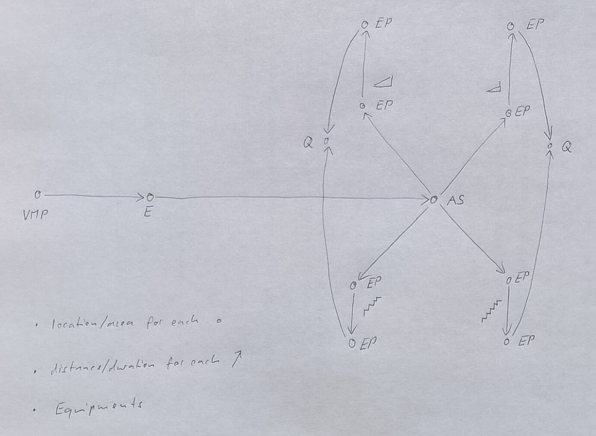
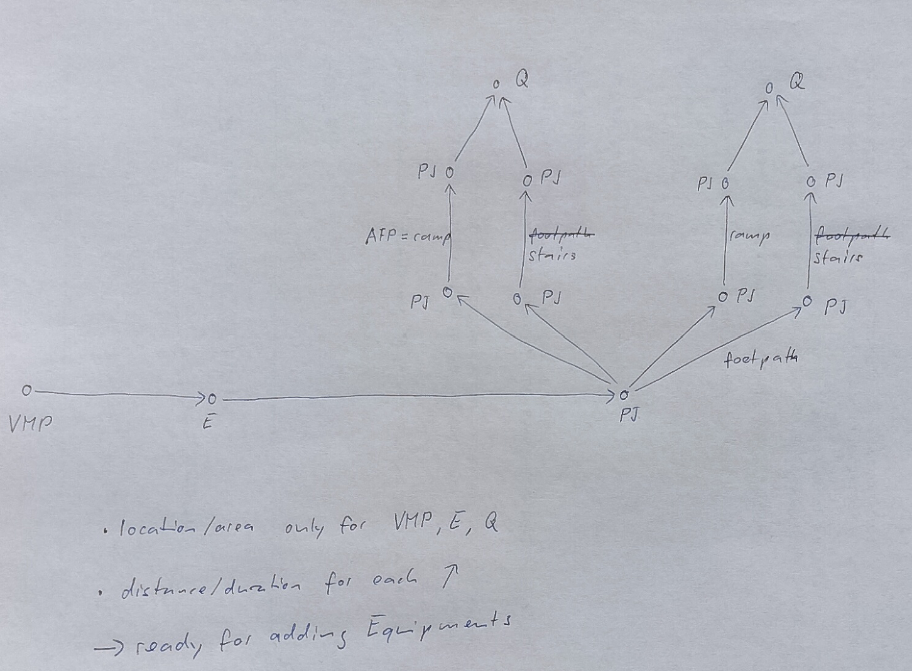
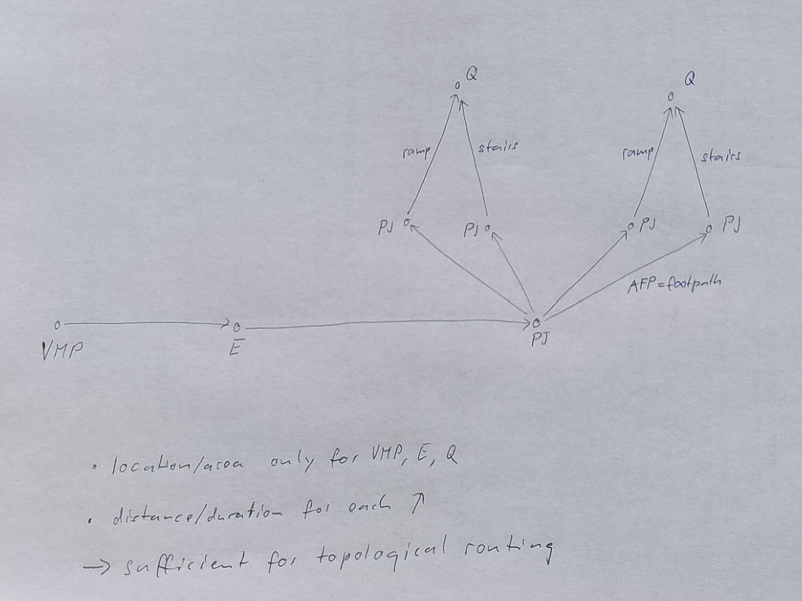

# Accessibility - WORK IN PROGRESS

Definition of the Swiss Accessibility Profile.

**Current State**
- Show what can be expressed with AccessibilityAssessment, Facilities, and Services
- Limited localisation: attached to complete StopPlaces or single Quays
- Proposal of using AccessibilityAssessment to describe the most needed "reachability" properties of a Quay
- Elaborated only for Site elements, not for vehicles 

This approach does not obey the EPIAP philiosophy of favoring Equipments over Facilities and Services. But it may be the more realistic and practical approach. 

**Next Step A**
- TSI/PRM requirements - what is covered/missing?
- Add selected Equipment types (for which data are available) - which ones?
- Replace the corresponding Facilities or keeping them in parallel?

**Next Step B**
- Do we need SitePathLinks? 
- StairEquipment, RampEquipment, etc.
- Granularity of navigation networks? - First thoughts  [presented below](#sitepathlink).

---

**In this chapter** (typography loosely reflects priority):

AccessibilityAssessment
- [**AccessibilityAssessment**](#accessibilityassessment)

Basic Orientation
- **Level**
- [**StopPlaceEntrance**](#stopplaceentrance)
- *AccessSpace*
- [**StopPlace - the Additional Elements**](#stopplace---the-additional-elements)
- **Quay - the Additional Elements**

PrivateMobility
- Parking

Path Navigation
- [*SitePathLink*](#sitepathlink)
- *PathJunction*
- *DefaultConnection - the Additional Elements*
- *SiteConnection - the Additional Elements*

Equipments, Facilities & Services
- **EquipmentPlace**
- EntranceEquipment
- *EscalatorEquipment*
- *LiftEquipment*
- *RampEquipment*
- *TravelatorEquipment*
- (LuggageLockerEquipment
- (TrolleyStandEquipment
- (PassengerSafetyEquipment
- SanitaryEquipment
- TicketingEquipment
- (QueingEquipment
- TicketValidatorEquipment
- (ShelterEquipment
- WaitingEquipment
- WaitingRoomEquipment
- SignEquipment
- [**AssistanceService**](#assistanceservice)
- [**AssistanceBookingService**](#assistancebookingservice)
- (LostPropertyService
- LuggageService
- **MeetingPointService**
- (TicketingService
- **CustomerService**
- [**SiteFacilitySet - the Additional Elements**](#sitefacilityset---the-additional-elements)
- **ServiceFacilitySet - the Additional Elements**

Vehicles & Vehicle Stop Interaction
- VehicleType
- BoardingPosition
- TrainStopAssignment

## AccessibilityAssessment
*→ [Glossary definition](A4_annex_glossary.md#accessibilityassessment)* **TODO**

### Purpose

An assessment of the usability by passengers with specific needs, for example, those needing wheelchair access, step-free access or for the visually or the auditorily impaired.

### Table
- [Swiss profile NeTEx definition](../site/tables/AccessibilityAssessment.md)

*→ [General NeTEx definition ](../xcore/netex/elements/AccessibilityAssessment.html)*

### Example
- [Example snippet](../site/xml-snippets/AccessibilityAssessment.xml)

*→ [Template](./templates/AccessibilityAssessment.xml)*

### Usage Notes

In case of `StopPlace` or `Quay`, EPIAP uses the following interpretation: 
`MobilityImpairedAccess` set to `true` means:
* `WheelchairAccess` `true`
* `StepFreeAccess` `true`
* `VisualSignsAvailable` `true` (only for railway stations)
* `TactileGuidanceAvailable` `true`

Interpretation of `AccessibilityLimitation`:

|   |   |
|---|---|
|`WheelchairAccess`|1.    `StepFreeAccess` from an accessible entrance (see next row). 2.    The stop/platform is sufficiently wide to make a turn with a wheelchair when entering/leaving the vehicles that usually stops at this stop/platform (depending on the available/needed tools for entering/leaving the vehicle). 3.    If boarding trains requires boarding assistance, onsite assistance is available.|
|`StepFreeAccess`|1.    A step-free route is an obstacle-free/barrier free route that meets the needs of mobility impaired persons. Changes in level are avoided or, when they cannot be avoided, they are bridged via ramps or lifts (compliant with PRM TSI). 2.    The platform or Stop is accessible without steps from the surrounding area (footpaths). A platform which has `StepFreeAccess` without `WheelchairAccess` (= `false`) may be not sufficiently wide to make a turn with a wheelchair.|
|`StairFreeAccess`|A stair-free route. Single steps allowed.|
|`LevelAccessIntoVehicle`|Whether the platform is high enough and gap is small enough for level access into vehicle.  At least at a designated wheelchair door position the gap between platform and vehicle floor (of level access vehicle) does not exceed 75 mm measured horizontally and 50 mm measured vertically including sliding step (according to PRM TSI).|
|`EscalatorFreeAccess` (not included in profile)|Reachable without using an escalator.|
|`LiftFreeAccess` (not included in profile)|Reachable without using an elevator.|
|`RampFreeAccess`|Reachable without using a ramp that doesn't fit the UN Design [Considerations](https://euc-word-edit.officeapps.live.com/we/wordeditorframe.aspx?ui=nl-nl&rs=nl-nl&wopisrc=https%3A%2F%2Fitxptorg.sharepoint.com%2Fsites%2FEU.DATA4PT.NETEX%2F_vti_bin%2Fwopi.ashx%2Ffiles%2Fc2c9167177c34bc1bb50e4880ff7b6ac&wdenableroaming=1&mscc=1&hid=12869e13-00bf-76bc-9351-10ac590e57c1-730&uiembed=1&uih=teams&uihit=files&hhdr=1&dchat=1&sc=%7B%22pmo%22%3A%22https%3A%2F%2Fteams.microsoft.com%22%2C%22pmshare%22%3Atrue%2C%22surl%22%3A%22%22%2C%22curl%22%3A%22%22%2C%22vurl%22%3A%22%22%2C%22eurl%22%3A%22https%3A%2F%2Fteams.microsoft.com%2Ffiles%2Fapps%2Fcom.microsoft.teams.files%2Ffiles%2F2441637157%2Fopen%3Fagent%3Dpostmessage%26objectUrl%3Dhttps%253A%252F%252Fitxptorg.sharepoint.com%252Fsites%252FEU.DATA4PT.NETEX%252FShared%2520Documents%252FGeneral%252FCEN_Accessibility_Profile%252F20210326%2520PrTS%252016614-6.docx%26fileId%3Dc2c91671-77c3-4bc1-bb50-e4880ff7b6ac%26fileType%3Ddocx%26ctx%3Daggregate%26scenarioId%3D730%26locale%3Dnl-nl%26theme%3Ddefault%26version%3D21100501100%26setting%3Dring.id%3Ageneral%26setting%3DcreatedTime%3A1639152919292%22%7D&wdorigin=TEAMS-ELECTRON.aggregatefiles.aggregate&jsapi=1&jsapiver=v1&newsession=1&corrid=ce9d3917-7c65-4632-a7d4-9644eb2f8575&usid=ce9d3917-7c65-4632-a7d4-9644eb2f8575&sftc=1&sams=1&accloop=1&sdr=6&scnd=1&sat=1&hbcv=1&htv=1&hodflp=1&instantedit=1&wopicomplete=1&wdredirectionreason=Unified_SingleFlush&rct=Medium&ctp=LeastProtected#_ftn1) (for instance, because they are too steep or a landing is missing in case of a ramp of more than 10 m). [[1]](https://euc-word-edit.officeapps.live.com/we/wordeditorframe.aspx?ui=nl-nl&rs=nl-nl&wopisrc=https%3A%2F%2Fitxptorg.sharepoint.com%2Fsites%2FEU.DATA4PT.NETEX%2F_vti_bin%2Fwopi.ashx%2Ffiles%2Fc2c9167177c34bc1bb50e4880ff7b6ac&wdenableroaming=1&mscc=1&hid=12869e13-00bf-76bc-9351-10ac590e57c1-730&uiembed=1&uih=teams&uihit=files&hhdr=1&dchat=1&sc=%7B%22pmo%22%3A%22https%3A%2F%2Fteams.microsoft.com%22%2C%22pmshare%22%3Atrue%2C%22surl%22%3A%22%22%2C%22curl%22%3A%22%22%2C%22vurl%22%3A%22%22%2C%22eurl%22%3A%22https%3A%2F%2Fteams.microsoft.com%2Ffiles%2Fapps%2Fcom.microsoft.teams.files%2Ffiles%2F2441637157%2Fopen%3Fagent%3Dpostmessage%26objectUrl%3Dhttps%253A%252F%252Fitxptorg.sharepoint.com%252Fsites%252FEU.DATA4PT.NETEX%252FShared%2520Documents%252FGeneral%252FCEN_Accessibility_Profile%252F20210326%2520PrTS%252016614-6.docx%26fileId%3Dc2c91671-77c3-4bc1-bb50-e4880ff7b6ac%26fileType%3Ddocx%26ctx%3Daggregate%26scenarioId%3D730%26locale%3Dnl-nl%26theme%3Ddefault%26version%3D21100501100%26setting%3Dring.id%3Ageneral%26setting%3DcreatedTime%3A1639152919292%22%7D&wdorigin=TEAMS-ELECTRON.aggregatefiles.aggregate&jsapi=1&jsapiver=v1&newsession=1&corrid=ce9d3917-7c65-4632-a7d4-9644eb2f8575&usid=ce9d3917-7c65-4632-a7d4-9644eb2f8575&sftc=1&sams=1&accloop=1&sdr=6&scnd=1&sat=1&hbcv=1&htv=1&hodflp=1&instantedit=1&wopicomplete=1&wdredirectionreason=Unified_SingleFlush&rct=Medium&ctp=LeastProtected#_ftnref1) [https://www.un.org/esa/socdev/enable/designm/AD2-01.htm](https://www.un.org/esa/socdev/enable/designm/AD2-01.htm)|
|`AudibleSignalsAvailable`|Whether audible signals for the visually impaired are present.|
|`VisualSignsAvailable`|PRM TSI: visual information as signposting, pictograms and dynamic information.|
|`TactileGuidanceAvailable`|Whether the object has tactile guidance (for the visually impaired). If absent assume `unknown`. PRM TSI: obstacle-free route to each Quay for the visually impaired passengers equipped with tactile information.   For bus- and tram stops:   1.  Groundsurfaceindicator (at location first door) and/or full-length guideline (for boarding at all entrances) 2.   Tactile guideline or boarding position connected to (natural) guideline in environment|

#### Remarks `RampFreeAccess`

* Note that `RampFreeAccess` may very well include ramps - provided their slopes are only moderate.
* It seems obvious that `RampFreeAccess`should also include `StairFreeAccess` and `StepFreeAccess` - this isn't explicitely stated in EPIAP, however. 
* `RampFreeAccess`is thus a stronger form of `WheelchairAccess` excluding steeper slopes.

#### Limitiations of AccessibilityAssessment

* If, e.g., `WheelchairAccess` or `StairFreeAccess` requires using a lift, the `AccessibilityAssessment` does not convey this information. 

* According to EPIAP definitions, a quay with, e.g., `WheelchairAccess` means that there is at least one entrance from which it is reachable. It may be that `WheelchairAccess` only works from a secondary entrance, not from the main entrance. 

Such information can be encoded using `PathLink`s and `PathJunction`s that describe a routing network including accessibility and location data.

### Modification Proposal

The definitions from EPIAP are partly ambiguous and of limited usefulness. 

#### Proposed changes to the current definition in italics: 
**TODO** to be reviewed & discussed, requires EPIAP modification

- `StepFreeAccess` - no stairs, no steps,  **_no escalator_**
- `RampFreeAccess` =  `StepFreeAccess` withoutRamp - **_no stairs, no steps, no escalator_**, no ramp exceeding a moderate slope (more precisely: "that doesn't fit the UN Design Considerations" [https://www.un.org/esa/socdev/enable/designm/AD2-01.htm](https://www.un.org/esa/socdev/enable/designm/AD2-01.htm))
- `LiftFreeAccess` = `StepFreeAccess` without lift  - **_no stairs, no steps, no escalator_**, no lift - possibly ramps
- `WheelchairAccess` - includes `StepFreeAccess`
- `EscalatorFreeAccess` - may have stairs, steps, lift, ramp, but no escalator

In addtion to the above modifications / clarifications, we specify that 
- all conditions of the AccessibiltyAssessment (StepFreeAccess etc.) have to be true for a complete path from a `StopPlaceEntrance` with `DroppedKerb=true` and `DropOffPointClose=true`. 

**Then the `AccessibiltyAssessment` is able to express the following TSI/PRM requirements:**
- **TODO**
- ...

#### Technical remarks:
- The above (re)definition may be incompatible with a more local understanding of `AccessibilityAssessment`. A more local understanding might be an appropriate choice if a complete SitePathLink network exists. 
- Pure  lift free access - no lift, for claustrophobia - must always be true in public spaces, there always has to be an alternative access means like stairs. Therefore the above definition of `LiftFreeAccess` which includes `StepFreeAccess` does not loose information for the claustophobics
- As `EscalatorFreeAccess` should always be guaranteed in public spaces, it seems superflouous - remove?
- One might consider adding `StepFreeAccessWithoutLiftWithoutRamp` - no stairs, no steps, no escalator, no lift, no ramp exceeding a moderate slope.

## AssistanceService
*→ [Glossary definition](A4_annex_glossary.md#AssistanceService)* **TODO**

### Purpose
Used for services that require booking or with limited availability.
The booking / contact information can be found in the accompanying `AssistanceBookingService`element.

### Table
- [Swiss profile NeTEx definition](../site/tables/AssistanceService.md)

*→ [General NeTEx definition ](../xcore/netex/elements/AssistanceService.html)*

### Example
- [Example snippet](../site/xml-snippets/AssistanceService.xml)

*→ [Template](./templates/AssistanceService.xml)*

## AssistanceBookingService
*→ [Glossary definition](A4_annex_glossary.md#AssistanceBookingService)* **TODO**

### Purpose
Booking / contact information for `AssistanceService`.

### Table
- [Swiss profile NeTEx definition](../site/tables/AssistanceBookingService.md)

*→ [General NeTEx definition ](../xcore/netex/elements/AssistanceBookingService.html)*

### Example
- [Example snippet](../site/xml-snippets/AssistanceBookingService.xml)

*→ [Template](./templates/AssistanceBookingService.xml)*

## StopPlace - the Additional Elements

### Table
- [Swiss profile NeTEx definition](../site/tables/StopPlace_withAccessibility.md)

### Example
- [Example snippet](../site/xml-snippets/StopPlace_withAccessibility.xml)

*→ [Template](./templates/StopPlace_withAccessibility.xml)*

## StopPlaceEntrance
*→ [Glossary definition](A4_annex_glossary.md#StopPlaceEntrance)* **TODO**

### Purpose
`StopPlaceEntrance`s, in particular if `DroppedKerbOutside` and `DropOffPointClose` are true, are the starting points from which the accessibility of `Quay`s and other place elements is assessed. 

### Table
- [Swiss profile NeTEx definition](../site/tables/StopPlaceEntrance.md)

*→ [General NeTEx definition ](../xcore/netex/elements/StopPlaceEntrance.html)*

### Example
- [Example snippet](../site/xml-snippets/StopPlaceEntrance.xml)

*→ [Template](./templates/StopPlaceEntrance.xml)*

## SiteFacilitySet - the Additional Elements

### Purpose
Accessiblity information attached to a `StopPlace` and `Quay` in particular. Also usable for other site/place elements like `AccessSpace`, `EquipmentPlace`.

### Table
- [Swiss profile NeTEx definition](../site/tables/SiteFacilitySet_withAccessibility.md)

### Usage Notes

The element is used in `StopPlace` and `Quay`, for which slightly differing rules apply: 
* General presence or absence of facilities has to be indicated at the level of the `StopPlace`.
* Of interest at the level of each `Quay`are the following:
  * `AccessibiltyInfoFacilityList`
  * `AccessFacilityList` (only for `Quay`)
  * `AssistanceFacilityList`
  * `TicketingFacilityList`
  * `EmergencyFacilityList`
  * `MedicalFacilityList`

#### Problems to be solved **TODO**
Overlaps between `AccessFacilityList`, `AssistanceFacilityList`, `MobilityFacilityList`. We might want to restrict the allowed enums, depending on what finally needs to be expressed. 

### Example
- [Example snippet](../site/xml-snippets/SiteFacilitySet_withAccessibility.xml)

*→ [Template](./templates/SiteFacilitySet_withAccessibility.xml)*

## SitePathLink
*→ [Glossary definition](A4_annex_glossary.md#sitepathlink)* TODO

### Purpose
...

### Table
- [Swiss profile NeTEx definition](../site/tables/SitePathLink.md)

*→ [General NeTEx definition ](../xcore/netex/elements/SitePathLink.html)*

### Example
- [Example snippet](../site/xml-snippets/SitePathLink.xml)

*→ [Template](./templates/SitePathLink.xml)*

### Usage Notes

#### Modelling Rules for Navigation Networks

Which conventions and rules do we want to follow when modelling navigation networks? Which level(s) of details should we aim at? The following is intended as a starting point for a discussion.

Three possible ways to model a navigation network from a VehicleMeetingPoint (error: the idea was a drop off point or parking) to two Quays.

The first model includes localised vertices (e.g., Entrance, EquipmentPlace) connected by SitePathLinks and AccessEquipments (StairEquipment, RampEquipment). 

VMP = VehicleMeetingPoint, E = Entrance, AS = AccessSpace, EP = EquipmentPlace, Q = Quay, arrow = SitePathLink

The second model uses localised and possibly non-localised (PathJunction) vertices, connected by similar SitePathLinks as the first model, but without Equipments and EquipmentPlaces.

PJ = PathJunction

The third model is a streamlined form that doesn't insist on PathJunctions if they don't provide additional information needed for accessibility routing.

---
---

**TEMPLATES FOR THIS DOCUMENT**

## NewElementX
*→ [Glossary definition](A4_annex_glossary.md#accessibilityassessment)* TODO

### Purpose
...

### Table
- [Swiss profile NeTEx definition](../site/tables/NewElement.md)

*→ [General NeTEx definition ](../xcore/netex/elements/NewElement.html)*

### Example
- [Example snippet](../site/xml-snippets/NewElement.xml)

*→ [Template](./templates/NewElement.xml)*

## ExistingElementY - the Additional Elements

### Table
- [Swiss profile NeTEx definition](../site/tables/OldElement_withAccessibility.md)

### Example
- [Example snippet](../site/xml-snippets/OldElement_withAccessibility.xml)

*→ [Template](./templates/OldElement_withAccessibility.xml)*

