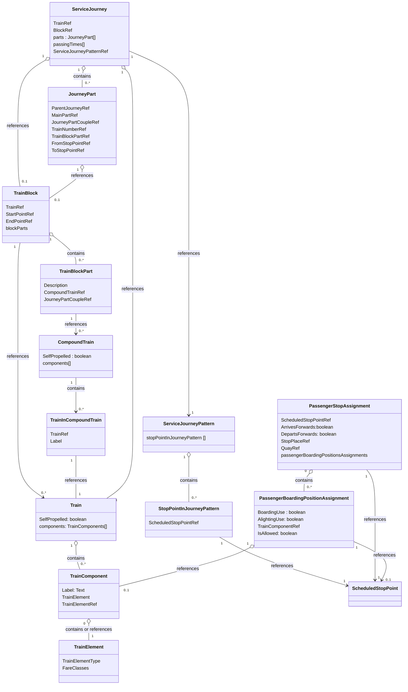

# Use Case: Formations

>NOTE: We currently don't import or export formations. Currently, this is an experimental use case that defines how we might do it. It is still work in progress.

Most important elements:
- `Train`
- `TrainComponent`
- `TrainElement`

> **LATER** Add template for these elements.

## Example
**LATER** Needs to be defined with TimeDemandType

## Usage Notes
- We intend to use a version without `Block` and `CompoundTrain`.
- We are unsure how to map to sectors as we don't want to have to invent new ScheduledStopPoints (especially as this would need new pseudo-sloid). **LATER**
- We have a special example for when the platform is too short on a given stop: **TODO**