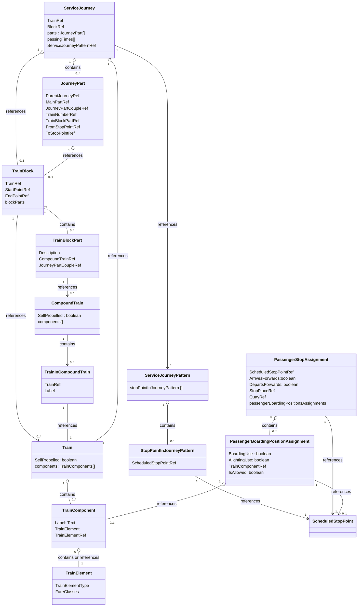

# Use Case: Formations

>NOTE: We currently don't import or export formations. Currently, this is an experimental use case that defines how we might do it. It is still work in progress.

Most important elements:
- `CompoundTrain`
- `Train`
- `TrainComponent`
- `TrainElement`
- `PassengerBoardingPositionAssignment` (badly named, as we never deal with boarding positions, but quays)



```mermaid
classDiagram


    class Train {
        SelfPropelled: boolean
        components: TrainComponents[]
    }

    %% Contained elements
    class TrainComponent {
        Label: Text
        TrainElement
        TrainElementRef

        
    }

    class TrainElement {
        TrainElementType
        FareClasses

    }

class CompoundTrain {
    SelfPropelled : boolean
    components[]

    }

class TrainInCompoundTrain {
    TrainRef
    Label 
}
    class TrainBlock {
        TrainRef
        StartPointRef
        EndPointRef
        blockParts
    }

    class TrainBlockPart {
        Description
        CompoundTrainRef
        JourneyPartCoupleRef
    }

    class ServiceJourney {
        TrainRef
        BlockRef
        parts : JourneyPart[]
        passingTimes[]
        ServiceJourneyPatternRef
    }

    class ServiceJourneyPattern {
        stopPointInJourneyPattern []
    }

    class StopPointInJourneyPattern {
        ScheduledStopPointRef
    }


    class JourneyPart {
        ParentJourneyRef
        MainPartRef
        JourneyPartCoupleRef
        TrainNumberRef
        TrainBlockPartRef
        FromStopPointRef
        ToStopPointRef
    }

    class PassengerStopAssignment {
        ScheduledStopPointRef
        ArrivesForwards:boolean
        DepartsForwards: boolean
        StopPlaceRef
        QuayRef
        passengerBoardingPositionsAssignments
    }

    class PassengerBoardingPositionAssignment  {
     BoardingUse : boolean
     AlightingUse: boolean
     TrainComponentRef
     IsAllowed: boolean
    }

    %% Containment relations (only contained elements)
    Train "1" o-- "0..*" TrainComponent : contains
    TrainComponent "0" o-- "1" TrainElement : contains or references
    TrainBlock "1" o-- "0..*" TrainBlockPart : contains
    TrainBlock "1" --> "0..*" Train : references
    TrainBlockPart "1" --> "0..*" CompoundTrain : references
    CompoundTrain "1" --> "0..*" TrainInCompoundTrain : contains
    TrainInCompoundTrain "1" -- "1" Train : references
    ServiceJourney "1" o-- "0..1" Train : references
    ServiceJourney "1" o-- "0..1" TrainBlock : references
    ServiceJourney "1"  o-- "0..*" JourneyPart: contains
    JourneyPart  "1" o-- "0..1"  TrainBlock : references
    PassengerStopAssignment "0"  o-- "0..*" PassengerBoardingPositionAssignment : contains
    PassengerBoardingPositionAssignment "1" o-- "0..1"  TrainComponent : references
    ServiceJourney "1"  --> "1" ServiceJourneyPattern : references
    ServiceJourneyPattern "1" o-- "0..*" StopPointInJourneyPattern : contains
    StopPointInJourneyPattern "1"  --> "1" ScheduledStopPoint : references
    PassengerStopAssignment "1" --> "1" ScheduledStopPoint: references
    PassengerBoardingPositionAssignment "1" --> "0..1" ScheduledStopPoint: references
```

## Example
Check the example we did https://github.com/openTdataCH/netexRealisationGuideSwitzerland/blob/main/src/examples/20_NeTEx_Interlaken_Spiez_Formation.xml

We have two important parts. Firstly, the formation itself as part of `vehicleTypes` in the `TimetableFrame`: 

```
				<vehicleTypes>
<CompoundTrain version="1" id="compoundtrain">
	<Name>4231</Name>
	<Description>2212 - 2122</Description>
	<SelfPropelled> true</SelfPropelled>
	<components>
		<TrainInCompoundTrain version="1" id="TICT1">
			<TrainRef version="1" ref="Train1"/>
			<Label>40447</Label>
		</TrainInCompoundTrain>
		<TrainInCompoundTrain version="1" id="TICT2">
			<TrainRef version="1" ref="Train2"/>
			<Label>457</Label>
		</TrainInCompoundTrain>
	</components>
</CompoundTrain>
<Train version="1" id="Train1">
	<Name>blabla</Name>
	<Description>2212</Description>
	<SelfPropelled> true</SelfPropelled>
	<components>
		<TrainComponent version="1" id="bbd:trncmp_447_01" order="1">
			<Label>1</Label>
			<TrainElement version="1" id="bbd:trne_447_01">
				<Name/>
				<TrainElementType>carriage</TrainElementType>
				<FareClasses>secondClass</FareClasses>
				<LowFloor>true</LowFloor>
				<facilities>
					<ServiceFacilitySetRef ref="nf" version="1"/>
					<ServiceFacilitySetRef ref="bikehooks" version="1"/>
					<ServiceFacilitySetRef ref="strollerplattform" version="1"/>
				</facilities>
			</TrainElement>
		</TrainComponent>
		<TrainComponent version="1" id="bbd:trncmp_447_02" order="2">
			<Label>2</Label>
			<TrainElement version="1" id="bbd:trne_447_02">
				<Name/>
				<TrainElementType>carriage</TrainElementType>
				<FareClasses>secondClass</FareClasses>
				<LowFloor>true</LowFloor>
				<facilities>
					<ServiceFacilitySetRef ref="nf" version="1"/>
					<ServiceFacilitySetRef ref="bikehooks" version="1"/>
					<ServiceFacilitySetRef ref="strollerplattform" version="1"/>
				</facilities>
			</TrainElement>
			<ForwardCoupling>
				<Splittable>false</Splittable>
				<ThroughAccess>openEntrance</ThroughAccess>
			</ForwardCoupling>
		</TrainComponent>
		<TrainComponent version="1" id="bbd:trncmp_447_03" order="3">
			<Label>3</Label>
			<TrainElement version="1" id="bbd:trne_447_03">
				<Name/>
				<TrainElementType>carriage</TrainElementType>
				<FareClasses>firstClass</FareClasses>
				<LowFloor>true</LowFloor>
				<facilities>
					<ServiceFacilitySetRef ref="nf" version="1"/>
				</facilities>
			</TrainElement>
			<ForwardCoupling>
				<Splittable>false</Splittable>
				<ThroughAccess>openEntrance</ThroughAccess>
			</ForwardCoupling>
		</TrainComponent>
		<TrainComponent version="1" id="bbd:trncmp_447_04" order="4">
			<Label>4</Label>
			<TrainElement version="1" id="bbd:trne_447_04">
				<Name/>
				<TrainElementType>carriage</TrainElementType>
				<FareClasses>secondClass</FareClasses>
				<LowFloor>true</LowFloor>
				<facilities>
					<ServiceFacilitySetRef ref="nf" version="1"/>
					<ServiceFacilitySetRef ref="bikehooks" version="1"/>
					<ServiceFacilitySetRef ref="wheelchairspace" version="1"/>
				</facilities>
			</TrainElement>
			<ForwardCoupling>
				<Splittable>false</Splittable>
				<ThroughAccess>openEntrance</ThroughAccess>
			</ForwardCoupling>
		</TrainComponent>
	</components>
</Train>
<Train version="1" id="Train2">
	<Name>blabla </Name>
	<Description>blabla</Description>
	<SelfPropelled> true</SelfPropelled>
	<components>
		<TrainComponent version="1" id="bbd:trncmp_448_01" order="1">
			<Label>5</Label>
			<TrainElement version="1" id="bbd:trne_448_01">
				<Name/>
				<TrainElementType>carriage</TrainElementType>
				<FareClasses>secondClass</FareClasses>
				<LowFloor>true</LowFloor>
				<facilities>
					<ServiceFacilitySetRef ref="nf" version="1"/>
					<ServiceFacilitySetRef ref="bikehooks" version="1"/>
					<ServiceFacilitySetRef ref="wheelchairspace" version="1"/>
				</facilities>
			</TrainElement>
			<ForwardCoupling>
				<Splittable>true</Splittable>
				<ThroughAccess>noThroughAccess</ThroughAccess>
			</ForwardCoupling>
		</TrainComponent>
		<TrainComponent version="1" id="bbd:trncmp_448_02" order="2">
			<Label>6</Label>
			<TrainElement version="1" id="bbd:trne_448_02">
				<Name/>
				<TrainElementType>carriage</TrainElementType>
				<FareClasses>firstClass</FareClasses>
				<LowFloor>true</LowFloor>
				<facilities>
					<ServiceFacilitySetRef ref="nf" version="1"/>
				</facilities>
			</TrainElement>
			<ForwardCoupling>
				<Splittable>false</Splittable>
				<ThroughAccess>openEntrance</ThroughAccess>
			</ForwardCoupling>
		</TrainComponent>
		<TrainComponent version="1" id="bbd:trncmp_448_03" order="3">
			<Label>7</Label>
			<TrainElement version="1" id="bbd:trne_448_03">
				<Name/>
				<TrainElementType>restaurantCarriage</TrainElementType>
				<FareClasses>secondClass</FareClasses>
				<LowFloor>true</LowFloor>
				<facilities>
					<ServiceFacilitySetRef ref="nf" version="1"/>
					<ServiceFacilitySetRef ref="bikehooks" version="1"/>
					<ServiceFacilitySetRef ref="strollerplattform" version="1"/>
				</facilities>
			</TrainElement>
			<ForwardCoupling>
				<Splittable>false</Splittable>
				<ThroughAccess>openEntrance</ThroughAccess>
			</ForwardCoupling>
		</TrainComponent>
		<TrainComponent version="1" id="bbd:trncmp_448_04" order="4">
			<Label>8</Label>
			<TrainElement version="1" id="bbd:trne_448_04">
				<Name/>
				<TrainElementType>carriage</TrainElementType>
				<FareClasses>secondClass</FareClasses>
				<LowFloor>true</LowFloor>
				<facilities>
					<ServiceFacilitySetRef ref="nf" version="1"/>
					<ServiceFacilitySetRef ref="bikehooks" version="1"/>
					<ServiceFacilitySetRef ref="strollerplattform" version="1"/>
				</facilities>
			</TrainElement>
			<ForwardCoupling>
				<Splittable>false</Splittable>
				<ThroughAccess>openEntrance</ThroughAccess>
			</ForwardCoupling>
		</TrainComponent>
	</components>
</Train>
					</vehicleTypes>
```

Secondly, the PassengerStopAssignment that shows how the train is structured into the stop:

```
<PassengerStopAssignment id="ch:1:PassengerStopAssignment:8507492:80" version="1">
	<!-- no scheduled stop point reference here as we do not want to confuse consumers who ignore PassengerStopAssignments-->
	<StopPlaceRef ref="ch:1:sloid:7492" version="1"/>
	<!-- we assign the quay sector. The platform quay is known as the quay sector again references it (see definition of quay sector) -->
	<QuayRef ref="ch:1:sloid:7492:0:460848sectorB" version="1"/>
	<!-- now we assign all train components to the sector B -->
	<passengerBoardingPositionAssignments>
		<PassengerBoardingPositionAssignment id="pbpa20" version="1">
			<Description>Assign coach 5 to sector B</Description>
			<ScheduledStopPointRef ref="ch:1:sloid:7492:0:460848" version="1"/>
			<TrainComponentRef version="1" ref="bbd:trncmp_448_01"/>
		</PassengerBoardingPositionAssignment>
		<PassengerBoardingPositionAssignment id="pbpa21" version="1">
			<Description>Assign coach 6 to sector B</Description>
			<ScheduledStopPointRef ref="ch:1:sloid:7492:0:460848" version="1"/>
			<TrainComponentRef version="1" ref="bbd:trncmp_448_02"/>
		</PassengerBoardingPositionAssignment>
		<PassengerBoardingPositionAssignment id="pbpa22" version="1">
			<Description>Assign coach 7 to sector B</Description>
			<ScheduledStopPointRef ref="ch:1:sloid:7492:0:460848" version="1"/>
			<TrainComponentRef version="1" ref="bbd:trncmp_448_03"/>
		</PassengerBoardingPositionAssignment>
		<PassengerBoardingPositionAssignment id="pbpa23" version="1">
			<Description>Assign coach 8 to sector B</Description>
			<ScheduledStopPointRef ref="ch:1:sloid:7492:0:460848" version="1"/>
			<TrainComponentRef version="1" ref="bbd:trncmp_448_04"/>
		</PassengerBoardingPositionAssignment>
	</passengerBoardingPositionAssignments>
</PassengerStopAssignment>		
```
## Usage Notes
- We intend to use a version without `Block` and `CompoundTrain`.
- We don't invent additional `ScheduledStopPoint`s for the sectors.
- We have a special example for when the platform is too short on a given stop: **LATER**